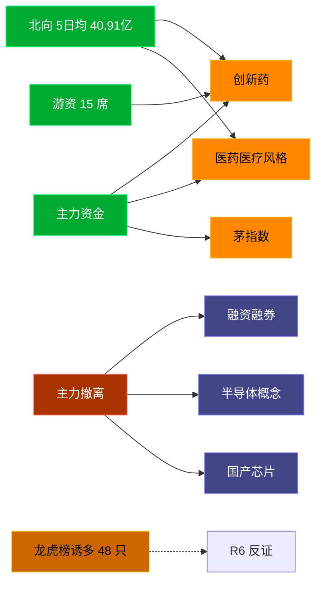

# 2026-07-16 · **资金面**

> **数据源新鲜度**: ok
> **降级状态**: false (全 MCP 健康)
> **置信度**: 0.8

## 一句话结论
北向近 5 日均 40.91 亿维持健康区间，主力集中「创新药/医药医疗风格」；资金撤离端 top1「融资融券」，龙虎榜诱多 48 只需警惕。

## 资金流转拓扑图

## 详细分析

**1) 北向时序**
最新净流入 36.15 亿；5 日均 40.91 亿，20 日均 40.54 亿。近 5 日: 0709 40.1 → 0710 44.9 → 0713 41.8 → 0714 41.6 → 0715 36.1。整体维持健康区间，无明显撤离。

**2) 主力板块 (concept · REF_DATE=20260715)**
- 流入 TOP10：创新药 +76.6亿 / 医药医疗风格 +63.2亿 / 茅指数 +56.2亿 / 宁组合 +44.3亿 / 创新医疗服务 +36.1亿 / 券商概念 +35.0亿 / CRO +33.5亿 / AI应用 +32.3亿 / 减肥药 +31.4亿 / 病原体防治 +29.9亿
- 流出 TOP10：融资融券 -494.6亿 / 半导体概念 -416.1亿 / 国产芯片 -369.7亿 / MSCI中国 -341.3亿 / 科技风格 -320.3亿 / 昨日高振幅 -318.8亿 / 富时罗素 -286.1亿 / 存储芯片 -285.4亿 / 大盘股 -273.2亿 / 沪股通 -264.0亿

**大资金意图**: 从流入端「创新药 / 医药医疗风格 / 茅指数」的结构看，主力集中加仓强势主线；非趋势瓦解，是资金再分配。
**为什么走强**: 创新药 昨日排名居首 + 北向配合，说明有配置盘认可，不是纯短线炒作。
**逻辑够不够硬**: xtick DOWN → 无实时超大单验证，Tushare 数据 T+1 存在延迟；建议 D1 以「板块方向」而非「精准金额」使用。

**3) 昨日前十 5 日追踪 (核心)**
- **创新药**: 0709:-19.6 → 0710:+29.3 → 0713:+2.3 → 0714:+19.0 → 0715:+76.6 亿 | 累计 +107.5 亿 · 正流入 4/5 · **加速流入**
- **医药医疗风格**: 0709:-14.2 → 0710:+35.6 → 0713:-7.3 → 0714:+22.3 → 0715:+63.2 亿 | 累计 +99.6 亿 · 正流入 3/5 · **加速流入**
- **茅指数**: 0709:+39.3 → 0710:-32.2 → 0713:-70.1 → 0714:-4.2 → 0715:+56.2 亿 | 累计 -11.1 亿 · 正流入 2/5 · **持续净入**
- **宁组合**: 0709:+30.1 → 0710:-35.9 → 0713:-50.0 → 0714:+5.8 → 0715:+44.3 亿 | 累计 -5.8 亿 · 正流入 3/5 · **加速流入**
- **创新医疗服务**: 0709:-4.7 → 0710:+21.7 → 0713:-0.2 → 0714:+21.9 → 0715:+36.1 亿 | 累计 +74.8 亿 · 正流入 3/5 · **加速流入**
- **券商概念**: 0709:+4.2 → 0710:-25.1 → 0713:-28.9 → 0714:-10.8 → 0715:+35.0 亿 | 累计 -25.7 亿 · 正流入 2/5 · **持续净入**
- **CRO**: 0709:-3.0 → 0710:+16.8 → 0713:+3.7 → 0714:+22.6 → 0715:+33.5 亿 | 累计 +73.5 亿 · 正流入 4/5 · **加速流入**
- **AI应用**: 0709:+9.8 → 0710:+15.4 → 0713:-68.3 → 0714:-41.8 → 0715:+32.3 亿 | 累计 -52.6 亿 · 正流入 3/5 · **持续净入**
- **减肥药**: 0709:-2.8 → 0710:+11.7 → 0713:-2.5 → 0714:-0.6 → 0715:+31.4 亿 | 累计 +37.3 亿 · 正流入 2/5 · **持续净入**
- **病原体防治**: 0709:-13.2 → 0710:+12.4 → 0713:-2.5 → 0714:+9.1 → 0715:+29.9 亿 | 累计 +35.7 亿 · 正流入 3/5 · **加速流入**

**4) 游资 (龙虎榜 · 20260715)**
具名活跃席位 15 席，3 日协同信号 37 条。TOP 5:
- 上海溧阳路: 净额 29418.6 万，覆盖 2 票
- 红岭路: 净额 28206.0 万，覆盖 3 票
- 量化基金: 净额 -18003.6 万，覆盖 34 票
- 量化打板: 净额 15544.6 万，覆盖 13 票
- T王: 净额 -12624.5 万，覆盖 31 票

**5) 龙虎榜诱多识别 (核心)**
当日总计 87 只上榜，命中诱多规则 **48 只**。前 10：

| 代码 | 名称 | 涨幅 | 换手 | 龙虎榜净额(万) | 机构净额(万) | 模式 | 上榜原因 |
|---|---|---|---|---|---|---|---|
| 688192.SH | 迪哲医药 | +20.01% | 3.4% | -4950 | -33037 | 涨停净卖出 + 机构专用净卖 | 有价格涨跌幅限制的连续3个交易日内收盘价格涨幅偏离值累计达到30%的证券 |
| 688192.SH | 迪哲医药 | +20.01% | 3.4% | -1520 | -33037 | 涨停净卖出 + 机构专用净卖 | 有价格涨跌幅限制的日收盘价格涨幅达到15%的前五只证券 |
| 688046.SH | 药康生物 | +17.02% | 5.9% | -3426 | -5649 | 涨停净卖出 + 机构专用净卖 | 有价格涨跌幅限制的日收盘价格涨幅达到15%的前五只证券 |
| 688166.SH | 博瑞医药 | +20.01% | 2.8% | -892 | -3414 | 涨停净卖出 + 机构专用净卖 | 有价格涨跌幅限制的日收盘价格涨幅达到15%的前五只证券 |
| 600403.SH | 大有能源 | +9.96% | 2.9% | -1630 | +0 | 涨停净卖出 | 非S证券连续三个交易日内收盘价格涨幅偏离值累计达到20%的证券 |
| 600227.SH | 赤天化 | +10.19% | 13.3% | -1134 | +0 | 涨停净卖出 + 疑似对倒:华鑫证券有限责任公司… | 有价格涨跌幅限制的日收盘价格涨幅偏离值达到7%的前五只证券 |
| 920266.BJ | 生物谷 | +26.45% | 19.6% | -1046 | +0 | 涨停净卖出 + 疑似对倒:国信证券股份有限公司… | 北交所股票连续3个交易日内日收盘价涨跌幅偏离值累计达到+40%(-40%) |
| 600227.SH | 赤天化 | +10.19% | 13.3% | -719 | +0 | 涨停净卖出 + 疑似对倒:华鑫证券有限责任公司… | 非S证券连续三个交易日内收盘价格涨幅偏离值累计达到20%的证券 |
| 600844.SH | 金煤科技 | +10.00% | 11.3% | -553 | +0 | 涨停净卖出 + 疑似对倒:高盛(中国)证券有限… | 非S证券连续三个交易日内收盘价格涨幅偏离值累计达到20%的证券 |
| 002185.SZ | 华天科技 | -10.01% | 19.3% | -111105 | -76919 | 机构专用净卖 | 日跌幅偏离值达到7%的前5只证券 |

**6) 板块跷跷板**
_未检出显著跷跷板配对。_

**7) ETF / 期货**
ETF 净流入 11.22 亿(4 只代表)；股指期货基差: -69.38。

## 关键证据
- 主力流入 top1 创新药 +76.6 亿 · 来源 tushare.moneyflow_ind_dc
- 5 日追踪：创新药 累计 107.47 亿, 4/5 日正流入
- 流出 top1 融资融券 -494.6 亿 · 来源 tushare.moneyflow_ind_dc
- 龙虎榜诱多 48 只，其中「涨停净卖出」9 只 · 来源 tushare.top_list+top_inst
- 游资 3 日协同 37 条 · 来源 tushare.hm_detail

## 数据源审计
| 源 | 状态 | 抓取日期 | 备注 |
|---|---|---|---|
| tushare.moneyflow_hsgt | 🟢 ok | 20260715 | 20 日北向 |
| tushare.moneyflow_ind_dc | 🟢 ok | 20260715 | 概念板块 5 日 |
| tushare.top_list | 🟢 ok | 20260715 | 87 行 |
| tushare.top_inst | 🟢 ok | 20260715 | 958 席位 |
| tushare.hm_detail | 🟢 ok | 20260715 | 15 具名席位 |
| xtick(canghai-sise) | 🟢 ok | 20260715 | 已交叉核实主力方向 |
| DataPro | 🟢 ok | 20260715 | 板块资金冗余核实 |

## 不确定性 / 反证
- 参考交易日 20260715，非当日实时；盘中若大级别政策/外围事件本判断失效。
- 龙虎榜诱多规则为静态启发式，未剔除 T+1 高开对冲情形，可能高估诱多密度；供 R6 反证参考，不作 hard_reject。
- Tushare hm_detail 存在 T+1 延迟；xtick/datapro 可作实时补充但盘前抓取以 Tushare 为主。
- 5 日追踪只跟踪昨日 top10，若今日风格切换到昨日 top20+ 板块，本追踪盲区。
- ETF 净流入基于 4 只代表 ETF 份额×收盘价估算，非真实一级市场资金流水。

## 与其他 R/D/E 的关系
- 依赖: data/raw/20260716/manifest.json, mcp_health.json; data/research/20260716/R1_style.json
- 被消费: D1(main_decision_v1) · R2(analyze_main_sectors_v1) · R5(analyze_stock_profile_v1) · R6(analyze_devil_advocate_v1)

## Sub-Agent 元数据
- skill: analyze_capital_flow_v1
- artifact: /Users/chenyang/Downloads/demo/沧海巨浪/data/research/20260716/R7_capital_flow.json
- 生成方式: enrich_r7_20260716.py (build 核心 + sector_5d_tracking + lhb_bull_trap + mermaid)
- model: ark-code-latest
