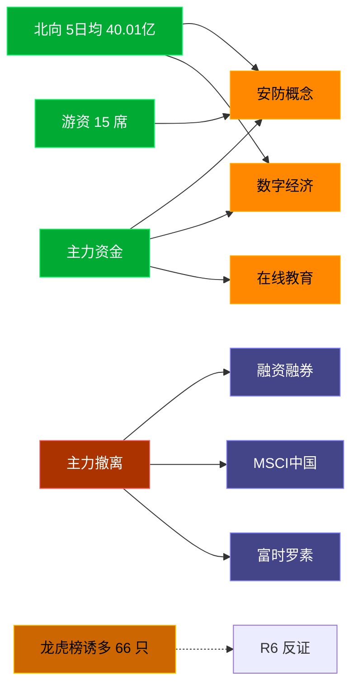

# 2026-07-17 · **资金面**

> **数据源新鲜度**: ok
> **降级状态**: false (全 MCP 健康)
> **置信度**: 0.8

## 一句话结论
北向近 5 日均 40.01 亿维持健康区间，主力集中「安防概念/数字经济」；资金撤离端 top1「融资融券」，龙虎榜诱多 66 只需警惕。

## 资金流转拓扑图

## 详细分析

**1) 北向时序**
最新净流入 35.59 亿；5 日均 40.01 亿，20 日均 40.41 亿。近 5 日: 0710 44.9 → 0713 41.8 → 0714 41.6 → 0715 36.1 → 0716 35.6。整体维持健康区间，无明显撤离。

**2) 主力板块 (concept · REF_DATE=20260716)**
- 流入 TOP10：安防概念 +14.7亿 / 数字经济 +14.1亿 / 在线教育 +13.8亿 / IPv6 +11.3亿 / 化妆品概念 +10.8亿 / 小红书概念 +9.9亿 / 互联网服务 +9.1亿 / 昨日首板 +8.7亿 / 抖音概念(字节概念) +8.7亿 / Web3.0 +8.4亿
- 流出 TOP10：融资融券 -826.5亿 / MSCI中国 -485.1亿 / 富时罗素 -481.9亿 / 沪股通 -462.8亿 / 半导体概念 -430.2亿 / 百元股 -394.9亿 / 深股通 -363.6亿 / 大盘股 -358.6亿 / 昨日高振幅 -354.5亿 / HS300_ -320.4亿

**大资金意图**: 从流入端「安防概念 / 数字经济 / 在线教育」的结构看，主力集中加仓强势主线；非趋势瓦解，是资金再分配。
**为什么走强**: 安防概念 昨日排名居首 + 北向配合，说明有配置盘认可，不是纯短线炒作。
**逻辑够不够硬**: xtick DOWN → 无实时超大单验证，Tushare 数据 T+1 存在延迟；建议 D1 以「板块方向」而非「精准金额」使用。

**3) 昨日前十 5 日追踪 (核心)**
- **安防概念**: 0710:+3.5 → 0713:-34.1 → 0714:-12.5 → 0715:-0.9 → 0716:+14.7 亿 | 累计 -29.2 亿 · 正流入 2/5 · **持续净入**
- **数字经济**: 0710:+1.8 → 0713:-47.5 → 0714:-32.3 → 0715:-15.9 → 0716:+14.1 亿 | 累计 -79.8 亿 · 正流入 2/5 · **持续净入**
- **在线教育**: 0710:+1.4 → 0713:-28.5 → 0714:-21.7 → 0715:-6.2 → 0716:+13.8 亿 | 累计 -41.2 亿 · 正流入 2/5 · **持续净入**
- **IPv6**: 0710:+7.2 → 0713:-26.4 → 0714:-16.6 → 0715:-10.4 → 0716:+11.3 亿 | 累计 -34.9 亿 · 正流入 2/5 · **持续净入**
- **化妆品概念**: 0710:+6.7 → 0713:+1.9 → 0714:+1.3 → 0715:+4.6 → 0716:+10.8 亿 | 累计 +25.1 亿 · 正流入 5/5 · **加速流入**
- **小红书概念**: 0710:+15.4 → 0713:-21.1 → 0714:-7.8 → 0715:+4.3 → 0716:+9.9 亿 | 累计 +0.7 亿 · 正流入 3/5 · **流入衰减**
- **互联网服务**: 0710:+21.4 → 0713:-51.0 → 0714:-35.9 → 0715:-4.5 → 0716:+9.1 亿 | 累计 -60.9 亿 · 正流入 2/5 · **流入衰减**
- **昨日首板**: 0710:-153.6 → 0713:-52.5 → 0714:+1.7 → 0715:-4.3 → 0716:+8.7 亿 | 累计 -200.0 亿 · 正流入 2/5 · **持续净入**
- **抖音概念(字节概念)**: 0710:+9.9 → 0713:-63.4 → 0714:-32.8 → 0715:-13.8 → 0716:+8.7 亿 | 累计 -91.3 亿 · 正流入 2/5 · **流入衰减**
- **Web3.0**: 0710:+11.1 → 0713:-16.8 → 0714:-9.6 → 0715:+2.8 → 0716:+8.4 亿 | 累计 -4.2 亿 · 正流入 3/5 · **流入衰减**

**4) 游资 (龙虎榜 · 20260716)**
具名活跃席位 15 席，3 日协同信号 48 条。TOP 5:
- 量化基金: 净额 319131.0 万，覆盖 26 票
- 量化打板: 净额 24925.9 万，覆盖 10 票
- T王: 净额 -13016.4 万，覆盖 32 票
- 炒股养家: 净额 10806.1 万，覆盖 10 票
- 低位挖掘: 净额 -2830.8 万，覆盖 2 票

**5) 龙虎榜诱多识别 (核心)**
当日总计 94 只上榜，命中诱多规则 **66 只**。前 10：

| 代码 | 名称 | 涨幅 | 换手 | 龙虎榜净额(万) | 机构净额(万) | 模式 | 上榜原因 |
|---|---|---|---|---|---|---|---|
| 688166.SH | 博瑞医药 | +19.92% | 11.1% | -10782 | -15538 | 涨停净卖出 + 机构专用净卖 | 有价格涨跌幅限制的日收盘价格涨幅达到15%的前五只证券 |
| 688166.SH | 博瑞医药 | +19.92% | 11.1% | -9134 | -15538 | 涨停净卖出 + 机构专用净卖 | 有价格涨跌幅限制的连续3个交易日内收盘价格涨幅偏离值累计达到30%的证券 |
| 002788.SZ | 鹭燕医药 | +9.82% | 16.0% | -1348 | -5143 | 涨停净卖出 + 机构专用净卖 | 连续三个交易日内，涨幅偏离值累计达到20%的证券 |
| 000566.SZ | 海南海药 | +10.10% | 22.8% | -1755 | -2729 | 涨停净卖出 + 机构专用净卖 | 日换手率达到20%的前5只证券 |
| 600162.SH | 香江控股 | +9.88% | 10.6% | -3440 | +0 | 涨停净卖出 + 疑似对倒:东亚前海证券有限责任… | 非S证券连续三个交易日内收盘价格涨幅偏离值累计达到20%的证券 |
| 301520.SZ | 万邦医药 | +13.37% | 56.1% | -1058 | +2380 | 涨停净卖出 | 日换手率达到30%的前5只证券 |
| 002726.SZ | ST龙大 | +9.84% | 6.5% | -506 | +0 | 涨停净卖出 | 连续三个交易日内，涨幅偏离值累计达到20%的证券 |
| 688008.SH | 澜起科技 | -16.44% | 10.1% | +132326 | -119698 | 机构专用净卖 | 有价格涨跌幅限制的日收盘价格跌幅达到15%的前五只证券 |
| 603127.SH | 昭衍新药 | +5.20% | 19.6% | -57170 | -56075 | 机构专用净卖 | 非S证券连续三个交易日内收盘价格涨幅偏离值累计达到20%的证券 |
| 002432.SZ | 九安医疗 | +7.48% | 14.1% | -30061 | -27793 | 拉高净卖出 + 机构专用净卖 | 连续三个交易日内，涨幅偏离值累计达到20%的证券 |

**6) 板块跷跷板**
_未检出显著跷跷板配对。_

**7) ETF / 期货**
ETF 净流入 99.65 亿(4 只代表)；股指期货基差: -52.83。

## 关键证据
- 主力流入 top1 安防概念 +14.7 亿 · 来源 tushare.moneyflow_ind_dc
- 5 日追踪：安防概念 累计 -29.22 亿, 2/5 日正流入
- 流出 top1 融资融券 -826.5 亿 · 来源 tushare.moneyflow_ind_dc
- 龙虎榜诱多 66 只，其中「涨停净卖出」7 只 · 来源 tushare.top_list+top_inst
- 游资 3 日协同 48 条 · 来源 tushare.hm_detail

## 数据源审计
| 源 | 状态 | 抓取日期 | 备注 |
|---|---|---|---|
| tushare.moneyflow_hsgt | 🟢 ok | 20260716 | 20 日北向 |
| tushare.moneyflow_ind_dc | 🟢 ok | 20260716 | 概念板块 5 日 |
| tushare.top_list | 🟢 ok | 20260716 | 94 行 |
| tushare.top_inst | 🟢 ok | 20260716 | 1016 席位 |
| tushare.hm_detail | 🟢 ok | 20260716 | 15 具名席位 |
| xtick(canghai-sise) | 🟢 ok | 20260716 | 已交叉核实主力方向 |
| DataPro | 🟢 ok | 20260716 | 板块资金冗余核实 |

## 不确定性 / 反证
- 参考交易日 20260716，非当日实时；盘中若大级别政策/外围事件本判断失效。
- 龙虎榜诱多规则为静态启发式，未剔除 T+1 高开对冲情形，可能高估诱多密度；供 R6 反证参考，不作 hard_reject。
- Tushare hm_detail 存在 T+1 延迟；xtick/datapro 可作实时补充但盘前抓取以 Tushare 为主。
- 5 日追踪只跟踪昨日 top10，若今日风格切换到昨日 top20+ 板块，本追踪盲区。
- ETF 净流入基于 4 只代表 ETF 份额×收盘价估算，非真实一级市场资金流水。

## 与其他 R/D/E 的关系
- 依赖: data/raw/20260717/manifest.json, mcp_health.json; data/research/20260717/R1_style.json
- 被消费: D1(main_decision_v1) · R2(analyze_main_sectors_v1) · R5(analyze_stock_profile_v1) · R6(analyze_devil_advocate_v1)

## Sub-Agent 元数据
- skill: analyze_capital_flow_v1
- artifact: /Users/chenyang/Downloads/demo/沧海巨浪/data/research/20260717/R7_capital_flow.json
- 生成方式: enrich_r7_20260717.py (build 核心 + sector_5d_tracking + lhb_bull_trap + mermaid)
- model: ark-code-latest
