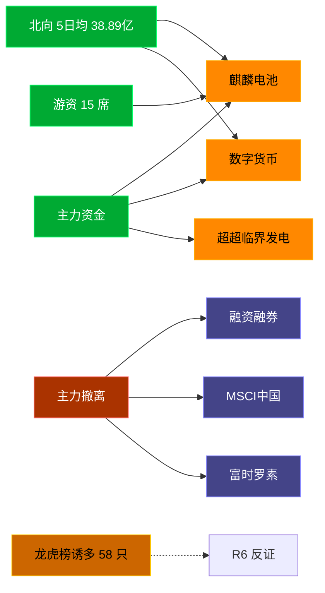

# 2026-07-20 · **资金面**

> **数据源新鲜度**: ok
> **降级状态**: false (全 MCP 健康)
> **置信度**: 0.8

## 一句话结论
北向近 5 日均 38.89 亿维持健康区间，主力集中「麒麟电池/数字货币」；资金撤离端 top1「融资融券」，龙虎榜诱多 58 只需警惕。

## 资金流转拓扑图

## 详细分析

**1) 北向时序**
最新净流入 39.35 亿；5 日均 38.89 亿，20 日均 40.45 亿。近 5 日: 0713 41.8 → 0714 41.6 → 0715 36.1 → 0716 35.6 → 0717 39.4。整体维持健康区间，无明显撤离。

**2) 主力板块 (concept · REF_DATE=20260717)**
- 流入 TOP10：麒麟电池 +3.3亿 / 数字货币 +2.4亿 / 超超临界发电 +1.1亿 / 生物质能发电 +0.8亿 / 环氧丙烷 +0.3亿 / 举牌 +0.3亿 / 土壤修复 +0.2亿 / 托育服务 +0.0亿 / B股 +0.0亿 / 拼多多概念 -0.0亿
- 流出 TOP10：融资融券 -1496.5亿 / MSCI中国 -960.4亿 / 富时罗素 -917.1亿 / 深股通 -867.5亿 / 大盘股 -714.9亿 / 深成500 -676.6亿 / 标准普尔 -652.7亿 / 沪股通 -635.9亿 / HS300_ -628.5亿 / 百元股 -574.0亿

**大资金意图**: 从流入端「麒麟电池 / 数字货币 / 超超临界发电」的结构看，主力集中加仓强势主线；非趋势瓦解，是资金再分配。
**为什么走强**: 麒麟电池 昨日排名居首 + 北向配合，说明有配置盘认可，不是纯短线炒作。
**逻辑够不够硬**: xtick DOWN → 无实时超大单验证，Tushare 数据 T+1 存在延迟；建议 D1 以「板块方向」而非「精准金额」使用。

**3) 昨日前十 5 日追踪 (核心)**
- **麒麟电池**: 0713:+5.7 → 0714:-4.6 → 0715:+9.1 → 0716:-3.8 → 0717:+3.3 亿 | 累计 +9.7 亿 · 正流入 3/5 · **流入衰减**
- **数字货币**: 0713:-20.3 → 0714:-10.8 → 0715:-8.0 → 0716:-1.5 → 0717:+2.4 亿 | 累计 -38.2 亿 · 正流入 1/5 · **持续净入**
- **超超临界发电**: 0713:-11.0 → 0714:-1.9 → 0715:-0.3 → 0716:-6.8 → 0717:+1.1 亿 | 累计 -19.1 亿 · 正流入 1/5 · **持续净入**
- **生物质能发电**: 0713:-2.2 → 0714:+2.4 → 0715:-0.1 → 0716:+0.2 → 0717:+0.8 亿 | 累计 +1.1 亿 · 正流入 3/5 · **加速流入**
- **环氧丙烷**: 0713:-6.7 → 0714:+5.3 → 0715:-1.8 → 0716:-3.2 → 0717:+0.3 亿 | 累计 -6.1 亿 · 正流入 2/5 · **持续净入**
- **举牌**: 0713:-0.4 → 0714:+0.2 → 0715:-0.2 → 0716:-0.1 → 0717:+0.3 亿 | 累计 -0.1 亿 · 正流入 2/5 · **持续净入**
- **土壤修复**: 0713:-0.6 → 0714:-0.4 → 0715:+0.3 → 0716:+0.9 → 0717:+0.2 亿 | 累计 +0.5 亿 · 正流入 3/5 · **持续净入**
- **托育服务**: 0713:-0.3 → 0714:-0.1 → 0715:-0.2 → 0716:-0.1 → 0717:+0.0 亿 | 累计 -0.6 亿 · 正流入 1/5 · **持续净入**
- **B股**: 0713:-0.1 → 0714:-0.1 → 0715:-0.1 → 0716:+0.1 → 0717:+0.0 亿 | 累计 -0.2 亿 · 正流入 2/5 · **持续净入**
- **拼多多概念**: 0713:-2.5 → 0714:+0.3 → 0715:+3.6 → 0716:+2.1 → 0717:-0.0 亿 | 累计 +3.5 亿 · 正流入 3/5 · **震荡**

**4) 游资 (龙虎榜 · 20260717)**
具名活跃席位 15 席，3 日协同信号 48 条。TOP 5:
- 量化基金: 净额 113381.3 万，覆盖 26 票
- 紫阳东路: 净额 35599.5 万，覆盖 2 票
- 量化打板: 净额 23753.2 万，覆盖 12 票
- 成都系: 净额 12994.8 万，覆盖 1 票
- T王: 净额 12602.3 万，覆盖 18 票

**5) 龙虎榜诱多识别 (核心)**
当日总计 75 只上榜，命中诱多规则 **58 只**。前 10：

| 代码 | 名称 | 涨幅 | 换手 | 龙虎榜净额(万) | 机构净额(万) | 模式 | 上榜原因 |
|---|---|---|---|---|---|---|---|
| 300577.SZ | 开润股份 | +19.98% | 11.9% | -4979 | -12019 | 涨停净卖出 + 机构专用净卖 | 连续三个交易日内，涨幅偏离值累计达到30%的证券 |
| 300577.SZ | 开润股份 | +19.98% | 11.9% | -3042 | -12019 | 涨停净卖出 + 机构专用净卖 | 日涨幅达到15%的前5只证券 |
| 118072.SH | N鼎通转 | +48.15% | 0.0% | -1217 | -3048 | 涨停净卖出 + 机构专用净卖 + 疑似对倒:光大证券股份有限公司… | 向不特定对象发行的可转债上市首日交易公开信息 |
| 000676.SZ | 智度股份 | +9.97% | 20.4% | -12710 | -1661 | 涨停净卖出 + 机构专用净卖 | 日涨幅偏离值达到7%的前5只证券 |
| 002829.SZ | 星网宇达 | +9.98% | 20.2% | -1510 | -1612 | 涨停净卖出 + 机构专用净卖 + 疑似对倒:国信证券股份有限公司… | 连续三个交易日内，涨幅偏离值累计达到20%的证券 |
| 603567.SH | 珍宝岛 | +10.04% | 11.1% | -5415 | +0 | 涨停净卖出 + 疑似对倒:华鑫证券有限责任公司… | 非S证券连续三个交易日内收盘价格涨幅偏离值累计达到20%的证券 |
| 600162.SH | 香江控股 | +10.07% | 11.6% | -3610 | +0 | 涨停净卖出 | 有价格涨跌幅限制的日收盘价格涨幅偏离值达到7%的前五只证券 |
| 600227.SH | 赤天化 | +10.07% | 19.8% | -1598 | +0 | 涨停净卖出 | 有价格涨跌幅限制的日收盘价格涨幅偏离值达到7%的前五只证券 |
| 600730.SH | *ST高科 | +10.06% | 1.5% | -775 | +0 | 涨停净卖出 | 有价格涨跌幅限制的日收盘价格涨幅偏离值达到7%的前五只证券 |
| 688668.SH | 鼎通科技 | -20.00% | 6.2% | +8266 | -34621 | 机构专用净卖 | 有价格涨跌幅限制的日收盘价格跌幅达到15%的前五只证券 |

**6) 板块跷跷板**
_未检出显著跷跷板配对。_

**7) ETF / 期货**
ETF 净流入 177.47 亿(4 只代表)；股指期货基差: -55.3。

## 关键证据
- 主力流入 top1 麒麟电池 +3.3 亿 · 来源 tushare.moneyflow_ind_dc
- 5 日追踪：麒麟电池 累计 9.74 亿, 3/5 日正流入
- 流出 top1 融资融券 -1496.5 亿 · 来源 tushare.moneyflow_ind_dc
- 龙虎榜诱多 58 只，其中「涨停净卖出」9 只 · 来源 tushare.top_list+top_inst
- 游资 3 日协同 48 条 · 来源 tushare.hm_detail

## 数据源审计
| 源 | 状态 | 抓取日期 | 备注 |
|---|---|---|---|
| tushare.moneyflow_hsgt | 🟢 ok | 20260717 | 20 日北向 |
| tushare.moneyflow_ind_dc | 🟢 ok | 20260717 | 概念板块 5 日 |
| tushare.top_list | 🟢 ok | 20260717 | 75 行 |
| tushare.top_inst | 🟢 ok | 20260717 | 780 席位 |
| tushare.hm_detail | 🟢 ok | 20260717 | 15 具名席位 |
| xtick(canghai-sise) | 🟢 ok | 20260717 | 已交叉核实主力方向 |
| DataPro | 🟢 ok | 20260717 | 板块资金冗余核实 |

## 不确定性 / 反证
- 参考交易日 20260717，非当日实时；盘中若大级别政策/外围事件本判断失效。
- 龙虎榜诱多规则为静态启发式，未剔除 T+1 高开对冲情形，可能高估诱多密度；供 R6 反证参考，不作 hard_reject。
- Tushare hm_detail 存在 T+1 延迟；xtick/datapro 可作实时补充但盘前抓取以 Tushare 为主。
- 5 日追踪只跟踪昨日 top10，若今日风格切换到昨日 top20+ 板块，本追踪盲区。
- ETF 净流入基于 4 只代表 ETF 份额×收盘价估算，非真实一级市场资金流水。

## 与其他 R/D/E 的关系
- 依赖: data/raw/20260720/manifest.json, mcp_health.json; data/research/20260720/R1_style.json
- 被消费: D1(main_decision_v1) · R2(analyze_main_sectors_v1) · R5(analyze_stock_profile_v1) · R6(analyze_devil_advocate_v1)

## Sub-Agent 元数据
- skill: analyze_capital_flow_v1
- artifact: /Users/chenyang/Downloads/demo/沧海巨浪/data/research/20260720/R7_capital_flow.json
- 生成方式: enrich_r7_20260720.py (build 核心 + sector_5d_tracking + lhb_bull_trap + mermaid)
- model: ark-code-latest
