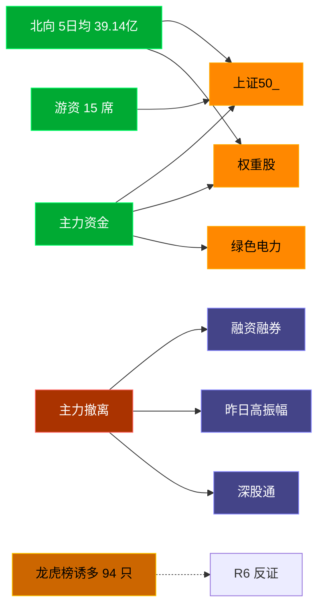

# 2026-07-21 · **资金面**

> **数据源新鲜度**: ok
> **降级状态**: false (全 MCP 健康)
> **置信度**: 0.8

## 一句话结论
北向近 5 日均 39.14 亿维持健康区间，主力集中「上证50_/权重股」；资金撤离端 top1「融资融券」，龙虎榜诱多 94 只需警惕。

## 资金流转拓扑图

## 详细分析

**1) 北向时序**
最新净流入 43.0 亿；5 日均 39.14 亿，20 日均 40.45 亿。近 5 日: 0714 41.6 → 0715 36.1 → 0716 35.6 → 0717 39.4 → 0720 43.0。整体维持健康区间，无明显撤离。

**2) 主力板块 (concept · REF_DATE=20260720)**
- 流入 TOP10：上证50_ +38.5亿 / 权重股 +28.4亿 / 绿色电力 +23.5亿 / 大盘价值 +17.1亿 / 茅指数 +15.7亿 / 安防概念 +14.5亿 / 数字经济 +14.4亿 / 红利股 +14.0亿 / 东数西算 +13.8亿 / 中特估 +13.6亿
- 流出 TOP10：融资融券 -574.2亿 / 昨日高振幅 -383.8亿 / 深股通 -370.2亿 / 富时罗素 -294.6亿 / MSCI中国 -284.9亿 / 深成500 -271.7亿 / 半导体概念 -213.7亿 / 华为概念 -203.2亿 / 标准普尔 -202.9亿 / 通信技术 -197.6亿

**大资金意图**: 从流入端「上证50_ / 权重股 / 绿色电力」的结构看，主力集中加仓强势主线；非趋势瓦解，是资金再分配。
**为什么走强**: 上证50_ 昨日排名居首 + 北向配合，说明有配置盘认可，不是纯短线炒作。
**逻辑够不够硬**: xtick DOWN → 无实时超大单验证，Tushare 数据 T+1 存在延迟；建议 D1 以「板块方向」而非「精准金额」使用。

**3) 昨日前十 5 日追踪 (核心)**
- **上证50_**: 0714:+44.0 → 0715:-13.4 → 0716:-116.7 → 0717:-127.7 → 0720:+38.5 亿 | 累计 -175.3 亿 · 正流入 2/5 · **流入衰减**
- **权重股**: 0714:+96.0 → 0715:+7.4 → 0716:-107.3 → 0717:-210.2 → 0720:+28.4 亿 | 累计 -185.8 亿 · 正流入 3/5 · **流入衰减**
- **绿色电力**: 0714:-7.8 → 0715:-9.2 → 0716:-25.3 → 0717:-7.1 → 0720:+23.5 亿 | 累计 -25.8 亿 · 正流入 1/5 · **持续净入**
- **大盘价值**: 0714:+27.3 → 0715:-16.9 → 0716:-49.5 → 0717:-58.4 → 0720:+17.1 亿 | 累计 -80.5 亿 · 正流入 2/5 · **流入衰减**
- **茅指数**: 0714:-4.2 → 0715:+56.2 → 0716:-33.0 → 0717:-97.2 → 0720:+15.7 亿 | 累计 -62.6 亿 · 正流入 2/5 · **持续净入**
- **安防概念**: 0714:-12.5 → 0715:-0.9 → 0716:+14.7 → 0717:-34.3 → 0720:+14.5 亿 | 累计 -18.4 亿 · 正流入 2/5 · **持续净入**
- **数字经济**: 0714:-32.3 → 0715:-15.9 → 0716:+14.1 → 0717:-54.2 → 0720:+14.4 亿 | 累计 -74.0 亿 · 正流入 2/5 · **持续净入**
- **红利股**: 0714:-4.3 → 0715:-19.6 → 0716:-16.1 → 0717:-12.6 → 0720:+14.0 亿 | 累计 -38.5 亿 · 正流入 1/5 · **持续净入**
- **东数西算**: 0714:-29.8 → 0715:-33.1 → 0716:+0.2 → 0717:-68.1 → 0720:+13.8 亿 | 累计 -117.1 亿 · 正流入 2/5 · **持续净入**
- **中特估**: 0714:-22.4 → 0715:-48.4 → 0716:-49.9 → 0717:-53.6 → 0720:+13.6 亿 | 累计 -160.8 亿 · 正流入 1/5 · **持续净入**

**4) 游资 (龙虎榜 · 20260720)**
具名活跃席位 15 席，3 日协同信号 49 条。TOP 5:
- 量化基金: 净额 278973.8 万，覆盖 64 票
- 炒新一族: 净额 -103064.6 万，覆盖 2 票
- 量化打板: 净额 53034.5 万，覆盖 19 票
- 紫阳东路: 净额 -36100.5 万，覆盖 3 票
- 交易猿: 净额 31880.3 万，覆盖 1 票

**5) 龙虎榜诱多识别 (核心)**
当日总计 133 只上榜，命中诱多规则 **94 只**。前 10：

| 代码 | 名称 | 涨幅 | 换手 | 龙虎榜净额(万) | 机构净额(万) | 模式 | 上榜原因 |
|---|---|---|---|---|---|---|---|
| 000600.SZ | 建投能源 | +10.05% | 8.1% | -2690 | -4523 | 涨停净卖出 + 机构专用净卖 | 连续三个交易日内，涨幅偏离值累计达到20%的证券 |
| 300317.SZ | 珈伟新能 | +12.59% | 25.2% | -1191 | -2831 | 涨停净卖出 + 机构专用净卖 | 连续三个交易日内，涨幅偏离值累计达到30%的证券 |
| 301190.SZ | 善水科技 | +19.97% | 8.8% | -1383 | -2051 | 涨停净卖出 + 机构专用净卖 | 日涨幅达到15%的前5只证券 |
| 000899.SZ | 赣能股份 | +9.91% | 7.0% | -2653 | -1059 | 涨停净卖出 + 机构专用净卖 + 疑似对倒:中泰证券股份有限公司… | 连续三个交易日内，涨幅偏离值累计达到20%的证券 |
| 600236.SH | 桂冠电力 | +9.98% | 0.9% | -5159 | +1583 | 涨停净卖出 + 疑似对倒:开源证券股份有限公司… | 非S证券连续三个交易日内收盘价格涨幅偏离值累计达到20%的证券 |
| 600032.SH | 浙江新能 | +10.04% | 4.0% | -2350 | +0 | 涨停净卖出 + 疑似对倒:高盛(中国)证券有限… | 非S证券连续三个交易日内收盘价格涨幅偏离值累计达到20%的证券 |
| 300164.SZ | 通源石油 | +16.41% | 39.4% | -1554 | +1180 | 涨停净卖出 | 连续三个交易日内，涨幅偏离值累计达到30%的证券 |
| 600227.SH | 赤天化 | +10.13% | 23.0% | -1475 | +0 | 涨停净卖出 + 疑似对倒:广发证券股份有限公司… | 有价格涨跌幅限制的日换手率达到20%的前五只证券 |
| 600744.SH | 华银电力 | +10.07% | 8.6% | -1316 | +0 | 涨停净卖出 + 疑似对倒:开源证券股份有限公司… | 有价格涨跌幅限制的日收盘价格涨幅偏离值达到7%的前五只证券 |
| 600227.SH | 赤天化 | +10.13% | 23.0% | -1174 | +0 | 涨停净卖出 + 疑似对倒:广发证券股份有限公司… | 非S证券连续三个交易日内收盘价格涨幅偏离值累计达到20%的证券 |

**6) 板块跷跷板**
- 消费电子概念 ↔ 电信运营商: ρ=-0.614 (20日主力净流入 Pearson), 近5日方向反转 ✅ 确认
- 说明: 成长(消费电子/半导体链)与防御(电信运营商)资金呈显著负相关，印证今日「高低切」风格；D1 应避免同时重仓这两类互斥板块。其余成长↔防御对(半导体材料/汽车芯片 ↔ 电信运营商、PCB ↔ 银行)相关系数落在 -0.5~-0.6 区间，未过 -0.6 硬阈值，仅作趋势参考。

**7) ETF / 期货**
ETF 净流入 348.67 亿(4 只代表)；股指期货基差: -52.52。

## 关键证据
- 主力流入 top1 上证50_ +38.5 亿 · 来源 tushare.moneyflow_ind_dc
- 5 日追踪：上证50_ 累计 -175.33 亿, 2/5 日正流入
- 流出 top1 融资融券 -574.2 亿 · 来源 tushare.moneyflow_ind_dc
- 龙虎榜诱多 94 只，其中「涨停净卖出」10 只 · 来源 tushare.top_list+top_inst
- 游资 3 日协同 49 条 · 来源 tushare.hm_detail

## 数据源审计
| 源 | 状态 | 抓取日期 | 备注 |
|---|---|---|---|
| tushare.moneyflow_hsgt | 🟢 ok | 20260720 | 20 日北向 |
| tushare.moneyflow_ind_dc | 🟢 ok | 20260720 | 概念板块 5 日 |
| tushare.top_list | 🟢 ok | 20260720 | 133 行 |
| tushare.top_inst | 🟢 ok | 20260720 | 1428 席位 |
| tushare.hm_detail | 🟢 ok | 20260720 | 15 具名席位 |
| xtick(canghai-sise) | 🟢 ok | 20260720 | 已交叉核实主力方向 |
| DataPro | 🟢 ok | 20260720 | 板块资金冗余核实 |

## 不确定性 / 反证
- 参考交易日 20260720，非当日实时；盘中若大级别政策/外围事件本判断失效。
- 龙虎榜诱多规则为静态启发式，未剔除 T+1 高开对冲情形，可能高估诱多密度；供 R6 反证参考，不作 hard_reject。
- Tushare hm_detail 存在 T+1 延迟；xtick/datapro 可作实时补充但盘前抓取以 Tushare 为主。
- 5 日追踪只跟踪昨日 top10，若今日风格切换到昨日 top20+ 板块，本追踪盲区。
- ETF 净流入基于 4 只代表 ETF 份额×收盘价估算，非真实一级市场资金流水。

## 与其他 R/D/E 的关系
- 依赖: data/raw/20260721/manifest.json, mcp_health.json; data/research/20260721/R1_style.json
- 被消费: D1(main_decision_v1) · R2(analyze_main_sectors_v1) · R5(analyze_stock_profile_v1) · R6(analyze_devil_advocate_v1)

## Sub-Agent 元数据
- skill: analyze_capital_flow_v1
- artifact: /Users/chenyang/Downloads/demo/沧海巨浪/data/research/20260721/R7_capital_flow.json
- 生成方式: enrich_r7_20260721.py (build 核心 + sector_5d_tracking + lhb_bull_trap + mermaid)
- model: ark-code-latest
