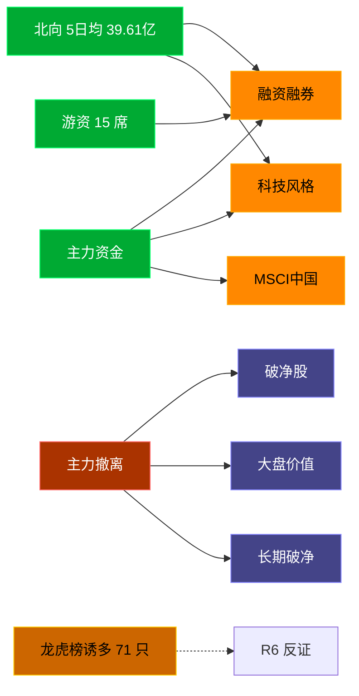

# 2026-07-22 · **资金面**

> **数据源新鲜度**: ok
> **降级状态**: false (全 MCP 健康)
> **置信度**: 0.8

## 一句话结论
北向近 5 日均 39.61 亿维持健康区间，主力集中「融资融券/科技风格」；资金撤离端 top1「破净股」，龙虎榜诱多 71 只需警惕。

## 资金流转拓扑图

## 详细分析

**1) 北向时序**
最新净流入 43.94 亿；5 日均 39.61 亿，20 日均 40.24 亿。近 5 日: 0715 36.1 → 0716 35.6 → 0717 39.4 → 0720 43.0 → 0721 43.9。整体维持健康区间，无明显撤离。

**2) 主力板块 (concept · REF_DATE=20260721)**
- 流入 TOP10：融资融券 +337.1亿 / 科技风格 +295.9亿 / MSCI中国 +283.7亿 / 百元股 +254.8亿 / 大盘股 +252.2亿 / 昨日高振幅 +247.9亿 / 富时罗素 +244.2亿 / 2026中报预增 +243.3亿 / 大盘成长 +237.8亿 / 国产芯片 +212.6亿
- 流出 TOP10：破净股 -54.7亿 / 大盘价值 -40.2亿 / 长期破净 -36.6亿 / 金融地产风格 -33.3亿 / 中特估 -33.0亿 / 消费风格 -30.1亿 / 超级品牌 -28.1亿 / 证金持股 -26.0亿 / 价值股 -25.7亿 / 味蕾经济 -21.1亿

**大资金意图**: 从流入端「融资融券 / 科技风格 / MSCI中国」的结构看，主力集中加仓强势主线；非趋势瓦解，是资金再分配。
**为什么走强**: 融资融券 昨日排名居首 + 北向配合，说明有配置盘认可，不是纯短线炒作。
**逻辑够不够硬**: Tushare 数据 T+1 存在延迟；建议 D1 以「板块方向」而非「精准金额」使用。

**3) 昨日前十 5 日追踪 (核心)**
- **融资融券**: 0715:-494.6 → 0716:-826.5 → 0717:-1496.5 → 0720:-574.2 → 0721:+337.1 亿 | 累计 -3054.7 亿 · 正流入 1/5 · **末日翻红·前段净出**
- **科技风格**: 0715:-320.3 → 0716:-318.4 → 0717:-567.1 → 0720:-190.6 → 0721:+295.9 亿 | 累计 -1100.5 亿 · 正流入 1/5 · **末日翻红·前段净出**
- **MSCI中国**: 0715:-341.3 → 0716:-485.1 → 0717:-960.4 → 0720:-284.9 → 0721:+283.7 亿 | 累计 -1788.1 亿 · 正流入 1/5 · **末日翻红·前段净出**
- **百元股**: 0715:-243.2 → 0716:-394.9 → 0717:-574.0 → 0720:-174.3 → 0721:+254.8 亿 | 累计 -1131.5 亿 · 正流入 1/5 · **末日翻红·前段净出**
- **大盘股**: 0715:-273.2 → 0716:-358.6 → 0717:-714.9 → 0720:-155.4 → 0721:+252.2 亿 | 累计 -1250.0 亿 · 正流入 1/5 · **末日翻红·前段净出**
- **昨日高振幅**: 0715:-318.8 → 0716:-354.5 → 0717:-456.2 → 0720:-383.8 → 0721:+247.9 亿 | 累计 -1265.4 亿 · 正流入 1/5 · **末日翻红·前段净出**
- **富时罗素**: 0715:-286.1 → 0716:-481.9 → 0717:-917.1 → 0720:-294.6 → 0721:+244.2 亿 | 累计 -1735.4 亿 · 正流入 1/5 · **末日翻红·前段净出**
- **2026中报预增**: 0715:-215.2 → 0716:-262.7 → 0717:-454.0 → 0720:-161.3 → 0721:+243.3 亿 | 累计 -849.9 亿 · 正流入 1/5 · **末日翻红·前段净出**
- **大盘成长**: 0715:-116.6 → 0716:-216.7 → 0717:-406.4 → 0720:-109.1 → 0721:+237.8 亿 | 累计 -611.0 亿 · 正流入 1/5 · **末日翻红·前段净出**
- **国产芯片**: 0715:-369.7 → 0716:-307.0 → 0717:-440.9 → 0720:-171.0 → 0721:+212.6 亿 | 累计 -1076.1 亿 · 正流入 1/5 · **末日翻红·前段净出**

**4) 游资 (龙虎榜 · 20260721)**
具名活跃席位 15 席，3 日协同信号 49 条。TOP 5:
- 炒新一族: 净额 -82257.3 万，覆盖 3 票
- 量化基金: 净额 -65826.8 万，覆盖 44 票
- 小鳄鱼: 净额 37770.7 万，覆盖 1 票
- T王: 净额 18974.9 万，覆盖 32 票
- 敢死队: 净额 12770.2 万，覆盖 4 票

**5) 龙虎榜诱多识别 (核心)**
当日总计 106 只上榜，命中诱多规则 **71 只**。前 10：

| 代码 | 名称 | 涨幅 | 换手 | 龙虎榜净额(万) | 机构净额(万) | 模式 | 上榜原因 |
|---|---|---|---|---|---|---|---|
| 688361.SH | 中科飞测 | +20.00% | 4.7% | -58757 | -42339 | 涨停净卖出 + 机构专用净卖 | 有价格涨跌幅限制的日收盘价格涨幅达到15%的前五只证券 |
| 300285.SZ | 国瓷材料 | +19.99% | 13.2% | -27251 | -37964 | 涨停净卖出 + 机构专用净卖 | 日涨幅达到15%的前5只证券 |
| 300534.SZ | 陇神戎发 | +14.62% | 39.5% | -12253 | -9810 | 涨停净卖出 + 换手异常且净卖出 + 机构专用净卖 | 日换手率达到30%的前5只证券 |
| 003031.SZ | 中瓷电子 | +10.00% | 4.4% | -4545 | -8159 | 涨停净卖出 + 机构专用净卖 | 日振幅值达到15%的前5只证券 |
| 688359.SH | 三孚新科 | +17.18% | 12.8% | -11906 | -7208 | 涨停净卖出 + 机构专用净卖 + 疑似对倒:高盛(中国)证券有限… | 有价格涨跌幅限制的日价格振幅达到30%的前五只证券 |
| 301086.SZ | 鸿富瀚 | +12.51% | 12.6% | -1831 | -4566 | 涨停净卖出 + 机构专用净卖 | 日振幅值达到30%的前5只证券 |
| 300814.SZ | 中富电路 | +20.00% | 6.0% | -13280 | -4558 | 涨停净卖出 + 机构专用净卖 | 日涨幅达到15%的前5只证券 |
| 301070.SZ | 开勒股份 | +14.05% | 10.8% | -1133 | -3484 | 涨停净卖出 + 机构专用净卖 | 日振幅值达到30%的前5只证券 |
| 688432.SH | 有研硅 | +10.03% | 6.1% | -7060 | -2664 | 涨停净卖出 + 机构专用净卖 | 有价格涨跌幅限制的日价格振幅达到30%的前五只证券 |
| 688662.SH | 富信科技 | +19.15% | 13.9% | -5528 | -2412 | 涨停净卖出 + 机构专用净卖 + 疑似对倒:瑞银证券有限责任公司… | 有价格涨跌幅限制的日价格振幅达到30%的前五只证券 |

**6) 板块跷跷板**
_未检出显著跷跷板配对。_

**7) ETF / 期货**
ETF 净流入 104.51 亿(4 只代表)；股指期货基差: -76.83。

## 关键证据
- 主力流入 top1 融资融券 +337.1 亿 · 来源 tushare.moneyflow_ind_dc
- 5 日追踪：融资融券 累计 -3054.69 亿, 1/5 日正流入
- 流出 top1 破净股 -54.7 亿 · 来源 tushare.moneyflow_ind_dc
- 龙虎榜诱多 71 只，其中「涨停净卖出」21 只 · 来源 tushare.top_list+top_inst
- 游资 3 日协同 49 条 · 来源 tushare.hm_detail

## 数据源审计
| 源 | 状态 | 抓取日期 | 备注 |
|---|---|---|---|
| tushare.moneyflow_hsgt | 🟢 ok | 20260721 | 20 日北向 |
| tushare.moneyflow_ind_dc | 🟢 ok | 20260721 | 概念板块 5 日 |
| tushare.top_list | 🟢 ok | 20260721 | 106 行 |
| tushare.top_inst | 🟢 ok | 20260721 | 1136 席位 |
| tushare.hm_detail | 🟢 ok | 20260721 | 15 具名席位 |
| xtick(canghai-sise) | 🟢 ok | 20260721 | 已交叉核实主力方向 |
| DataPro | 🟢 ok | 20260721 | 板块资金冗余核实 |

## 不确定性 / 反证
- 参考交易日 20260721，非当日实时；盘中若大级别政策/外围事件本判断失效。
- 龙虎榜诱多规则为静态启发式，未剔除 T+1 高开对冲情形，可能高估诱多密度；供 R6 反证参考，不作 hard_reject。
- Tushare hm_detail 存在 T+1 延迟；xtick/datapro 可作实时补充但盘前抓取以 Tushare 为主。
- 5 日追踪只跟踪昨日 top10，若今日风格切换到昨日 top20+ 板块，本追踪盲区。
- ETF 净流入基于 4 只代表 ETF 份额×收盘价估算，非真实一级市场资金流水。

## 与其他 R/D/E 的关系
- 依赖: data/raw/20260722/manifest.json, mcp_health.json; data/research/20260722/R1_style.json
- 被消费: D1(main_decision_v1) · R2(analyze_main_sectors_v1) · R5(analyze_stock_profile_v1) · R6(analyze_devil_advocate_v1)

## Sub-Agent 元数据
- skill: analyze_capital_flow_v1
- artifact: /Users/chenyang/Downloads/demo/沧海巨浪/data/research/20260722/R7_capital_flow.json
- 生成方式: enrich_r7_20260722.py (build 核心 + sector_5d_tracking + lhb_bull_trap + mermaid)
- model: ark-code-latest
