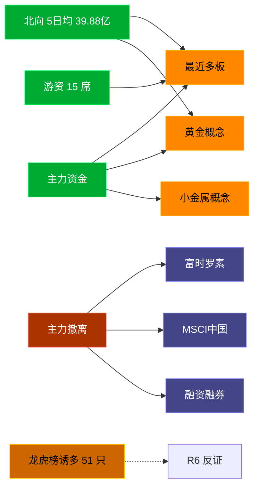

# 2026-07-23 · **资金面**

> **数据源新鲜度**: ok
> **降级状态**: false (资金面 MCP 全健康)
> **置信度**: 0.8

## 一句话结论
北向近 5 日均 39.88 亿维持健康区间，主力集中「最近多板/黄金概念」；资金撤离端 top1「富时罗素」，龙虎榜诱多 51 只需警惕。

## 资金流转拓扑图

## 详细分析

**1) 北向时序**
最新净流入 37.5 亿；5 日均 39.88 亿，20 日均 39.89 亿。近 5 日: 0716 35.6 → 0717 39.4 → 0720 43.0 → 0721 43.9 → 0722 37.5。整体维持健康区间，无明显撤离。

**2) 主力板块 (concept · REF_DATE=20260722)**
- 流入 TOP10：最近多板 +58.6亿 / 黄金概念 +51.4亿 / 小金属概念 +48.0亿 / 边缘计算 +46.8亿 / 昨日首板 +46.8亿 / 云计算 +46.6亿 / 稀缺资源 +41.8亿 / 昨日涨停_含一字 +41.4亿 / 昨日涨停 +41.4亿 / 深圳特区 +39.4亿
- 流出 TOP10：富时罗素 -202.1亿 / MSCI中国 -200.7亿 / 融资融券 -186.8亿 / 科技风格 -184.3亿 / 昨日高振幅 -179.1亿 / 5G概念 -173.9亿 / 大盘股 -171.4亿 / HS300_ -161.0亿 / 深证100R -158.8亿 / 深股通 -155.2亿

**大资金意图**: 从流入端「最近多板 / 黄金概念 / 小金属概念」的结构看，主力集中加仓强势主线；非趋势瓦解，是资金再分配。
**为什么走强**: 最近多板 昨日排名居首 + 北向配合，说明有配置盘认可，不是纯短线炒作。
**逻辑够不够硬**: Tushare 数据 T+1 存在延迟；建议 D1 以「板块方向」而非「精准金额」使用。

**3) 昨日前十 5 日追踪 (核心)**
- **最近多板**: 0716:-8.8 → 0717:-17.9 → 0720:-12.1 → 0721:+6.2 → 0722:+58.6 亿 | 累计 +25.9 亿 · 正流入 2/5 · **末日翻红·前段净出**
- **黄金概念**: 0716:+0.3 → 0717:-30.5 → 0720:-1.9 → 0721:+37.0 → 0722:+51.4 亿 | 累计 +56.5 亿 · 正流入 3/5 · **偏强净入·有波动**
- **小金属概念**: 0716:-46.4 → 0717:-70.2 → 0720:-24.1 → 0721:+46.4 → 0722:+48.0 亿 | 累计 -46.2 亿 · 正流入 2/5 · **末日翻红·前段净出**
- **边缘计算**: 0716:+2.5 → 0717:-95.5 → 0720:-32.9 → 0721:+13.1 → 0722:+46.8 亿 | 累计 -66.1 亿 · 正流入 3/5 · **净出收窄·转暖**
- **昨日首板**: 0716:+8.7 → 0717:-4.0 → 0720:+1.4 → 0721:-0.1 → 0722:+46.8 亿 | 累计 +52.9 亿 · 正流入 3/5 · **偏强净入·有波动**
- **云计算**: 0716:-17.0 → 0717:-137.6 → 0720:+12.6 → 0721:+39.8 → 0722:+46.6 亿 | 累计 -55.6 亿 · 正流入 3/5 · **净出收窄·转暖**
- **稀缺资源**: 0716:-22.2 → 0717:-44.1 → 0720:-12.0 → 0721:+33.0 → 0722:+41.8 亿 | 累计 -3.5 亿 · 正流入 2/5 · **末日翻红·前段净出**
- **昨日涨停_含一字**: 0716:+2.5 → 0717:-13.1 → 0720:-7.5 → 0721:-0.9 → 0722:+41.4 亿 | 累计 +22.3 亿 · 正流入 2/5 · **末日翻红·前段净出**
- **昨日涨停**: 0716:+0.3 → 0717:-14.2 → 0720:-4.5 → 0721:-3.2 → 0722:+41.4 亿 | 累计 +19.8 亿 · 正流入 2/5 · **末日翻红·前段净出**
- **深圳特区**: 0716:-38.6 → 0717:-176.0 → 0720:-80.5 → 0721:+32.5 → 0722:+39.4 亿 | 累计 -223.2 亿 · 正流入 2/5 · **末日翻红·前段净出**

**4) 游资 (龙虎榜 · 20260722)**
具名活跃席位 15 席，3 日协同信号 47 条。TOP 5:
- T王: 净额 -26787.3 万，覆盖 28 票
- 量化打板: 净额 24349.5 万，覆盖 12 票
- 紫阳东路: 净额 11664.5 万，覆盖 2 票
- 成都系: 净额 10101.8 万，覆盖 1 票
- 量化基金: 净额 -10074.1 万，覆盖 31 票

**5) 龙虎榜诱多识别 (核心)**
当日总计 87 只上榜，命中诱多规则 **51 只**。前 10：

| 代码 | 名称 | 涨幅 | 换手 | 龙虎榜净额(万) | 机构净额(万) | 模式 | 上榜原因 |
|---|---|---|---|---|---|---|---|
| 000975.SZ | 山金国际 | +10.01% | 3.7% | -8675 | -11466 | 涨停净卖出 + 机构专用净卖 | 连续三个交易日内，涨幅偏离值累计达到20%的证券 |
| 301536.SZ | 星宸科技 | +12.13% | 20.2% | -92265 | +1022 | 涨停净卖出 | 连续三个交易日内，涨幅偏离值累计达到30%的证券 |
| 600726.SH | 华电能源 | +10.00% | 5.1% | -8691 | +0 | 涨停净卖出 + 疑似对倒:高盛(中国)证券有限… | 非S证券连续三个交易日内收盘价格涨幅偏离值累计达到20%的证券 |
| 000815.SZ | 美利云 | +10.03% | 13.0% | -6519 | +4836 | 涨停净卖出 + 疑似对倒:东海证券股份有限公司… | 日涨幅偏离值达到7%的前5只证券 |
| 603725.SH | 天安新材 | +10.04% | 13.1% | -5468 | +0 | 涨停净卖出 + 疑似对倒:摩根大通证券(中国)… | 有价格涨跌幅限制的日收盘价格涨幅偏离值达到7%的前五只证券 |
| 605196.SH | 华通线缆 | +9.99% | 5.2% | -2778 | +26540 | 涨停净卖出 | 非S证券连续三个交易日内收盘价格涨幅偏离值累计达到20%的证券 |
| 002515.SZ | 金字火腿 | +9.95% | 10.7% | -853 | +2435 | 涨停净卖出 | 日涨幅偏离值达到7%的前5只证券 |
| 000603.SZ | 盛达资源 | +9.99% | 6.3% | -644 | +2008 | 涨停净卖出 | 日涨幅偏离值达到7%的前5只证券 |
| 600176.SH | 中国巨石 | -10.00% | 7.0% | -59512 | -55834 | 机构专用净卖 + 疑似对倒:瑞银证券有限责任公司… | 有价格涨跌幅限制的日收盘价格跌幅偏离值达到7%的前五只证券 |
| 300164.SZ | 通源石油 | +8.89% | 38.0% | -6282 | -11901 | 拉高净卖出 + 机构专用净卖 | 日换手率达到30%的前5只证券 |

**6) 板块跷跷板**
_未检出显著跷跷板配对。_

**7) ETF / 期货**
ETF 净流入 -86.14 亿(4 只代表)；股指期货基差: -69.24。

## 关键证据
- 主力流入 top1 最近多板 +58.6 亿 · 来源 tushare.moneyflow_ind_dc
- 5 日追踪：最近多板 累计 25.89 亿, 2/5 日正流入
- 流出 top1 富时罗素 -202.1 亿 · 来源 tushare.moneyflow_ind_dc
- 龙虎榜诱多 51 只，其中「涨停净卖出」8 只 · 来源 tushare.top_list+top_inst
- 游资 3 日协同 47 条 · 来源 tushare.hm_detail

## 数据源审计
| 源 | 状态 | 抓取日期 | 备注 |
|---|---|---|---|
| tushare.moneyflow_hsgt | 🟢 ok | 20260722 | 20 日北向 |
| tushare.moneyflow_ind_dc | 🟢 ok | 20260722 | 概念板块 5 日 |
| tushare.top_list | 🟢 ok | 20260722 | 87 行 |
| tushare.top_inst | 🟢 ok | 20260722 | 949 席位 |
| tushare.hm_detail | 🟢 ok | 20260722 | 15 具名席位 |
| xtick(canghai-sise) | 🟢 ok | 20260722 | 已交叉核实主力方向 |
| DataPro | 🟢 ok | 20260722 | 板块资金冗余核实 |
| agentqmt_qmt | 🔴 down | — | 持仓通道，不影响资金面研究 |

## 不确定性 / 反证
- 参考交易日 20260722，非当日实时；盘中若大级别政策/外围事件本判断失效。
- 龙虎榜诱多规则为静态启发式，未剔除 T+1 高开对冲情形，可能高估诱多密度；供 R6 反证参考，不作 hard_reject。
- Tushare hm_detail 存在 T+1 延迟；xtick/datapro 可作实时补充但盘前抓取以 Tushare 为主。
- 5 日追踪只跟踪昨日 top10，若今日风格切换到昨日 top20+ 板块，本追踪盲区。
- ETF 净流入基于 4 只代表 ETF 份额×收盘价估算，非真实一级市场资金流水。

## 与其他 R/D/E 的关系
- 依赖: data/raw/20260723/manifest.json, mcp_health.json; data/research/20260723/R1_style.json
- 被消费: D1(main_decision_v1) · R2(analyze_main_sectors_v1) · R5(analyze_stock_profile_v1) · R6(analyze_devil_advocate_v1)

## Sub-Agent 元数据
- skill: analyze_capital_flow_v1
- artifact: /Users/chenyang/Downloads/demo/沧海巨浪/data/research/20260723/R7_capital_flow.json
- 生成方式: enrich_r7_20260723.py (build 核心 + sector_5d_tracking + lhb_bull_trap + mermaid)
- model: ark-code-latest
