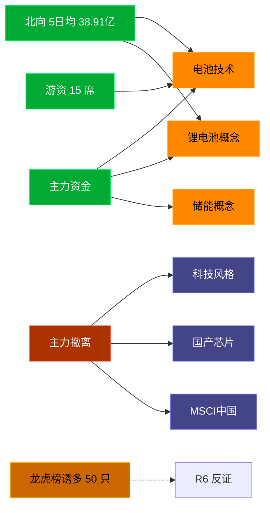

# 2026-07-24 · **资金面**

> **数据源新鲜度**: ok
> **降级状态**: false (资金面 MCP 全健康)
> **置信度**: 0.8

## 一句话结论
北向近 5 日均 38.91 亿维持健康区间，主力集中「电池技术/锂电池概念」；资金撤离端 top1「科技风格」，龙虎榜诱多 50 只需警惕。

## 资金流转拓扑图

## 详细分析

**1) 北向时序**
最新净流入 30.75 亿；5 日均 38.91 亿，20 日均 39.31 亿。近 5 日: 0717 39.4 → 0720 43.0 → 0721 43.9 → 0722 37.5 → 0723 30.8。整体维持健康区间，无明显撤离。

**2) 主力板块 (concept · REF_DATE=20260723)**
- 流入 TOP10：电池技术 +109.5亿 / 锂电池概念 +103.7亿 / 储能概念 +78.1亿 / 固态电池 +60.0亿 / 小金属概念 +52.2亿 / 先进制造风格 +50.3亿 / 电网概念 +47.3亿 / 智能电网 +43.4亿 / 锂矿概念 +43.2亿 / 特高压 +40.1亿
- 流出 TOP10：科技风格 -313.1亿 / 国产芯片 -262.5亿 / MSCI中国 -236.8亿 / 融资融券 -235.4亿 / 东方财富热股 -234.5亿 / 大盘股 -219.8亿 / 昨日高振幅 -212.6亿 / 百元股 -211.4亿 / 半导体概念 -200.7亿 / 通信技术 -197.8亿

**大资金意图**: 从流入端「电池技术 / 锂电池概念 / 储能概念」的结构看，主力集中加仓强势主线；非趋势瓦解，是资金再分配。
**为什么走强**: 电池技术 昨日排名居首 + 北向配合，说明有配置盘认可，不是纯短线炒作。
**逻辑够不够硬**: Tushare 数据 T+1 存在延迟；建议 D1 以「板块方向」而非「精准金额」使用。

**3) 昨日前十 5 日追踪 (核心)**
- **电池技术**: 0717:-176.6 → 0720:-116.7 → 0721:+87.3 → 0722:-52.7 → 0723:+109.5 亿 | 累计 -149.1 亿 · 正流入 2/5 · **末日翻红·前段净出**
- **锂电池概念**: 0717:-125.7 → 0720:-82.5 → 0721:+64.3 → 0722:-40.1 → 0723:+103.7 亿 | 累计 -80.4 亿 · 正流入 2/5 · **末日翻红·前段净出**
- **储能概念**: 0717:-96.4 → 0720:-53.9 → 0721:+41.0 → 0722:-16.9 → 0723:+78.1 亿 | 累计 -48.0 亿 · 正流入 2/5 · **末日翻红·前段净出**
- **固态电池**: 0717:-68.9 → 0720:-55.4 → 0721:+46.0 → 0722:-35.6 → 0723:+60.0 亿 | 累计 -53.9 亿 · 正流入 2/5 · **末日翻红·前段净出**
- **小金属概念**: 0717:-70.2 → 0720:-24.1 → 0721:+46.4 → 0722:+48.0 → 0723:+52.2 亿 | 累计 +52.4 亿 · 正流入 3/5 · **偏强净入·有波动**
- **先进制造风格**: 0717:-116.3 → 0720:-61.5 → 0721:+47.2 → 0722:-9.8 → 0723:+50.3 亿 | 累计 -90.1 亿 · 正流入 2/5 · **末日翻红·前段净出**
- **电网概念**: 0717:-48.4 → 0720:-23.8 → 0721:+10.0 → 0722:-35.9 → 0723:+47.3 亿 | 累计 -50.7 亿 · 正流入 2/5 · **末日翻红·前段净出**
- **智能电网**: 0717:-38.5 → 0720:-18.9 → 0721:+11.1 → 0722:-15.9 → 0723:+43.4 亿 | 累计 -18.9 亿 · 正流入 2/5 · **末日翻红·前段净出**
- **锂矿概念**: 0717:-13.4 → 0720:-11.2 → 0721:+25.7 → 0722:+15.1 → 0723:+43.2 亿 | 累计 +59.4 亿 · 正流入 3/5 · **偏强净入·有波动**
- **特高压**: 0717:-34.8 → 0720:-15.8 → 0721:-0.2 → 0722:-34.9 → 0723:+40.1 亿 | 累计 -45.5 亿 · 正流入 1/5 · **末日翻红·前段净出**

**4) 游资 (龙虎榜 · 20260723)**
具名活跃席位 15 席，3 日协同信号 42 条。TOP 5:
- 量化基金: 净额 59169.0 万，覆盖 28 票
- 紫阳东路: 净额 -26823.6 万，覆盖 5 票
- T王: 净额 -24463.2 万，覆盖 25 票
- 量化打板: 净额 15343.8 万，覆盖 16 票
- 红岭路: 净额 -9098.8 万，覆盖 1 票

**5) 龙虎榜诱多识别 (核心)**
当日总计 80 只上榜，命中诱多规则 **50 只**。前 10：

| 代码 | 名称 | 涨幅 | 换手 | 龙虎榜净额(万) | 机构净额(万) | 模式 | 上榜原因 |
|---|---|---|---|---|---|---|---|
| 000603.SZ | 盛达资源 | +10.01% | 10.4% | -5296 | -6823 | 涨停净卖出 + 机构专用净卖 | 连续三个交易日内，涨幅偏离值累计达到20%的证券 |
| 002379.SZ | 宏桥控股 | +10.01% | 6.5% | -4522 | -4496 | 涨停净卖出 + 机构专用净卖 | 日涨幅偏离值达到7%的前5只证券 |
| 300444.SZ | 双杰电气 | +20.00% | 17.1% | -2882 | -3424 | 涨停净卖出 + 机构专用净卖 | 日涨幅达到15%的前5只证券 |
| 002879.SZ | 长缆科技 | +9.99% | 19.2% | -2870 | -3209 | 涨停净卖出 + 机构专用净卖 | 连续三个交易日内，涨幅偏离值累计达到20%的证券 |
| 920193.BJ | 吉和昌 | +15.19% | 32.8% | -2082 | -325 | 涨停净卖出 + 换手异常且净卖出 + 疑似对倒:国金证券股份有限公司… | 当日换手率达到20%的前5只股票 |
| 600396.SH | 华电辽能 | +9.99% | 23.2% | -22822 | +0 | 涨停净卖出 | 有价格涨跌幅限制的日换手率达到20%的前五只证券 |
| 001258.SZ | 立新能源 | +9.99% | 11.3% | -5988 | +5320 | 涨停净卖出 | 日涨幅偏离值达到7%的前5只证券 |
| 688679.SH | 通源环境 | +19.99% | 5.5% | -1688 | +1053 | 涨停净卖出 | 有价格涨跌幅限制的连续3个交易日内收盘价格涨幅偏离值累计达到30%的证券 |
| 600289.SH | ST信通 | +10.13% | 2.1% | -588 | +0 | 涨停净卖出 | 有价格涨跌幅限制的日收盘价格涨幅偏离值达到7%的前五只证券 |
| 002156.SZ | 通富微电 | -6.78% | 13.6% | -15430 | -34964 | 机构专用净卖 | 日跌幅偏离值达到7%的前5只证券 |

**6) 板块跷跷板**
_未检出显著跷跷板配对。_

**7) ETF / 期货**
ETF 净流入 13.72 亿(4 只代表)；股指期货基差: -66.6。

## 关键证据
- 主力流入 top1 电池技术 +109.5 亿 · 来源 tushare.moneyflow_ind_dc
- 5 日追踪：电池技术 累计 -149.13 亿, 2/5 日正流入
- 流出 top1 科技风格 -313.1 亿 · 来源 tushare.moneyflow_ind_dc
- 龙虎榜诱多 50 只，其中「涨停净卖出」9 只 · 来源 tushare.top_list+top_inst
- 游资 3 日协同 42 条 · 来源 tushare.hm_detail

## 数据源审计
| 源 | 状态 | 抓取日期 | 备注 |
|---|---|---|---|
| tushare.moneyflow_hsgt | 🟢 ok | 20260723 | 20 日北向 |
| tushare.moneyflow_ind_dc | 🟢 ok | 20260723 | 概念板块 5 日 |
| tushare.top_list | 🟢 ok | 20260723 | 80 行 |
| tushare.top_inst | 🟢 ok | 20260723 | 855 席位 |
| tushare.hm_detail | 🟢 ok | 20260723 | 15 具名席位 |
| xtick(canghai-sise) | 🟢 ok | 20260723 | 已交叉核实主力方向 |
| DataPro | 🟢 ok | 20260723 | 板块资金冗余核实 |
| agentqmt_qmt | 🔴 down | — | 持仓通道，不影响资金面研究 |

## 不确定性 / 反证
- 参考交易日 20260723，非当日实时；盘中若大级别政策/外围事件本判断失效。
- 龙虎榜诱多规则为静态启发式，未剔除 T+1 高开对冲情形，可能高估诱多密度；供 R6 反证参考，不作 hard_reject。
- Tushare hm_detail 存在 T+1 延迟；xtick/datapro 可作实时补充但盘前抓取以 Tushare 为主。
- 5 日追踪只跟踪昨日 top10，若今日风格切换到昨日 top20+ 板块，本追踪盲区。
- ETF 净流入基于 4 只代表 ETF 份额×收盘价估算，非真实一级市场资金流水。

## 与其他 R/D/E 的关系
- 依赖: data/raw/20260724/manifest.json, mcp_health.json; data/research/20260724/R1_style.json
- 被消费: D1(main_decision_v1) · R2(analyze_main_sectors_v1) · R5(analyze_stock_profile_v1) · R6(analyze_devil_advocate_v1)

## Sub-Agent 元数据
- skill: analyze_capital_flow_v1
- artifact: /Users/chenyang/Downloads/demo/沧海巨浪/data/research/20260724/R7_capital_flow.json
- 生成方式: enrich_r7_20260724.py (build 核心 + sector_5d_tracking + lhb_bull_trap + mermaid)
- model: ark-code-latest
