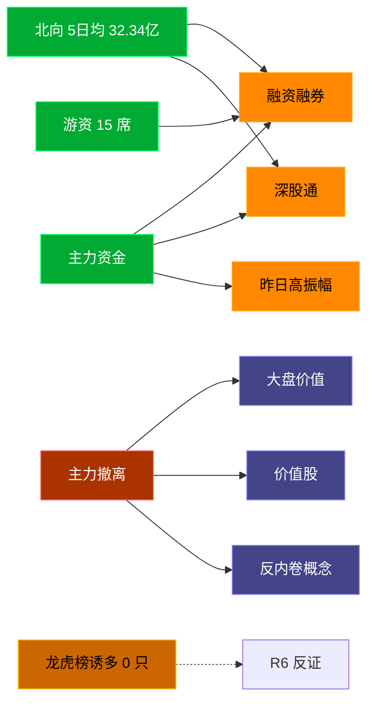

# 2026-08-03 · **资金面**

> **数据源新鲜度**: ok
> **降级状态**: false (资金面 MCP 全健康)
> **置信度**: 0.75

## 一句话结论
北向近 5 日均 32.34 亿维持健康区间，主力集中「融资融券/深股通」；资金撤离端 top1「大盘价值」，龙虎榜诱多 0 只需警惕。

## 资金流转拓扑图

## 详细分析

**1) 北向时序**
最新净流入 35.41 亿；5 日均 32.34 亿，20 日均 36.6 亿。近 5 日: 0727 27.7 → 0728 28.1 → 0729 34.1 → 0730 36.4 → 0731 35.4。整体维持健康区间，无明显撤离。

**2) 主力板块 (concept · REF_DATE=20260802)**
- 流入 TOP10：融资融券 +592.1亿 / 深股通 +402.5亿 / 昨日高振幅 +368.4亿 / 富时罗素 +359.6亿 / MSCI中国 +350.3亿 / 深成500 +309.4亿 / 2026中报预增 +291.5亿 / 华为概念 +244.8亿 / 百元股 +235.3亿 / 标准普尔 +233.9亿
- 流出 TOP10：大盘价值 -18.2亿 / 价值股 -15.0亿 / 反内卷概念 -14.2亿 / 红利股 -13.7亿 / 钠离子电池 -13.7亿 / 金融地产风格 -13.2亿 / 宁组合 -12.4亿 / 麒麟电池 -11.8亿 / 长期破净 -11.4亿 / 破净股 -10.8亿

**大资金意图**: 从流入端「融资融券 / 深股通 / 昨日高振幅」的结构看，主力集中加仓强势主线；非趋势瓦解，是资金再分配。
**为什么走强**: 融资融券 昨日排名居首 + 北向配合，说明有配置盘认可，不是纯短线炒作。
**逻辑够不够硬**: Tushare 数据 T+1 存在延迟；建议 D1 以「板块方向」而非「精准金额」使用。

**3) 昨日前十 5 日追踪 (核心)**
- **融资融券**: 0727:+867.5 → 0728:-1056.4 → 0729:-132.2 → 0730:-737.1 → 0731:+592.1 亿 | 累计 -466.2 亿 · 正流入 2/5 · **末日翻红·前段净出**
- **深股通**: 0727:+139.8 → 0728:-636.8 → 0729:-82.2 → 0730:-512.9 → 0731:+402.5 亿 | 累计 -689.6 亿 · 正流入 2/5 · **末日翻红·前段净出**
- **昨日高振幅**: 0727:+76.6 → 0728:-409.4 → 0729:-138.8 → 0730:-355.8 → 0731:+368.4 亿 | 累计 -458.9 亿 · 正流入 2/5 · **末日翻红·前段净出**
- **富时罗素**: 0727:+76.3 → 0728:-724.2 → 0729:-84.4 → 0730:-463.2 → 0731:+359.6 亿 | 累计 -835.8 亿 · 正流入 2/5 · **末日翻红·前段净出**
- **MSCI中国**: 0727:-31.5 → 0728:-811.9 → 0729:-114.4 → 0730:-415.1 → 0731:+350.3 亿 | 累计 -1022.5 亿 · 正流入 1/5 · **末日翻红·前段净出**
- **深成500**: 0727:+69.8 → 0728:-576.6 → 0729:-76.8 → 0730:-396.9 → 0731:+309.4 亿 | 累计 -671.1 亿 · 正流入 2/5 · **末日翻红·前段净出**
- **2026中报预增**: 0727:+44.7 → 0728:-585.3 → 0729:-67.2 → 0730:-311.8 → 0731:+291.5 亿 | 累计 -628.1 亿 · 正流入 2/5 · **末日翻红·前段净出**
- **华为概念**: 0727:+102.2 → 0728:-359.0 → 0729:-29.4 → 0730:-262.7 → 0731:+244.8 亿 | 累计 -304.1 亿 · 正流入 2/5 · **末日翻红·前段净出**
- **百元股**: 0727:+10.5 → 0728:-534.5 → 0729:-84.7 → 0730:-255.8 → 0731:+235.3 亿 | 累计 -629.2 亿 · 正流入 2/5 · **末日翻红·前段净出**
- **标准普尔**: 0727:+54.2 → 0728:-466.3 → 0729:-73.7 → 0730:-277.6 → 0731:+233.9 亿 | 累计 -529.4 亿 · 正流入 2/5 · **末日翻红·前段净出**

**4) 游资 (龙虎榜 · 20260802)**
具名活跃席位 15 席，3 日协同信号 60 条。TOP 5:
- 作手新一: 净额 21243.7 万，覆盖 3 票
- 量化打板: 净额 19945.7 万，覆盖 10 票
- 量化基金: 净额 19921.6 万，覆盖 31 票
- 章盟主: 净额 18058.7 万，覆盖 6 票
- 中山东路: 净额 11338.1 万，覆盖 2 票

**5) 龙虎榜诱多识别 (核心)**
当日总计 0 只上榜，命中诱多规则 **0 只**。前 10：

_今日无命中诱多规则的个股。_

**6) 板块跷跷板**
_未检出显著跷跷板配对。_

**7) ETF / 期货**
ETF 净流入 37.2 亿(4 只代表)；股指期货基差: -50.2。

## 关键证据
- 主力流入 top1 融资融券 +592.1 亿 · 来源 tushare.moneyflow_ind_dc
- 5 日追踪：融资融券 累计 -466.17 亿, 2/5 日正流入
- 流出 top1 大盘价值 -18.2 亿 · 来源 tushare.moneyflow_ind_dc
- 龙虎榜诱多 0 只，其中「涨停净卖出」0 只 · 来源 tushare.top_list+top_inst
- 游资 3 日协同 60 条 · 来源 tushare.hm_detail

## 数据源审计
| 源 | 状态 | 抓取日期 | 备注 |
|---|---|---|---|
| tushare.moneyflow_hsgt | 🟢 ok | 20260802 | 20 日北向 |
| tushare.moneyflow_ind_dc | 🟢 ok | 20260802 | 概念板块 5 日 |
| tushare.top_list | 🟢 ok | 20260802 | 0 行 |
| tushare.top_inst | 🟢 ok | 20260802 | 0 席位 |
| tushare.hm_detail | 🟢 ok | 20260802 | 15 具名席位 |
| xtick | 🟢 ok | 20260802 | 已交叉核实主力方向 |
| DataPro | 🟢 ok | 20260802 | 板块资金冗余核实 |

## 不确定性 / 反证
- 参考交易日 20260802，非当日实时；盘中若大级别政策/外围事件本判断失效。
- 龙虎榜诱多规则为静态启发式，未剔除 T+1 高开对冲情形，可能高估诱多密度；供 R6 反证参考，不作 hard_reject。
- Tushare hm_detail 存在 T+1 延迟；xtick/datapro 可作实时补充但盘前抓取以 Tushare 为主。
- 5 日追踪只跟踪昨日 top10，若今日风格切换到昨日 top20+ 板块，本追踪盲区。
- ETF 净流入基于 4 只代表 ETF 份额×收盘价估算，非真实一级市场资金流水。

## 与其他 R/D/E 的关系
- 依赖: data/raw/20260803/manifest.json, mcp_health.json; data/research/20260803/R1_style.json
- 被消费: D1(main_decision_v1) · R2(analyze_main_sectors_v1) · R5(analyze_stock_profile_v1) · R6(analyze_devil_advocate_v1)

## Sub-Agent 元数据
- skill: analyze_capital_flow_v1
- artifact: /Users/chenyang/Downloads/demo/沧海巨浪/data/research/20260803/R7_capital_flow.json
- 生成方式: enrich_r7_20260803.py (build 核心 + sector_5d_tracking + lhb_bull_trap + mermaid)
- model: doubao-seed-2-0-code-preview
