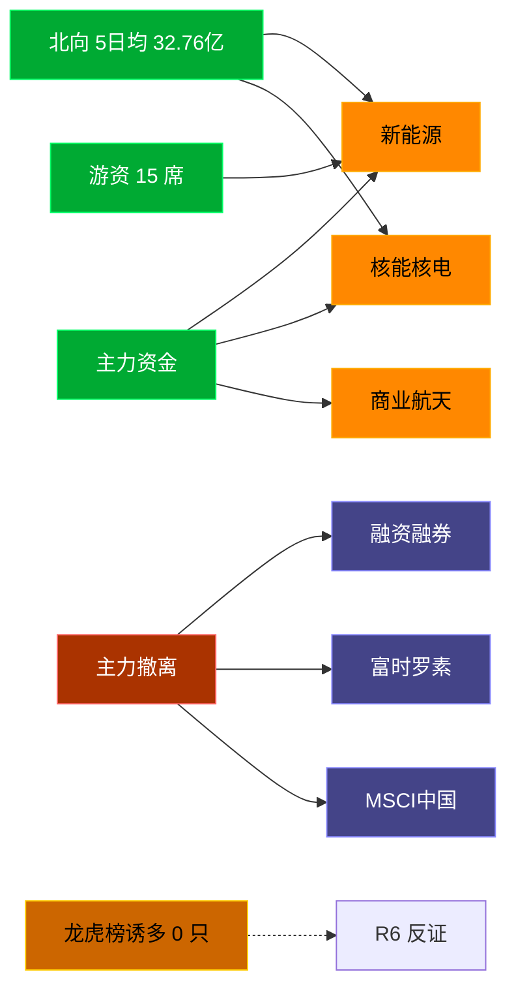

# 2026-08-04 · **资金面**

> **数据源新鲜度**: ok
> **降级状态**: false (资金面 MCP 全健康)
> **置信度**: 0.75

## 一句话结论
北向近 5 日均 32.76 亿维持健康区间，主力集中「新能源/核能核电」；资金撤离端 top1「融资融券」，龙虎榜诱多 0 只需警惕。

## 资金流转拓扑图

## 详细分析

**1) 北向时序**
最新净流入 29.77 亿；5 日均 32.76 亿，20 日均 36.1 亿。近 5 日: 0728 28.1 → 0729 34.1 → 0730 36.4 → 0731 35.4 → 0803 29.8。整体维持健康区间，无明显撤离。

**2) 主力板块 (concept · REF_DATE=20260801)**
- 流入 TOP10：新能源 +27.4亿 / 核能核电 +26.3亿 / 商业航天 +21.6亿 / 可控核聚变 +12.0亿 / HJT电池 +10.6亿 / BC电池 +8.1亿 / 抽水蓄能 +8.0亿 / 东北振兴 +7.8亿 / 氢能源 +7.7亿 / 绿色电力 +7.6亿
- 流出 TOP10：融资融券 -420.3亿 / 富时罗素 -345.9亿 / MSCI中国 -343.7亿 / 大盘股 -300.6亿 / 标准普尔 -264.6亿 / 2026中报预增 -261.2亿 / 科技风格 -257.0亿 / HS300_ -243.4亿 / 昨日高振幅 -242.8亿 / 半导体概念 -241.8亿

**大资金意图**: 从流入端「新能源 / 核能核电 / 商业航天」的结构看，主力集中加仓强势主线；非趋势瓦解，是资金再分配。
**为什么走强**: 新能源 昨日排名居首 + 北向配合，说明有配置盘认可，不是纯短线炒作。
**逻辑够不够硬**: Tushare 数据 T+1 存在延迟；建议 D1 以「板块方向」而非「精准金额」使用。

**3) 昨日前十 5 日追踪 (核心)**
- **新能源**: 0727:+26.5 → 0728:-42.5 → 0729:+5.5 → 0730:-41.6 → 0731:+11.7 亿 | 累计 -40.4 亿 · 正流入 3/5 · **净出收窄·转暖**
- **核能核电**: 0727:+10.0 → 0728:-22.4 → 0729:+14.7 → 0730:-26.7 → 0731:+17.4 亿 | 累计 -7.0 亿 · 正流入 3/5 · **净出收窄·转暖**
- **商业航天**: 0727:+16.1 → 0728:-99.7 → 0729:-25.3 → 0730:-107.0 → 0731:+44.0 亿 | 累计 -172.0 亿 · 正流入 2/5 · **末日翻红·前段净出**
- **可控核聚变**: 0727:+17.7 → 0728:-44.0 → 0729:-6.3 → 0730:-12.7 → 0731:+10.8 亿 | 累计 -34.5 亿 · 正流入 2/5 · **末日翻红·前段净出**
- **HJT电池**: 0727:+4.3 → 0728:-3.5 → 0729:-0.5 → 0730:-8.8 → 0731:+2.5 亿 | 累计 -5.9 亿 · 正流入 2/5 · **末日翻红·前段净出**
- **BC电池**: 0727:+3.0 → 0728:-3.5 → 0729:-1.2 → 0730:-8.8 → 0731:+3.9 亿 | 累计 -6.5 亿 · 正流入 2/5 · **末日翻红·前段净出**
- **抽水蓄能**: 0727:+0.4 → 0728:-6.1 → 0729:-0.6 → 0730:-0.6 → 0731:+4.2 亿 | 累计 -2.7 亿 · 正流入 2/5 · **末日翻红·前段净出**
- **东北振兴**: 0727:+2.4 → 0728:+2.0 → 0729:-1.8 → 0730:-8.3 → 0731:-2.7 亿 | 累计 -8.4 亿 · 正流入 2/5 · **弱净出·震荡**
- **氢能源**: 0727:+21.6 → 0728:-40.7 → 0729:-10.3 → 0730:-36.6 → 0731:+10.7 亿 | 累计 -55.4 亿 · 正流入 2/5 · **末日翻红·前段净出**
- **绿色电力**: 0727:+13.2 → 0728:-24.6 → 0729:-2.7 → 0730:-32.2 → 0731:+23.9 亿 | 累计 -22.4 亿 · 正流入 2/5 · **末日翻红·前段净出**

**4) 游资 (龙虎榜 · 20260801)**
具名活跃席位 15 席，3 日协同信号 40 条。TOP 5:
- 量化基金: 净额 143943.2 万，覆盖 23 票
- 红岭路: 净额 -38269.9 万，覆盖 1 票
- 作手新一: 净额 30591.8 万，覆盖 2 票
- 上海超短帮: 净额 8140.8 万，覆盖 3 票
- 宁波和源路: 净额 5926.6 万，覆盖 1 票

**5) 龙虎榜诱多识别 (核心)**
当日总计 0 只上榜，命中诱多规则 **0 只**。前 10：

_今日无命中诱多规则的个股。_

**6) 板块跷跷板**
_未检出显著跷跷板配对。_

**7) ETF / 期货**
ETF 净流入 22.56 亿(4 只代表)；股指期货基差: -30.98。

## 关键证据
- 主力流入 top1 新能源 +27.4 亿 · 来源 tushare.moneyflow_ind_dc
- 5 日追踪：新能源 累计 -40.35 亿, 3/5 日正流入
- 流出 top1 融资融券 -420.3 亿 · 来源 tushare.moneyflow_ind_dc
- 龙虎榜诱多 0 只，其中「涨停净卖出」0 只 · 来源 tushare.top_list+top_inst
- 游资 3 日协同 40 条 · 来源 tushare.hm_detail

## 数据源审计
| 源 | 状态 | 抓取日期 | 备注 |
|---|---|---|---|
| tushare.moneyflow_hsgt | 🟢 ok | 20260801 | 20 日北向 |
| tushare.moneyflow_ind_dc | 🟢 ok | 20260801 | 概念板块 5 日 |
| tushare.top_list | 🟢 ok | 20260801 | 0 行 |
| tushare.top_inst | 🟢 ok | 20260801 | 0 席位 |
| tushare.hm_detail | 🟢 ok | 20260801 | 15 具名席位 |
| xtick | 🟢 ok | 20260801 | 已交叉核实主力方向 |
| DataPro | 🟢 ok | 20260801 | 板块资金冗余核实 |

## 不确定性 / 反证
- 参考交易日 20260801，非当日实时；盘中若大级别政策/外围事件本判断失效。
- 龙虎榜诱多规则为静态启发式，未剔除 T+1 高开对冲情形，可能高估诱多密度；供 R6 反证参考，不作 hard_reject。
- Tushare hm_detail 存在 T+1 延迟；xtick/datapro 可作实时补充但盘前抓取以 Tushare 为主。
- 5 日追踪只跟踪昨日 top10，若今日风格切换到昨日 top20+ 板块，本追踪盲区。
- ETF 净流入基于 4 只代表 ETF 份额×收盘价估算，非真实一级市场资金流水。

## 与其他 R/D/E 的关系
- 依赖: data/raw/20260804/manifest.json, mcp_health.json; data/research/20260804/R1_style.json
- 被消费: D1(main_decision_v1) · R2(analyze_main_sectors_v1) · R5(analyze_stock_profile_v1) · R6(analyze_devil_advocate_v1)

## Sub-Agent 元数据
- skill: analyze_capital_flow_v1
- artifact: /Users/chenyang/Downloads/demo/沧海巨浪/data/research/20260804/R7_capital_flow.json
- 生成方式: enrich_r7_20260804.py (build 核心 + sector_5d_tracking + lhb_bull_trap + mermaid)
- model: doubao-seed-2-0-code-preview
