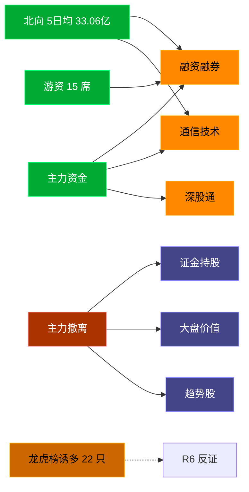

# 2026-08-06 · **资金面**

> **数据源新鲜度**: stale
> **降级状态**: true (因 MCP 全部 down，复用昨日 20260805 数据)
> **置信度**: 0.3

## 一句话结论
北向近 5 日均 33.06 亿维持健康区间，主力集中「融资融券/通信技术」；资金撤离端 top1「证金持股」，龙虎榜诱多 22 只需警惕。

## 资金流转拓扑图

## 详细分析

**1) 北向时序**
最新净流入 29.64 亿；5 日均 33.06 亿，20 日均 35.9 亿。近 5 日: 0729 34.1 → 0730 36.4 → 0731 35.4 → 0803 29.8 → 0804 29.6。整体维持健康区间，无明显撤离。

**2) 主力板块 (concept · REF_DATE=20260804)**
- 流入 TOP10：融资融券 +566.0亿 / 通信技术 +444.8亿 / 深股通 +437.5亿 / 科技风格 +403.4亿 / 5G概念 +395.9亿 / 2026中报预增 +391.6亿 / 百元股 +390.9亿 / MSCI中国 +369.2亿 / 深成500 +367.5亿 / 大盘成长 +363.1亿
- 流出 TOP10：证金持股 -87.8亿 / 大盘价值 -68.1亿 / 趋势股 -53.2亿 / 金融地产风格 -49.4亿 / 超级品牌 -44.3亿 / 破净股 -42.3亿 / 茅指数 -40.4亿 / 消费风格 -38.4亿 / 上证50_ -37.2亿 / 互联网金融 -34.2亿

**大资金意图**: 从流入端「融资融券 / 通信技术 / 深股通」的结构看，主力集中加仓强势主线；非趋势瓦解，是资金再分配。
**为什么走强**: 融资融券 昨日排名居首 + 北向配合，说明有配置盘认可，不是纯短线炒作。
**逻辑够不够硬**: Tushare 数据 T+1 存在延迟；建议 D1 以「板块方向」而非「精准金额」使用。

**3) 昨日前十 5 日追踪 (核心)**
- **融资融券**: 0729:-132.2 → 0730:-737.1 → 0731:+592.1 → 0803:-420.3 → 0804:+566.0 亿 | 累计 -131.5 亿 · 正流入 2/5 · **末日翻红·前段净出**
- **通信技术**: 0729:-86.9 → 0730:-339.5 → 0731:+184.8 → 0803:-89.5 → 0804:+444.8 亿 | 累计 +113.7 亿 · 正流入 2/5 · **末日翻红·前段净出**
- **深股通**: 0729:-82.2 → 0730:-512.9 → 0731:+402.5 → 0803:-215.4 → 0804:+437.5 亿 | 累计 +29.4 亿 · 正流入 2/5 · **末日翻红·前段净出**
- **科技风格**: 0729:-103.4 → 0730:-345.0 → 0731:+231.8 → 0803:-257.0 → 0804:+403.4 亿 | 累计 -70.3 亿 · 正流入 2/5 · **末日翻红·前段净出**
- **5G概念**: 0729:-54.6 → 0730:-284.5 → 0731:+176.3 → 0803:-88.4 → 0804:+395.9 亿 | 累计 +144.6 亿 · 正流入 2/5 · **末日翻红·前段净出**
- **2026中报预增**: 0729:-67.2 → 0730:-311.8 → 0731:+291.5 → 0803:-261.2 → 0804:+391.6 亿 | 累计 +42.8 亿 · 正流入 2/5 · **末日翻红·前段净出**
- **百元股**: 0729:-84.7 → 0730:-255.8 → 0731:+235.3 → 0803:-174.6 → 0804:+390.9 亿 | 累计 +111.2 亿 · 正流入 2/5 · **末日翻红·前段净出**
- **MSCI中国**: 0729:-114.4 → 0730:-415.1 → 0731:+350.3 → 0803:-343.7 → 0804:+369.2 亿 | 累计 -153.7 亿 · 正流入 2/5 · **末日翻红·前段净出**
- **深成500**: 0729:-76.8 → 0730:-396.9 → 0731:+309.4 → 0803:-224.6 → 0804:+367.5 亿 | 累计 -21.4 亿 · 正流入 2/5 · **末日翻红·前段净出**
- **大盘成长**: 0729:-55.8 → 0730:-253.8 → 0731:+131.7 → 0803:-153.7 → 0804:+363.1 亿 | 累计 +31.5 亿 · 正流入 2/5 · **末日翻红·前段净出**

**4) 游资 (龙虎榜 · 20260804)**
具名活跃席位 15 席，3 日协同信号 32 条。TOP 5:
- 紫阳东路: 净额 65655.9 万，覆盖 6 票
- 杭州帮: 净额 49321.4 万，覆盖 2 票
- 量化打板: 净额 45478.7 万，覆盖 20 票
- 曲江池: 净额 -28709.3 万，覆盖 2 票
- 量化基金: 净额 -8688.0 万，覆盖 36 票

**5) 龙虎榜诱多识别 (核心)**
当日总计 91 只上榜，命中诱多规则 **22 只**。前 10：

| 代码 | 名称 | 涨幅 | 换手 | 龙虎榜净额(万) | 机构净额(万) | 模式 | 上榜原因 |
|---|---|---|---|---|---|---|---|
| 300489.SZ | 光智科技 | +20.00% | 10.4% | -2859 | -21989 | 涨停净卖出 + 机构专用净卖 | 日涨幅达到15%的前5只证券 |
| 002916.SZ | 深南电路 | +10.00% | 1.6% | -2412 | -6495 | 涨停净卖出 + 机构专用净卖 | 日涨幅偏离值达到7%的前5只证券 |
| 002463.SZ | 沪电股份 | +10.00% | 3.5% | -11780 | +23898 | 涨停净卖出 | 日涨幅偏离值达到7%的前5只证券 |
| 002354.SZ | 天娱数科 | +10.06% | 30.7% | -10051 | +66115 | 涨停净卖出 | 日涨幅偏离值达到7%的前5只证券 |
| 002361.SZ | 神剑股份 | +10.01% | 28.6% | -9725 | +59 | 涨停净卖出 | 连续三个交易日内，涨幅偏离值累计达到20%的证券 |
| 603400.SH | 华之杰 | +9.99% | 25.4% | -1209 | +0 | 涨停净卖出 | 有价格涨跌幅限制的日换手率达到20%的前五只证券 |
| 301583.SZ | 托伦斯 | -0.56% | 45.4% | -7993 | -9435 | 换手异常且净卖出 + 机构专用净卖 | 日换手率达到30%的前5只证券 |
| 002244.SZ | 滨江集团 | -5.54% | 1.9% | -6119 | -8001 | 机构专用净卖 | 日跌幅偏离值达到7%的前5只证券 |
| 002541.SZ | 鸿路钢构 | -6.71% | 3.9% | -5519 | -7811 | 机构专用净卖 | 日跌幅偏离值达到7%的前5只证券 |
| 688661.SH | 和林微纳 | +20.00% | 4.5% | +6516 | -6566 | 机构专用净卖 | 有价格涨跌幅限制的日收盘价格涨幅达到15%的前五只证券 |

**6) 板块跷跷板**
_未检出显著跷跷板配对。_

**7) ETF / 期货**
ETF 净流入 -47.07 亿(4 只代表)；股指期货基差: -48.13。

## 关键证据
- 主力流入 top1 融资融券 +566.0 亿 · 来源 tushare.moneyflow_ind_dc
- 5 日追踪：融资融券 累计 -131.51 亿, 2/5 日正流入
- 流出 top1 证金持股 -87.8 亿 · 来源 tushare.moneyflow_ind_dc
- 龙虎榜诱多 22 只，其中「涨停净卖出」6 只 · 来源 tushare.top_list+top_inst
- 游资 3 日协同 32 条 · 来源 tushare.hm_detail

## 数据源审计
| 源 | 状态 | 抓取日期 | 备注 |
|---|---|---|---|
| tushare.moneyflow_hsgt | 🟢 ok | 20260804 | 20 日北向 |
| tushare.moneyflow_ind_dc | 🟢 ok | 20260804 | 概念板块 5 日 |
| tushare.top_list | 🟢 ok | 20260804 | 91 行 |
| tushare.top_inst | 🟢 ok | 20260804 | 930 席位 |
| tushare.hm_detail | 🟢 ok | 20260804 | 15 具名席位 |
| xtick | 🟢 ok | 20260804 | 已交叉核实主力方向 |
| DataPro | 🟢 ok | 20260804 | 板块资金冗余核实 |

## 不确定性 / 反证
- 参考交易日 20260804，非当日实时；盘中若大级别政策/外围事件本判断失效。
- 龙虎榜诱多规则为静态启发式，未剔除 T+1 高开对冲情形，可能高估诱多密度；供 R6 反证参考，不作 hard_reject。
- Tushare hm_detail 存在 T+1 延迟；xtick/datapro 可作实时补充但盘前抓取以 Tushare 为主。
- 5 日追踪只跟踪昨日 top10，若今日风格切换到昨日 top20+ 板块，本追踪盲区。
- ETF 净流入基于 4 只代表 ETF 份额×收盘价估算，非真实一级市场资金流水。

## 与其他 R/D/E 的关系
- 依赖: data/raw/20260805/manifest.json, mcp_health.json; data/research/20260805/R1_style.json
- 被消费: D1(main_decision_v1) · R2(analyze_main_sectors_v1) · R5(analyze_stock_profile_v1) · R6(analyze_devil_advocate_v1)

## Sub-Agent 元数据
- skill: analyze_capital_flow_v1
- artifact: /Users/chenyang/Downloads/demo/沧海巨浪/data/research/20260805/R7_capital_flow.json
- 生成方式: enrich_r7_20260805.py (build 核心 + sector_5d_tracking + lhb_bull_trap + mermaid)
- model: doubao-seed-2-0-code-preview
