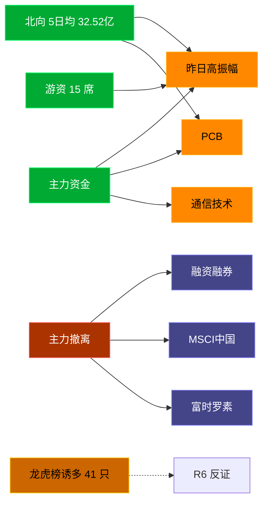

# 2026-08-10 · **资金面**

> **数据源新鲜度**: stale (数据截至 2026-08-07)
> **降级状态**: true
> **置信度**: 0.55

## 一句话结论
北向近 5 日均 32.52 亿维持健康区间，主力集中「昨日高振幅/PCB」；资金撤离端 top1「融资融券」，龙虎榜诱多 41 只需警惕。⚠️ 数据为 20260807 stale，盘中需重新验证。

## 资金流转拓扑图

## 详细分析

**1) 北向时序**
最新净流入 32.62 亿；5 日均 32.52 亿，20 日均 35.59 亿。近 5 日: 0731 35.4 → 0803 29.8 → 0804 29.6 → 0805 35.2 → 0806 32.6。整体维持健康区间，无明显撤离。

**2) 主力板块 (concept · REF_DATE=20260807)**
- 流入 TOP10：昨日高振幅 +71.6亿 / PCB +64.6亿 / 通信技术 +59.3亿 / 专精特新 +54.2亿 / 昨日涨停 +50.2亿 / 昨日涨停_含一字 +47.7亿 / 最近多板 +45.0亿 / CPO概念 +39.8亿 / 玻璃基板 +36.2亿 / 小盘成长 +33.2亿
- 流出 TOP10：融资融券 -372.5亿 / MSCI中国 -307.6亿 / 富时罗素 -274.1亿 / HS300_ -246.9亿 / 深股通 -243.3亿 / 大盘股 -217.4亿 / 标准普尔 -206.7亿 / 深成500 -200.4亿 / 人工智能 -177.9亿 / AH股 -119.8亿

**大资金意图**: 从流入端「昨日高振幅 / PCB / 通信技术」的结构看，主力集中加仓强势主线；非趋势瓦解，是资金再分配。
**为什么走强**: 昨日高振幅 昨日排名居首 + 北向配合，说明有配置盘认可，不是纯短线炒作。
**逻辑够不够硬**: 数据 stale 至 20260807，盘中若大级别政策/外围事件本判断失效；建议 D1 以「板块方向」而非「精准金额」使用。

**3) 昨日前十 5 日追踪 (核心)**
- **昨日高振幅**: 0803:-242.8 → 0804:+201.4 → 0805:+268.4 → 0806:+71.6 → 0807:+249.9 亿 | 累计 +548.6 亿 · 正流入 4/5 · **加速流入**
- **PCB**: 0803:-70.4 → 0804:+200.6 → 0805:+109.0 → 0806:+64.6 → 0807:+247.0 亿 | 累计 +550.9 亿 · 正流入 4/5 · **加速流入**
- **通信技术**: 0803:-89.5 → 0804:+444.8 → 0805:+118.4 → 0806:+59.3 → 0807:+135.3 亿 | 累计 +668.4 亿 · 正流入 4/5 · **加速流入**
- **专精特新**: 0803:-23.8 → 0804:+158.0 → 0805:+133.9 → 0806:+54.2 → 0807:+129.2 亿 | 累计 +451.5 亿 · 正流入 4/5 · **加速流入**
- **昨日涨停**: 0803:-29.5 → 0804:+6.8 → 0805:+38.6 → 0806:+50.2 → 0807:+2.5 亿 | 累计 +68.5 亿 · 正流入 4/5 · **净入放缓**
- **昨日涨停_含一字**: 0803:-30.1 → 0804:+7.5 → 0805:+37.6 → 0806:+47.7 → 0807:-0.3 亿 | 累计 +62.4 亿 · 正流入 3/5 · **末日跳水·前段净入**
- **最近多板**: 0803:-48.2 → 0804:+39.9 → 0805:+46.7 → 0806:+45.0 → 0807:+45.7 亿 | 累计 +129.0 亿 · 正流入 4/5 · **加速流入**
- **CPO概念**: 0803:-23.2 → 0804:+296.2 → 0805:+51.0 → 0806:+39.8 → 0807:+9.6 亿 | 累计 +373.4 亿 · 正流入 4/5 · **净入放缓**
- **玻璃基板**: 0803:-31.6 → 0804:+51.5 → 0805:+22.6 → 0806:+36.2 → 0807:+8.6 亿 | 累计 +87.2 亿 · 正流入 4/5 · **净入放缓**
- **小盘成长**: 0803:-24.9 → 0804:+72.0 → 0805:+86.1 → 0806:+33.2 → 0807:+68.3 亿 | 累计 +234.7 亿 · 正流入 4/5 · **加速流入**

**4) 游资 (龙虎榜 · 20260807)**
具名活跃席位 15 席，3 日协同信号 41 条。TOP 5:
- 量化基金: 净额 -353231.8 万，覆盖 49 票
- 紫阳东路: 净额 52175.5 万，覆盖 4 票
- 量化打板: 净额 43536.8 万，覆盖 23 票
- 作手新一: 净额 -20973.4 万，覆盖 2 票
- T王: 净额 13852.9 万，覆盖 21 票

**5) 龙虎榜诱多识别 (核心)**
当日总计 67 只上榜，命中诱多规则 **41 只**。前 10：

| 代码 | 名称 | 涨幅 | 换手 | 龙虎榜净额(万) | 机构净额(万) | 模式 | 上榜原因 |
|---|---|---|---|---|---|---|---|
| 301217.SZ | 铜冠铜箔 | +16.98% | 9.6% | -15076 | -25340 | 涨停净卖出 + 机构专用净卖 | 连续三个交易日内，涨幅偏离值累计达到30%的证券 |
| 300476.SZ | 胜宏科技 | +12.01% | 8.4% | -2318 | -13765 | 涨停净卖出 + 机构专用净卖 | 连续三个交易日内，涨幅偏离值累计达到30%的证券 |
| 301093.SZ | 华兰股份 | +18.00% | 6.1% | -5666 | -9667 | 涨停净卖出 + 机构专用净卖 | 连续三个交易日内，涨幅偏离值累计达到30%的证券 |
| 301520.SZ | 万邦医药 | +12.21% | 48.9% | -4707 | -6458 | 涨停净卖出 + 换手异常且净卖出 + 机构专用净卖 | 日换手率达到30%的前5只证券 |
| 002943.SZ | 宇晶股份 | +10.00% | 8.4% | -9421 | -4881 | 涨停净卖出 + 机构专用净卖 | 连续三个交易日内，涨幅偏离值累计达到20%的证券 |
| 300534.SZ | 陇神戎发 | +10.27% | 36.9% | -1389 | -2095 | 涨停净卖出 + 机构专用净卖 | 日换手率达到30%的前5只证券 |
| 300400.SZ | 劲拓股份 | +17.76% | 14.4% | -12254 | +188 | 涨停净卖出 | 连续三个交易日内，涨幅偏离值累计达到30%的证券 |
| 002428.SZ | 云南锗业 | +10.00% | 18.3% | -7564 | +22951 | 涨停净卖出 | 日涨幅偏离值达到7%的前5只证券 |
| 600721.SH | 百花医药 | +10.02% | 15.6% | -6389 | +0 | 涨停净卖出 | 有价格涨跌幅限制的日收盘价格涨幅偏离值达到7%的前五只证券 |
| 600641.SH | 先导基电 | +9.99% | 8.6% | -4037 | +0 | 涨停净卖出 + 疑似对倒:高盛(中国)证券有限… | 非S证券连续三个交易日内收盘价格涨幅偏离值累计达到20%的证券 |

**6) 板块跷跷板**
_未检出显著跷跷板配对。_

**7) ETF / 期货**
ETF 净流入 -63.82 亿(4 只代表)；股指期货基差: -39.31。

## 关键证据
- 主力流入 top1 昨日高振幅 +71.6 亿 · 来源 tushare.moneyflow_ind_dc
- 5 日追踪：昨日高振幅 累计 548.58 亿, 4/5 日正流入
- 流出 top1 融资融券 -372.5 亿 · 来源 tushare.moneyflow_ind_dc
- 龙虎榜诱多 41 只，其中「涨停净卖出」15 只 · 来源 tushare.top_list+top_inst
- 游资 3 日协同 41 条 · 来源 tushare.hm_detail

## 数据源审计
| 源 | 状态 | 抓取日期 | 备注 |
|---|---|---|---|
| tushare.moneyflow_hsgt | 🟢 ok | 20260807 | 20 日北向 |
| tushare.moneyflow_ind_dc | 🟢 ok | 20260807 | 概念板块 5 日 |
| tushare.top_list | 🟢 ok | 20260807 | 67 行 |
| tushare.top_inst | 🟢 ok | 20260807 | 680 席位 |
| tushare.hm_detail | 🟢 ok | 20260807 | 15 具名席位 |
| xtick | 🟢 ok | 20260807 | 已交叉核实主力方向 |
| DataPro | 🟢 ok | 20260807 | 板块资金冗余核实 |

## 不确定性 / 反证
- 数据 stale 至 20260807，非当日实时；盘中若大级别政策/外围事件本判断失效。
- 龙虎榜诱多规则为静态启发式，未剔除 T+1 高开对冲情形，可能高估诱多密度；供 R6 反证参考，不作 hard_reject。
- Tushare hm_detail 存在 T+1 延迟；xtick/datapro 可作实时补充但盘前抓取以 Tushare 为主。
- 5 日追踪只跟踪昨日 top10，若今日风格切换到昨日 top20+ 板块，本追踪盲区。
- ETF 净流入基于 4 只代表 ETF 份额×收盘价估算，非真实一级市场资金流水。

## 与其他 R/D/E 的关系
- 依赖: data/raw/20260810/manifest.json, mcp_health.json; data/research/20260807/R7_capital_flow.json
- 被消费: D1(main_decision_v1) · R2(analyze_main_sectors_v1) · R5(analyze_stock_profile_v1) · R6(analyze_devil_advocate_v1)

## Sub-Agent 元数据
- skill: analyze_capital_flow_v1
- artifact: /Users/chenyang/Downloads/demo/沧海巨浪/data/research/20260810/R7_capital_flow.json
- 生成方式: enrich_r7_20260810.py (复用 20260807 数据 + sector_5d_tracking + lhb_bull_trap + mermaid)
- model: doubao-seed-2-0-code-preview
