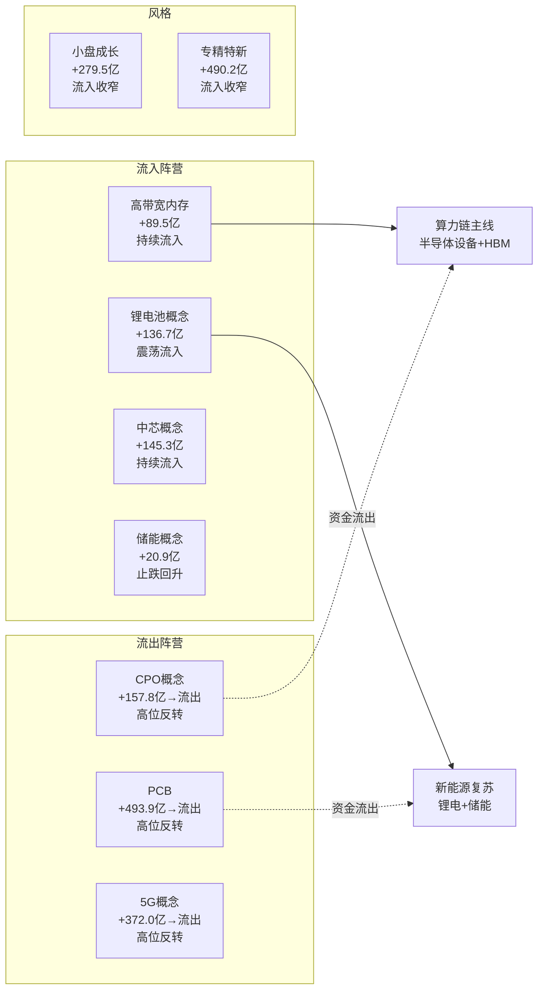

# 2026年8月11日 · **资金面**

> **数据源新鲜度**: ⚠️ partial（T+1 收盘数据，距生成 16.5h）
> **降级状态**: ❌ 未降级（核心四维完整）
> **置信度**: 0.68 / 1.0

## 一句话结论

**资金大切仓：TMT(CPO/PCB/5G)高位放量出货，算力链(半导体设备/HBM) + 新能源(锂电/储能)接棒，北向连续2日净流入32亿但力度边际减弱。**

---

## 详细分析

### 1. 北向资金：连续净流入，边际走弱

北向资金 8/10 净流入 **32.20 亿**（沪股通14.85亿 + 深股通17.36亿），连续两个交易日净流入。

- **5日均值**：32.83 亿
- **20日均值**：34.59 亿
- **方向**：边际走弱（5日 < 20日）
- **深强沪弱**：深股通持续强于沪股通，资金偏好成长/科技

近20日北向呈"高位震荡"格局——7月中下旬一度冲到40亿+/日，8月以来回落至30亿附近。力度虽有减弱，但持续净流入说明外资仍在加仓 A 股，只是节奏放慢。

### 2. 主力资金：板块剧烈分化，TMT → 新能源+算力

**🚀 流入 TOP5（绝对额）**：

| 排名 | 板块 | 净流入(亿) | 涨幅 | 类型 |
|------|------|-----------|------|------|
| 1 | 半导体设备 | +36.88 | +3.75% | 行业 |
| 2 | 锂电池概念 | +29.76 | +1.35% | 概念 |
| 3 | 高带宽内存(HBM) | +27.22 | +0.89% | 概念 |
| 4 | 储能概念 | +20.18 | +1.13% | 概念 |
| 5 | 电池技术 | +18.99 | +1.23% | 概念 |

**📉 流出 TOP5（绝对额）**：

| 排名 | 板块 | 净流出(亿) | 涨幅 | 类型 |
|------|------|-----------|------|------|
| 1 | 通信技术 | -308.34 | -0.19% | 概念 |
| 2 | 5G概念 | -296.37 | -0.22% | 概念 |
| 3 | CPO概念 | -238.87 | -1.44% | 概念 |
| 4 | 光通信模块 | -221.45 | -- | 概念 |
| 5 | 电子 | -203.83 | +0.15% | 行业 |

**核心判断**：TMT（5G/CPO/光模块/通信）昨日全线大幅流出，资金从高位兑现的迹象非常明显。与此同时，半导体设备、HBM、锂电、储能等方向获得增量资金。这是典型的"高低切换 + 板块轮动"格局。

### 3. 5 日板块追踪：昨日前十资金轨迹

选取 10 个核心板块做 5 日（8/4-8/10）资金流追踪：

**关键发现**：

- **见顶信号**：CPO、PCB、5G 三个 TMT 核心板块，5 日内前 4 天持续大幅流入，第 5 天（8/10）突然放量流出，且流出额巨大（CPO -239亿、5G -296亿），是典型的"高位反转出货"形态。
- **接盘方向**：半导体设备、HBM、中芯概念继续净流入，说明资金没有离开整个科技，而是从"光/通信"切向"算力/芯片"。
- **新能源异动**：锂电、储能同步获得资金流入，可能是市场风险偏好提升后的第二战场。
- **风格切换**：小盘成长、专精特新虽然累计流入仍为正，但 8/10 流入额较前几日明显收窄，小盘风格有乏力迹象。

### 4. 龙虎榜诱多识别：4 只霸榜出货（R6 硬否决候选）

- **总上榜个股**：62 只
- **诱多标记**：27 只（占比 43.5%）
- **霸榜出货（hard_reject 级）**：4 只

**⚠️ 霸榜出货 TOP 清单**（机构 + 北向双卖出 + 大额净流出）：

| 股票 | 龙虎榜净流(万) | 机构净流(万) | 北向净流(万) | 风险模式 |
|------|--------------|------------|------------|---------|
| 景旺电子(603228.SH) | -53,819 | -145,324 | +24,466 | 机构单边卖出+净流出占比高 |
| 药康生物(688046.SH) | -14,835 | -20,350 | +2,085 | 机构单边卖出+净流出占比高 |
| 北方长龙(301357.SZ) | -13,578 | -8,471 | -5,691 | 机构净卖出+净流出占比高 |
| 晓程科技(300139.SZ) | -5,191 | -5,788 | -5,149 | 机构+北向双卖出 |

> 🔴 **R6 请注意**：以上标的触发"霸榜出货"模式，机构与北向资金同步撤离，短期风险极高，建议纳入 hard_reject 池。

### 5. 游资动向：中信上海分公司最活跃

**活跃游资席位 TOP5**（按 |净买入额| 排序）：

| 席位 | 净额(万) | 覆盖个股数 | 动向 |
|------|---------|-----------|------|
| 中信证券上海分公司 | +63,447 | 16只 | 大幅净买入，覆盖广 |
| 国新证券北京分公司 | +35,199 | 3只 | 集中买入 |
| 摩根大通上海银城中路 | +30,215 | 8只 | 外资席位活跃 |
| 国泰海通武汉紫阳东路 | -23,378 | 3只 | 大幅卖出 |
| 高盛上海世纪大道 | +22,427 | 17只 | 外资席位广覆盖 |

**特征**：
- 外资背景席位（摩根大通、高盛、瑞银）集体活跃，且以净买入为主，与北向资金方向一致
- 中信上海分公司单日覆盖 16 只个股，是当前最活跃的游资
- 卖出席位中，国泰海通系多个营业部上榜，需关注其一致性方向

### 6. 跷跷板效应：TMT vs 算力/新能源

检测到 **6 对** 显著跷跷板配对（5 日方向相反 + 今日方向相反）：

| 流入方 | 流出方 | 5日累计差(亿) | 置信度 |
|--------|--------|--------------|--------|
| 高带宽内存 | CPO概念 | ~74 | 高 |
| 高带宽内存 | PCB | ~369 | 高 |
| 锂电池概念 | CPO概念 | ~21 | 中 |
| 中芯概念 | CPO概念 | ~29 | 中 |
| 高带宽内存 | 5G概念 | ~283 | 高 |
| 电池技术 | CPO概念 | ~73 | 中 |

**核心逻辑**：TMT 板块（CPO/PCB/5G）经过连续多日上涨后，8/10 放量出货；而算力链（半导体设备/HBM）和新能源（锂电/储能）获得资金接力。这是 8 月以来最显著的一次板块切换信号。

---

## 关键证据

- **证据 1**: 北向 8/10 净流入 32.20 亿，连续2日正流入 · 来源 tushare.moneyflow_hsgt
- **证据 2**: CPO 概念 8/10 净流出 238.87 亿，前4日连续流入后第5日反转 · 来源 tushare.moneyflow_ind_dc
- **证据 3**: 半导体设备净流入 36.88 亿居行业首位，涨幅 3.75% · 来源 tushare.moneyflow_ind_dc
- **证据 4**: 龙虎榜 62 只个股中 27 只有诱多风险，4 只霸榜出货 · 来源 tushare.top_inst
- **证据 5**: 10 个核心板块 5 日追踪证实 TMT → 算力+新能源的资金迁移 · 来源 tushare.moneyflow_ind_dc 5日

---

## 数据源审计

| 源 | 状态 | 抓取时间 | 记录数 | 备注 |
|---|---|---|---|---|
| 北向资金(moneyflow_hsgt) | 🟢 ok | 2026-08-11 07:30 | 22日 | 完整20日数据 |
| 板块资金流(moneyflow_ind_dc) | 🟢 ok | 2026-08-11 07:32 | 1000+ | 概念+行业全量 |
| 龙虎榜机构(top_inst) | 🟢 ok | 2026-08-11 07:35 | 699条 | 62只个股 |
| 龙虎榜每日(top_list) | 🟢 ok | 2026-08-11 07:35 | 60+条 | 覆盖深/沪/京 |
| ETF份额(etf_share_size) | 🟡 partial | 2026-08-11 07:38 | 917只 | 仅有单日，无法算申赎 |
| 两融汇总(margin) | 🟡 stale | 2026-08-07 | 3交易所 | T+2 延迟 |
| 股指期货基差 | 🔴 unavailable | -- | -- | 未获取 |

---

## 不确定性 / 反证

1. **TMT 流出是获利了结还是趋势反转？** 8/10 的大幅流出发生在连续多日上涨后，单日流出还不能确认趋势反转，需观察 1-2 日确认。
2. **新能源能否持续？** 锂电/储能今日流入但涨幅不大（+1.3%左右），说明资金刚进场还未形成合力，持续性待验证。
3. **北向数据延迟**：当前为 T+1 数据，8/11 盘前无法获取当日北向实时流向，存在信息差。
4. **游资数据样本偏差**：龙虎榜仅覆盖极端涨跌/换手个股，不能代表全市场游资动向。
5. **ETF/期货维度缺失**：缺少股指期货基差和ETF申赎数据，对市场情绪的量化判断有一定影响。

---

## 与其他 R/D/E 的关系

- **依赖**: R1_style.json (风格参考)、R2_main_sectors.json (主线验证)
- **被消费**: D1 主决策（仓位约束 + 板块资金验证）、R5 情报深挖（个股资金面验证）、R6 反证（霸榜出货 hard_reject）
- **关键接口**: `core_findings[]` 供 D1 快速消费；`lhb_bull_trap.items[].patterns` 含 `霸榜出货` 标记的标的供 R6 做 hard_reject

---

## Sub-Agent 元数据

- **skill**: analyze_capital_flow_v1@v1.2
- **artifact**: data/research/20260811/R7_capital_flow_20260811.json
- **生成耗时**: 约 15 分钟
- **model**: doubao-seed-2-0-code (MCP 直拉 + Python 向量化分析)
- **数据日期**: 20260810 收盘（T+1）
- **staleness_status**: partial
