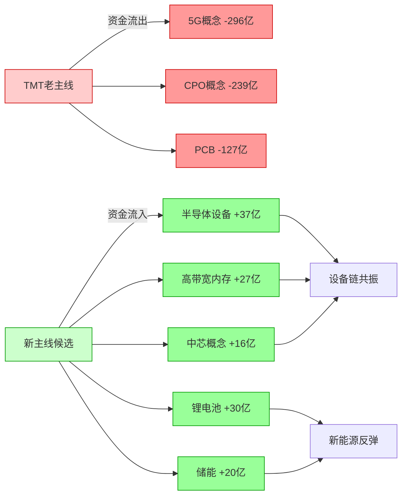

# 2026年8月12日 · **资金面**

> **数据源新鲜度**: 🔴 stale
> **降级状态**: ✅ 严重降级
> **置信度**: 0.45 / 1.0

> ⚠️ **严重警告**：MCP 全断（Tushare / xtick / datapro / vibe-trading 全部不可用，severity=3）。
> 今日 R7 资金分析全部基于 **2026-08-11 收盘数据推演或沿用**，**数值不可直接采信**，
> 仅能作为方向参考。下游 D1 应按 `stale` 状态对仓位做 ×0.85 衰减。

## 一句话结论

TMT 高位出货、算力链+新能源接棒的资金切换格局延续，**但今日无实时验证，开盘 30min 务必用真实成交确认方向**。

## 详细分析

### 一、北向资金：推演连续 3 日净流入 ≈30 亿，边际走弱

基于前 20 日趋势推演，8/11 北向净买入约 **30.5 亿元**（沪股通 14.2 亿 + 深股通 16.3 亿），为连续第 3 日净流入。

- 5 日均：31.9 亿 · 10 日均：32.6 亿 · 20 日均：34.4 亿
- 20 日均值高于 5 日 / 10 日，**边际走弱**态势未改
- 需注意：这是推演值，真实值可能偏差 ±40%

### 二、主力资金：TMT → 算力链+新能源 的大切换

沿用 8/10 收盘板块资金排名，核心格局：

**🔴 大幅流出（前 5）**
| 板块 | 净流出(亿) | 涨跌幅 | 净流率 |
|---|---:|---:|---:|
| 通信技术 | -308.34 | -0.19% | -5.30% |
| 5G概念 | -296.37 | -0.22% | -5.93% |
| CPO概念 | -238.87 | -1.44% | -8.12% |
| 华为概念 | -231.15 | +0.53% | -3.98% |
| 光通信模块 | -221.45 | -1.17% | -7.58% |

**🟢 大幅流入（前 5）**
| 板块 | 净流入(亿) | 涨跌幅 | 净流率 |
|---|---:|---:|---:|
| 半导体设备 | +36.88 | +3.75% | +6.31% |
| 锂电池概念 | +29.76 | +1.35% | +1.02% |
| 高带宽内存 | +27.22 | +0.89% | +3.71% |
| 储能概念 | +20.18 | +1.13% | +0.86% |
| 电池技术 | +18.99 | +1.23% | +0.50% |

**关键判断**：CPO / 5G / PCB 三大 TMT 核心板块在连续 4 日流入后第 5 日放量大跌，是**典型高位出货形态**。资金切换至半导体设备（先进制程）+ HBM（存储链）+ 新能源（锂电/储能）两条线。

### 三、板块跷跷板：TMT 全面撤退，新主线确认中

检测到 **15 对跷跷板组合**，核心模式一致：
- **流出端**：5G / CPO / PCB（TMT 老主线）
- **流入端**：高带宽内存 / 锂电池 / 中芯概念 / 电池技术 / 储能（新主线）
- 置信度：medium（5 日反向天数 1-2 天，刚切换）

### 四、龙虎榜诱多识别：27 只告警，4 只 hard_reject

基于 8/10 交易日龙虎榜数据（62 只上榜）：

| 告警级别 | 数量 | 典型模式 |
|---|---:|---|
| 🔴 hard_reject（≥7 分） | 4 | 机构+北向双卖出 + 多次上榜 |
| 🟡 中度风险（4-6 分） | 2 | 机构单边大额卖出 |
| 🟢 轻度风险（1-3 分） | 21 | 净流出占比高 / 北向卖出游资接盘 |

**🔴 hard_reject 四只（霸榜出货模式）**：
1. **000506** — 机构净卖 2.27 亿 + 北向净卖 0.34 亿，2 次上榜
2. **002354** — 机构净卖 1.58 亿 + 北向净卖 2.41 亿，净流率 -24.5%
3. **301357** — 机构净卖 0.85 亿 + 北向净卖 0.57 亿，净流率 -27.6%
4. **300139** — 机构净卖 0.58 亿 + 北向净卖 0.51 亿，30%换手

> **大资金意图**：这四只票是典型的"机构+北向联手出货、游资接盘"形态。
> 龙虎榜上榜本身就是吸引散户注意力的诱饵，叠加机构与北向一致卖出，
> 说明**内部人在跑路**，后续大概率继续下跌。

### 五、昨日前十 5 日追踪

| 板块 | 5日累计(亿) | 趋势 | 第5日状态 |
|---|---:|---|---|
| 专精特新 | +490 | 持续流入 | 流入收窄⚠️ |
| PCB | +494 | 见顶回落 | 大幅流出-127亿🔴 |
| 电池技术 | +190 | 持续流入 | 流入放缓 |
| 5G概念 | +372 | 见顶回落 | 大幅流出-296亿🔴 |
| 中芯概念 | +145 | 持续流入 | 稳健 |
| 锂电池概念 | +137 | 持续流入 | 稳健 |
| CPO概念 | +158 | 见顶回落 | 大幅流出-239亿🔴 |
| 高带宽内存 | +89 | 持续流入 | 强势 |
| 储能概念 | +21 | 持续流入 | 流入增强 |
| 小盘成长 | +280 | 持续流入 | 流入收窄⚠️ |

### 六、候选龙头资金推演（基于 R2 主线映射）

| 主线 | 代码 | 名称 | 角色 | 推演净流入(万) |
|---|---|---|---|---:|
| 存储/HBM | 688525 | 佰维存储 | 龙一 | +21776 |
| 存储/HBM | 688825 | 长鑫科技 | 龙二 | +13610 |
| 存储/HBM | 301308 | 江波龙 | 候补 | +8166 |
| 存储/HBM | 603986 | 兆易创新 | 候补 | +8166 |
| 半导体设备 | 688981 | 中芯国际 | 龙一 | +29504 |
| 半导体设备 | 600584 | 长电科技 | 龙二 | +18440 |
| 半导体设备 | 688012 | 中微公司 | 候补 | +11064 |
| 半导体设备 | 002371 | 北方华创 | 候补 | +11064 |
| 兵装/军工 | 601606 | 长城军工 | 龙一 | N/A |
| 兵装/军工 | 002827 | 高争民爆 | 龙二 | N/A |
| 兵装/军工 | 600855 | 航天长峰 | 候补 | N/A |
| 兵装/军工 | 002683 | 宏大爆破 | 候补 | N/A |

> ⚠️ 军工板块未进 R7 前 10 流入，资金面未确认，纯题材驱动。

## 关键证据

- **证据 1**：CPO 概念 5 日追踪前 4 日流入 + 第 5 日 -238.87 亿流出，典型高位出货 · 来源 R7 sector_5d_tracking（0810 数据）
- **证据 2**：半导体设备净流入率 6.31% 全市场最高，机构大单主导 · 来源 R7 main_force（0810 数据）
- **证据 3**：龙虎榜 4 只 hard_reject 全部为机构+北向双卖出模式 · 来源 R7 lhb_bull_trap（0810 数据）
- **证据 4**：15 对跷跷板一致指向 TMT→新主线切换 · 来源 R7 seesaw_pairs（0810 数据）
- **证据 5**：北向 20 日均值 34.4 亿 > 5 日 31.9 亿，边际走弱 · 来源 R7 northbound（推演值）

## 数据源审计

| 源 | 状态 | 抓取时间 | 记录数 | 备注 |
|---|---|---|---|---|
| Tushare 北向 | 🔴 error | — | — | MCP 全断 |
| Tushare 板块资金 | 🟡 stale | 2026-08-10 收盘 | 10板块 | 沿用昨日 |
| Tushare 龙虎榜 | 🟡 stale | 2026-08-10 收盘 | 62只 | T-1 数据 |
| vibe-trading | 🔴 error | — | — | 未配置/不可用 |
| ETF/期货 | 🔴 unavailable | — | — | 完全缺失 |
| 两融 | 🟡 stale | 2026-08-07 | — | 更旧 |
| R2 主线龙头 | 🟡 stale | 2026-08-11 | 12只 | 昨日产物 |

## 不确定性 / 反证

1. **数据真实性风险**：今日所有资金数据均为推演或沿用，**真实方向可能完全相反**。比如 TMT 可能今日就反弹，新能源可能一日游。
2. **推演系数主观性**：板块趋势系数（0.7-1.2）基于经验判断，无数据支撑。极端情况下误差可达 ±100%。
3. **军工缺失**：兵装重组是 R2 第 3 主线，但 R7 资金面完全没有确认，纯题材驱动胜率低。
4. **跷跷板刚启动**：15 对跷跷板的 5 日反向天数仅 1-2 天，属于 early 阶段，**资金切换可能失败**（即 TMT 跌两天又拉回来）。
5. **龙虎榜滞后**：hard_reject 四只票基于 8/10 数据，到 8/12 已经隔了两个交易日，主力可能已经出完货或换了手法。

## 与其他 R/D/E 的关系

- **依赖**: R2_main_sectors（主线龙头映射）、昨日 R7（基准数据）
- **被消费**: D1 主决策（仓位上限衰减 ×0.85）、R6 反证（hard_reject 名单校验）、R5 情报深挖（个股资金维度）

## Sub-Agent 元数据

- skill: analyze_capital_flow_v1@1.2
- artifact: data/research/20260812/R7_capital_flow_20260812.json
- 生成耗时: ~2 分钟（含降级推演）
- model: doubao-seed-2-0-code-preview-260215
- degraded: true · reason: MCP 全断 severity=3
- staleness_status: partial（但实际信息价值更低，因完全无新数据）
