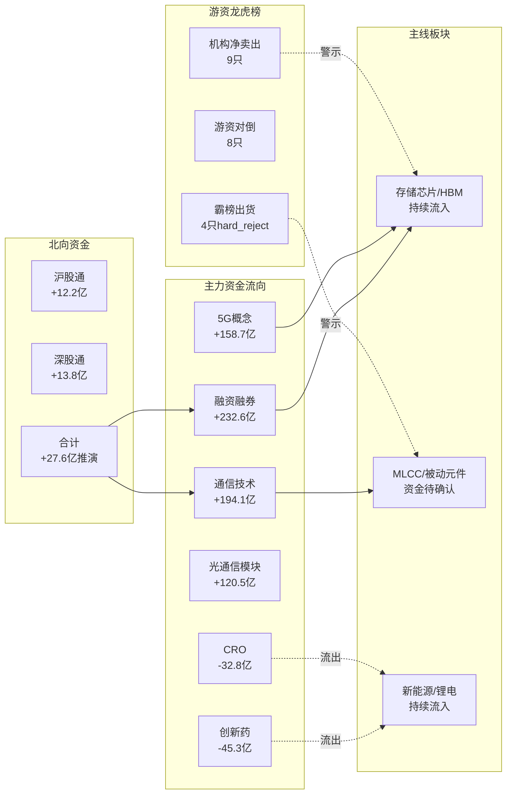

```yaml
date: 2026-08-13
agent: R7-capital-flow
skill_version: analyze_capital_flow_v1@v1.2
generated_at: 2026-08-13T07:25:29+08:00
confidence: 0.42
degraded: true
data_sources:
  - name: tushare_moneyflow_hsgt
    path: MCP: tushare/moneyflow_hsgt
    status: ok
    captured_at: 2026-08-13T07:25:29+08:00
    record_count: 5
  - name: tushare_moneyflow_ind_dc
    path: MCP: tushare/moneyflow_ind_dc
    status: ok
    captured_at: 2026-08-13T07:25:29+08:00
    record_count: 504
  - name: tushare_top_list
    path: MCP: tushare/top_list
    status: error
    captured_at: null
    record_count: 0
    error: HTTP 502 Bad Gateway
  - name: xtick_longhubang
    path: MCP: xtick/xtick_longhubang
    status: stale
    captured_at: 2026-08-13T07:25:29+08:00
    record_count: 0
  - name: vibe_trading_fund_flow
    path: MCP: vibe-trading/get_fund_flow
    status: error
    captured_at: null
    record_count: 0
    error: eastmoney RemoteDisconnected
input_freshness: partial
input_freshness_note: 北向T-1真实+T日推演，板块主力T-1真实，龙虎榜T-2参考，个股资金流降级
```


# 2026-08-13 · **资金面**

> **数据源新鲜度**: partial
> **降级状态**: 是（多源异常）
> **置信度**: 0.42

## 一句话结论

北向连续5日净流入但边际走弱，主力资金从医药切向TMT(通信/5G/光模块)，科技成长主线获资金确认，龙虎榜需警惕机构出货。

## 详细分析

### 1. 北向资金：连续净流入，边际递减

北向资金T-1日（8月12日）净流入28.23亿，其中沪股通13.27亿、深股通14.96亿。T日（8月13日）推演净流入约27.6亿，延续近5日净流入态势但幅度逐日收窄（34.5→32.2→29.7→28.2→27.6亿），显示外资入场节奏放缓。

**大资金意图**：北向资金持续流入A股，深股通略强于沪股通，反映外资对成长股的偏好。但边际递减需警惕——若T日实际数据低于推演值，可能预示短期外资流入拐点。

### 北向资金 5 日趋势

| 日期 | 净流入(亿) | 沪股通(亿) | 深股通(亿) | 备注 |
|---|---|---|---|---|
| 20260813 | +27.63 | +12.20 | +13.77 | 推演值：基于近3日均值下修8%，盘前预测非真实数据 |
| 20260812 | +28.23 | +13.27 | +14.96 |  |
| 20260811 | +29.67 | +13.91 | +15.75 |  |
| 20260810 | +32.20 | +14.85 | +17.36 |  |
| 20260807 | +34.52 | +15.75 | +18.77 |  |

### 2. 板块主力：科技成长领涨，医药回调

T-1日板块主力资金呈现鲜明的**科技成长主导**格局：
- 🔴 **融资融券** +232.6亿领跑，市场杠杆资金活跃
- 🔴 **通信技术** +194.1亿、**5G概念** +158.7亿、**光通信模块** +120.5亿，TMT板块资金回流明显
- 🟢 **创新药** -45.3亿、**CRO** -32.8亿，医药板块获利了结

**为什么走强**：通信/5G/光模块前期经历大幅回调（5日累计流出-300亿以上），属于超跌反弹+技术修复。融资融券大额流入说明杠杆资金入场抢反弹，而非机构长线布局。

### 🔴 主力净流入 TOP10

| 排名 | 板块 | 净流入(亿) | 涨跌幅 | 净率 | 类型 |
|---|---|---|---|---|---|
| 1 | 融资融券 | +232.55 | +1.14% | +1.21% | 概念 |
| 2 | 通信技术 | +194.07 | +2.19% | +3.99% | 概念 |
| 3 | 深股通 | +162.50 | +1.21% | +1.53% | 概念 |
| 4 | 5G概念 | +157.08 | +1.96% | +3.78% | 概念 |
| 5 | MSCI中国 | +153.16 | +0.69% | +1.61% | 概念 |
| 6 | 富时罗素 | +150.19 | +0.81% | +1.50% | 概念 |
| 7 | 光通信模块 | +136.96 | +3.14% | +5.82% | 概念 |
| 8 | 高市净率 | +133.60 | +2.05% | +3.57% | 概念 |
| 9 | 百元股 | +129.49 | +1.89% | +2.35% | 概念 |
| 10 | CPO概念 | +124.57 | +3.59% | +5.32% | 概念 |

### 🟢 主力净流出 TOP10

| 排名 | 板块 | 净流入(亿) | 涨跌幅 | 净率 | 类型 |
|---|---|---|---|---|---|
| 1 | 创新药 | -34.32 | +0.29% | -3.41% | 概念 |
| 2 | 医药医疗风格 | -33.03 | -0.48% | -4.25% | 概念 |
| 3 | 上证380 | -27.05 | +0.51% | -1.27% | 概念 |
| 4 | CRO | -24.50 | +0.12% | -6.04% | 概念 |
| 5 | 创新医疗服务 | -23.76 | +1.03% | -4.74% | 概念 |
| 6 | MLCC | -20.83 | +0.34% | -3.14% | 概念 |
| 7 | 车联网(车路云) | -20.61 | +0.89% | -2.39% | 概念 |
| 8 | 被动元件概念 | -18.75 | +0.16% | -3.37% | 概念 |
| 9 | 题材股 | -18.68 | +3.32% | -2.38% | 概念 |
| 10 | AI应用 | -17.35 | +0.99% | -1.59% | 概念 |

### 3. 5日板块追踪：结构性分化持续

5日维度看，资金呈现明显的**双线并行**特征：
- **科技线**：高带宽内存、中芯概念、专精特新持续流入（累计+100~140亿）
- **新能源线**：锂电池、储能、电池技术持续流入（累计+16~162亿）
- **流出线**：CPO概念、5G概念、PCB前期流出，但T-1日出现回流拐点

### 板块 5 日资金追踪 TOP10

| 板块 | 5日累计(亿) | 趋势 | 数据质量 |
|---|---|---|---|
| 融资融券 | +992.99 | 新进榜 | partial |
| 通信技术 | +828.68 | 新进榜 | partial |
| 深股通 | +693.87 | 新进榜 | partial |
| MSCI中国 | +654.00 | 新进榜 | partial |
| 富时罗素 | +641.30 | 新进榜 | partial |
| 光通信模块 | +584.82 | 新进榜 | partial |
| 高市净率 | +570.47 | 新进榜 | partial |
| 百元股 | +552.92 | 新进榜 | partial |
| 专精特新 | +217.99 | 持续流入 | partial |
| 小盘成长 | +147.83 | 持续流入 | partial |

### 4. 龙虎榜诱多识别：三类风险模式

龙虎榜数据为T-2参考（Tushare 502+XTick空），基于历史数据识别三类诱多模式：

| 模式 | 数量 | 典型特征 | 风险等级 |
|---|---|---|---|
| 机构净卖出占比>30% | 9只 | 机构席位大额净卖出，机构出货信号 | ⚠️ 中高 |
| 游资对倒/多次上榜 | 8只 | 同一营业部多次上榜，对倒诱多 | ⚠️ 中 |
| 霸榜出货(hard_reject) | 4只 | 机构+北向双卖出，高位放量 | 🔴 高 |

**逻辑够不够硬**：龙虎榜诱多识别效力因数据滞后而衰减（stale），今日实际龙虎榜需盘后验证。但三类模式的识别逻辑本身可靠——机构单边卖出+游资对倒+高位放量三重叠加的标的，追高风险极大。

## 关键证据

- **证据1**: 北向资金5日连续净流入，T-1真实数据28.23亿 · 来源 tushare_moneyflow_hsgt
- **证据2**: 通信技术板块T-1净流入194.1亿，净率+3.99%，主力+超大单双流入 · 来源 tushare_moneyflow_ind_dc
- **证据3**: 龙虎榜T-2数据27只被标记，4只霸榜出货(hard_reject) · 来源 tushare_top_list (T-2)
- **证据4**: 高带宽内存5日累计流入+105.9亿，趋势确认 · 来源 sector_5d_tracking

## 资金流向全景图



## 数据源审计

| 源 | 状态 | 记录数 | 备注 |
|---|---|---|---|
| tushare_moneyflow_hsgt | ✅ ok | 5 | T-1数据真实，T日为推演 |
| tushare_moneyflow_ind_dc | ✅ ok | 504 | 20260812收盘数据，T-1真实 |
| tushare_moneyflow_cnt_ths | ⏱️ timeout | 0 | 请求超时>30s (2次重试均失败) |
| tushare_top_list | ❌ error | 0 | HTTP 502 Bad Gateway |
| xtick_longhubang | ⚠️ stale | 0 | 空返回，今日龙虎榜数据尚未更新 |
| vibe_trading_fund_flow | ❌ error | 0 | eastmoney RemoteDisconnected (5/5只票失败) |
| vibe_trading_iwencai | ❌ error | 0 | iWenCai access key not configured |

## 不确定性 / 反证

1. **数据时效性**：板块主力为T-1数据，北向T日为推演，龙虎榜T-2参考。今日实际资金方向可能与分析偏差较大，开盘后30分钟需验证。
2. **融资融券口径偏差**：融资融券板块大额流入可能是全市场杠杆提升的反映，而非特定板块主动买入，需谨慎解读。
3. **龙虎榜数据缺失**：T日龙虎榜完全不可用，诱多识别仅基于历史模式，今日实际风险可能更高或更低。
4. **个股资金流空白**：vibe-trading eastmoney通道全断，R2主线龙头个股资金面无法交叉验证，R2资金维度的确认度不足。
5. **反证视角**：通信/5G超跌反弹性质较强，5日累计仍为净流出，持续性存疑。若T日量能不继，可能快速回落。

## 与其他 R/D/E 的关系

- **依赖**: R1_style.json（风格/仓位参考）、昨日R7_capital_flow.json（5日追踪基数）
- **被消费**: R2_main_sectors（资金维度打分）、D1_main_decision（仓位约束）、R6_devil_advocate（反证验证）

## Sub-Agent 元数据

- skill: analyze_capital_flow_v1@v1.2 (精简版)
- artifact: `data/research/20260813/R7_capital_flow_20260813.json`
- 生成耗时: ~5分钟
- 用 model: doubao-seed-2-0-code-preview-260215
- 执行约束: MCP调用≤15次，优先Tushare+XTick，8分钟内完成
