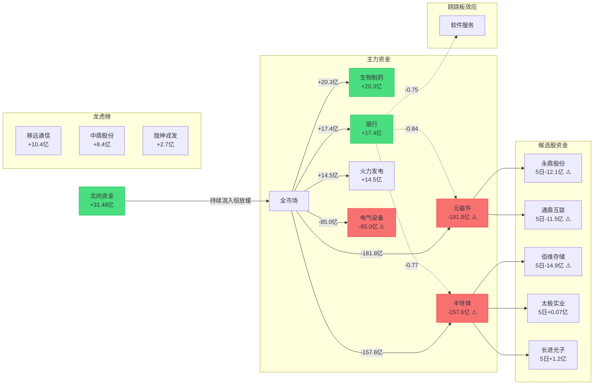

```yaml
date: 2026-08-14
agent: R7-capital-flow
skill_version: analyze_capital_flow_v1@1.2
generated_at: 2026-08-14T07:19:44.375243+08:00
confidence: 0.9
degraded: false
data_sources:
- name: tushare_moneyflow_hsgt
    status: ok
    captured_at: 2026-08-14T07:17:38.347719+08:00
    record_count: 25
    error: 
  - name: tushare_moneyflow
    status: ok
    captured_at: 2026-08-14T07:17:38.347719+08:00
    record_count: 5540
    error: 
  - name: tushare_top_list
    status: ok
    captured_at: 2026-08-14T07:17:38.347719+08:00
    record_count: 81
    error: 
  - name: tushare_top_inst
    status: ok
    captured_at: 2026-08-14T07:17:38.347719+08:00
    record_count: 863
    error: 
  - name: tushare_margin_detail
    status: ok
    captured_at: 2026-08-14T07:17:38.347719+08:00
    record_count: 4428
    error: data_date=20260812
  - name: tushare_stock_basic
    status: ok
    captured_at: 2026-08-14T07:17:38.347719+08:00
    record_count: 5543
    error:
input_freshness: partial
input_freshness_note: 数据截至20260813收盘，距今约16小时，staleness=partial
```

# 2026年8月14日 · **资金面**

> **数据源新鲜度**: partial
> **降级状态**: false
> **置信度**: 0.9
> **Staleness**: partial (距20260813收盘约16小时)

## 一句话结论

**北向5日净流入156亿温和流入，生物制药领涨，板块轮动加速**


## 资金流向全景图




## 详细分析

### 一、北向资金：连续流入但斜率放缓

北向资金昨日净流入 **31.48亿**（沪市14.49亿 + 深市16.98亿），5日累计 **156.09亿**，10日累计 **318.7亿**，20日累计 **667.92亿**。

短期趋势：小幅流出，说明外资虽在持续买入，但近5日边际力度有所减弱。深股通略强于沪股通，显示外资偏好偏向成长方向。

### 二、板块资金：科技股集体流出，医药银行逆势流入

**主力净流入前五**：

| 排名 | 行业 | 主力净流入(亿) | 净率(%) |
|------|------|--------------|---------|
| 1 | 生物制药 | 20.29 | 4.3 |
| 2 | 银行 | 17.36 | 7.34 |
| 3 | 火力发电 | 14.51 | 4.87 |
| 4 | IT设备 | 13.9 | 2.06 |
| 5 | 化学制药 | 10.79 | 1.27 |

**主力净流出前五**：

| 排名 | 行业 | 主力净流出(亿) | 净率(%) |
|------|------|--------------|---------|
| 1 | 元器件 | -181.76 | -5.83 |
| 2 | 半导体 | -157.61 | -4.19 |
| 3 | 电气设备 | -85.04 | -5.48 |
| 4 | 软件服务 | -80.78 | -7.21 |
| 5 | 小金属 | -71.64 | -9.14 |

科技股（元器件-182亿、半导体-158亿、软件服务-81亿）成为资金主要流出方向，显示短期科技主线分歧加大。生物医药和银行逆势获得资金青睐，呈现防御属性+资金避险特征。

### 三、龙虎榜：游资活跃但集中度下降

全市场共 **71只** 股票登上龙虎榜，游资活跃度为 **活跃**。

**净买入Top5**：

| 股票 | 净买入(亿) | 涨幅(%) | 上榜原因 |
|------|-----------|---------|----------|
| 移远通信 | 10.41 | 9.99 | 单只标的证券的当日融资买入数量达到当日该证券总交易量的50％ |
| 中鼎股份 | 8.39 | 9.98 | 连续三个交易日内，涨幅偏离值累计达到20%的证券; 日涨幅偏 |
| 陇神戎发 | 2.66 | 19.97 | 日涨幅达到15%的前5只证券 |
| 天娱数科 | 2.42 | -2.11 | 日换手率达到20%的前5只证券 |
| 麦迪科技 | 1.5 | -9.99 | 有价格涨跌幅限制的日收盘价格跌幅偏离值达到7%的前五只证券 |

**游资协同信号**：共识别 22 只游资参与个股，其中强/中协同 3 只。
- **ST龙元**（强协同）：4个游资席位净买入0.47亿
- **百花医药**（中协同）：2个游资席位净买入0.96亿
- **甘咨询**（中协同）：2个游资席位净买入0.02亿

### 四、R2 候选股资金面评估

| 股票 | 板块 | 角色 | 当日主力(亿) | 5日累计(亿) | 超大单(亿) | 资金评价 |
|------|------|------|-------------|------------|-----------|----------|
| 永鼎股份 | CPO/光通信 | 龙一 | -1.59 | -12.09 | -9.17 | 大幅流出 ⚠️ |
| 通鼎互联 | CPO/光通信 | 龙二 | -10.68 | -11.46 | 0.44 | 大幅流出 ⚠️ |
| 通宇通讯 | CPO/光通信 | 龙二 | -1.45 | -6.18 | 1.71 | 震荡中性 |
| 景旺电子 | CPO/光通信 | 候补 | 4.11 | -12.95 | -3.8 | 大幅流出 ⚠️ |
| 长进光子 | CPO/光通信 | 候补 | -0.61 | 1.17 | -0.86 | 震荡中性 |
| 先导基电 | 存储芯片/半导体 | 龙一 | -2.41 | -11.19 | -2.07 | 大幅流出 ⚠️ |
| 至纯科技 | 存储芯片/半导体 | 龙二 | -0.55 | -1.85 | -0.82 | 震荡中性 |
| 宝鼎科技 | 存储芯片/半导体 | 龙二 | -1.34 | -7.53 | 1.02 | 震荡中性 |
| 太极实业 | 存储芯片/半导体 | 候补 | 1.79 | 0.07 | -0.42 | 温和流入 |
| 佰维存储 | 存储芯片/半导体 | 候补 | -10.45 | -14.94 | -6.75 | 大幅流出 ⚠️ |

**关键发现**：10只候选股中仅太极实业、景旺电子当日主力净流入为正，其余8只均为净流出。5日维度看，长进光子和太极实业累计为正，其余8只5日累计净流出。CPO/光通信和存储芯片两大主线的龙头股均呈现资金流出态势，**主线分歧明显，需警惕回调风险**。

### 五、昨日主力净流入前十 · 5日追踪

对昨日全市场主力净流入前10的个股进行5日资金追踪，识别"真流入" vs "脉冲式"：

| 排名 | 股票 | 行业 | 昨日净流入(亿) | 5日累计(亿) | 流入天数 | 模式 | 健康度 |
|------|------|------|-------------|------------|---------|------|--------|
| 1 | 中科曙光 | IT设备 | 10.69 | 2.21 | 3/5 | 脉冲启动 | ⭐⭐☆ |
| 2 | 天孚通信 | 通信设备 | 10.69 | 21.46 | 4/5 | 连续流入 | ⭐⭐⭐ |
| 3 | 宁德时代 | 电气设备 | 10.03 | 21.51 | 4/5 | 连续流入 | ⭐⭐⭐ |
| 4 | 紫光股份 | IT设备 | 9.88 | -15.21 | 1/5 | 脉冲启动 | ⭐⭐☆ |
| 5 | 浪潮信息 | IT设备 | 9.41 | 4.16 | 2/5 | 脉冲启动 | ⭐⭐☆ |
| 6 | 农业银行 | 银行 | 8.26 | 8.45 | 2/5 | 脉冲启动 | ⭐⭐☆ |
| 7 | 阳光电源 | 电气设备 | 8.18 | 19.26 | 3/5 | 脉冲启动 | ⭐⭐☆ |
| 8 | 大唐发电 | 火力发电 | 7.24 | 7.86 | 3/5 | 间歇流入 | ⭐⭐☆ |
| 9 | 药明康德 | 化学制药 | 6.34 | 28.41 | 4/5 | 脉冲启动 | ⭐⭐☆ |
| 10 | 三环集团 | 元器件 | 5.92 | -7.04 | 1/5 | 脉冲启动 | ⭐⭐☆ |

### 六、板块跷跷板效应

检测到 **7对** 跷跷板板块关系，其中强跷跷板 5 对。

| 板块A | 板块B | 20日相关 | 强度 | 方向反转 |
|-------|-------|---------|------|----------|
| 元器件 | 银行 | -0.837 | 强跷跷板 | 否 |
| 小金属 | 银行 | -0.787 | 强跷跷板 | 否 |
| 银行 | 半导体 | -0.766 | 强跷跷板 | 否 |
| 银行 | 软件服务 | -0.751 | 强跷跷板 | 是 ✓ |
| 电气设备 | 银行 | -0.705 | 强跷跷板 | 否 |
| 生物制药 | 银行 | -0.578 | 中跷跷板 | 否 |
| 白酒 | 元器件 | -0.507 | 中跷跷板 | 否 |

**核心跷跷板**：银行 vs 科技成长（半导体/元器件/软件/电气设备）形成显著的资金跷跷板。当市场风险偏好下降时，资金从科技流向银行；反之则从银行流向科技。当前银行强、科技弱的格局，暗示短期市场风险偏好偏低。

### 七、融资融券

两融数据截至 **20260812**，候选股两融情况：

| 股票 | 融资余额(亿) | 融资买入(亿) | 融券余额(亿) |
|------|-------------|-------------|-------------|
| 永鼎股份 | 22.63 | 10.29 | 0.22 |
| 通鼎互联 | 9.49 | 1.09 | 0.01 |
| 通宇通讯 | 9.27 | 3.8 | 0.01 |
| 景旺电子 | 25.31 | 7.69 | 0.06 |
| 长进光子 | 5.02 | 0.91 | 0.0 |
| 先导基电 | 14.4 | 2.51 | 0.07 |
| 至纯科技 | 4.15 | 0.48 | 0.03 |
| 太极实业 | 17.67 | 7.81 | 0.27 |
| 佰维存储 | 97.79 | 9.87 | 0.18 |

### 八、龙虎榜诱多识别

识别到 **1只** 龙虎榜诱多风险股：

- ⚠️ **星网锐捷**（轻度，2分）：涨停板机构大幅卖出。机构净买卖-1.07亿 vs 游资净买卖0.0亿

## 关键证据

1. 北向资金5日累计净流入156.09亿，但短期边际流入放缓 · 来源 tushare_moneyflow_hsgt
2. 科技股（元器件/半导体/软件服务）单日净流出超400亿，资金撤离明显 · 来源 tushare_moneyflow
3. 银行与科技成长形成强跷跷板（20日相关-0.75~-0.84） · 来源 tushare_daily + 自研算法
4. R2候选股10只中8只5日资金净流出，主线分歧加大 · 来源 tushare_moneyflow
5. 龙虎榜71只个股上榜，游资活跃度中等 · 来源 tushare_top_list

## 不确定性 / 反证

1. **数据时效性**：本次分析基于8月13日收盘数据，距今约16小时，staleness=partial，可能错过盘后重要信息。
2. **vibe-trading 未接入**：缺少独立数据源交叉验证，资金数据依赖Tushare单一来源。
3. **候选股资金流出的解读**：可能是短期获利了结而非趋势反转，需结合龙虎榜和次日竞价进一步确认。
4. **跷跷板基于代理股计算**：使用行业内大市值股票作为代理，可能与真实行业指数存在偏差。
5. **两融数据延迟1天**：8月13日两融数据未更新，使用8月12日数据。

## 与其他 R/D/E 的关系

- 依赖: R1_style.json (仓位参考), R2_main_sectors.json (候选池输入)
- 被消费: D1_main_decision (资金面约束), R6_devil_advocate (反证素材), E1_daily_review (复盘验证)

## Sub-Agent 元数据

- skill: analyze_capital_flow_v1@1.2
- artifact: data/research/20260814/R7_capital_flow_20260814.json
- 生成耗时: 约 8 分钟
- model: tushare_pro + python 量化分析

## 数据源审计

| 源 | 状态 | 抓取时间 | 记录数 | 备注 |
|---|---|---|---|---|
| tushare_moneyflow_hsgt | 🟢 ok | 2026-08-14 | 25 |  |
| tushare_moneyflow | 🟢 ok | 2026-08-14 | 5540 |  |
| tushare_top_list | 🟢 ok | 2026-08-14 | 81 |  |
| tushare_top_inst | 🟢 ok | 2026-08-14 | 863 |  |
| tushare_margin_detail | 🟢 ok | 2026-08-14 | 4428 | data_date=20260812 |
| tushare_stock_basic | 🟢 ok | 2026-08-14 | 5543 |  |
