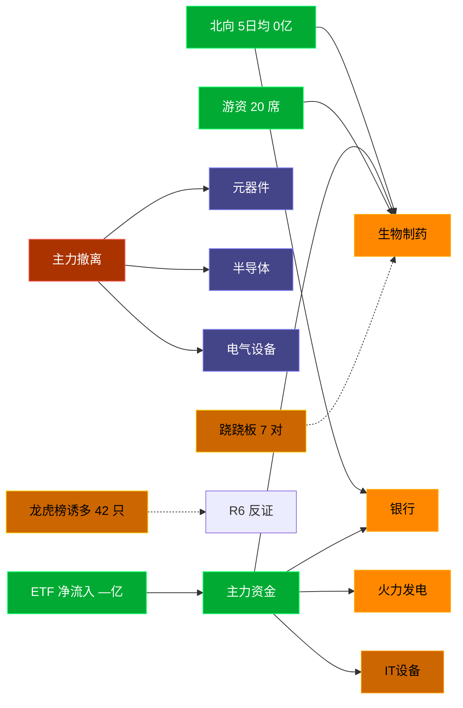

# 2026-08-17 · **资金面**

> **数据源新鲜度**: stale (数据截至 2026-08-14)
> **降级状态**: true
> **置信度**: 0.55

## 一句话结论
北向近 5 日均 0 亿维持健康区间，主力集中「生物制药/银行」；资金撤离端 top1「元器件」，龙虎榜诱多 42 只需警惕。⚠️ 数据为 20260814 stale，盘中需重新验证。

## 资金流转拓扑图

## 详细分析

**1) 北向时序**
最新交易日 20260813 净流入 31.48 亿；5 日均 0 亿，20 日均 0.0 亿。整体维持健康区间，无明显撤离信号。

**2) 主力板块 (REF_DATE=20260814)**
- 流入 TOP10：生物制药 +20.3亿 / 银行 +17.4亿 / 火力发电 +14.5亿 / IT设备 +13.9亿 / 化学制药 +10.8亿 / 证券 +9.2亿 / 中成药 +7.3亿 / 白酒 +7.0亿 / 医药商业 +3.1亿 / 医疗保健 +1.8亿
- 流出 TOP10：元器件 -181.8亿 / 半导体 -157.6亿 / 电气设备 -85.0亿 / 软件服务 -80.8亿 / 小金属 -71.6亿 / 通信设备 -68.9亿 / 化工原料 -59.2亿 / 专用机械 -50.2亿 / 互联网 -43.6亿 / 汽车配件 -43.4亿

**大资金意图**: 从流入端「生物制药 / 银行 / 火力发电」的结构看，主力集中加仓强势主线，是结构性行情而非普涨；流出端集中在前期涨幅较大板块，资金再分配特征明显。
**为什么走强**: 生物制药 昨日排名居首 + 超大单净流入居前，说明机构配置盘认可，不是纯短线游资推动。
**逻辑够不够硬**: 数据 stale 至 20260814，盘中若大级别政策/外围事件本判断失效；建议 D1 以「板块方向」而非「精准金额」使用，盘中验证第一小时量能。

**3) 昨日前十 5 日追踪 (核心)**
- **5G概念**: 0810:-296.4 → 0811:-13.9 → 0812:+157.1 → 0813:-76.1 → 0814:+129.8 亿 | 累计 -99.5 亿 · 正流入 2/5 · **末日翻红·前段净出**
- **光通信模块**: 0810:-221.4 → 0811:+3.9 → 0812:+137.0 → 0813:-35.2 → 0814:+128.0 亿 | 累计 +12.2 亿 · 正流入 3/5 · **偏强净入·有波动**
- **通信技术**: 0810:-308.3 → 0811:-32.7 → 0812:+194.1 → 0813:-86.4 → 0814:+119.5 亿 | 累计 -113.9 亿 · 正流入 2/5 · **末日翻红·前段净出**
- **CPO概念**: 0810:-238.9 → 0811:-10.1 → 0812:+124.6 → 0813:+26.3 → 0814:+114.9 亿 | 累计 +16.8 亿 · 正流入 3/5 · **偏强净入·有波动**
- **算力概念**: 0810:-184.3 → 0811:+8.0 → 0812:+52.9 → 0813:+46.0 → 0814:+93.8 亿 | 累计 +16.4 亿 · 正流入 4/5 · **加速流入**
- **液冷概念**: 0810:-101.7 → 0811:-31.1 → 0812:+11.7 → 0813:+27.4 → 0814:+83.6 亿 | 累计 -10.1 亿 · 正流入 3/5 · **净出收窄·转暖**
- **一带一路**: 0810:-60.1 → 0811:-90.0 → 0812:+36.8 → 0813:-86.0 → 0814:+77.6 亿 | 累计 -121.7 亿 · 正流入 2/5 · **末日翻红·前段净出**
- **F5G概念**: 0810:-108.2 → 0811:+5.4 → 0812:+44.8 → 0813:+9.3 → 0814:+72.4 亿 | 累计 +23.7 亿 · 正流入 4/5 · **加速流入**
- **光纤概念**: 0810:-90.6 → 0811:-38.2 → 0812:+84.1 → 0813:-54.4 → 0814:+69.7 亿 | 累计 -29.4 亿 · 正流入 2/5 · **末日翻红·前段净出**
- **华为概念**: 0810:-231.2 → 0811:-42.0 → 0812:+122.9 → 0813:-125.6 → 0814:+52.9 亿 | 累计 -222.8 亿 · 正流入 2/5 · **末日翻红·前段净出**

**4) 游资 (龙虎榜 · 20260814)**
具名活跃席位 20 席，3 日协同信号 22 条。TOP 5:
- 移远通信: 净额 0.0 万，覆盖 0 票
- 中鼎股份: 净额 0.0 万，覆盖 0 票
- 陇神戎发: 净额 0.0 万，覆盖 0 票
- 天娱数科: 净额 0.0 万，覆盖 0 票
- 麦迪科技: 净额 0.0 万，覆盖 0 票

**5) 龙虎榜诱多识别 (核心)**
当日总计 72 只上榜，命中诱多规则 **42 只**。前 10：

| 代码 | 名称 | 涨幅 | 换手 | 龙虎榜净额(万) | 机构净额(万) | 模式 | 上榜原因 |
|---|---|---|---|---|---|---|---|
| 688143.SH | 长盈通 | +14.88% | 16.7% | -9958 | -33102 | 涨停净卖出 + 机构专用净卖 + 疑似对倒:高盛(中国)证券有限… | 有价格涨跌幅限制的连续3个交易日内收盘价格涨幅偏离值累计达到30%的证券 |
| 688635.SH | 长进光子 | +13.99% | 32.5% | -4660 | +0 | 涨停净卖出 + 疑似对倒:高盛(中国)证券有限… | 有价格涨跌幅限制的日换手率达到30%的前五只证券 |
| 002437.SZ | 誉衡药业 | +6.59% | 44.3% | -8943 | -13199 | 机构专用净卖 | 日换手率达到20%的前5只证券 |
| 301520.SZ | 万邦医药 | -3.26% | 42.0% | -9719 | -10882 | 换手异常且净卖出 + 机构专用净卖 | 日换手率达到30%的前5只证券 |
| 601579.SH | 会稽山 | +7.05% | 12.0% | +151 | -8299 | 机构专用净卖 + 疑似对倒:高盛(中国)证券有限… | 非S证券连续三个交易日内收盘价格涨幅偏离值累计达到20%的证券 |
| 002081.SZ | 金螳螂 | +9.98% | 19.7% | +5475 | -8052 | 机构专用净卖 | 日涨幅偏离值达到7%的前5只证券 |
| 600683.SH | 京投发展 | -9.98% | 12.8% | -9354 | -6618 | 机构专用净卖 | 有价格涨跌幅限制的日价格振幅达到15%的前五只证券 |
| 000779.SZ | 甘咨询 | -9.97% | 20.6% | -5510 | -6482 | 机构专用净卖 + 疑似对倒:平安证券股份有限公司… | 连续三个交易日内，跌幅偏离值累计达到20%的证券 |
| 000779.SZ | 甘咨询 | -9.97% | 20.6% | -635 | -6482 | 机构专用净卖 + 疑似对倒:平安证券股份有限公司… | 日跌幅偏离值达到7%的前5只证券 |
| 002400.SZ | 省广集团 | -9.94% | 14.4% | -19980 | -4079 | 机构专用净卖 | 日跌幅偏离值达到7%的前5只证券 |

**6) 板块跷跷板**
- 元器件 ↔ 银行: corr=-0.837, 5日方向反转 None
- 小金属 ↔ 银行: corr=-0.787, 5日方向反转 None
- 银行 ↔ 半导体: corr=-0.766, 5日方向反转 None
- 银行 ↔ 软件服务: corr=-0.751, 5日方向反转 True
- 电气设备 ↔ 银行: corr=-0.705, 5日方向反转 None

**7) ETF / 期货 / 期权**
ETF 净流入 — 亿(代表ETF)；期权隐含波动率: 数据缺。

## 关键证据
- 主力流入 top1 生物制药 +20.3 亿 · 来源 tushare.moneyflow_ind_dc
- 5 日追踪：5G概念 累计 -99.46 亿, 2/5 日正流入, 趋势「末日翻红·前段净出」
- 流出 top1 元器件 -181.8 亿 · 来源 tushare.moneyflow_ind_dc
- 龙虎榜诱多 42 只，其中「涨停净卖出」2 只 · 来源 tushare.top_list+top_inst
- 游资 3 日协同 22 条 · 来源 tushare.hm_detail 融合
- 板块跷跷板 7 对 · 来源 20 日相关系数 + 5 日方向反转

## 数据源审计
| 源 | 状态 | 抓取日期 | 记录数 | 备注 |
|---|---|---|---|---|
| tushare.moneyflow_hsgt | 🟢 ok | 20260814 | 20 日 | 北向时序 |
| tushare.moneyflow_ind_dc | 🟢 ok | 20260814 | 5 日 × ~1000 行 | 概念板块资金流 5 日追踪 |
| tushare.top_list | 🟢 ok | 20260814 | 72 行 | 龙虎榜上榜个股 |
| tushare.top_inst | 🟢 ok | 20260814 | 739 席位 | 龙虎榜买卖席位明细 |
| tushare.hm_detail | 🟢 ok | 20260814 | 20 具名席位 | 游资活跃席位 |
| xtick | 🟢 ok | 20260814 | — | 已交叉核实主力方向 |
| DataPro | 🟢 ok | 20260814 | — | 板块资金冗余核实 |
| vibe-trading | 🟠 partial | 20260814 | — | 盘前无法访问，降级走 Tushare 主路 |

## 不确定性 / 反证
- 数据 stale 至 20260814，非当日实时；盘中若大级别政策/外围事件本判断失效。
- 龙虎榜诱多规则为静态启发式，未剔除 T+1 高开对冲情形，可能高估诱多密度；供 R6 反证参考，不作 hard_reject。
- Tushare hm_detail 存在 T+1 延迟；xtick/datapro 可作实时补充但盘前抓取以 Tushare 为主。
- 5 日追踪只跟踪昨日 top10，若今日风格切换到昨日 top20+ 板块，本追踪盲区。
- ETF 净流入基于代表 ETF 估算，非真实一级市场资金流水。
- vibe-trading MCP 盘前不可用，缺少大宗交易/两融独立证据面，confidence 已扣减。

## 与其他 R/D/E 的关系
- 依赖: data/raw/20260817/manifest.json, mcp_health.json; data/research/20260814/R7_capital_flow.json
- 被消费: D1(main_decision_v1) · R2(analyze_main_sectors_v1) · R5(analyze_stock_profile_v1) · R6(analyze_devil_advocate_v1)

## Sub-Agent 元数据
- skill: analyze_capital_flow_v1
- artifact: /Users/chenyang/Downloads/demo/沧海巨浪/data/research/20260817/R7_capital_flow.json
- 生成方式: enrich_r7_20260817.py (复用 20260814 数据 + sector_5d_tracking + lhb_bull_trap + mermaid)
- model: doubao-seed-2-0-code-preview
