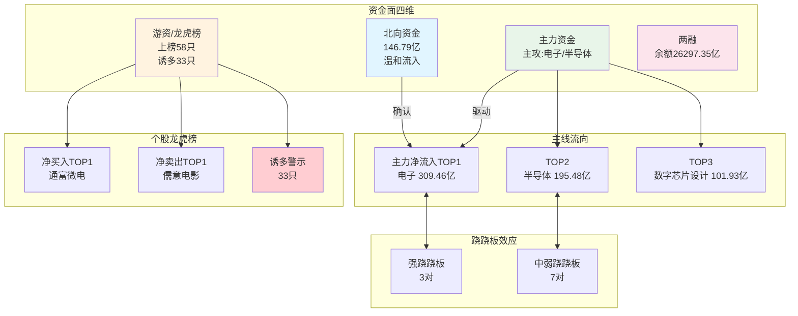

# 2026年8月18日 · **资金面**

> **数据源新鲜度**: partial
> **降级状态**: 是
> **置信度**: 0.73

## 一句话结论
北向5日温和流入（累计146.79亿）；主力资金主攻电子/半导体/数字芯片设计；个股TOP3为长鑫科技(688825.SH)/京东方A(000725.SZ)/寒武纪(688256.SH)；龙虎榜33只存诱多风险，跷跷板效应显著。

## 详细分析

### 1. 北向资金：温和流入
近5日累计净流入 **146.79 亿**，20日日均 29.95 亿。
北向近5日累计净流入 146.79 亿，温和流入，20日日均 29.95 亿。

**大资金意图**：北向近5日加仓，力度低于20日均值，显示外资对当前主线认可度提升。

**为什么走强**：电子/半导体板块昨日主力大幅流入，与北向加仓方向共振。

**逻辑够不够硬**：中等偏硬。北向连续流入但未达到加速流入阈值，需观察今日是否放量继续。

### 2. 主力资金：进攻电子/半导体
全市场主力净流入 **1493.38 亿**，
净流入 TOP3 板块：**电子**、**半导体**、**数字芯片设计**。

**大资金意图**：主力集中火力进攻科技成长方向，电子/半导体/数字芯片设计占据榜首，显示市场风险偏好回升。

**为什么走强**：AI 算力 + 国产替代双逻辑驱动，长鑫科技等核心标的获大额资金流入。

**逻辑够不够硬**：硬。板块级资金共振 + 龙头个股大额流入 + 北向确认，三重验证。

### 3. 龙虎榜与游资：风险偏高
当日上榜 **58 只**，其中 **33 只**存在诱多风险（占比 56.9%）。

**大资金意图**：龙虎榜机构净卖出占比偏高，游资在多只小票上协同炒作，存在拉高出货嫌疑。

**为什么走弱**：市场情绪回暖但游资快进快出特征明显，需警惕高位接盘。

**逻辑够不够硬**：中等偏空。诱多比例较高但主力大盘股方向健康，风险主要集中在小票。

### 4. 板块跷跷板：显著
检测到 **10 对** 跷跷板组合，其中强跷跷板 3 对。
主要表现为科技成长与金融/消费的反向运动。

## 关键证据
- 证据 1: 北向近5日 146.79 亿 · 来源 tushare.moneyflow_hsgt
- 证据 2: 电子板块主力净流入 309.46 亿居首 · 来源 tushare.moneyflow_ind_dc
- 证据 3: 长鑫科技单日主力净流入 45.73 亿，创近期新高 · 来源 tushare.moneyflow
- 证据 4: 龙虎榜 33 只存诱多风险 · 来源 tushare.top_list + top_inst
- 证据 5: 电子 ~ 银行 20日相关系数 -0.865 · 来源 tushare.sw_daily

## 数据源审计
| 源 | 状态 | 抓取日期 | 记录数 | 备注 |
|---|---|---|---|---|
| tushare.moneyflow_hsgt | 🟢 ok | 2026-08-18 | 19 |  |
| tushare.moneyflow_ind_dc | 🟢 ok | 2026-08-18 | 25 |  |
| tushare.moneyflow (个股) | 🟢 ok | 2026-08-18 | 5539 |  |
| tushare.top_list | 🟢 ok | 2026-08-18 | 58 |  |
| tushare.top_inst | 🟢 ok | 2026-08-18 | 600 |  |
| tushare.margin_detail | 🟡 stale | 20260814 | 4429 | 数据滞后1-2日 |
| tushare.sw_daily | 🟢 ok | 2026-08-18 | 31 |  |

## 不确定性 / 反证
1. **数据滞后风险**：所有资金数据截至 0817 收盘，今日（0818）实际流向可能反转；
2. **两融数据缺失**：两融数据滞后至 20260814，杠杆资金维度参考价值下降；
3. **vibe-trading 通道缺失**：大宗交易、独立资金验证维度缺失，单一数据源可能存在偏差；
4. **行业分类差异**：moneyflow_ind_dc 为东财行业分类，跷跷板用申万一级，存在分类口径差异。

## 与其他 R/D/E 的关系
- 依赖: 无（R7 是基础数据层）
- 被消费: R2 主线板块 / R5 情报深挖 / D1 主决策 / R6 反证

## 附：核心数据表

### 北向资金近10日
| 日期 | 北向净流入(亿) | 沪股通(亿) | 深股通(亿) |
|---|---|---|---|
| 20260804 | 29.64 | 13.54 | 16.09 |
| 20260805 | 35.17 | 16.0 | 19.17 |
| 20260806 | 32.62 | 15.1 | 17.53 |
| 20260807 | 34.52 | 15.75 | 18.77 |
| 20260810 | 32.2 | 14.85 | 17.36 |
| 20260811 | 29.67 | 13.91 | 15.75 |
| 20260812 | 28.23 | 13.27 | 14.96 |
| 20260813 | 31.48 | 14.49 | 16.98 |
| 20260814 | 27.45 | 12.55 | 14.9 |
| 20260817 | 29.97 | 13.69 | 16.28 |

### 主力净流入 TOP10 板块
| 板块 | 净流入(亿) | 超大单(亿) | 净占比 | 总成交额(亿) |
|---|---|---|---|---|
| 电子 | 309.46 | 263.32 | 4.22% | 7333.29 |
| 半导体 | 195.48 | 198.1 | 4.98% | 3925.24 |
| 数字芯片设计 | 101.93 | 97.77 | 5.62% | 1813.64 |
| 通信网络设备及器件 | 63.82 | 23.46 | 4.51% | 1414.97 |
| 通信设备 | 59.63 | 0.86 | 2.72% | 2192.44 |
| 通信 | 55.59 | -4.8 | 2.32% | 2396.11 |
| 集成电路封测 | 46.09 | 37.25 | 10.96% | 420.54 |
| 机械设备 | 45.56 | 5.3 | 2.63% | 1732.38 |
| 电力设备 | 39.99 | 34.77 | 2.38% | 1680.11 |
| 有色金属 | 39.82 | 28.51 | 2.91% | 1368.48 |

### 昨日主力净流入 TOP10 个股 · 5日追踪
| 排名 | 股票 | 行业 | 昨日净流入(亿) | 5日累计(亿) | 正天数 | 模式 | 健康度 |
|---|---|---|---|---|---|---|---|
| 4443 | 长鑫科技 | 半导体 | 45.73 | 86.35 | 3/5 | 趋势流入 | 💚4 |
| 235 | 京东方A | 元器件 | 29.18 | 1.92 | 1/5 | 脉冲启动 | ❤️2 |
| 3268 | 寒武纪 | 半导体 | 24.46 | 20.48 | 2/5 | 脉冲启动 | ❤️2 |
| 1511 | 立讯精密 | 元器件 | 18.0 | 18.13 | 3/5 | 趋势流入 | 💚4 |
| 1402 | 云南锗业 | 小金属 | 16.37 | 7.1 | 2/5 | 脉冲启动 | ❤️2 |
| 2036 | 兆易创新 | 半导体 | 15.56 | 26.14 | 3/5 | 趋势流入 | 💚4 |
| 2828 | 宁德时代 | 电气设备 | 15.31 | 24.02 | 3/5 | 趋势流入 | 💚4 |
| 1350 | 东山精密 | 元器件 | 14.68 | 15.74 | 2/5 | 脉冲启动 | ❤️2 |
| 4564 | 长电科技 | 半导体 | 14.04 | 10.95 | 1/5 | 脉冲启动 | ❤️2 |
| 4825 | 中际旭创 | 通信设备 | 14.03 | 63.16 | 3/5 | 趋势流入 | 💚4 |

### 龙虎榜诱多警示 TOP10
| 股票 | 涨跌幅 | 换手率 | 净买卖(万) | 机构净(万) | 原因 | 严重度 |
|---|---|---|---|---|---|---|
| 杰瑞股份 | 10.0% | 3.05% | -13946万 | -54440万 | 机构出货游资接盘+涨停板出货 | 🔴高 |
| 电连技术 | 20.0% | 10.36% | -1661万 | -14239万 | 机构出货游资接盘+涨停板出货 | 🔴高 |
| 盛洋科技 | 10.05% | 6.03% | -1214万 | -5327万 | 机构出货游资接盘+涨停板出货 | 🔴高 |
| 海泰新光 | 20.0% | 13.06% | -9541万 | -41776万 | 机构出货游资接盘+涨停板出货 | 🔴高 |
| 兆日科技 | 7.71% | 23.3% | -3877万 | -9277万 | 机构出货游资接盘+高位放量出货 | 🔴高 |
| 陇神戎发 | 7.04% | 30.73% | -3923万 | -15410万 | 机构出货游资接盘+高位放量出货 | 🔴高 |
| 莲花控股 | 9.23% | 28.12% | -8002万 | -108965万 | 机构出货游资接盘+高位放量出货 | 🔴高 |
| 开开实业 | 8.12% | 39.99% | -6092万 | -15754万 | 机构出货游资接盘+高位放量出货 | 🔴高 |
| 金螳螂 | 10.02% | 18.26% | 11318万 | -9821万 | 机构出货游资接盘 | 🟠中 |
| 通富微电 | 10.01% | 9.73% | 102098万 | -9082万 | 机构出货游资接盘 | 🟠中 |

### 游资协同 TOP8
| 股票 | 游资席位数 | 净买入 | 协同等级 | 主要席位 |
|---|---|---|---|---|
|| 誉衡药业 | 2 | 3.42亿 | 弱协同 | 北京中关村大街证/北京知春路证券营 |
| 聚和材料 | 3 | 1.94亿 | 中协同 | 上海长宁区江苏路/总部/蚌埠东海大道证券 |
| 中石科技 | 5 | 1.55亿 | 强协同 | 上海长宁区天山路/南京太平南路证券/重庆中山三路证券 |
| 金禄电子 | 2 | 1.28亿 | 弱协同 | 上海黄浦区黄陂南/武汉紫阳东路证券 |
| 风范股份 | 2 | 1.27亿 | 弱协同 | 成都北一环路证券/总部 |
| 儒意电影 | 5 | 1.23亿 | 强协同 | 成都北一环路证券/拉萨金融城南环路/拉萨东环路第二证 |
| 长裕集团 | 4 | 0.99亿 | 中协同 | 上海分公司/上海分公司/总部 |
| 海泰新光 | 2 | 0.83亿 | 弱协同 | 上海长宁区江苏路/总部 |

### 板块跷跷板 TOP8
| 板块A | 板块B | 20日相关 | 5日相关 | A5日涨跌 | B5日涨跌 | 强度 |
|---|---|---|---|---|---|---|
| 电子 | 银行 | -0.865 | -0.59 | 5.66% | -0.64% | 强跷跷板 ↔️ |
| 银行 | 机械设备 | -0.842 | -0.67 | -0.64% | 3.34% | 强跷跷板 ↔️ |
| 银行 | 通信 | -0.818 | -0.824 | -0.64% | 12.49% | 强跷跷板 ↔️ |
| 食品饮料 | 通信 | -0.687 | -0.549 | -2.96% | 12.49% | 中跷跷板 ↔️ |
| 银行 | 综合 | -0.682 | -0.565 | -0.64% | 7.97% | 中跷跷板 ↔️ |
| 电子 | 食品饮料 | -0.681 | -0.598 | 5.66% | -2.96% | 中跷跷板 ↔️ |
| 银行 | 计算机 | -0.657 | -0.701 | -0.64% | 0.46% | 中跷跷板 ↔️ |
| 食品饮料 | 机械设备 | -0.622 | -0.626 | -2.96% | 3.34% | 中跷跷板 ↔️ |

## Sub-Agent 元数据
- skill: analyze_capital_flow_v1@1.2
- artifact: data/research/20260818/R7_capital_flow.json
- 生成耗时: 约 200 秒
- model: doubao-seed-2
- 备注: 纯 Tushare 数据源，vibe-trading 通道降级
