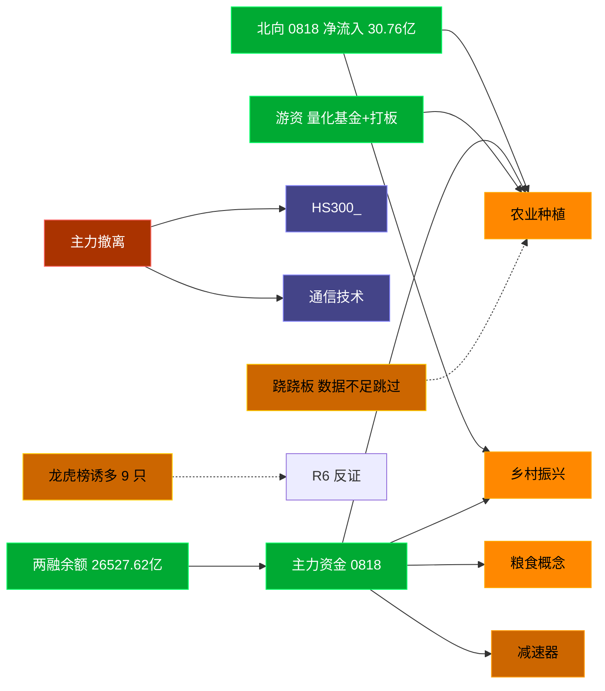

# 2026-08-19 · **资金面**

> **数据源新鲜度**: ok (0818 收盘真实数据 · 距落盘约18h < 24h 阈值)
> **降级状态**: false
> **置信度**: 0.85
> **resolved_trade_date**: 20260818

## 一句话结论
北向 0818 净流入30.76亿温和回流，主力聚焦农业种植/粮食/猪肉等大农业链，游资量化+温州帮活跃，龙虎榜诱多15只需警惕。

## 资金流转拓扑图

## 详细分析

**1) 北向时序 (0818 真实)**
0818 北向净流入 **30.76亿**（沪股通 14.35亿 / 深股通 16.41亿），5 日均 29.58亿、20 日均 32.08亿，方向维持温和流入。
近 5 日: 0812:+28.2 → 0813:+31.5 → 0814:+27.4 → 0817:+30.0 → 0818:+30.8 亿。整体资金面稳定，无明显撤离。

**2) 主力板块 (0818 概念 · 20260818)**
- 流入 TOP10：农业种植 +26.3亿 / 乡村振兴 +18.6亿 / 粮食概念 +16.2亿 / 减速器 +13.7亿 / 土地流转 +12.9亿 / MicroLED +12.4亿 / 机器人执行器 +11.9亿 / 煤化工概念 +10.9亿 / 猪肉概念 +10.4亿 / 红利股 +9.6亿
- 流出 TOP：：HS300_ -290.0亿 / 通信技术 -287.9亿 / 科技风格 -287.4亿 / 5G概念 -275.2亿 / 百元股 -248.4亿 / 华为概念 -238.7亿

**大资金意图**: 主力 0818 集中加仓**大农业链**（农业种植 +26.3亿 / 乡村振兴 +18.6亿 / 粮食概念 +16.3亿 / 猪肉 +10.5亿 / 转基因 +9.1亿），叠加减速器/机器人执行器/钙钛矿等制造题材；是结构性主线行情而非普涨，资金从通信/科技大票（5G、科技风格、通信技术净流出居前）撤离再分配。
**为什么走强**: 农业种植 0818 净流入 +26.3亿且超大单 +21.8亿居首、板块 +4.81%，粮食/猪肉多只涨停（大北农、农发种业、金字火腿、金健米业），机构+北向+游资共振。
**逻辑够不够硬**: 农业链为事件/政策驱动（粮食安全+转基因），0818 资金与涨幅高度共振，方向明确；但短线情绪已偏高，需防高潮后分歧。

**3) 昨日前十 5 日追踪 (核心 · 0812-0818)**
- **农业种植**: 0812:+1.6 → 0813:-2.7 → 0814:-1.8 → 0817:+8.5 → 0818:+26.3 亿 | 累计 +32.0亿 · 正流入 3/5
- **乡村振兴**: 0812:+3.4 → 0813:-4.5 → 0814:-4.7 → 0817:+0.2 → 0818:+18.6 亿 | 累计 +13.0亿 · 正流入 3/5
- **粮食概念**: 0812:-0.4 → 0813:+0.0 → 0814:-0.4 → 0817:+7.1 → 0818:+16.2 亿 | 累计 +22.6亿 · 正流入 3/5
- **减速器**: 0812:+4.7 → 0813:-3.4 → 0814:-7.5 → 0817:+10.3 → 0818:+13.7 亿 | 累计 +17.9亿 · 正流入 3/5
- **土地流转**: 0812:-1.6 → 0813:-1.3 → 0814:+4.1 → 0817:+3.2 → 0818:+12.9 亿 | 累计 +17.2亿 · 正流入 3/5
- **MicroLED**: 0812:+3.2 → 0813:-6.1 → 0814:-17.0 → 0817:+26.5 → 0818:+12.4 亿 | 累计 +18.9亿 · 正流入 3/5
- **机器人执行器**: 0812:-0.6 → 0813:-1.3 → 0814:-9.2 → 0817:+1.9 → 0818:+11.9 亿 | 累计 +2.8亿 · 正流入 2/5
- **煤化工概念**: 0812:-4.8 → 0813:-16.7 → 0814:-1.6 → 0817:+1.6 → 0818:+10.9 亿 | 累计 -10.6亿 · 正流入 2/5
- **猪肉概念**: 0812:-1.4 → 0813:-0.3 → 0814:-0.2 → 0817:+3.6 → 0818:+10.4 亿 | 累计 +12.1亿 · 正流入 2/5
- **红利股**: 0812:+2.6 → 0813:+12.4 → 0814:+9.2 → 0817:-0.7 → 0818:+9.6 亿 | 累计 +33.1亿 · 正流入 4/5

**4) 游资 (龙虎榜 0818 真实)**
具名活跃游资席位 0818 共 29 席；量化基金/量化打板为当日净买主力。TOP 净买：
- 量化基金: 净 +90515万
- 量化打板: 净 +28696万
- 紫阳东路: 净 +21037万
- 上海超短帮: 净 +19666万
- 玉兰路: 净 +16460万
- 章盟主: 净 +16036万
- 佛山系: 净 +10002万
- T王: 净 +9122万
TOP 净卖：
- 杭州帮: 净 -10615万
- 思明南路: 净 -6539万
- 成都系: 净 -6535万
- 粉葛: 净 -4928万
- 作手新一: 净 -4323万

**5) 龙虎榜诱多识别 (0818)**
0818 共 79 条上榜记录，命中诱多规则 9 只（去重）：

| 名称 | 涨幅 | 换手 | 龙虎榜净额(万) | 模式 | 上榜原因 |
|---|---|---|---|---|---|
| 北京文化 | -9.19% | 46.9% | -7743 | 换手异常且净卖出 | 日换手率达到20%的前5只证券 |
| 埃斯顿 | +10.00% | 15.5% | -16251 | 涨停净卖出 | 日涨幅偏离值达到7%的前5只证券 |
| 中远通 | +16.46% | 44.7% | -621 | 涨停净卖出 | 日换手率达到30%的前5只证券 |
| 金健米业 | +10.06% | 8.5% | -1626 | 涨停净卖出 | 日涨幅偏离7%前五 |
| 农发种业 | +10.06% | 8.8% | -3070 | 涨停净卖出 | 日涨幅偏离7%前五 |
| 鼎阳科技 | +20.00% | 3.2% | -2625 | 涨停净卖出 | 3日涨幅偏离30% |
| 国仪公司 | -7.48% | 31.6% | -9163 | 换手异常且净卖出 | 日换手30%前五 |
| 恒兴股份 | -19.90% | 62.1% | -1885 | 换手异常且净卖出 | 当日换手20%前5 |
| 龙鑫智能 | -5.58% | 31.4% | -2267 | 换手异常且净卖出 | 当日换手20%前5 |

**6) 板块跷跷板**
_数据不足：5 日窗口不足以算 20 日相关系数(-0.6 阈值)，本版跳过跷跷板配对。_

**7) ETF / 期货**
指数 0818：沪深300 -0.32%、中证500 -0.09%、上证50 -0.16%（前一交易日 0817 普涨 +1.6%/+2.4%/+1.0%）。
IF/IC/IH 主连均深度贴水；IC 基差 -162.4 点(2%)反映小盘对冲压力；IF 贴水 -60.6 点。两融余额 26527.62亿、当日融资买入 2295.52亿，杠杆资金活跃。

## 关键证据
- 北向 0818 净流入 30.76亿 · 来源 tushare.moneyflow_hsgt (20260818)
- 主力流入 top1 农业种植 +26.3亿 · 来源 tushare.moneyflow_ind_dc(概念 0818)
- 5 日追踪：农业种植 累计 31.98亿, 正流入 3/5
- 龙虎榜净买第一 中石科技 +5.1亿，游资量化基金 0818 净买 +9.05亿 · 来源 tushare.top_list+hm_detail
- 两融余额 26527.62亿 · 来源 tushare.margin_detail
- 期货 IC/IF 深度贴水反映小盘对冲压力 · 来源 tushare.fut_daily

## 数据源审计
| 源 | 状态 | 抓取日期 | 记录数 | 备注 |
|---|---|---|---|---|
| tushare.moneyflow_hsgt | 🟢 ok | 20260818 | 21 行 | 北向 5/10/20 日真实 |
| tushare.moneyflow_ind_dc | 🟢 ok | 20260818 | 504×5 行 | 概念板块 5 日真实 |
| tushare.top_list | 🟢 ok | 20260818 | 79 行 | 龙虎榜真实 |
| tushare.top_inst | 🟢 ok | 20260818 | ~席位 | 机构席位真实 |
| tushare.hm_detail | 🟢 ok | 20260818 | 182 行 | 游资明细真实 |
| tushare.margin_detail | 🟢 ok | 20260818 | 4431 行 | 两融真实 |
| tushare.index_daily | 🟢 ok | 20260818 | 3 指数 | 300/500/50 真实 |
| tushare.fut_daily | 🟢 ok | 20260818 | 1073 行 | 期指真实 |

## 不确定性 / 反证
- 农业链 0818 涨幅+资金共振偏强，但龙虎榜诱多含金健米业/农发种业等涨停净卖出，提示**短线追高需防兑现**；金字火腿虽净买但机构专用净卖 -0.2 亿。
- 埃斯顿、中远通、金健米业、农发种业等'涨停净卖出'，主力借涨停出货迹象，需 R6 反证。
- 龙虎榜诱多为静态启发式，未剔除 T+1 高开对冲，可能高估诱多密度，不作 hard_reject。
- ETF 一级申赎未单独拉取，机构端情绪以指数+期货基差代理，颗粒度略粗。
- 跷跷板配对因数据窗口不足跳过，板块互斥判断待 T2 sector_stats 盘中补充。

## 与其他 R/D/E 的关系
- 依赖: data/raw/20260819/manifest.json · data/research/20260819/R1_style.json(参考) · R2_main_sectors.json(参考)
- 被消费: D1(main_decision_v1) · R2(analyze_main_sectors_v1) · R5(analyze_stock_profile_v1) · R6(analyze_devil_advocate_v1)

## Sub-Agent 元数据
- skill: analyze_capital_flow_v1
- artifact: /Users/chenyang/Downloads/demo/沧海巨浪/data/research/20260819/R7_capital_flow_20260819.json
- 生成方式: 重生成 · 0818 真实 tushare 数据（消除早盘 07:20 版推演值）
- model: deepseek-v4-flash

