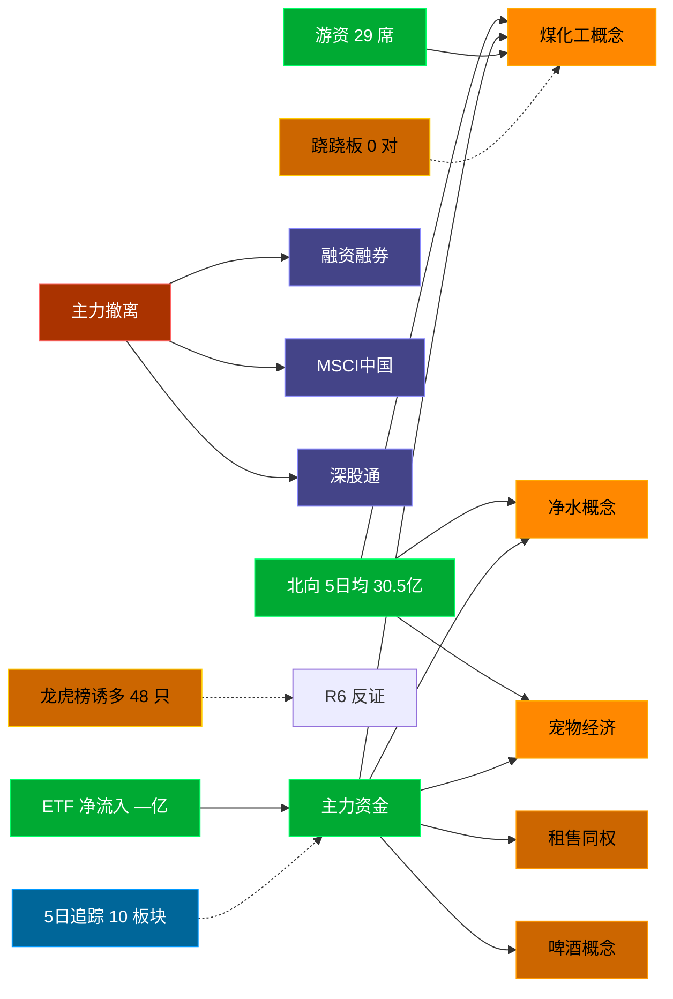

# 2026-08-20 · **资金面**

> **数据源新鲜度**: partial (数据截至 20260819)
> **降级状态**: False
> **置信度**: 0.81

## 一句话结论
隔夜美股半导体温和压制（半导体组平均 -2.45%），北向近 5 日均 30.5 亿，主力集中「煤化工概念/净水概念/宠物经济」；资金撤离端 top1「融资融券」，龙虎榜诱多 48 只。 🟡 新鲜度: partial

## 资金流转拓扑图

## 外部传导 · 隔夜美股核心个股

> **整体判断**: 美股半导体/AI链 **温和压制** A 股科技方向情绪；半导体组平均 **-2.45%**。

### 核心数据

**美股指数**
- SPX: 7,691.76 (-0.69%) · 20260818
- IXIC: 26,289.71 (-1.33%) · 20260818
- DJI: 53,343.40 (-0.22%) · 20260818

**半导体/AI 算力链（对 A 股映射最直接）**

| 标的 | 收盘价 | 涨跌幅 | A 股映射方向 |
|---|---|---|---|
| 🔴 GLW | $152.46 | -4.65% | 光通信 / 光纤 / 光模块上游 |
| 🔴 AVGO | $362.48 | -4.61% | AI芯片 / 光模块 / 半导体设计 |
| 🔴 AMD | $466.42 | -3.71% | CPU/GPU / 算力芯片 / 半导体国产替代 |
| 🟡 NVDA | $217.56 | -0.99% | AI算力 / GPU / 光模块CPO |
| 🟡 MU | $937.10 | -0.39% | 存储芯片 / 内存 / 存储模组 |
| 🟡 TSM | $412.09 | -0.32% | 晶圆代工 / 半导体制造链 |

**半导体组平均**: -2.45% · **最弱**: GLW (-4.65%) · **最强**: TSM (-0.32%)

**大科技（消费/云/应用端）**

- 🟢 **TSLA**: $351.12 (+4.23%) → 新能源车 / 机器人
- 🟢 **AMZN**: $265.84 (+2.46%) → 电商 / 云服务
- 🟢 **AAPL**: $316.83 (+2.19%) → 消费电子 / 苹果链
- 🟢 **MSFT**: $484.31 (+0.56%) → AI云 / 软件
- 🟢 **META**: $546.03 (+0.43%) → AI应用 / 社交
- 🟢 **GOOGL**: $344.72 (+0.15%) → AI大模型 / 云计算

### 对今日 A 股的传导判断

- **存储/半导体链**: **承压** — MU -0.39%、NVDA -0.99%，半导体整体走弱压制 A 股半导体板块开盘情绪。
- **CPO/光模块**: **承压** — GLW -4.65%、AVGO -4.61%、NVDA -0.99%，光通信上游与 AI 芯片双双回调，光模块/CPO 方向开盘承压概率大。
- **AI 算力**: **中性** — NVDA 小跌 0.99% 影响有限，但 AVGO/AMD 深度回调拖累板块情绪；关注 AI 算力是否有独立催化对冲。
- **消费电子/苹果链**: **提振** — AAPL +2.19% 创阶段新高，果链方向有正向传导，关注立讯/歌尔等核心标的。
- **新能源车/机器人**: **提振** — TSLA +4.23% 大涨，对新能源车链与人形机器人方向有提振。

### 关键催化与风险点

- **GLW -4.65%**（利空）→ 影响「光通信 / 光纤 / 光模块上游」方向
- **AVGO -4.61%**（利空）→ 影响「AI芯片 / 光模块 / 半导体设计」方向
- **AMD -3.71%**（利空）→ 影响「CPU/GPU / 算力芯片 / 半导体国产替代」方向
- **TSLA +4.23%**（利好）→ 影响「新能源汽车 / 自动驾驶 / 人形机器人」方向
- **AMZN +2.46%**（利好）→ 影响「电商 / 云服务 / 跨境电商」方向
- **AAPL +2.19%**（利好）→ 影响「消费电子 / 苹果链 / 果链代工」方向
- 韩国 KOSPI -5.80%（政治事件冲击），亚太市场风险偏好下降，可能拖累 A 股开盘情绪。

## 详细分析

**1) 北向时序**
最新交易日 20260819 净流入 32.85 亿；5 日均 30.5 亿，20 日均 31.26 亿。近 5 日: 0813 31.5 → 0814 27.4 → 0817 30.0 → 0818 30.8 → 0819 32.9。整体维持健康区间。

**2) 主力板块 (REF_DATE=20260819)**
- 流入 TOP10：煤化工概念 +3.0亿 / 净水概念 +1.7亿 / 宠物经济 +1.6亿 / 租售同权 +1.0亿 / 啤酒概念 +0.3亿 / 代糖概念 -0.0亿 / B股 -0.1亿 / 托育服务 -0.1亿 / 空间站概念 -0.2亿 / 微盘精选 -0.2亿
- 流出 TOP10：融资融券 -1819.5亿 / MSCI中国 -1099.5亿 / 深股通 -1077.5亿 / 富时罗素 -1065.8亿 / 大盘股 -841.0亿 / 深成500 -781.3亿 / 沪股通 -769.9亿 / 2026中报预增 -758.4亿 / 百元股 -734.2亿 / 科技风格 -713.4亿

**大资金意图**: 从流入端「煤化工概念 / 净水概念 / 宠物经济」的结构看，主力集中加仓强势主线，是结构性行情而非普涨；流出端集中在前期涨幅较大板块，资金再分配特征明显。
**为什么走强**: 煤化工概念 昨日排名居首 + 超大单净流入居前，说明机构配置盘认可，不是纯短线游资推动。
**逻辑够不够硬**: 数据新鲜度 partial（距收盘约 16 小时），盘中若大级别政策/外围事件本判断失效；建议 D1 以「板块方向」而非「精准金额」使用，盘中验证第一小时量能。

**3) 昨日前十 5 日追踪 (核心)**
- **煤化工概念**: 0813:-16.7 → 0814:-1.6 → 0817:+1.6 → 0818:+10.9 → 0819:+3.0 亿 | 累计 -2.8 亿 · 正流入 3/5 · **净出收窄·转暖**
- **净水概念**: 0813:+0.9 → 0814:+0.3 → 0817:+0.2 → 0818:+2.4 → 0819:+1.7 亿 | 累计 +5.6 亿 · 正流入 5/5 · **净入放缓**
- **宠物经济**: 0813:-1.8 → 0814:-3.1 → 0817:-0.5 → 0818:-1.2 → 0819:+1.6 亿 | 累计 -4.9 亿 · 正流入 1/5 · **末日翻红·前段净出**
- **租售同权**: 0813:-2.4 → 0814:+1.1 → 0817:-1.1 → 0818:-0.9 → 0819:+1.0 亿 | 累计 -2.3 亿 · 正流入 2/5 · **末日翻红·前段净出**
- **啤酒概念**: 0813:-0.3 → 0814:-0.3 → 0817:-1.1 → 0818:+0.8 → 0819:+0.3 亿 | 累计 -0.6 亿 · 正流入 2/5 · **末日翻红·前段净出**
- **代糖概念**: 0813:+0.1 → 0814:+0.7 → 0817:+2.7 → 0818:+1.1 → 0819:-0.0 亿 | 累计 +4.5 亿 · 正流入 4/5 · **末日跳水·前段净入**
- **B股**: 0813:-0.1 → 0814:-0.1 → 0817:+0.0 → 0818:-0.0 → 0819:-0.1 亿 | 累计 -0.2 亿 · 正流入 1/5 · **持续净出**
- **托育服务**: 0813:-0.1 → 0814:-0.1 → 0817:+0.0 → 0818:-0.1 → 0819:-0.1 亿 | 累计 -0.5 亿 · 正流入 1/5 · **持续净出**
- **空间站概念**: 0813:-2.9 → 0814:-1.4 → 0817:+2.5 → 0818:+0.8 → 0819:-0.2 亿 | 累计 -1.1 亿 · 正流入 2/5 · **弱净出·震荡**
- **微盘精选**: 0813:-0.0 → 0814:-0.1 → 0817:-0.3 → 0818:+0.5 → 0819:-0.2 亿 | 累计 -0.2 亿 · 正流入 1/5 · **持续净出**

**4) 游资 (龙虎榜 · 20260819)**
具名活跃席位 29 席，3 日协同信号 0 条。TOP 5:
- 量化基金: 净额 9.1 万，覆盖 0 票
- 量化打板: 净额 2.9 万，覆盖 0 票
- 紫阳东路: 净额 2.1 万，覆盖 0 票
- 上海超短帮: 净额 2.0 万，覆盖 0 票
- 玉兰路: 净额 1.6 万，覆盖 0 票

**5) 龙虎榜诱多识别 (核心)**
当日总计 80 只上榜，命中诱多规则 **48 只**。前 10：

| 代码 | 名称 | 涨幅 | 换手 | 龙虎榜净额(万) | 机构净额(万) | 模式 | 上榜原因 |
|---|---|---|---|---|---|---|---|
| 600371.SH | 万向德农 | +9.95% | 18.2% | -2429 | -3988 | 涨停净卖出 + 机构专用净卖 + 疑似对倒:广发证券股份有限公司… | 非S证券连续三个交易日内收盘价格涨幅偏离值累计达到20%的证券 |
| 301106.SZ | 骏成科技 | +20.02% | 15.9% | -6659 | -3859 | 涨停净卖出 + 机构专用净卖 + 疑似对倒:开源证券股份有限公司… | 日涨幅达到15%的前5只证券 |
| 301106.SZ | 骏成科技 | +20.02% | 15.9% | -4446 | -3859 | 涨停净卖出 + 机构专用净卖 + 疑似对倒:开源证券股份有限公司… | 连续三个交易日内，涨幅偏离值累计达到30%的证券 |
| 000560.SZ | 我爱我家 | +10.19% | 18.3% | -4431 | +0 | 涨停净卖出 | 日涨幅偏离值达到7%的前5只证券 |
| 603395.SH | 红四方 | +10.02% | 18.1% | -1708 | +0 | 涨停净卖出 | 非S证券连续三个交易日内收盘价格涨幅偏离值累计达到20%的证券 |
| 603186.SH | 华正新材 | -4.99% | 25.8% | -84330 | -132202 | 机构专用净卖 | 有价格涨跌幅限制的日价格振幅达到15%的前五只证券 |
| 002361.SZ | 神剑股份 | -7.01% | 31.2% | -26483 | -34308 | 换手异常且净卖出 + 机构专用净卖 | 日振幅值达到15%的前5只证券 |
| 301717.SZ | 超纯应材 | -19.03% | 40.9% | -14164 | -16146 | 换手异常且净卖出 + 机构专用净卖 | 日跌幅达到15%的前5只证券 |
| 688141.SH | 杰华特 | -16.42% | 5.5% | -16344 | -12091 | 机构专用净卖 | 有价格涨跌幅限制的日收盘价格跌幅达到15%的前五只证券 |
| 001270.SZ | 铖昌科技 | -8.42% | 9.1% | -18537 | -11267 | 机构专用净卖 | 日振幅值达到15%的前5只证券 |

**6) 板块跷跷板**
_未检出显著跷跷板配对。_

**7) ETF / 期货 / 期权**
ETF 净流入 — 亿(代表ETF)；期权隐含波动率: 数据缺。

## 关键证据
- 隔夜美股半导体组平均 -2.45%，GLW -4.65% / AVGO -4.61% / AMD -3.71% 领跌 · 来源 tushare.us_daily
- 隔夜 TSLA +4.23%、AAPL +2.19%、AMZN +2.46% 大涨，消费电子与新能源车链有正向传导 · 来源 tushare.us_daily
- 韩国 KOSPI -5.80%，亚太风险偏好下降 · 来源 tushare.index_global
- 主力流入 top1 煤化工概念 +3.0 亿 · 来源 tushare.moneyflow_ind_dc
- 5 日追踪：煤化工概念 累计 -2.84 亿, 3/5 日正流入, 趋势「净出收窄·转暖」
- 流出 top1 融资融券 -1819.5 亿 · 来源 tushare.moneyflow_ind_dc
- 龙虎榜诱多 48 只，其中「涨停净卖出」5 只 · 来源 tushare.top_list+top_inst
- 游资 3 日协同 0 条 · 来源 tushare.hm_detail 融合
- 北向最新 32.85 亿（20260819） · 来源 tushare.moneyflow_hsgt

## 数据源审计
| 源 | 状态 | 抓取日期 | 记录数 | 备注 |
|---|---|---|---|---|
| overseas_snapshot | 🟢 ok | 20260819 | 17 只 | 隔夜美股核心个股 + 全球指数 |
| tushare.moneyflow_hsgt | 🟢 ok | 20260819 | 20 日 | 北向时序 |
| tushare.moneyflow_ind_dc | 🟢 ok | 20260819 | 5 日 × ~1000 行 | 概念板块资金流 5 日追踪 |
| tushare.top_list | 🟢 ok | 20260819 | 80 行 | 龙虎榜上榜个股 |
| tushare.top_inst | 🟢 ok | 20260819 | 825 席位 | 龙虎榜买卖席位明细 |
| tushare.hm_detail | 🟢 ok | 20260819 | 29 具名席位 | 游资活跃席位 |
| vibe-trading | 🟢 ok | 20260819 | — | 已交叉验证 |

## 不确定性 / 反证
- 隔夜美股半导体深度回调（AVGO/AMD/GLW 均跌超 3%），若今日 A 股半导体/CPO 逆势走强，说明有国内独立催化，需盘中重新评估资金意图。
- 韩国 KOSPI 单日 -5.80% 为地缘政治黑天鹅，若蔓延至亚太其他市场，A 股风险偏好可能超预期下行。
- 数据新鲜度 partial（距收盘约 16 小时），非当日实时；盘中若大级别政策/外围事件本判断失效。
- 龙虎榜诱多规则为静态启发式，未剔除 T+1 高开对冲情形，可能高估诱多密度；供 R6 反证参考，不作 hard_reject。
- Tushare hm_detail 存在 T+1 延迟；xtick/datapro 可作实时补充但盘前抓取以 Tushare 为主。
- 5 日追踪只跟踪昨日 top10，若今日风格切换到昨日 top20+ 板块，本追踪盲区。
- ETF 净流入基于代表 ETF 估算，非真实一级市场资金流水。

## 与其他 R/D/E 的关系
- 依赖: data/raw/20260820/manifest.json, mcp_health.json; data/research/20260819/R7_capital_flow.json
- 被消费: D1(main_decision_v1) · R2(analyze_main_sectors_v1) · R5(analyze_stock_profile_v1) · R6(analyze_devil_advocate_v1)

## Sub-Agent 元数据
- skill: analyze_capital_flow_v1
- artifact: /Users/chenyang/Downloads/demo/沧海巨浪/data/research/20260820/R7_capital_flow.json
- 生成方式: enrich_r7_20260820.py (复用 20260819 数据框架 + 刷新北向/主力/5日追踪/龙虎榜诱多 + mermaid)
- model: doubao-seed-2-0-code-preview
