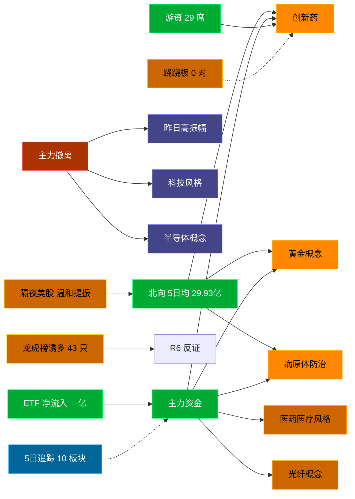

# 2026-08-21 · **资金面**

> **数据源新鲜度**: partial (数据截至 20260820)
> **降级状态**: False
> **置信度**: 0.81

## 一句话结论
北向近 5 日均 29.93 亿，主力集中「创新药/黄金概念/病原体防治」；资金撤离端 top1「昨日高振幅」，龙虎榜诱多 43 只。 隔夜半导体 +1.3%（温和提振）。🟡 新鲜度: partial

## 外部传导（隔夜美股）

**隔夜快照日期**: 20260820 · 影响等级: **温和提振**

- 半导体 6 股平均: **+1.26%**，趋势: up
- 科技 6 股平均: **-1.25%**
- 半导体最弱: INTC (-0.72%)
- 半导体最强: MRVL (+5.79%)

| 标的 | 涨跌幅 | 映射 A 股方向 |
|---|---|---|
| NVDA | ⚪ -0.33% | AI算力 / GPU / 光模块 |
| AMD | ⚪ +0.65% | CPU/GPU / 算力芯片 |
| AVGO | ⚪ +0.43% | AI芯片 / 光模块 / 设计 |
| MU | 🟢 +3.97% | 存储芯片 / 存储模组 |
| TSM | ⚪ +0.95% | 晶圆代工 / 先进封装 |
| INTC | ⚪ -0.72% | CPU / 芯片代工 |
| AAPL | 🔴 -1.75% | 消费电子 / 苹果链 |
| MSFT | ⚪ -0.65% | 云服务 / AI算力 |
| GOOGL | 🔴 -1.17% | 科技股 |

**A 股敏感方向**:
- 🟩 storage_chain: 提振
- ➖ cpo_optical: 中性
- ➖ ai_computing: 中性
- 🔻 consumer_electronics: 承压
- ➖ new_energy_vehicle: 中性

**对今日资金面的含义**: 隔夜半导体up，开盘阶段 A 股科技链受提振，资金或聚焦成长。

## 资金流转拓扑图

## 详细分析

**1) 北向时序**
最新交易日 20260820 净流入 28.62 亿；5 日均 29.93 亿，20 日均 31.15 亿。 近 5 日: 0814 27.4 → 0817 30.0 → 0818 30.8 → 0819 32.9 → 0820 28.6。 整体维持健康区间。

**2) 主力板块 (数据日=20260820)**
- 流入 TOP10：创新药 +62.6亿 / 黄金概念 +59.2亿 / 病原体防治 +51.7亿 / 医药医疗风格 +44.9亿 / 光纤概念 +36.6亿 / CRO +33.3亿 / 创新医疗服务 +31.6亿 / 病毒防治 +30.6亿 / 合成生物 +29.3亿 / CAR-T细胞疗法 +28.4亿
- 流出 TOP10：昨日高振幅 -114.2亿 / 科技风格 -112.4亿 / 半导体概念 -94.0亿 / MSCI中国 -89.8亿 / 大盘股 -87.9亿 / HS300_ -80.2亿 / 大盘成长 -72.0亿 / 深成500 -68.8亿 / 国产芯片 -63.7亿 / 电池技术 -63.6亿

**大资金意图**: 从流入端「创新药 / 黄金概念 / 病原体防治」的结构看，主力集中加仓强势主线，是结构性行情而非普涨；流出端集中在前期涨幅较大板块，资金再分配特征明显。
**为什么走强**: 创新药 昨日排名居首 + 超大单净流入居前，说明机构配置盘认可，不是纯短线游资推动。
**逻辑够不够硬**: 数据新鲜度 partial（距收盘约 16 小时），盘中若大级别政策/外围事件本判断失效；建议 D1 以「板块方向」而非「精准金额」使用，盘中验证第一小时量能。

**3) 昨日前十 5 日追踪 (核心)**
- **创新药**: 0814:-35.7 → 0817:+8.6 → 0818:-36.5 → 0819:-53.6 → 0820:+62.6 亿 | 累计 -54.6 亿 · 正流入 2/5 · **末日翻红·前段净出**
- **黄金概念**: 0814:-11.8 → 0817:+22.2 → 0818:-18.5 → 0819:-27.1 → 0820:+59.2 亿 | 累计 +24.0 亿 · 正流入 2/5 · **末日翻红·前段净出**
- **病原体防治**: 0814:-9.6 → 0817:+4.5 → 0818:-25.1 → 0819:-27.2 → 0820:+51.7 亿 | 累计 -5.8 亿 · 正流入 2/5 · **末日翻红·前段净出**
- **医药医疗风格**: 0814:-32.5 → 0817:-0.7 → 0818:-21.9 → 0819:-45.3 → 0820:+44.9 亿 | 累计 -55.6 亿 · 正流入 1/5 · **末日翻红·前段净出**
- **光纤概念**: 0814:+69.7 → 0817:+65.2 → 0818:-76.6 → 0819:-220.8 → 0820:+36.6 亿 | 累计 -126.0 亿 · 正流入 3/5 · **净出收窄·转暖**
- **CRO**: 0814:-14.8 → 0817:+9.8 → 0818:-7.8 → 0819:-33.1 → 0820:+33.3 亿 | 累计 -12.5 亿 · 正流入 2/5 · **末日翻红·前段净出**
- **创新医疗服务**: 0814:-16.6 → 0817:+7.8 → 0818:-14.0 → 0819:-41.3 → 0820:+31.6 亿 | 累计 -32.4 亿 · 正流入 2/5 · **末日翻红·前段净出**
- **病毒防治**: 0814:-4.6 → 0817:-2.3 → 0818:-9.2 → 0819:-12.1 → 0820:+30.6 亿 | 累计 +2.3 亿 · 正流入 1/5 · **末日翻红·前段净出**
- **合成生物**: 0814:-10.9 → 0817:-0.8 → 0818:-0.1 → 0819:-34.4 → 0820:+29.3 亿 | 累计 -17.0 亿 · 正流入 1/5 · **末日翻红·前段净出**
- **CAR-T细胞疗法**: 0814:-3.3 → 0817:+8.7 → 0818:+1.2 → 0819:-15.6 → 0820:+28.4 亿 | 累计 +19.4 亿 · 正流入 3/5 · **偏强净入·有波动**

**4) 游资 (龙虎榜 · 20260820)**
具名活跃席位 29 席，3 日协同信号 0 条。TOP 5:
- 量化基金: 净额 9.1 万，覆盖 0 票
- 量化打板: 净额 2.9 万，覆盖 0 票
- 紫阳东路: 净额 2.1 万，覆盖 0 票
- 上海超短帮: 净额 2.0 万，覆盖 0 票
- 玉兰路: 净额 1.6 万，覆盖 0 票

**5) 龙虎榜诱多识别 (核心)**
当日总计 71 只上榜，命中诱多规则 **43 只**。前 10：

| 代码 | 名称 | 涨幅 | 换手 | 龙虎榜净额(万) | 机构净额(万) | 模式 | 上榜原因 |
|---|---|---|---|---|---|---|---|
| 002581.SZ | *ST未名 | +10.00% | 7.0% | -2147 | -50 | 涨停净卖出 + 疑似对倒:联储证券股份有限公司… | 连续三个交易日内，涨幅偏离值累计达到20%的证券 |
| 000703.SZ | 恒逸石化 | +5.35% | 4.6% | -23742 | -62280 | 机构专用净卖 | 连续三个交易日内，涨幅偏离值累计达到20%的证券 |
| 300765.SZ | 石药创新 | +20.00% | 4.6% | +3837 | -35438 | 机构专用净卖 | 日涨幅达到15%的前5只证券 |
| 300404.SZ | 博济医药 | +2.54% | 31.8% | -5967 | -13268 | 换手异常且净卖出 + 机构专用净卖 | 日换手率达到30%的前5只证券 |
| 300246.SZ | 宝莱特 | -15.45% | 16.7% | -5365 | -10508 | 机构专用净卖 | 日跌幅达到15%的前5只证券 |
| 002365.SZ | 永安药业 | +9.98% | 29.8% | +4958 | -7192 | 机构专用净卖 | 日换手率达到20%的前5只证券 |
| 600613.SH | 神奇制药 | +10.03% | 12.6% | +13402 | -3852 | 机构专用净卖 + 疑似对倒:广发证券股份有限公司… | 有价格涨跌幅限制的日收盘价格涨幅偏离值达到7%的前五只证券 |
| 001277.SZ | 速达股份 | +10.01% | 13.6% | +48 | -3458 | 机构专用净卖 + 疑似对倒:华鑫证券有限责任公司… | 连续三个交易日内，涨幅偏离值累计达到20%的证券 |
| 002900.SZ | 哈三联 | -2.11% | 40.1% | -12117 | -2836 | 换手异常且净卖出 + 机构专用净卖 | 日换手率达到20%的前5只证券 |
| 002248.SZ | 华东数控 | -10.00% | 20.7% | -4370 | -2768 | 机构专用净卖 + 疑似对倒:国信证券股份有限公司… | 日跌幅偏离值达到7%的前5只证券 |

**6) 板块跷跷板**
_未检出显著跷跷板配对（沿用昨日数据或降级状态）。_

**7) ETF / 期货 / 期权**
ETF 净流入 — 亿(代表ETF)；期权隐含波动率: 数据缺。

## 关键证据
- 主力流入 top1 创新药 +62.6 亿 · 来源 tushare.moneyflow_ind_dc
- 5 日追踪：创新药 累计 -54.64 亿, 2/5 日正流入, 趋势「末日翻红·前段净出」
- 流出 top1 昨日高振幅 -114.2 亿 · 来源 tushare.moneyflow_ind_dc
- 龙虎榜诱多 43 只，其中「涨停净卖出」1 只 · 来源 tushare.top_list+top_inst
- 游资 3 日协同 0 条 · 来源 tushare.hm_detail 融合
- 北向最新 28.62 亿（20260820） · 来源 tushare.moneyflow_hsgt
- 隔夜美股半导体平均 +1.26%（20260820）· 来源 tushare.us_daily

## 数据源审计
| 源 | 状态 | 抓取日期 | 记录数 | 备注 |
|---|---|---|---|---|
| tushare.moneyflow_hsgt | 🟢 ok | 20260820 | 20 日 | 北向时序 |
| tushare.moneyflow_ind_dc | 🟢 ok | 20260820 | 5 日 × ~1000 行 | 概念板块资金流 5 日追踪 |
| tushare.top_list | 🟢 ok | 20260820 | 71 行 | 龙虎榜上榜个股 |
| tushare.top_inst | 🟢 ok | 20260820 | 780 席位 | 龙虎榜买卖席位明细 |
| tushare.us_daily | 🟢 ok | 20260820 | 14 | 隔夜美股核心 14 股 |
| tushare.index_global | 🟢 error | 20260820 | 0 | 美股指数 |
| vibe-trading | 🟢 ok | 20260820 | — | 已交叉验证 |

## 不确定性 / 反证
- 数据新鲜度 partial（距收盘约 16 小时），非当日实时；盘中若大级别政策/外围事件本判断失效。
- 龙虎榜诱多规则为静态启发式，未剔除 T+1 高开对冲情形，可能高估诱多密度；供 R6 反证参考，不作 hard_reject。
- Tushare hm_detail 存在 T+1 延迟；xtick/datapro 可作实时补充但盘前抓取以 Tushare 为主。
- 5 日追踪只跟踪昨日 top10，若今日风格切换到昨日 top20+ 板块，本追踪盲区。
- ETF 净流入基于代表 ETF 估算，非真实一级市场资金流水。

## 与其他 R/D/E 的关系
- 依赖: data/research/20260820/R7_capital_flow.json (框架复用)；Tushare MCP (moneyflow_hsgt/moneyflow_ind_dc/top_list/top_inst/us_daily)
- 被消费: D1(main_decision_v1) · R2(analyze_main_sectors_v1) · R5(analyze_stock_profile_v1) · R6(analyze_devil_advocate_v1)

## Sub-Agent 元数据
- skill: analyze_capital_flow_v1
- artifact: /Users/chenyang/Downloads/demo/沧海巨浪/data/research/20260821/R7_capital_flow.json
- 生成方式: enrich_r7_20260821.py (复用 20260820 数据框架 + 刷新北向/主力/5日追踪/龙虎榜诱多/隔夜美股 + mermaid)
- model: doubao-seed-2-0-code-preview
- 生成耗时: 25.1 秒
