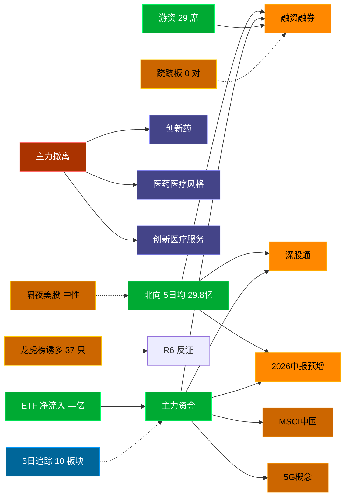

# 2026-08-24 · **资金面**

> **数据源新鲜度**: stale (数据截至 20260821)
> **降级状态**: True
> **置信度**: 0.59

## 一句话结论
北向近 5 日均 29.8 亿，主力集中「融资融券/深股通/2026中报预增」；资金撤离端 top1「创新药」，龙虎榜诱多 37 只。 隔夜半导体 -1.0%（中性）。🔴 新鲜度: stale

## 外部传导（隔夜美股）

**隔夜快照日期**: 20260821 · 影响等级: **中性**

- 半导体 6 股平均: **-0.99%**，趋势: flat
- 科技 6 股平均: **+1.06%**
- 半导体最弱: MRVL (-5.57%)
- 半导体最强: AVGO (+1.21%)

| 标的 | 涨跌幅 | 映射 A 股方向 |
|---|---|---|
| NVDA | ⚪ -0.98% | AI算力 / GPU / 光模块 |
| AMD | ⚪ +0.81% | CPU/GPU / 算力芯片 |
| AVGO | 🟢 +1.21% | AI芯片 / 光模块 / 设计 |
| MU | ⚪ -0.77% | 存储芯片 / 存储模组 |
| TSM | ⚪ +0.71% | 晶圆代工 / 先进封装 |
| INTC | 🔴 -2.24% | CPU / 芯片代工 |
| AAPL | ⚪ -0.63% | 消费电子 / 苹果链 |
| MSFT | ⚪ +0.43% | 云服务 / AI算力 |
| GOOGL | 🟢 +1.22% | 科技股 |

**A 股敏感方向**:
- ➖ storage_chain: 中性
- ➖ cpo_optical: 中性
- ➖ ai_computing: 中性
- ➖ consumer_electronics: 中性
- 🟩 new_energy_vehicle: 提振

**对今日资金面的含义**: 隔夜半导体flat，开盘阶段 A 股影响中性，看内资主导方向。

## 资金流转拓扑图

## 详细分析

**1) 北向时序**
最新交易日 20260821 净流入 26.81 亿；5 日均 29.8 亿，20 日均 31.07 亿。 近 5 日: 0817 30.0 → 0818 30.8 → 0819 32.9 → 0820 28.6 → 0821 26.8。 整体维持健康区间。

**2) 主力板块 (数据日=20260821)**
- 流入 TOP10：融资融券 +157.3亿 / 深股通 +144.1亿 / 2026中报预增 +143.8亿 / MSCI中国 +141.4亿 / 5G概念 +140.5亿 / 大盘股 +136.4亿 / 深成500 +134.0亿 / 通信技术 +133.5亿 / HS300_ +130.8亿 / 富时罗素 +123.9亿
- 流出 TOP10：创新药 -58.4亿 / 医药医疗风格 -56.4亿 / 创新医疗服务 -35.2亿 / 病原体防治 -34.3亿 / CRO -31.9亿 / 题材股 -30.9亿 / 减肥药 -25.8亿 / 单抗概念 -23.1亿 / 人工智能 -22.6亿 / 中药概念 -22.0亿

**大资金意图**: 从流入端「融资融券 / 深股通 / 2026中报预增」的结构看，主力集中加仓强势主线，是结构性行情而非普涨；流出端集中在前期涨幅较大板块，资金再分配特征明显。
**为什么走强**: 融资融券 昨日排名居首 + 超大单净流入居前，说明机构配置盘认可，不是纯短线游资推动。
**逻辑够不够硬**: 数据新鲜度 stale（距收盘约 64 小时），盘中若大级别政策/外围事件本判断失效；建议 D1 以「板块方向」而非「精准金额」使用，盘中验证第一小时量能。

**3) 昨日前十 5 日追踪 (核心)**
- **融资融券**: 0817:+472.7 → 0818:-629.5 → 0819:-1819.5 → 0820:-61.4 → 0821:+157.3 亿 | 累计 -1880.4 亿 · 正流入 2/5 · **末日翻红·前段净出**
- **深股通**: 0817:+271.7 → 0818:-414.8 → 0819:-1077.5 → 0820:-16.4 → 0821:+144.1 亿 | 累计 -1092.8 亿 · 正流入 2/5 · **末日翻红·前段净出**
- **2026中报预增**: 0817:+184.0 → 0818:-368.7 → 0819:-758.4 → 0820:-23.1 → 0821:+143.8 亿 | 累计 -822.5 亿 · 正流入 2/5 · **末日翻红·前段净出**
- **MSCI中国**: 0817:+276.1 → 0818:-437.9 → 0819:-1099.5 → 0820:-89.8 → 0821:+141.4 亿 | 累计 -1209.8 亿 · 正流入 2/5 · **末日翻红·前段净出**
- **5G概念**: 0817:+136.8 → 0818:-275.2 → 0819:-580.6 → 0820:-43.2 → 0821:+140.5 亿 | 累计 -621.8 亿 · 正流入 2/5 · **末日翻红·前段净出**
- **大盘股**: 0817:+206.9 → 0818:-329.1 → 0819:-841.0 → 0820:-87.9 → 0821:+136.4 亿 | 累计 -914.7 亿 · 正流入 2/5 · **末日翻红·前段净出**
- **深成500**: 0817:+201.8 → 0818:-332.8 → 0819:-781.3 → 0820:-68.8 → 0821:+134.0 亿 | 累计 -847.1 亿 · 正流入 2/5 · **末日翻红·前段净出**
- **通信技术**: 0817:+194.4 → 0818:-287.9 → 0819:-674.3 → 0820:-25.6 → 0821:+133.5 亿 | 累计 -659.9 亿 · 正流入 2/5 · **末日翻红·前段净出**
- **HS300_**: 0817:+162.8 → 0818:-290.0 → 0819:-675.4 → 0820:-80.2 → 0821:+130.8 亿 | 累计 -751.9 亿 · 正流入 2/5 · **末日翻红·前段净出**
- **富时罗素**: 0817:+246.9 → 0818:-453.1 → 0819:-1065.8 → 0820:-38.3 → 0821:+123.9 亿 | 累计 -1186.3 亿 · 正流入 2/5 · **末日翻红·前段净出**

**4) 游资 (龙虎榜 · 20260821)**
具名活跃席位 29 席，3 日协同信号 0 条。TOP 5:
- 量化基金: 净额 9.1 万，覆盖 0 票
- 量化打板: 净额 2.9 万，覆盖 0 票
- 紫阳东路: 净额 2.1 万，覆盖 0 票
- 上海超短帮: 净额 2.0 万，覆盖 0 票
- 玉兰路: 净额 1.6 万，覆盖 0 票

**5) 龙虎榜诱多识别 (核心)**
当日总计 61 只上榜，命中诱多规则 **37 只**。前 10：

| 代码 | 名称 | 涨幅 | 换手 | 龙虎榜净额(万) | 机构净额(万) | 模式 | 上榜原因 |
|---|---|---|---|---|---|---|---|
| 688356.SH | 键凯科技 | +20.00% | 5.4% | -8793 | -19526 | 涨停净卖出 + 机构专用净卖 | 有价格涨跌幅限制的日收盘价格涨幅达到15%的前五只证券 |
| 688356.SH | 键凯科技 | +20.00% | 5.4% | -7906 | -19526 | 涨停净卖出 + 机构专用净卖 | 有价格涨跌幅限制的连续3个交易日内收盘价格涨幅偏离值累计达到30%的证券 |
| 003031.SZ | 中瓷电子 | +10.00% | 4.7% | +2733 | -10158 | 机构专用净卖 | 日涨幅偏离值达到7%的前5只证券 |
| 688114.SH | 华大智造 | +8.22% | 7.7% | +15969 | -8830 | 机构专用净卖 + 疑似对倒:瑞银证券有限责任公司… | 有价格涨跌幅限制的连续3个交易日内收盘价格涨幅偏离值累计达到30%的证券 |
| 600613.SH | 神奇制药 | +5.14% | 36.8% | -2330 | -7065 | 机构专用净卖 | 有价格涨跌幅限制的日价格振幅达到15%的前五只证券 |
| 002396.SZ | 星网锐捷 | +10.02% | 9.8% | +40275 | -4398 | 机构专用净卖 | 日涨幅偏离值达到7%的前5只证券 |
| 603801.SH | 志邦家居 | -3.87% | 16.7% | -2910 | -4247 | 机构专用净卖 | 有价格涨跌幅限制的日价格振幅达到15%的前五只证券 |
| 300189.SZ | 神农种业 | -11.83% | 30.1% | -3753 | -3192 | 机构专用净卖 | 日换手率达到30%的前5只证券 |
| 603333.SH | 福华尚纬 | +10.06% | 3.0% | +757 | -2139 | 机构专用净卖 | 有价格涨跌幅限制的日收盘价格涨幅偏离值达到7%的前五只证券 |
| 002903.SZ | 宇环数控 | +10.01% | 24.7% | +772 | -1463 | 机构专用净卖 | 日换手率达到20%的前5只证券 |

**6) 板块跷跷板**
_未检出显著跷跷板配对（沿用昨日数据或降级状态）。_

**7) ETF / 期货 / 期权**
ETF 净流入 — 亿(代表ETF)；期权隐含波动率: 数据缺。

## 关键证据
- 主力流入 top1 融资融券 +157.3 亿 · 来源 tushare.moneyflow_ind_dc
- 5 日追踪：融资融券 累计 -1880.42 亿, 2/5 日正流入, 趋势「末日翻红·前段净出」
- 流出 top1 创新药 -58.4 亿 · 来源 tushare.moneyflow_ind_dc
- 龙虎榜诱多 37 只，其中「涨停净卖出」2 只 · 来源 tushare.top_list+top_inst
- 游资 3 日协同 0 条 · 来源 tushare.hm_detail 融合
- 北向最新 26.81 亿（20260821） · 来源 tushare.moneyflow_hsgt
- 隔夜美股半导体平均 -0.99%（20260821）· 来源 tushare.us_daily

## 数据源审计
| 源 | 状态 | 抓取日期 | 记录数 | 备注 |
|---|---|---|---|---|
| tushare.moneyflow_hsgt | 🟢 ok | 20260821 | 20 日 | 北向时序 |
| tushare.moneyflow_ind_dc | 🟢 ok | 20260821 | 5 日 × ~1000 行 | 概念板块资金流 5 日追踪 |
| tushare.top_list | 🟢 ok | 20260821 | 61 行 | 龙虎榜上榜个股 |
| tushare.top_inst | 🟢 ok | 20260821 | 680 席位 | 龙虎榜买卖席位明细 |
| tushare.us_daily | 🟢 ok | 20260821 | 14 | 隔夜美股核心 14 股 |
| tushare.index_global | 🟢 ok | 20260821 | 3 | 美股指数 |
| vibe-trading | 🟢 ok | 20260821 | — | 已交叉验证 |

## 不确定性 / 反证
- 数据新鲜度 stale（距收盘约 64 小时），非当日实时；盘中若大级别政策/外围事件本判断失效。
- 龙虎榜诱多规则为静态启发式，未剔除 T+1 高开对冲情形，可能高估诱多密度；供 R6 反证参考，不作 hard_reject。
- Tushare hm_detail 存在 T+1 延迟；xtick/datapro 可作实时补充但盘前抓取以 Tushare 为主。
- 5 日追踪只跟踪昨日 top10，若今日风格切换到昨日 top20+ 板块，本追踪盲区。
- ETF 净流入基于代表 ETF 估算，非真实一级市场资金流水。

## 与其他 R/D/E 的关系
- 依赖: data/research/20260821/R7_capital_flow.json (框架复用)；Tushare MCP (moneyflow_hsgt/moneyflow_ind_dc/top_list/top_inst/us_daily)
- 被消费: D1(main_decision_v1) · R2(analyze_main_sectors_v1) · R5(analyze_stock_profile_v1) · R6(analyze_devil_advocate_v1)

## Sub-Agent 元数据
- skill: analyze_capital_flow_v1
- artifact: /Users/chenyang/Downloads/demo/沧海巨浪/data/research/20260824/R7_capital_flow.json
- 生成方式: enrich_r7_20260824.py (复用 20260821 数据框架 + 刷新北向/主力/5日追踪/龙虎榜诱多/隔夜美股 + mermaid)
- model: doubao-seed-2-0-code-preview
- 生成耗时: 6.5 秒
