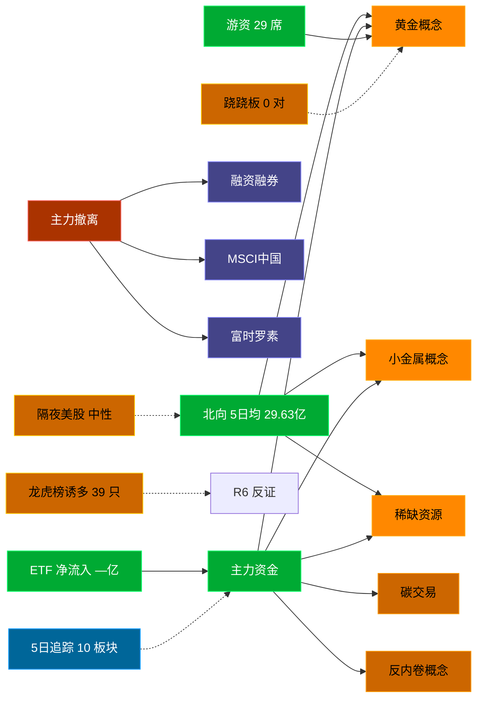

# 2026-08-25 · **资金面**

> **数据源新鲜度**: partial (数据截至 20260824)
> **降级状态**: False
> **置信度**: 0.81

## 一句话结论
北向近 5 日均 29.63 亿，主力集中「黄金概念/小金属概念/稀缺资源」；资金撤离端 top1「融资融券」，龙虎榜诱多 39 只。 隔夜半导体 -1.0%（中性）。🟡 新鲜度: partial

## 外部传导（隔夜美股）

**隔夜快照日期**: 20260821 · 影响等级: **中性**

- 半导体 6 股平均: **-0.99%**，趋势: flat
- 科技 6 股平均: **+1.06%**
- 半导体最弱: MRVL (-5.57%)
- 半导体最强: AVGO (+1.21%)

| 标的 | 涨跌幅 | 映射 A 股方向 |
|---|---|---|
| NVDA | ⚪ -0.98% | AI算力 / GPU / 光模块 |
| AMD | ⚪ +0.81% | CPU/GPU / 算力芯片 |
| AVGO | 🟢 +1.21% | AI芯片 / 光模块 / 设计 |
| MU | ⚪ -0.77% | 存储芯片 / 存储模组 |
| TSM | ⚪ +0.71% | 晶圆代工 / 先进封装 |
| INTC | 🔴 -2.24% | CPU / 芯片代工 |
| AAPL | ⚪ -0.63% | 消费电子 / 苹果链 |
| MSFT | ⚪ +0.43% | 云服务 / AI算力 |
| GOOGL | 🟢 +1.22% | 科技股 |

**A 股敏感方向**:
- ➖ storage_chain: 中性
- ➖ cpo_optical: 中性
- ➖ ai_computing: 中性
- ➖ consumer_electronics: 中性
- 🟩 new_energy_vehicle: 提振

**对今日资金面的含义**: 隔夜半导体flat，开盘阶段 A 股影响中性，看内资主导方向。

## 资金流转拓扑图

## 详细分析

**1) 北向时序**
最新交易日 20260824 净流入 29.1 亿；5 日均 29.63 亿，20 日均 31.14 亿。 近 5 日: 0818 30.8 → 0819 32.9 → 0820 28.6 → 0821 26.8 → 0824 29.1。 整体维持健康区间。

**2) 主力板块 (数据日=20260824)**
- 流入 TOP10：黄金概念 +13.6亿 / 小金属概念 +13.0亿 / 稀缺资源 +10.0亿 / 碳交易 +7.0亿 / 反内卷概念 +6.9亿 / 土地流转 +6.3亿 / 红利破净股 +6.1亿 / 红利股 +5.8亿 / 低市净率 +4.9亿 / 化债(AMC)概念 +4.0亿
- 流出 TOP10：融资融券 -773.0亿 / MSCI中国 -551.9亿 / 富时罗素 -512.0亿 / 大盘股 -444.3亿 / 深股通 -435.6亿 / 百元股 -405.9亿 / 科技风格 -404.2亿 / HS300_ -387.5亿 / 深成500 -378.4亿 / 通信技术 -339.4亿

**大资金意图**: 从流入端「黄金概念 / 小金属概念 / 稀缺资源」的结构看，主力集中加仓强势主线，是结构性行情而非普涨；流出端集中在前期涨幅较大板块，资金再分配特征明显。
**为什么走强**: 黄金概念 昨日排名居首 + 超大单净流入居前，说明机构配置盘认可，不是纯短线游资推动。
**逻辑够不够硬**: 数据新鲜度 partial（距收盘约 16 小时），盘中若大级别政策/外围事件本判断失效；建议 D1 以「板块方向」而非「精准金额」使用，盘中验证第一小时量能。

**3) 昨日前十 5 日追踪 (核心)**
- **黄金概念**: 0818:-18.5 → 0819:-27.1 → 0820:+59.2 → 0821:+67.8 → 0824:+13.6 亿 | 累计 +95.0 亿 · 正流入 3/5 · **偏强净入·有波动**
- **小金属概念**: 0818:-56.4 → 0819:-103.2 → 0820:+19.0 → 0821:+65.3 → 0824:+13.0 亿 | 累计 -62.3 亿 · 正流入 3/5 · **净出收窄·转暖**
- **稀缺资源**: 0818:-29.8 → 0819:-48.5 → 0820:+22.6 → 0821:+41.5 → 0824:+10.0 亿 | 累计 -4.1 亿 · 正流入 3/5 · **净出收窄·转暖**
- **碳交易**: 0818:-14.6 → 0819:-22.5 → 0820:-6.0 → 0821:+1.3 → 0824:+7.0 亿 | 累计 -34.8 亿 · 正流入 2/5 · **末日翻红·前段净出**
- **反内卷概念**: 0818:-11.0 → 0819:-27.2 → 0820:-7.9 → 0821:+22.1 → 0824:+6.9 亿 | 累计 -17.2 亿 · 正流入 2/5 · **末日翻红·前段净出**
- **土地流转**: 0818:+12.9 → 0819:-5.8 → 0820:+4.8 → 0821:-3.9 → 0824:+6.3 亿 | 累计 +14.3 亿 · 正流入 3/5 · **偏强净入·有波动**
- **红利破净股**: 0818:+8.7 → 0819:-1.5 → 0820:+0.8 → 0821:-12.2 → 0824:+6.1 亿 | 累计 +1.9 亿 · 正流入 3/5 · **偏强净入·有波动**
- **红利股**: 0818:+9.6 → 0819:-0.9 → 0820:-4.5 → 0821:-11.4 → 0824:+5.8 亿 | 累计 -1.4 亿 · 正流入 2/5 · **末日翻红·前段净出**
- **低市净率**: 0818:+1.6 → 0819:-9.9 → 0820:+6.1 → 0821:-16.2 → 0824:+4.9 亿 | 累计 -13.5 亿 · 正流入 3/5 · **净出收窄·转暖**
- **化债(AMC)概念**: 0818:-3.3 → 0819:-10.5 → 0820:+6.9 → 0821:+3.7 → 0824:+4.0 亿 | 累计 +0.8 亿 · 正流入 3/5 · **偏强净入·有波动**

**4) 游资 (龙虎榜 · 20260824)**
具名活跃席位 29 席，3 日协同信号 0 条。TOP 5:
- 量化基金: 净额 9.1 万，覆盖 0 票
- 量化打板: 净额 2.9 万，覆盖 0 票
- 紫阳东路: 净额 2.1 万，覆盖 0 票
- 上海超短帮: 净额 2.0 万，覆盖 0 票
- 玉兰路: 净额 1.6 万，覆盖 0 票

**5) 龙虎榜诱多识别 (核心)**
当日总计 64 只上榜，命中诱多规则 **39 只**。前 10：

| 代码 | 名称 | 涨幅 | 换手 | 龙虎榜净额(万) | 机构净额(万) | 模式 | 上榜原因 |
|---|---|---|---|---|---|---|---|
| 002716.SZ | 湖南白银 | +9.98% | 25.3% | -19752 | -40710 | 涨停净卖出 + 机构专用净卖 | 日涨幅偏离值达到7%的前5只证券 |
| 600785.SH | 新华百货 | +9.96% | 5.0% | -886 | -664 | 涨停净卖出 + 疑似对倒:东亚前海证券有限责任… | 非S证券连续三个交易日内收盘价格涨幅偏离值累计达到20%的证券 |
| 603958.SH | 哈森股份 | +10.02% | 19.9% | -5715 | +0 | 涨停净卖出 + 疑似对倒:东莞证券股份有限公司… | 有价格涨跌幅限制的日收盘价格涨幅偏离值达到7%的前五只证券 |
| 002716.SZ | 湖南白银 | +9.98% | 25.3% | +9625 | -40710 | 机构专用净卖 | 连续三个交易日内，涨幅偏离值累计达到20%的证券 |
| 000603.SZ | 盛达资源 | +8.88% | 18.7% | -21059 | -39207 | 拉高净卖出 + 机构专用净卖 + 疑似对倒:平安证券股份有限公司… | 连续三个交易日内，涨幅偏离值累计达到20%的证券 |
| 002437.SZ | 誉衡药业 | -9.43% | 27.0% | -8120 | -12850 | 机构专用净卖 | 日换手率达到20%的前5只证券 |
| 300139.SZ | 晓程科技 | +8.66% | 34.4% | -10728 | -11934 | 拉高净卖出 + 机构专用净卖 | 日换手率达到30%的前5只证券 |
| 300189.SZ | 神农种业 | +4.47% | 32.5% | -9980 | -8765 | 换手异常且净卖出 + 机构专用净卖 | 日换手率达到30%的前5只证券 |
| 688356.SH | 键凯科技 | +15.52% | 25.0% | +14929 | -8713 | 机构专用净卖 | 有价格涨跌幅限制的日收盘价格涨幅达到15%的前五只证券 |
| 000534.SZ | 万泽股份 | -9.99% | 3.3% | -9211 | -8099 | 机构专用净卖 | 日跌幅偏离值达到7%的前5只证券 |

**6) 板块跷跷板**
_未检出显著跷跷板配对（沿用昨日数据或降级状态）。_

**7) ETF / 期货 / 期权**
ETF 净流入 — 亿(代表ETF)；期权隐含波动率: 数据缺。

## 关键证据
- 主力流入 top1 黄金概念 +13.6 亿 · 来源 tushare.moneyflow_ind_dc
- 5 日追踪：黄金概念 累计 95.04 亿, 3/5 日正流入, 趋势「偏强净入·有波动」
- 流出 top1 融资融券 -773.0 亿 · 来源 tushare.moneyflow_ind_dc
- 龙虎榜诱多 39 只，其中「涨停净卖出」3 只 · 来源 tushare.top_list+top_inst
- 游资 3 日协同 0 条 · 来源 tushare.hm_detail 融合
- 北向最新 29.1 亿（20260824） · 来源 tushare.moneyflow_hsgt
- 隔夜美股半导体平均 -0.99%（20260821）· 来源 tushare.us_daily

## 数据源审计
| 源 | 状态 | 抓取日期 | 记录数 | 备注 |
|---|---|---|---|---|
| tushare.moneyflow_hsgt | 🟢 ok | 20260824 | 20 日 | 北向时序 |
| tushare.moneyflow_ind_dc | 🟢 ok | 20260824 | 5 日 × ~1000 行 | 概念板块资金流 5 日追踪 |
| tushare.top_list | 🟢 ok | 20260824 | 64 行 | 龙虎榜上榜个股 |
| tushare.top_inst | 🟢 ok | 20260824 | 670 席位 | 龙虎榜买卖席位明细 |
| tushare.us_daily | 🟢 ok | 20260821 | 14 | 隔夜美股核心 14 股 |
| tushare.index_global | 🟢 ok | 20260821 | 3 | 美股指数 |
| vibe-trading | 🟢 ok | 20260824 | — | 已交叉验证 |

## 不确定性 / 反证
- 数据新鲜度 partial（距收盘约 16 小时），非当日实时；盘中若大级别政策/外围事件本判断失效。
- 龙虎榜诱多规则为静态启发式，未剔除 T+1 高开对冲情形，可能高估诱多密度；供 R6 反证参考，不作 hard_reject。
- Tushare hm_detail 存在 T+1 延迟；xtick/datapro 可作实时补充但盘前抓取以 Tushare 为主。
- 5 日追踪只跟踪昨日 top10，若今日风格切换到昨日 top20+ 板块，本追踪盲区。
- ETF 净流入基于代表 ETF 估算，非真实一级市场资金流水。

## 与其他 R/D/E 的关系
- 依赖: data/research/20260824/R7_capital_flow.json (框架复用)；Tushare MCP (moneyflow_hsgt/moneyflow_ind_dc/top_list/top_inst/us_daily)
- 被消费: D1(main_decision_v1) · R2(analyze_main_sectors_v1) · R5(analyze_stock_profile_v1) · R6(analyze_devil_advocate_v1)

## Sub-Agent 元数据
- skill: analyze_capital_flow_v1
- artifact: /Users/chenyang/Downloads/demo/沧海巨浪/data/research/20260825/R7_capital_flow.json
- 生成方式: enrich_r7_20260825.py (复用 20260824 数据框架 + 刷新北向/主力/5日追踪/龙虎榜诱多/隔夜美股 + mermaid)
- model: doubao-seed-2-0-code-preview
- 生成耗时: 4.1 秒
