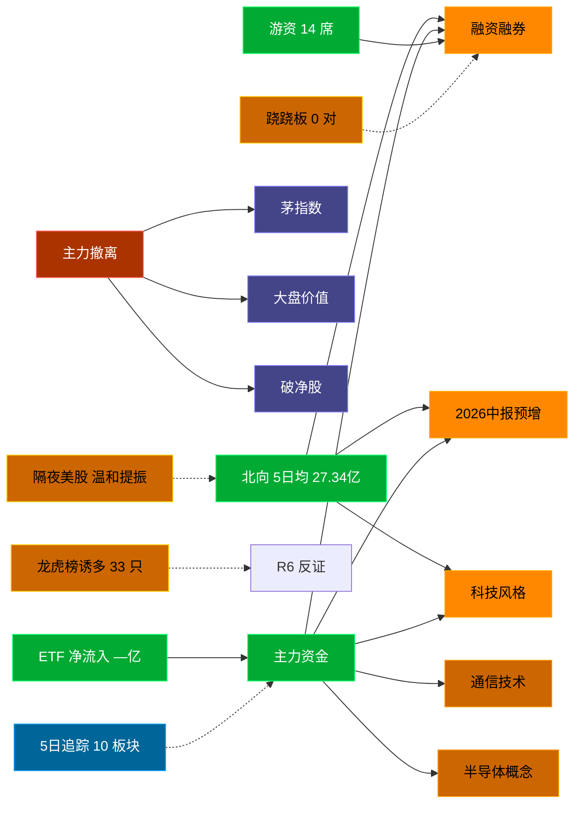

# 2026-08-28 · **资金面**

> **数据源新鲜度**: partial (数据截至 20260827)
> **降级状态**: False
> **置信度**: 0.73

## 一句话结论
北向近 5 日均 27.34 亿，主力集中「融资融券/2026中报预增/科技风格」；资金撤离端 top1「茅指数」，龙虎榜诱多 33 只。 隔夜半导体 +2.4%（温和提振）。🟡 新鲜度: partial

## 外部传导（隔夜美股）

**隔夜快照日期**: 20260826 · 影响等级: **温和提振**

- 半导体 6 股平均: **+2.39%**，趋势: up
- 科技 6 股平均: **-0.02%**
- 半导体最弱: AVGO (-0.32%)
- 半导体最强: AMD (+4.91%)

| 标的 | 涨跌幅 | 映射 A 股方向 |
|---|---|---|
| NVDA | 🟢 +2.19% | AI算力 / GPU / 光模块 |
| AMD | 🟢 +4.91% | CPU/GPU / 算力芯片 |
| AVGO | ⚪ -0.32% | AI芯片 / 光模块 / 设计 |
| MU | 🟢 +2.48% | 存储芯片 / 存储模组 |
| INTC | ⚪ +0.25% | CPU / 芯片代工 |
| MRVL | 🟢 +4.84% | 数据中心芯片 / 光通信 |
| AAPL | ⚪ -0.14% | 消费电子 / 苹果链 |
| MSFT | ⚪ +0.90% | 云服务 / AI算力 |
| GOOGL | ⚪ -0.32% | 科技股 |

**A 股敏感方向**:
- 🟩 storage_chain: 提振
- ➖ cpo_optical: 中性
- 🟩 ai_computing: 提振
- ➖ consumer_electronics: 中性
- ➖ new_energy_vehicle: 中性

**对今日资金面的含义**: 隔夜半导体up，开盘阶段 A 股科技链受提振，资金或聚焦成长。

## 资金流转拓扑图

## 详细分析

**1) 北向时序**
最新交易日 20260827 净流入 28.49 亿；5 日均 27.34 亿，20 日均 30.25 亿。 近 5 日: 0821 26.8 → 0824 29.1 → 0825 26.7 → 0826 25.6 → 0827 28.5。 整体维持健康区间。

**2) 主力板块 (数据日=20260827)**
- 流入 TOP10：融资融券 +510.9亿 / 2026中报预增 +360.6亿 / 科技风格 +346.9亿 / 通信技术 +319.9亿 / 半导体概念 +309.8亿 / 深股通 +290.1亿 / MSCI中国 +289.7亿 / 5G概念 +287.7亿 / 百元股 +267.4亿 / 国产芯片 +263.2亿
- 流出 TOP10：茅指数 -38.5亿 / 大盘价值 -30.3亿 / 破净股 -30.0亿 / 蚂蚁金服概念 -26.2亿 / 宁组合 -26.0亿 / 锂矿概念 -23.4亿 / 黄金概念 -23.3亿 / 动力电池回收 -21.9亿 / 绿色电力 -18.2亿 / 跨境支付 -17.3亿

**大资金意图**: 从流入端「融资融券 / 2026中报预增 / 科技风格」的结构看，主力集中加仓强势主线，是结构性行情而非普涨；流出端集中在前期涨幅较大板块，资金再分配特征明显。
**为什么走强**: 融资融券 昨日排名居首 + 超大单净流入居前，说明机构配置盘认可，不是纯短线游资推动。
**逻辑够不够硬**: 数据新鲜度 partial（距收盘约 16 小时），盘中若大级别政策/外围事件本判断失效；建议 D1 以「板块方向」而非「精准金额」使用，盘中验证第一小时量能。

**3) 昨日前十 5 日追踪 (核心)**
- **融资融券**: 0821:+157.3 → 0824:-773.0 → 0825:+47.6 → 0826:+92.5 → 0827:+510.9 亿 | 累计 +35.4 亿 · 正流入 4/5 · **加速流入**
- **2026中报预增**: 0821:+143.8 → 0824:-326.4 → 0825:+42.1 → 0826:+95.5 → 0827:+360.6 亿 | 累计 +315.5 亿 · 正流入 4/5 · **加速流入**
- **科技风格**: 0821:+111.2 → 0824:-404.2 → 0825:+15.2 → 0826:+22.0 → 0827:+346.9 亿 | 累计 +91.1 亿 · 正流入 4/5 · **加速流入**
- **通信技术**: 0821:+133.5 → 0824:-339.4 → 0825:+50.6 → 0826:+1.7 → 0827:+319.9 亿 | 累计 +166.3 亿 · 正流入 4/5 · **加速流入**
- **半导体概念**: 0821:+15.0 → 0824:-276.3 → 0825:+16.2 → 0826:-2.3 → 0827:+309.8 亿 | 累计 +62.4 亿 · 正流入 3/5 · **偏强净入·有波动**
- **深股通**: 0821:+144.1 → 0824:-435.6 → 0825:+12.1 → 0826:+29.1 → 0827:+290.1 亿 | 累计 +39.7 亿 · 正流入 4/5 · **加速流入**
- **MSCI中国**: 0821:+141.4 → 0824:-551.9 → 0825:-16.8 → 0826:+91.8 → 0827:+289.7 亿 | 累计 -45.9 亿 · 正流入 3/5 · **净出收窄·转暖**
- **5G概念**: 0821:+140.5 → 0824:-297.3 → 0825:+53.3 → 0826:+3.9 → 0827:+287.7 亿 | 累计 +188.2 亿 · 正流入 4/5 · **加速流入**
- **百元股**: 0821:+82.4 → 0824:-405.9 → 0825:+5.5 → 0826:+25.1 → 0827:+267.4 亿 | 累计 -25.4 亿 · 正流入 4/5 · **净出收窄·转暖**
- **国产芯片**: 0821:+53.4 → 0824:-308.2 → 0825:+25.8 → 0826:-18.6 → 0827:+263.2 亿 | 累计 +15.7 亿 · 正流入 3/5 · **偏强净入·有波动**

**4) 游资 (龙虎榜 · 20260827)**
具名活跃席位 14 席，3 日协同信号 0 条。TOP 5:
- 开源证券股份有限公司西安西大街证券营业部: 净额 73333.9 万，覆盖 11 票
- 国泰海通证券股份有限公司武汉紫阳东路证券营业部: 净额 72636.5 万，覆盖 7 票
- 国泰海通证券股份有限公司北京知春路证券营业部: 净额 24609.6 万，覆盖 2 票
- 东北证券股份有限公司佛山分公司: 净额 20711.5 万，覆盖 2 票
- 国泰海通证券股份有限公司上海长宁区江苏路证券营业部: 净额 19364.5 万，覆盖 4 票

**5) 龙虎榜诱多识别 (核心)**
当日总计 62 只上榜，命中诱多规则 **33 只**。前 10：

| 代码 | 名称 | 涨幅 | 换手 | 龙虎榜净额(万) | 机构净额(万) | 模式 | 上榜原因 |
|---|---|---|---|---|---|---|---|
| 300456.SZ | 赛微电子 | +20.01% | 13.7% | -1603 | -8591 | 涨停净卖出 + 机构专用净卖 | 日涨幅达到15%的前5只证券 |
| 600721.SH | 百花医药 | +10.03% | 43.5% | -8499 | +0 | 涨停净卖出 + 换手异常且净卖出 + 疑似对倒:国信证券股份有限公司… | 有价格涨跌幅限制的日换手率达到20%的前五只证券 |
| 300010.SZ | ST豆神 | +14.76% | 11.4% | -1216 | +0 | 涨停净卖出 + 疑似对倒:中信建投证券股份有限… | 连续三个交易日内，涨幅偏离值累计达到30%的证券 |
| 002028.SZ | 思源电气 | -10.00% | 1.1% | -7391 | -12515 | 机构专用净卖 | 日跌幅偏离值达到7%的前5只证券 |
| 600479.SH | 千金药业 | +9.98% | 25.8% | +2875 | -11568 | 机构专用净卖 | 非S证券连续三个交易日内收盘价格涨幅偏离值累计达到20%的证券 |
| 600479.SH | 千金药业 | +9.98% | 25.8% | +2954 | -11568 | 机构专用净卖 | 有价格涨跌幅限制的日换手率达到20%的前五只证券 |
| 688828.SH | 国仪公司 | -2.63% | 31.6% | -5954 | -4905 | 换手异常且净卖出 + 机构专用净卖 + 疑似对倒:高盛(中国)证券有限… | 有价格涨跌幅限制的日换手率达到30%的前五只证券 |
| 003013.SZ | 地铁设计 | -9.97% | 4.8% | -3679 | -4400 | 机构专用净卖 | 日跌幅偏离值达到7%的前5只证券 |
| 001299.SZ | 美能能源 | -6.60% | 3.5% | -1571 | -3192 | 机构专用净卖 | 日跌幅偏离值达到7%的前5只证券 |
| 002949.SZ | 华阳国际 | -6.43% | 20.2% | -1810 | -3008 | 机构专用净卖 | 日跌幅偏离值达到7%的前5只证券 |

**6) 板块跷跷板**
_未检出显著跷跷板配对（当日新构建 R7，无历史对比）。_

**7) ETF / 期货 / 期权**
ETF 净流入 — 亿(代表ETF)；期权隐含波动率: 数据缺。

## 关键证据
- 主力流入 top1 融资融券 +510.9 亿 · 来源 tushare.moneyflow_ind_dc
- 5 日追踪：融资融券 累计 35.44 亿, 4/5 日正流入, 趋势「加速流入」
- 流出 top1 茅指数 -38.5 亿 · 来源 tushare.moneyflow_ind_dc
- 龙虎榜诱多 33 只，其中「涨停净卖出」3 只 · 来源 tushare.top_list+top_inst
- 游资 3 日协同 0 条 · 来源 tushare.top_inst 席位统计
- 板块跷跷板 0 对 · 来源 当日新构建，无历史对比
- 北向最新 28.49 亿（20260827） · 来源 tushare.moneyflow_hsgt
- 隔夜美股半导体平均 +2.39%（20260826）· 来源 tushare.us_daily

## 数据源审计
| 源 | 状态 | 抓取日期 | 记录数 | 备注 |
|---|---|---|---|---|
| tushare.moneyflow_hsgt | 🟢 ok | 20260827 | 20 日 | 北向时序 |
| tushare.moneyflow_ind_dc | 🟢 ok | 20260827 | 5 日 × ~1000 行 | 概念板块资金流 5 日追踪 |
| tushare.top_list | 🟢 ok | 20260827 | 62 行 | 龙虎榜上榜个股 |
| tushare.top_inst | 🟢 ok | 20260827 | 660 席位 | 龙虎榜买卖席位明细 |
| tushare.us_daily | 🟢 ok | 20260826 | 12 | 隔夜美股核心 14 股 |
| tushare.index_global | 🟢 ok | 20260826 | 3 | 美股指数 |
| vibe-trading | 🟠 partial | 20260827 | — | 盘前无法访问，降级走 Tushare 主路 |

## 不确定性 / 反证
- 数据新鲜度 partial（距收盘约 16 小时），非当日实时；盘中若大级别政策/外围事件本判断失效。
- 龙虎榜诱多规则为静态启发式，未剔除 T+1 高开对冲情形，可能高估诱多密度；供 R6 反证参考，不作 hard_reject。
- Tushare hm_detail 存在 T+1 延迟；xtick/datapro 可作实时补充但盘前抓取以 Tushare 为主。
- 5 日追踪只跟踪昨日 top10，若今日风格切换到昨日 top20+ 板块，本追踪盲区。
- ETF 净流入基于代表 ETF 估算，非真实一级市场资金流水。
- vibe-trading MCP 盘前不可用，缺少大宗交易/两融独立证据面，confidence 已扣减。

## 与其他 R/D/E 的关系
- 依赖: Tushare MCP (moneyflow_hsgt/moneyflow_ind_dc/top_list/top_inst/us_daily/fund_daily)
- 被消费: D1(main_decision_v1) · R2(analyze_main_sectors_v1) · R5(analyze_stock_profile_v1) · R6(analyze_devil_advocate_v1)

## Sub-Agent 元数据
- skill: analyze_capital_flow_v1
- artifact: /Users/chenyang/Downloads/demo/沧海巨浪/data/research/20260828/R7_capital_flow.json
- 生成方式: enrich_r7_20260828.py (从零构建 + 刷新北向/主力/5日追踪/龙虎榜诱多/隔夜美股 + mermaid)
- model: doubao-seed-2-0-code-preview
- 生成耗时: 7.2 秒
