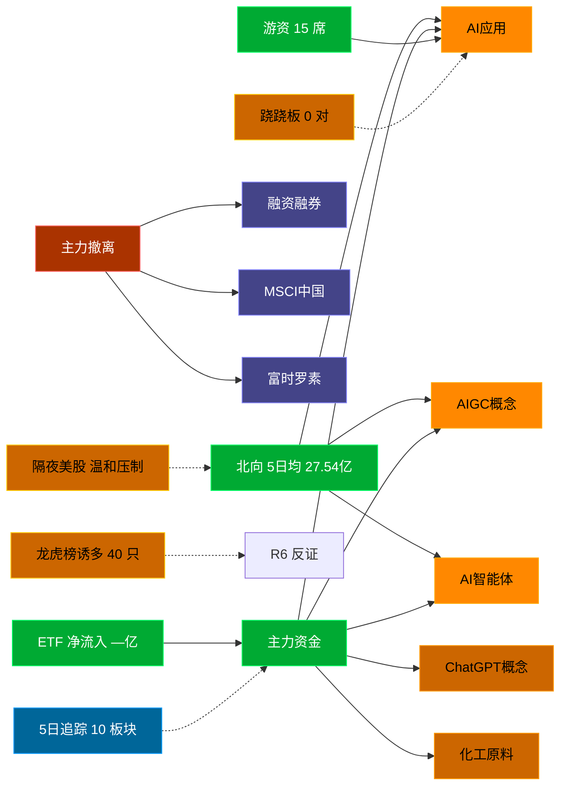

# 2026-08-31 · **资金面**

> **数据源新鲜度**: stale (数据截至 20260828，周末间隔)
> **降级状态**: True
> **置信度**: 0.54

## 一句话结论
北向近 5 日均 27.54 亿，主力集中「AI应用/AIGC概念/AI智能体」；资金撤离端 top1「融资融券」，龙虎榜诱多 40 只。 隔夜半导体 -2.7%（温和压制）。🔴 新鲜度: stale（周末间隔）

## 外部传导（隔夜美股）

**隔夜快照日期**: 20260828 · 影响等级: **温和压制**

- 半导体 8 股平均: **-2.67%**，趋势: down
- 科技 6 股平均: **+1.42%**
- 半导体最弱: MRVL (-10.28%)
- 半导体最强: TSM (+0.71%)

| 标的 | 涨跌幅 | 映射 A 股方向 |
|---|---|---|
| NVDA | 🔴 -4.57% | AI算力 / GPU / 光模块 |
| AMD | 🔴 -2.33% | CPU/GPU / 算力芯片 |
| AVGO | ⚪ -0.74% | AI芯片 / 光模块 / 设计 |
| MU | ⚪ -0.27% | 存储芯片 / 存储模组 |
| TSM | ⚪ +0.71% | 晶圆代工 / 先进封装 |
| INTC | 🔴 -2.85% | CPU / 芯片代工 |
| GLW | 🔴 -1.06% | 光通信 / 光纤 / 光模块上游 |
| MRVL | 🔴 -10.28% | 数据中心芯片 / 光通信 |
| AAPL | 🟢 +1.63% | 消费电子 / 苹果链 |
| MSFT | 🟢 +1.68% | 云服务 / AI算力 |
| GOOGL | 🟢 +1.74% | AI / 广告 / 云 |
| META | 🟢 +1.21% | AI应用 / 社交 |
| AMZN | 🟢 +3.97% | 电商 / 云 |
| TSLA | 🔴 -1.71% | 新能源车 / 机器人 |

**A 股敏感方向**:
- ➖ storage_chain: 中性
- ➖ cpo_optical: 中性
- 🔻 ai_computing: 承压
- 🟩 consumer_electronics: 提振
- ➖ new_energy_vehicle: 中性

**对今日资金面的含义**: 隔夜半导体down，开盘阶段 A 股科技链承压，资金或偏向防御。周末两天消息面需额外关注政策/行业催化是否与方向一致。

## 资金流转拓扑图

## 详细分析

**1) 北向时序**
最新交易日 20260828 净流入 27.81 亿；5 日均 27.54 亿，20 日均 29.87 亿。 近 5 日: 0824 29.1 → 0825 26.7 → 0826 25.6 → 0827 28.5 → 0828 27.8。 周一盘前参考周五数据，周末若有政策面变化需盘中重估。

**2) 主力板块 (数据日=20260828·周五)**
- 流入 TOP10：AI应用 +32.9亿 / AIGC概念 +26.2亿 / AI智能体 +25.9亿 / ChatGPT概念 +20.1亿 / 化工原料 +19.4亿 / 数字经济 +18.4亿 / 2026一季报预增 +18.1亿 / 多模态AI +17.0亿 / 反内卷概念 +15.8亿 / 虚拟数字人 +14.8亿
- 流出 TOP10：融资融券 -332.8亿 / MSCI中国 -253.2亿 / 富时罗素 -250.9亿 / 大盘股 -208.1亿 / 百元股 -170.4亿 / 沪股通 -166.8亿 / 科技风格 -165.5亿 / HS300_ -165.3亿 / 国产芯片 -157.7亿 / 半导体概念 -147.7亿

**大资金意图**: 从流入端「AI应用 / AIGC概念 / AI智能体」的结构看，主力集中加仓强势主线，是结构性行情而非普涨；流出端集中在前期涨幅较大板块，资金再分配特征明显。注意周一开盘可能出现周末消息消化后的方向修正。
**为什么走强**: AI应用 周五排名居首 + 超大单净流入居前，说明机构配置盘认可，不是纯短线游资推动。经过周末发酵后，若有消息面配合则可能延续。
**逻辑够不够硬**: 数据新鲜度 stale（距收盘约 64 小时，周末间隔），盘中若大级别政策/外围事件本判断失效；建议 D1 以「板块方向」而非「精准金额」使用，盘中验证第一小时量能。

**3) 昨日前十 5 日追踪 (核心)**
- **AI应用**: 0824:-41.6 → 0825:+17.0 → 0826:+10.8 → 0827:+29.7 → 0828:+32.9 亿 | 累计 +48.9 亿 · 正流入 4/5 · **加速流入**
- **AIGC概念**: 0824:-35.6 → 0825:+9.0 → 0826:+11.8 → 0827:+25.4 → 0828:+26.2 亿 | 累计 +36.9 亿 · 正流入 4/5 · **加速流入**
- **AI智能体**: 0824:-40.3 → 0825:+12.5 → 0826:-4.8 → 0827:+22.4 → 0828:+25.9 亿 | 累计 +15.7 亿 · 正流入 3/5 · **偏强净入·有波动**
- **ChatGPT概念**: 0824:-25.4 → 0825:+5.3 → 0826:+4.4 → 0827:+13.0 → 0828:+20.1 亿 | 累计 +17.5 亿 · 正流入 4/5 · **加速流入**
- **化工原料**: 0824:-11.0 → 0825:-5.2 → 0826:+7.2 → 0827:+2.2 → 0828:+19.4 亿 | 累计 +12.6 亿 · 正流入 3/5 · **偏强净入·有波动**
- **数字经济**: 0824:-39.2 → 0825:+12.1 → 0826:-5.3 → 0827:+19.1 → 0828:+18.4 亿 | 累计 +5.1 亿 · 正流入 3/5 · **偏强净入·有波动**
- **2026一季报预增**: 0824:-49.0 → 0825:-9.9 → 0826:+3.4 → 0827:+67.3 → 0828:+18.1 亿 | 累计 +29.8 亿 · 正流入 3/5 · **偏强净入·有波动**
- **多模态AI**: 0824:-14.4 → 0825:+5.0 → 0826:-1.9 → 0827:+7.1 → 0828:+17.0 亿 | 累计 +12.7 亿 · 正流入 3/5 · **偏强净入·有波动**
- **反内卷概念**: 0824:+6.9 → 0825:-15.2 → 0826:-7.3 → 0827:+1.7 → 0828:+15.8 亿 | 累计 +1.9 亿 · 正流入 3/5 · **偏强净入·有波动**
- **虚拟数字人**: 0824:-16.1 → 0825:+7.3 → 0826:-3.7 → 0827:+8.2 → 0828:+14.8 亿 | 累计 +10.5 亿 · 正流入 3/5 · **偏强净入·有波动**

**4) 游资 (龙虎榜 · 20260828)**
具名活跃席位 15 席，3 日协同信号 0 条。TOP 5:
- 国盛证券股份有限公司宁波桑田路证券营业部: 净额 26358.3 万，覆盖 2 票
- 华泰证券股份有限公司天津河东金茂广场证券营业部: 净额 24749.8 万，覆盖 1 票
- 华泰证券股份有限公司苏州吴中大道证券营业部: 净额 24600.5 万，覆盖 1 票
- 开源证券股份有限公司西安高新成章路证券营业部: 净额 21214.6 万，覆盖 1 票
- 世纪证券有限责任公司天津分公司: 净额 19756.4 万，覆盖 1 票

**5) 龙虎榜诱多识别 (核心)**
当日总计 57 只上榜，命中诱多规则 **40 只**。前 10：

| 代码 | 名称 | 涨幅 | 换手 | 龙虎榜净额(万) | 机构净额(万) | 模式 | 上榜原因 |
|---|---|---|---|---|---|---|---|
| 600378.SH | 昊华科技 | +10.01% | 5.2% | -31964 | -51853 | 涨停净卖出 + 机构专用净卖 + 疑似对倒:国新证券股份有限公司… | 非S证券连续三个交易日内收盘价格涨幅偏离值累计达到20%的证券 |
| 002942.SZ | 新农股份 | +9.99% | 18.4% | -4032 | -8709 | 涨停净卖出 + 机构专用净卖 + 疑似对倒:华鑫证券有限责任公司… | 连续三个交易日内，涨幅偏离值累计达到20%的证券 |
| 000017.SZ | 深中华A | +9.99% | 25.1% | -2789 | -6106 | 涨停净卖出 + 机构专用净卖 | 连续三个交易日内，涨幅偏离值累计达到20%的证券 |
| 600227.SH | 赤天化 | +10.10% | 28.9% | -2431 | +0 | 涨停净卖出 + 疑似对倒:国信证券股份有限公司… | 有价格涨跌幅限制的日收盘价格涨幅偏离值达到7%的前五只证券 |
| 920469.BJ | 富恒新材 | +23.94% | 16.0% | -1360 | +0 | 涨停净卖出 + 疑似对倒:中信建投证券股份有限… | 当日收盘价涨幅达到20%的前5只股票 |
| 600815.SH | 厦工股份 | +10.12% | 10.1% | -806 | +0 | 涨停净卖出 + 疑似对倒:高盛(中国)证券有限… | 有价格涨跌幅限制的日收盘价格涨幅偏离值达到7%的前五只证券 |
| 000062.SZ | 深圳华强 | +10.00% | 5.8% | -339 | -7215 | 机构专用净卖 | 日涨幅偏离值达到7%的前5只证券 |
| 000017.SZ | 深中华A | +9.99% | 25.1% | +541 | -6106 | 机构专用净卖 | 日涨幅偏离值达到7%的前5只证券 |
| 300189.SZ | 神农种业 | -0.15% | 40.7% | -5623 | -4139 | 机构专用净卖 | 日换手率达到30%的前5只证券 |
| 002963.SZ | 豪尔赛 | -10.01% | 13.0% | -1791 | -3659 | 机构专用净卖 | 日跌幅偏离值达到7%的前5只证券 |

**6) 板块跷跷板**
_未检出显著跷跷板配对（当日新构建 R7，无历史对比）。_

**7) ETF / 期货 / 期权**
ETF 净流入 — 亿(代表ETF)；期权隐含波动率: 数据缺。

## 关键证据
- 主力流入 top1 AI应用 +32.9 亿 · 来源 tushare.moneyflow_ind_dc
- 5 日追踪：AI应用 累计 48.86 亿, 4/5 日正流入, 趋势「加速流入」
- 流出 top1 融资融券 -332.8 亿 · 来源 tushare.moneyflow_ind_dc
- 龙虎榜诱多 40 只，其中「涨停净卖出」6 只 · 来源 tushare.top_list+top_inst
- 游资 3 日协同 0 条 · 来源 tushare.top_inst 席位统计
- 板块跷跷板 0 对 · 来源 当日新构建，无历史对比
- 北向最新 27.81 亿（20260828） · 来源 tushare.moneyflow_hsgt
- 隔夜美股半导体平均 -2.67%（20260828）· 来源 tushare.us_daily

## 数据源审计
| 源 | 状态 | 抓取日期 | 记录数 | 备注 |
|---|---|---|---|---|
| tushare.moneyflow_hsgt | 🟢 ok | 20260828 | 20 日 | 北向时序 |
| tushare.moneyflow_ind_dc | 🟢 ok | 20260828 | 5 日 × ~1000 行 | 概念板块资金流 5 日追踪 |
| tushare.top_list | 🟢 ok | 20260828 | 57 行 | 龙虎榜上榜个股 |
| tushare.top_inst | 🟢 ok | 20260828 | 630 席位 | 龙虎榜买卖席位明细 |
| tushare.us_daily | 🟢 ok | 20260828 | 14 | 隔夜美股核心 14 股 |
| tushare.index_global | 🟢 ok | 20260828 | 3 | 美股指数 |
| vibe-trading | 🟠 partial | 20260828 | — | 盘前无法访问，降级走 Tushare 主路 |

## 不确定性 / 反证
- 数据新鲜度 stale（距收盘约 64 小时，含周末 2 天空窗），周一开盘前无法获取周末最新消息面/政策面变化，本判断需盘中第一小时验证。
- 龙虎榜诱多规则为静态启发式，未剔除 T+1 高开对冲情形，可能高估诱多密度；供 R6 反证参考，不作 hard_reject。
- Tushare hm_detail 存在 T+1 延迟；xtick/datapro 可作实时补充但盘前抓取以 Tushare 为主。
- 5 日追踪只跟踪周五 top10，若周一风格切换到前期弱势板块，本追踪盲区。
- ETF 净流入基于代表 ETF 估算，非真实一级市场资金流水。
- 周末 2 天消息面（政策/行业/地缘）可能完全改变资金方向，D1 需重视开盘 30 分钟真实量价验证。
- vibe-trading MCP 盘前不可用，缺少大宗交易/两融独立证据面，confidence 已扣减。

## 与其他 R/D/E 的关系
- 依赖: Tushare MCP (moneyflow_hsgt/moneyflow_ind_dc/top_list/top_inst/us_daily/fund_daily)
- 被消费: D1(main_decision_v1) · R2(analyze_main_sectors_v1) · R5(analyze_stock_profile_v1) · R6(analyze_devil_advocate_v1)

## Sub-Agent 元数据
- skill: analyze_capital_flow_v1
- artifact: /Users/chenyang/Downloads/demo/沧海巨浪/data/research/20260831/R7_capital_flow.json
- 生成方式: enrich_r7_20260831.py (从零构建 + 刷新北向/主力/5日追踪/龙虎榜诱多/隔夜美股 + mermaid)
- model: doubao-seed-2-0-code-preview
- 生成耗时: 7.6 秒
