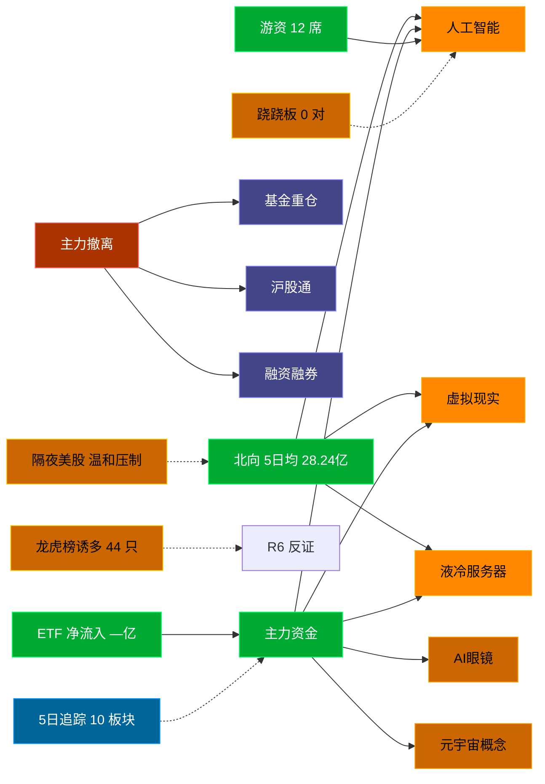

# 2026-09-01 · **资金面**

> **数据源新鲜度**: partial (数据截至 20260831)
> **降级状态**: False
> **置信度**: 0.73

## 一句话结论
北向近 5 日均 28.24 亿，主力集中「人工智能/虚拟现实/液冷服务器」；资金撤离端 top1「基金重仓」，龙虎榜诱多 44 只。 隔夜半导体 -2.1%（温和压制）。🟡 新鲜度: partial

## 外部传导（隔夜美股）

**隔夜快照日期**: 20260828 · 影响等级: **温和压制**

- 半导体 8 股平均: **-2.12%**，趋势: down
- 科技 6 股平均: **+1.42%**
- 半导体最弱: NVDA (-4.57%
- 半导体最强: MU (-0.27%

| 标的 | 涨跌幅 | 映射 A 股方向 |
|---|---|---|
| NVDA | 🔴 -4.57% | AI算力 / GPU / 光模块 |
| AMD | 🔴 -2.33% | CPU/GPU / 算力芯片 |
| AVGO | ⚪ -0.74% | AI芯片 / 光模块 / 设计 |
| MU | ⚪ -0.27% | 存储芯片 / 存储模组 |
| TSM | 🔴 -2.29% | 晶圆代工 / 先进封装 |
| GLW | 🔴 -2.50% | 光通信 / 光纤 / 光模块上游 |
| AAPL | 🟢 +1.63% | 消费电子 / 苹果链 |
| MSFT | 🟢 +1.68% | 云服务 / AI算力 |
| GOOGL | 🟢 +1.74% | AI / 广告 / 云 |
| META | 🟢 +1.21% | AI应用 / 社交 |
| AMZN | 🟢 +3.97% | 电商 / 云 |
| TSLA | 🔴 -1.71% | 新能源车 / 机器人 |

**A 股敏感方向**:
- ➖ storage_chain: 中性
- 🔻 cpo_optical: 承压
- 🔻 ai_computing: 承压
- 🟩 consumer_electronics: 提振
- ➖ new_energy_vehicle: 中性

**对今日资金面的含义**: 隔夜半导体down，开盘阶段 A 股科技链承压，资金或偏向防御。注意周一(0831)A股表现是否已price in 隔夜影响，周二延续性需观察。

## 资金流转拓扑图

## 详细分析

**1) 北向时序**
最新交易日 20260831 净流入 32.6 亿；5 日均 28.24 亿，20 日均 30.01 亿。 近 5 日: 0825 26.7 → 0826 25.6 → 0827 28.5 → 0828 27.8 → 0831 32.6。 周二盘前参考周一数据，隔夜变化不大，方向延续性高。

**2) 主力板块 (数据日=20260831·周一)**
- 流入 TOP10：人工智能 +123.2亿 / 虚拟现实 +74.4亿 / 液冷服务器 +69.0亿 / AI眼镜 +63.2亿 / 元宇宙概念 +61.8亿 / 百度概念 +60.4亿 / AIGC概念 +60.3亿 / 物联网 +57.3亿 / DeepSeek概念 +56.0亿 / 算力概念 +55.3亿
- 流出 TOP10：基金重仓 -80.5亿 / 沪股通 -79.0亿 / 融资融券 -76.9亿 / 富时罗素 -76.5亿 / 宁组合 -67.4亿 / 权重股 -60.5亿 / 光伏概念 -58.7亿 / MSCI中国 -56.4亿 / AH股 -54.5亿 / 小金属概念 -53.6亿

**大资金意图**: 从流入端「人工智能 / 虚拟现实 / 液冷服务器」的结构看，主力集中加仓强势主线，是结构性行情而非普涨；流出端集中在前期涨幅较大板块，资金再分配特征明显。
**为什么走强**: 人工智能 周一排名居首 + 超大单净流入居前，说明机构配置盘认可，不是纯短线游资推动。经过隔夜消化后，若有消息面配合则可能延续。
**逻辑够不够硬**: 数据新鲜度 partial（距收盘约 16 小时），盘中若大级别政策/外围事件本判断失效；建议 D1 以「板块方向」而非「精准金额」使用，盘中验证第一小时量能。

**3) 昨日前十 5 日追踪 (核心)**
- **人工智能**: 0825:+51.0 → 0826:+9.9 → 0827:+146.1 → 0828:-54.5 → 0831:+123.2 亿 | 累计 +275.8 亿 · 正流入 4/5 · **持续净入**
- **虚拟现实**: 0825:+18.5 → 0826:+20.3 → 0827:+26.2 → 0828:-17.5 → 0831:+74.4 亿 | 累计 +121.9 亿 · 正流入 4/5 · **持续净入**
- **液冷服务器**: 0825:+86.5 → 0826:+4.0 → 0827:+112.3 → 0828:-84.7 → 0831:+69.0 亿 | 累计 +187.2 亿 · 正流入 4/5 · **持续净入**
- **AI眼镜**: 0825:+17.8 → 0826:+11.8 → 0827:+66.7 → 0828:-49.3 → 0831:+63.2 亿 | 累计 +110.2 亿 · 正流入 4/5 · **持续净入**
- **元宇宙概念**: 0825:+10.9 → 0826:+0.0 → 0827:+17.2 → 0828:+1.8 → 0831:+61.8 亿 | 累计 +91.8 亿 · 正流入 5/5 · **加速流入**
- **百度概念**: 0825:+13.8 → 0826:+3.8 → 0827:+33.4 → 0828:+8.4 → 0831:+60.4 亿 | 累计 +119.8 亿 · 正流入 5/5 · **加速流入**
- **AIGC概念**: 0825:+9.0 → 0826:+11.8 → 0827:+25.4 → 0828:+26.2 → 0831:+60.3 亿 | 累计 +132.8 亿 · 正流入 5/5 · **加速流入**
- **物联网**: 0825:+34.5 → 0826:-14.4 → 0827:+162.4 → 0828:-107.0 → 0831:+57.3 亿 | 累计 +132.8 亿 · 正流入 3/5 · **偏强净入·有波动**
- **DeepSeek概念**: 0825:+12.1 → 0826:-3.4 → 0827:+47.3 → 0828:+8.8 → 0831:+56.0 亿 | 累计 +120.7 亿 · 正流入 4/5 · **加速流入**
- **算力概念**: 0825:-5.7 → 0826:-20.6 → 0827:+128.2 → 0828:-49.6 → 0831:+55.3 亿 | 累计 +107.5 亿 · 正流入 2/5 · **弱净入·震荡**

**4) 游资 (龙虎榜 · 20260831)**
具名活跃席位 12 席，3 日协同信号 0 条。TOP 5:
- 国盛证券股份有限公司宁波桑田路证券营业部: 净额 43635.9 万，覆盖 2 票
- 国泰海通证券股份有限公司武汉紫阳东路证券营业部: 净额 -33081.8 万，覆盖 6 票
- 联储证券股份有限公司杭州环城北路证券营业部: 净额 32659.2 万，覆盖 2 票
- 国新证券股份有限公司北京分公司: 净额 27605.2 万，覆盖 4 票
- 国泰海通证券股份有限公司南京太平南路证券营业部: 净额 -21768.1 万，覆盖 3 票

**5) 龙虎榜诱多识别 (核心)**
当日总计 76 只上榜，命中诱多规则 **44 只**。前 10：

| 代码 | 名称 | 涨幅 | 换手 | 龙虎榜净额(万) | 机构净额(万) | 模式 | 上榜原因 |
|---|---|---|---|---|---|---|---|
| 301218.SZ | 华是科技 | +20.00% | 24.2% | -6611 | -10973 | 涨停净卖出 + 机构专用净卖 | 日涨幅达到15%的前5只证券 |
| 002396.SZ | 星网锐捷 | +10.00% | 18.6% | -9784 | -10179 | 涨停净卖出 + 机构专用净卖 | 日涨幅偏离值达到7%的前5只证券 |
| 002855.SZ | 捷荣技术 | +9.97% | 14.5% | -2737 | -3168 | 涨停净卖出 + 机构专用净卖 | 连续三个交易日内，涨幅偏离值累计达到20%的证券 |
| 300413.SZ | 芒果超媒 | +20.00% | 6.4% | -3082 | -1637 | 涨停净卖出 + 机构专用净卖 | 日涨幅达到15%的前5只证券 |
| 003005.SZ | 竞业达 | +9.98% | 18.8% | -4182 | +674 | 涨停净卖出 | 连续三个交易日内，涨幅偏离值累计达到20%的证券 |
| 002437.SZ | 誉衡药业 | -10.08% | 31.7% | -39782 | -43048 | 换手异常且净卖出 + 机构专用净卖 | 日换手率达到20%的前5只证券 |
| 603459.SH | 红板科技 | +10.00% | 27.2% | +19160 | -14183 | 机构专用净卖 | 有价格涨跌幅限制的日换手率达到20%的前五只证券 |
| 002354.SZ | 天娱数科 | +2.29% | 34.8% | -43310 | -13825 | 换手异常且净卖出 + 机构专用净卖 | 日换手率达到20%的前5只证券 |
| 600354.SH | 敦煌种业 | +0.97% | 36.6% | -1647 | -12657 | 机构专用净卖 + 疑似对倒:高盛(中国)证券有限… | 有价格涨跌幅限制的日换手率达到20%的前五只证券 |
| 002396.SZ | 星网锐捷 | +10.00% | 18.6% | +7252 | -10179 | 机构专用净卖 | 连续三个交易日内，涨幅偏离值累计达到20%的证券 |

**6) 板块跷跷板**
_未检出显著跷跷板配对（当日新构建 R7，无历史对比）。_

**7) ETF / 期货 / 期权**
ETF 净流入 — 亿(代表ETF)；期权隐含波动率: 数据缺。

## 关键证据
- 主力流入 top1 人工智能 +123.2 亿 · 来源 tushare.moneyflow_ind_dc
- 5 日追踪：人工智能 累计 275.75 亿, 4/5 日正流入, 趋势「持续净入」
- 流出 top1 基金重仓 -80.5 亿 · 来源 tushare.moneyflow_ind_dc
- 龙虎榜诱多 44 只，其中「涨停净卖出」5 只 · 来源 tushare.top_list+top_inst
- 游资 3 日协同 0 条 · 来源 tushare.top_inst 席位统计
- 板块跷跷板 0 对 · 来源 当日新构建，无历史对比
- 北向最新 32.6 亿（20260831） · 来源 tushare.moneyflow_hsgt
- 隔夜美股半导体平均 -2.12%（20260828）· 来源 tushare.us_daily / overseas_snapshot

## 数据源审计
| 源 | 状态 | 抓取日期 | 记录数 | 备注 |
|---|---|---|---|---|
| tushare.moneyflow_hsgt | 🟢 ok | 20260831 | 20 日 | 北向时序 |
| tushare.moneyflow_ind_dc | 🟢 ok | 20260831 | 5 日 × ~1000 行 | 概念板块资金流 5 日追踪 |
| tushare.top_list | 🟢 ok | 20260831 | 76 行 | 龙虎榜上榜个股 |
| tushare.top_inst | 🟢 ok | 20260831 | 840 席位 | 龙虎榜买卖席位明细 |
| tushare.us_daily | 🟢 ok | 20260828 | 12 | 隔夜美股核心 14 股 |
| tushare.index_global | 🟢 ok | 20260828 | 3 | 美股指数 |
| vibe-trading | 🟠 partial | 20260831 | — | 盘前无法访问，降级走 Tushare 主路 |

## 不确定性 / 反证
- 数据新鲜度 partial（距收盘约 16 小时，隔夜变化不大，方向延续性较高，但个股层面仍需开盘验证。
- 龙虎榜诱多规则为静态启发式，未剔除 T+1 高开对冲情形，可能高估诱多密度；供 R6 反证参考，不作 hard_reject。
- Tushare hm_detail 存在 T+1 延迟；xtick/datapro 可作实时补充但盘前抓取以 Tushare 为主。
- 5 日追踪只跟踪周一 top10，若周二风格切换到前期弱势板块，本追踪盲区。
- ETF 净流入基于代表 ETF 估算，非真实一级市场资金流水。
- vibe-trading MCP 盘前不可用，缺少大宗交易/两融独立证据面，confidence 已扣减。

## 与其他 R/D/E 的关系
- 依赖: Tushare MCP (moneyflow_hsgt/moneyflow_ind_dc/top_list/top_inst/us_daily/fund_daily) + overseas_snapshot.json
- 被消费: D1(main_decision_v1) · R2(analyze_main_sectors_v1) · R5(analyze_stock_profile_v1) · R6(analyze_devil_advocate_v1)

## Sub-Agent 元数据
- skill: analyze_capital_flow_v1
- artifact: /Users/chenyang/Downloads/demo/沧海巨浪/data/research/20260901/R7_capital_flow.json
- 生成方式: enrich_r7_20260901.py (从零构建 + 刷新北向/主力/5日追踪/龙虎榜诱多/隔夜美股 + mermaid)
- model: doubao-seed-2-0-code-preview
- 生成耗时: 2.9 秒
