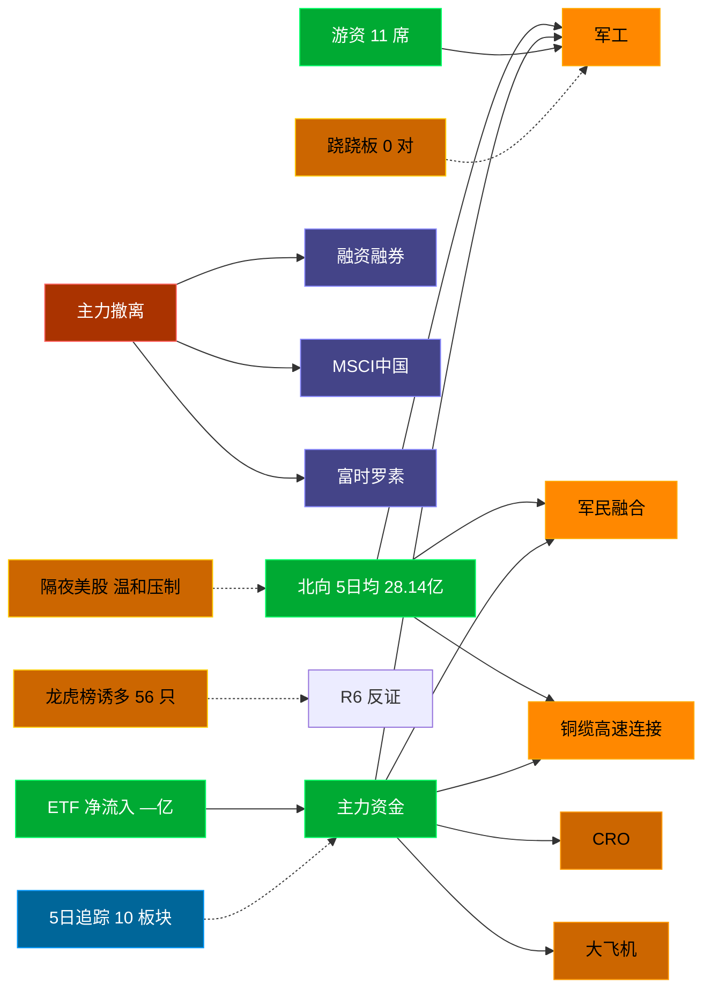

# 2026-09-03 · **资金面**

> **数据源新鲜度**: ok (数据截至 20260902，T-1 最新可得)
> **降级状态**: False
> **置信度**: 0.77

## 一句话结论
北向近 5 日均 28.14 亿，主力集中「军工/军民融合/铜缆高速连接」；资金撤离端 top1「融资融券」，龙虎榜诱多 56 只。 隔夜半导体 -1.5%（温和压制）。🟢 新鲜度: ok（T-1）

## 外部传导（隔夜美股）

**隔夜快照日期**: 20260901 · 影响等级: **温和压制**

- 半导体 6 股平均: **-1.52%**，趋势: down
- 科技 6 股平均: **-0.65%**
- 半导体最弱: MU (-2.64%)
- 半导体最强: AVGO (-0.18%)

| 标的 | 涨跌幅 | 映射 A 股方向 |
|---|---|---|
| NVDA | 🔴 -1.51% | AI算力 / GPU / 光模块 |
| AMD | 🔴 -2.36% | CPU/GPU / 算力芯片 |
| AVGO | ⚪ -0.18% | AI芯片 / 光模块 / 设计 |
| MU | 🔴 -2.64% | 存储芯片 / 存储模组 |
| TSM | ⚪ -0.32% | 晶圆代工 / 先进封装 |
| GLW | 🔴 -2.13% | 光通信 / 光纤 / 光模块上游 |
| AAPL | 🟢 +2.61% | 消费电子 / 苹果链 |
| MSFT | 🔴 -1.24% | 云服务 / AI算力 |
| GOOGL | 🔴 -1.28% | AI / 广告 / 云 |
| META | 🟢 +1.08% | AI应用 / 社交 |
| AMZN | 🔴 -1.87% | 电商 / 云 |
| TSLA | 🔴 -3.22% | 新能源车 / 机器人 |

**A 股敏感方向**:
- 🔻 storage_chain: 承压
- 🔻 cpo_optical: 承压
- ➖ ai_computing: 中性
- 🟩 consumer_electronics: 提振
- 🔻 new_energy_vehicle: 承压

**对今日资金面的含义**: 隔夜半导体down，开盘阶段 A 股科技链承压，资金或偏向防御。美股快照为 T-2 (20260901)，周三(0902)美股尚未落库，需盘中用 xtick 实时核验。

## 资金流转拓扑图

## 详细分析

**1) 北向时序**
最新交易日 20260902 净流入 24.48 亿；5 日均 28.14 亿，20 日均 29.36 亿。 近 5 日: 0827 28.5 → 0828 27.8 → 0831 32.6 → 0901 27.3 → 0902 24.5。 周四盘前参考周三数据（T-1 最新可得），隔夜变化不大，方向延续性高。

**2) 主力板块 (数据日=20260902·周三)**
- 流入 TOP10：军工 +23.5亿 / 军民融合 +18.3亿 / 铜缆高速连接 +14.7亿 / CRO +14.0亿 / 大飞机 +13.8亿 / 油气设服 +13.5亿 / 液冷服务器 +12.0亿 / 航天航空 +12.0亿 / 水利建设 +11.7亿 / 油气资源 +11.1亿
- 流出 TOP10：融资融券 -520.0亿 / MSCI中国 -423.2亿 / 富时罗素 -399.5亿 / 深股通 -340.9亿 / 深成500 -302.7亿 / HS300_ -287.0亿 / 大盘股 -281.8亿 / 标准普尔 -232.1亿 / 创业板综 -193.9亿 / 2026中报预增 -189.0亿

**大资金意图**: 从流入端「军工 / 军民融合 / 铜缆高速连接」的结构看，主力集中加仓强势主线，是结构性行情而非普涨；流出端集中在前期涨幅较大板块，资金再分配特征明显。
**为什么走强**: 军工 周三排名居首 + 超大单净流入居前，说明机构配置盘认可，不是纯短线游资推动。经过隔夜消化后，若有消息面配合则可能延续。
**逻辑够不够硬**: 数据新鲜度 ok（T-1 收盘，最新可得），盘中若大级别政策/外围事件本判断失效；建议 D1 以「板块方向」而非「精准金额」使用，盘中验证第一小时量能。

**3) 昨日前十 5 日追踪 (核心)**
- **军工**: 0827:+45.9 → 0828:-32.5 → 0831:-12.1 → 0901:-5.5 → 0902:+23.5 亿 | 累计 +19.3 亿 · 正流入 2/5 · **末日翻红·前段净出**
- **军民融合**: 0827:+16.0 → 0828:-9.8 → 0831:+3.6 → 0901:+6.3 → 0902:+18.3 亿 | 累计 +34.4 亿 · 正流入 4/5 · **加速流入**
- **铜缆高速连接**: 0827:+19.8 → 0828:-22.7 → 0831:-5.9 → 0901:-21.6 → 0902:+14.7 亿 | 累计 -15.8 亿 · 正流入 2/5 · **末日翻红·前段净出**
- **CRO**: 0827:-4.9 → 0828:-12.9 → 0831:-14.7 → 0901:+3.4 → 0902:+14.0 亿 | 累计 -15.1 亿 · 正流入 2/5 · **末日翻红·前段净出**
- **大飞机**: 0827:+15.2 → 0828:-6.0 → 0831:-2.9 → 0901:-2.8 → 0902:+13.8 亿 | 累计 +17.3 亿 · 正流入 2/5 · **弱净入·震荡**
- **油气设服**: 0827:-8.0 → 0828:-4.4 → 0831:+2.5 → 0901:-4.0 → 0902:+13.5 亿 | 累计 -0.3 亿 · 正流入 2/5 · **末日翻红·前段净出**
- **液冷服务器**: 0827:+112.3 → 0828:-84.7 → 0831:+69.0 → 0901:-60.4 → 0902:+12.0 亿 | 累计 +48.3 亿 · 正流入 3/5 · **偏强净入·有波动**
- **航天航空**: 0827:+2.6 → 0828:-0.9 → 0831:+0.2 → 0901:+1.6 → 0902:+12.0 亿 | 累计 +15.6 亿 · 正流入 4/5 · **加速流入**
- **水利建设**: 0827:-5.6 → 0828:-6.5 → 0831:-2.4 → 0901:+5.0 → 0902:+11.7 亿 | 累计 +2.2 亿 · 正流入 2/5 · **末日翻红·前段净出**
- **油气资源**: 0827:-17.1 → 0828:-0.7 → 0831:-1.1 → 0901:+0.3 → 0902:+11.1 亿 | 累计 -7.6 亿 · 正流入 2/5 · **末日翻红·前段净出**

**4) 游资 (龙虎榜 · 20260902)**
具名活跃席位 11 席，3 日协同信号 0 条。TOP 5:
- 开源证券股份有限公司西安西大街证券营业部: 净额 22654.6 万，覆盖 13 票
- 国新证券股份有限公司北京分公司: 净额 -16530.3 万，覆盖 5 票
- 国信证券股份有限公司浙江互联网分公司: 净额 15547.4 万，覆盖 19 票
- 国泰海通证券股份有限公司南京太平南路证券营业部: 净额 -15270.3 万，覆盖 3 票
- 中国国际金融股份有限公司上海分公司: 净额 -15152.2 万，覆盖 7 票

**5) 龙虎榜诱多识别 (核心)**
当日总计 77 只上榜，命中诱多规则 **56 只**。前 10：

| 代码 | 名称 | 涨幅 | 换手 | 龙虎榜净额(万) | 机构净额(万) | 模式 | 上榜原因 |
|---|---|---|---|---|---|---|---|
| 002104.SZ | 恒宝股份 | +10.02% | 23.0% | -5816 | -21616 | 涨停净卖出 + 机构专用净卖 | 日涨幅偏离值达到7%的前5只证券 |
| 002104.SZ | 恒宝股份 | +10.02% | 23.0% | -2754 | -21616 | 涨停净卖出 + 机构专用净卖 | 连续三个交易日内，涨幅偏离值累计达到20%的证券 |
| 601566.SH | 九牧王 | +9.98% | 8.5% | -1517 | +0 | 涨停净卖出 + 疑似对倒:中泰证券股份有限公司… | 非S证券连续三个交易日内收盘价格涨幅偏离值累计达到20%的证券 |
| 920748.BJ | 路桥信息 | +21.64% | 11.2% | -1143 | +0 | 涨停净卖出 + 疑似对倒:中信建投证券股份有限… | 当日收盘价涨幅达到20%的前5只股票 |
| 300164.SZ | 通源石油 | +1.13% | 35.0% | -22017 | -18437 | 换手异常且净卖出 + 机构专用净卖 | 日换手率达到30%的前5只证券 |
| 003040.SZ | 楚天龙 | +7.87% | 32.3% | -10855 | -15317 | 拉高净卖出 + 换手异常且净卖出 + 机构专用净卖 + 疑似对倒:国新证券股份有限公司… | 日换手率达到20%的前5只证券 |
| 003040.SZ | 楚天龙 | +7.87% | 32.3% | -8340 | -15317 | 拉高净卖出 + 机构专用净卖 + 疑似对倒:国新证券股份有限公司… | 连续三个交易日内，涨幅偏离值累计达到20%的证券 |
| 118058.SH | 微导转债 | -20.00% | 0.0% | -4687 | -10679 | 机构专用净卖 + 疑似对倒:华鑫证券有限责任公司… | 非上市首日,当日收盘价跌幅达15%的前五只可转债 |
| 002437.SZ | 誉衡药业 | +4.14% | 32.5% | +805 | -8664 | 机构专用净卖 | 日换手率达到20%的前5只证券 |
| 002412.SZ | 汉森制药 | -8.06% | 21.6% | -5262 | -7884 | 机构专用净卖 + 疑似对倒:国信证券股份有限公司… | 连续三个交易日内，跌幅偏离值累计达到20%的证券 |

**6) 板块跷跷板**
_未检出显著跷跷板配对（当日新构建 R7，无历史对比）。_

**7) ETF / 期货 / 期权**
ETF 净流入 — 亿(代表ETF)；期权隐含波动率: 数据缺。

## 关键证据
- 主力流入 top1 军工 +23.5 亿 · 来源 tushare.moneyflow_ind_dc
- 5 日追踪：军工 累计 19.28 亿, 2/5 日正流入, 趋势「末日翻红·前段净出」
- 流出 top1 融资融券 -520.0 亿 · 来源 tushare.moneyflow_ind_dc
- 龙虎榜诱多 56 只，其中「涨停净卖出」4 只 · 来源 tushare.top_list+top_inst
- 游资 3 日协同 0 条 · 来源 tushare.top_inst 席位统计
- 板块跷跷板 0 对 · 来源 当日新构建，无历史对比
- 北向最新 24.48 亿（20260902） · 来源 tushare.moneyflow_hsgt
- 隔夜美股半导体平均 -1.52%（20260901）· 来源 overseas_snapshot.json

## 数据源审计
| 源 | 状态 | 抓取日期 | 记录数 | 备注 |
|---|---|---|---|---|
| tushare.moneyflow_hsgt | 🟢 ok | 20260902 | 20 日 | 北向时序 |
| tushare.moneyflow_ind_dc | 🟢 ok | 20260902 | 5 日 × ~1000 行 | 概念板块资金流 5 日追踪 |
| tushare.top_list | 🟢 ok | 20260902 | 77 行 | 龙虎榜上榜个股 |
| tushare.top_inst | 🟢 ok | 20260902 | 830 席位 | 龙虎榜买卖席位明细 |
| overseas_snapshot.json | 🟢 ok | 20260901 | 12 | 隔夜美股核心 12 股 |
| overseas_snapshot.json (indices) | 🟢 ok | 20260901 | 3 | 美股指数 |
| vibe-trading | 🟠 partial | 20260902 | — | 盘前无法访问，降级走 Tushare 主路 |

## 不确定性 / 反证
- 数据新鲜度 ok（T-1 收盘最新可得，距收盘约 16 小时），周四开盘前无法获取 T 日盘中资金变化，本判断需盘中第一小时验证。
- 龙虎榜诱多规则为静态启发式，未剔除 T+1 高开对冲情形，可能高估诱多密度；供 R6 反证参考，不作 hard_reject。
- Tushare hm_detail 存在 T+1 延迟；xtick/datapro 可作实时补充但盘前抓取以 Tushare 为主。
- 5 日追踪只跟踪周三 top10，若周四风格切换到前期弱势板块，本追踪盲区。
- ETF 净流入基于代表 ETF 估算，非真实一级市场资金流水。
- 隔夜美股快照为 T-2 (20260901)，周三(0902)美股数据尚未落库，外部传导存在 1 日滞后，需盘中用 xtick 实时核验。
- vibe-trading MCP 盘前不可用，缺少大宗交易/两融独立证据面，confidence 已扣减。

## 与其他 R/D/E 的关系
- 依赖: Tushare MCP (moneyflow_hsgt/moneyflow_ind_dc/top_list/top_inst/fund_daily) + overseas_snapshot.json
- 被消费: D1(main_decision_v1) · R2(analyze_main_sectors_v1) · R5(analyze_stock_profile_v1) · R6(analyze_devil_advocate_v1)

## Sub-Agent 元数据
- skill: analyze_capital_flow_v1
- artifact: /Users/chenyang/Downloads/demo/沧海巨浪/data/research/20260903/R7_capital_flow.json
- 生成方式: enrich_r7_20260903.py (从零构建 + 刷新北向/主力/5日追踪/龙虎榜诱多/隔夜美股 + mermaid)
- model: doubao-seed-2-0-code-preview
- 生成耗时: 3.3 秒
