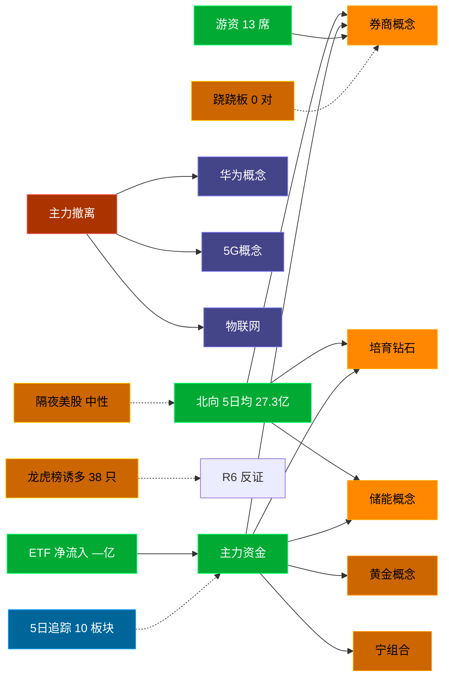

# 2026-09-04 · **资金面**

> **数据源新鲜度**: ok (数据截至 20260903，T-1 最新可得)
> **降级状态**: False
> **置信度**: 0.77

## 一句话结论
北向近 5 日均 27.3 亿，主力集中「券商概念/培育钻石/储能概念」；资金撤离端 top1「华为概念」，龙虎榜诱多 38 只。 隔夜半导体 +0.6%（中性）。🟢 新鲜度: ok（T-1）

## 外部传导（隔夜美股）

**隔夜快照日期**: 20260902 · 影响等级: **中性**

- 半导体 6 股平均: **+0.64%**，趋势: flat
- 科技 6 股平均: **+0.42%**
- 半导体最弱: GLW (-0.98%)
- 半导体最强: NVDA (+3.21%)

| 标的 | 涨跌幅 | 映射 A 股方向 |
|---|---|---|
| NVDA | 🟢 +3.21% | AI算力 / GPU / 光模块 |
| AMD | ⚪ -0.55% | CPU/GPU / 算力芯片 |
| AVGO | ⚪ -0.66% | AI芯片 / 光模块 / 设计 |
| MU | 🟢 +2.43% | 存储芯片 / 存储模组 |
| TSM | ⚪ +0.36% | 晶圆代工 / 先进封装 |
| GLW | ⚪ -0.98% | 光通信 / 光纤 / 光模块上游 |
| AAPL | ⚪ -0.05% | 消费电子 / 苹果链 |
| MSFT | ⚪ -0.84% | 云服务 / AI算力 |
| GOOGL | ⚪ +0.63% | AI / 广告 / 云 |
| META | 🟢 +2.47% | AI应用 / 社交 |
| AMZN | ⚪ +0.02% | 电商 / 云 |
| TSLA | ⚪ +0.26% | 新能源车 / 机器人 |

**A 股敏感方向**:
- 🟩 storage_chain: 提振
- ➖ cpo_optical: 中性
- ➖ ai_computing: 中性
- ➖ consumer_electronics: 中性
- ➖ new_energy_vehicle: 中性

**对今日资金面的含义**: 隔夜半导体flat，开盘阶段 A 股影响中性，看内资主导方向。美股快照为 T-2 (20260902)，周四(0903)美股数据尚未落库，需盘中用 xtick 实时核验。

## 资金流转拓扑图

## 详细分析

**1) 北向时序**
最新交易日 20260903 净流入 24.27 亿；5 日均 27.3 亿，20 日均 28.95 亿。 近 5 日: 0828 27.8 → 0831 32.6 → 0901 27.3 → 0902 24.5 → 0903 24.3。 周五盘前参考周四数据（T-1 最新可得），隔夜变化不大，方向延续性高。

**2) 主力板块 (数据日=20260903·周四)**
- 流入 TOP10：券商概念 +18.8亿 / 培育钻石 +18.2亿 / 储能概念 +16.6亿 / 黄金概念 +15.2亿 / 宁组合 +14.8亿 / 小金属概念 +11.8亿 / 植物照明 +10.9亿 / 工业母机 +10.8亿 / 麒麟电池 +10.4亿 / 汽车热管理 +9.9亿
- 流出 TOP10：华为概念 -86.8亿 / 5G概念 -71.2亿 / 物联网 -65.2亿 / 国产芯片 -62.8亿 / 通信技术 -61.7亿 / 人工智能 -59.7亿 / 央国企改革 -57.7亿 / 机构重仓 -55.6亿 / 消费电子概念 -53.3亿 / 东方财富热股 -50.2亿

**大资金意图**: 从流入端「券商概念 / 培育钻石 / 储能概念」的结构看，主力集中加仓强势主线，是结构性行情而非普涨；流出端集中在前期涨幅较大板块，资金再分配特征明显。
**为什么走强**: 券商概念 周四排名居首 + 超大单净流入居前，说明机构配置盘认可，不是纯短线游资推动。经过隔夜消化后，若有消息面配合则可能延续。
**逻辑够不够硬**: 数据新鲜度 ok（T-1 收盘，最新可得），盘中若大级别政策/外围事件本判断失效；建议 D1 以「板块方向」而非「精准金额」使用，盘中验证第一小时量能。

**3) 昨日前十 5 日追踪 (核心)**
- **券商概念**: 0828:-9.1 → 0831:-5.8 → 0901:+12.8 → 0902:-45.6 → 0903:+18.8 亿 | 累计 -29.0 亿 · 正流入 2/5 · **末日翻红·前段净出**
- **培育钻石**: 0828:+1.6 → 0831:-0.0 → 0901:-1.6 → 0902:+2.0 → 0903:+18.2 亿 | 累计 +20.2 亿 · 正流入 3/5 · **偏强净入·有波动**
- **储能概念**: 0828:-44.7 → 0831:-47.6 → 0901:-52.8 → 0902:-52.6 → 0903:+16.6 亿 | 累计 -181.1 亿 · 正流入 1/5 · **末日翻红·前段净出**
- **黄金概念**: 0828:-8.2 → 0831:-43.5 → 0901:-18.9 → 0902:-45.8 → 0903:+15.2 亿 | 累计 -101.1 亿 · 正流入 1/5 · **末日翻红·前段净出**
- **宁组合**: 0828:-22.2 → 0831:-67.4 → 0901:-30.5 → 0902:-26.7 → 0903:+14.8 亿 | 累计 -131.8 亿 · 正流入 1/5 · **末日翻红·前段净出**
- **小金属概念**: 0828:-19.5 → 0831:-53.6 → 0901:-40.9 → 0902:-63.3 → 0903:+11.8 亿 | 累计 -165.5 亿 · 正流入 1/5 · **末日翻红·前段净出**
- **植物照明**: 0828:-2.5 → 0831:-0.3 → 0901:-0.6 → 0902:-0.9 → 0903:+10.9 亿 | 累计 +6.6 亿 · 正流入 1/5 · **末日翻红·前段净出**
- **工业母机**: 0828:-6.6 → 0831:+10.9 → 0901:-16.2 → 0902:-12.6 → 0903:+10.8 亿 | 累计 -13.6 亿 · 正流入 2/5 · **末日翻红·前段净出**
- **麒麟电池**: 0828:-3.1 → 0831:-11.3 → 0901:-4.6 → 0902:-9.9 → 0903:+10.4 亿 | 累计 -18.6 亿 · 正流入 1/5 · **末日翻红·前段净出**
- **汽车热管理**: 0828:-13.5 → 0831:+5.4 → 0901:-2.9 → 0902:+7.8 → 0903:+9.9 亿 | 累计 +6.8 亿 · 正流入 3/5 · **偏强净入·有波动**

**4) 游资 (龙虎榜 · 20260903)**
具名活跃席位 13 席，3 日协同信号 20 条。TOP 5:
- 国泰海通证券股份有限公司武汉紫阳东路证券营业部: 净额 31278.3 万，覆盖 4 票
- 国新证券股份有限公司北京分公司: 净额 29990.0 万，覆盖 4 票
- 国泰海通证券股份有限公司上海长宁区江苏路证券营业部: 净额 24419.6 万，覆盖 8 票
- 平安证券股份有限公司浙江分公司: 净额 22990.0 万，覆盖 4 票
- 国泰海通证券股份有限公司南京太平南路证券营业部: 净额 19440.3 万，覆盖 2 票

3 日协同 (同席位 3 日内净买同票 ≥2 次):
- 国泰海通证券股份有限公司总部 × 600127.SH: 3 次 · 净买 23551.9 万 · level=high
- 中信证券股份有限公司上海分公司 × 600127.SH: 3 次 · 净买 15483.9 万 · level=high
- 国泰海通证券股份有限公司上海分公司 × 600127.SH: 3 次 · 净买 15735.0 万 · level=high
- 国信证券股份有限公司浙江互联网分公司 × 600227.SH: 3 次 · 净买 9780.0 万 · level=high
- 国信证券股份有限公司浙江互联网分公司 × 600721.SH: 3 次 · 净买 18603.1 万 · level=high

**5) 龙虎榜诱多识别 (核心)**
当日总计 58 只上榜，命中诱多规则 **38 只**。前 10：

| 代码 | 名称 | 涨幅 | 换手 | 龙虎榜净额(万) | 机构净额(万) | 模式 | 上榜原因 |
|---|---|---|---|---|---|---|---|
| 301086.SZ | 鸿富瀚 | +15.17% | 15.5% | -4940 | -3205 | 涨停净卖出 + 机构专用净卖 | 日涨幅达到15%的前5只证券 |
| 605577.SH | 龙版传媒 | +10.04% | 11.1% | -2928 | +0 | 涨停净卖出 + 疑似对倒:国金证券股份有限公司… | 非S证券连续三个交易日内收盘价格涨幅偏离值累计达到20%的证券 |
| 002297.SZ | 博云新材 | +10.00% | 31.4% | +12474 | -22343 | 机构专用净卖 + 疑似对倒:开源证券股份有限公司… | 日涨幅偏离值达到7%的前5只证券 |
| 002297.SZ | 博云新材 | +10.00% | 31.4% | +17292 | -22343 | 机构专用净卖 + 疑似对倒:开源证券股份有限公司… | 连续三个交易日内，涨幅偏离值累计达到20%的证券 |
| 002201.SZ | 九鼎新材 | +7.27% | 18.1% | -5029 | -6884 | 拉高净卖出 + 机构专用净卖 | 连续三个交易日内，涨幅偏离值累计达到20%的证券 |
| 002886.SZ | 沃特股份 | -9.99% | 24.3% | -21287 | -3858 | 机构专用净卖 | 日跌幅偏离值达到7%的前5只证券 |
| 002536.SZ | 飞龙股份 | +8.54% | 16.8% | +17150 | -3815 | 机构专用净卖 | 连续三个交易日内，涨幅偏离值累计达到20%的证券 |
| 123267.SZ | 珂玛转债 | -19.68% | 0.0% | -4761 | -3625 | 机构专用净卖 + 疑似对倒:华宝证券股份有限公司… | 日跌幅达到15%的前5只可转债 |
| 920176.BJ | 维琪科技 | +7.30% | 70.4% | -4150 | -3175 | 拉高净卖出 + 换手异常且净卖出 + 机构专用净卖 + 疑似对倒:国信证券股份有限公司… | 当日换手率达到20%的前5只股票 |
| 002855.SZ | 捷荣技术 | -9.99% | 15.6% | -2224 | -3111 | 机构专用净卖 | 日跌幅偏离值达到7%的前5只证券 |

**6) 板块跷跷板**
_未检出显著跷跷板配对（沿用 R7 简化实现，无历史对比）。_

**7) ETF / 期货 / 期权**
ETF 净流入 — 亿(代表ETF)；期权隐含波动率: 数据缺。

## 关键证据
- 主力流入 top1 券商概念 +18.8 亿 · 来源 tushare.moneyflow_ind_dc
- 5 日追踪：券商概念 累计 -29.01 亿, 2/5 日正流入, 趋势「末日翻红·前段净出」
- 流出 top1 华为概念 -86.8 亿 · 来源 tushare.moneyflow_ind_dc
- 龙虎榜诱多 38 只，其中「涨停净卖出」2 只 · 来源 tushare.top_list+top_inst
- 游资 3 日协同 20 条 · 来源 tushare.top_inst 席位统计
- 板块跷跷板 0 对 · 来源 当日新构建，无历史对比
- 北向最新 24.27 亿（20260903） · 来源 tushare.moneyflow_hsgt
- 隔夜美股半导体平均 +0.64%（20260902）· 来源 overseas_snapshot.json

## 数据源审计
| 源 | 状态 | 抓取日期 | 记录数 | 备注 |
|---|---|---|---|---|
| tushare.moneyflow_hsgt | 🟢 ok | 20260903 | 20 日 | 北向时序 |
| tushare.moneyflow_ind_dc | 🟢 ok | 20260903 | 5 日 × ~1000 行 | 概念板块资金流 5 日追踪 |
| tushare.top_list | 🟢 ok | 20260903 | 58 行 | 龙虎榜上榜个股 |
| tushare.top_inst | 🟢 ok | 20260903 | 630 席位 | 龙虎榜买卖席位明细 |
| overseas_snapshot.json | 🟢 ok | 20260902 | 12 | 隔夜美股核心 12 股 |
| tushare.index_global | 🟢 ok | 20260902 | 3 | 美股指数 |
| vibe-trading | 🟠 partial | 20260903 | — | 盘前无法访问，降级走 Tushare 主路 |

## 不确定性 / 反证
- 数据新鲜度 ok（T-1 收盘最新可得，距收盘约 16 小时），周五开盘前无法获取 T 日盘中资金变化，本判断需盘中第一小时验证。
- 龙虎榜诱多规则为静态启发式，未剔除 T+1 高开对冲情形，可能高估诱多密度；供 R6 反证参考，不作 hard_reject。
- Tushare hm_detail 存在 T+1 延迟；xtick/datapro 可作实时补充但盘前抓取以 Tushare 为主。
- 5 日追踪只跟踪周四 top10，若周五风格切换到前期弱势板块，本追踪盲区。
- ETF 净流入基于代表 ETF 估算，非真实一级市场资金流水。
- 隔夜美股快照为 T-2 (20260902)，周四(0903)美股数据尚未落库，外部传导存在 1 日滞后，需盘中用 xtick 实时核验。
- vibe-trading MCP 盘前不可用，缺少大宗交易/两融独立证据面，confidence 已扣减。

## 与其他 R/D/E 的关系
- 依赖: Tushare MCP (moneyflow_hsgt/moneyflow_ind_dc/top_list/top_inst/fund_daily) + overseas_snapshot.json
- 被消费: D1(main_decision_v1) · R2(analyze_main_sectors_v1) · R5(analyze_stock_profile_v1) · R6(analyze_devil_advocate_v1)

## Sub-Agent 元数据
- skill: analyze_capital_flow_v1
- artifact: /Users/chenyang/Downloads/demo/沧海巨浪/data/research/20260904/R7_capital_flow.json
- 生成方式: enrich_r7_20260904.py (从零构建 + 刷新北向/主力/5日追踪/龙虎榜诱多/隔夜美股 + mermaid)
- model: deepseek-v4-flash-260425
- 生成耗时: 6.2 秒
