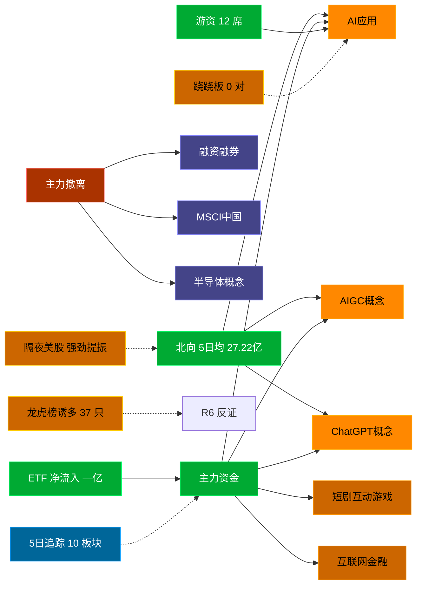

# 2026-09-07 · **资金面**

> **数据源新鲜度**: ok (数据截至 20260904，T-1 周五·周一盘前最新可得)
> **降级状态**: False
> **置信度**: 0.77

## 一句话结论
北向近 5 日均 27.22 亿，主力集中「AI应用/AIGC概念/ChatGPT概念」；资金撤离端 top1「融资融券」，龙虎榜诱多 37 只。 隔夜半导体 +4.0%（强劲提振）。🟢 新鲜度: ok（T-1 周五）

## 外部传导（隔夜美股）

**隔夜快照日期**: 20260904 · 影响等级: **强劲提振**

- 半导体 8 股平均: **+3.99%**，趋势: up
- 科技 6 股平均: **-1.80%**
- 半导体最弱: AVGO (+0.21%)
- 半导体最强: MRVL (+7.05%)

| 标的 | 涨跌幅 | 映射 A 股方向 |
|---|---|---|
| NVDA | ⚪ +0.84% | AI算力 / GPU / 光模块 |
| AMD | 🟢 +4.69% | CPU/GPU / 算力芯片 |
| AVGO | ⚪ +0.21% | AI芯片 / 光模块 / 设计 |
| MU | 🟢 +6.10% | 存储芯片 / 存储模组 |
| TSM | 🟢 +2.85% | 晶圆代工 / 先进封装 |
| INTC | 🟢 +4.51% | CPU / 芯片代工 |
| GLW | 🟢 +5.68% | 光通信 / 光纤 / 光模块上游 |
| MRVL | 🟢 +7.05% | 数据中心芯片 / 光通信 |
| AAPL | 🔴 -2.51% | 消费电子 / 苹果链 |
| MSFT | 🔴 -2.04% | 云服务 / AI算力 |
| GOOGL | 🔴 -1.17% | AI / 广告 / 云 |
| META | ⚪ +1.00% | AI应用 / 社交 |
| AMZN | ⚪ -0.15% | 电商 / 云 |
| TSLA | 🔴 -5.92% | 新能源车 / 机器人 |

**A 股敏感方向**:
- 🟩 storage_chain: 提振
- 🟩 cpo_optical: 提振
- 🟩 ai_computing: 提振
- 🔻 consumer_electronics: 承压
- 🔻 new_energy_vehicle: 承压

**对今日资金面的含义**: 隔夜半导体大涨（+3.99%），存储/CPO/算力链受强提振，开盘阶段资金或聚焦科技成长；但 AAPL/TSLA 大跌对应果链/新能源车承压，注意科技内部分化。港股恒指 +1.74%、韩股 +1.64% 同步偏暖，亚洲科技风险偏好回升。

## 资金流转拓扑图

## 详细分析

**1) 北向时序**
最新交易日 20260904 净流入 27.42 亿；5 日均 27.22 亿，20 日均 28.59 亿。 近 5 日: 0831 32.6 → 0901 27.3 → 0902 24.5 → 0903 24.3 → 0904 27.4。 周一盘前参考周五数据（T-1 最新可得），周末若有政策面变化需盘中重估。

**2) 主力板块 (数据日=20260904·周五)**
- 流入 TOP10：AI应用 +85.5亿 / AIGC概念 +58.1亿 / ChatGPT概念 +46.5亿 / 短剧互动游戏 +43.7亿 / 互联网金融 +43.0亿 / 文娱消费 +42.0亿 / AI智能体 +41.5亿 / Web3.0 +40.9亿 / 虚拟数字人 +40.9亿 / 多模态AI +39.3亿
- 流出 TOP10：融资融券 -416.6亿 / MSCI中国 -323.3亿 / 半导体概念 -273.3亿 / 2026中报预增 -247.8亿 / 科技风格 -240.3亿 / 标准普尔 -235.3亿 / 富时罗素 -234.5亿 / 国产芯片 -233.6亿 / 大盘股 -229.2亿 / 沪股通 -215.1亿

**大资金意图**: 从流入端「AI应用 / AIGC概念 / ChatGPT概念」的结构看，主力集中加仓强势主线，是结构性行情而非普涨；流出端集中在前期涨幅较大板块，资金再分配特征明显。注意周一开盘可能出现周末消息消化后的方向修正。
**为什么走强**: AI应用 周五排名居首 + 超大单净流入居前，说明机构配置盘认可，不是纯短线游资推动。经过周末发酵后，若有消息面配合则可能延续。
**逻辑够不够硬**: 数据新鲜度 ok（T-1 周五收盘最新可得，周末间隔），盘中若大级别政策/外围事件本判断失效；建议 D1 以「板块方向」而非「精准金额」使用，盘中验证第一小时量能。

**3) 昨日前十 5 日追踪 (核心)**
- **AI应用**: 0831:+52.3 → 0901:+20.4 → 0902:-79.9 → 0903:-23.1 → 0904:+85.5 亿 | 累计 +55.2 亿 · 正流入 3/5 · **偏强净入·有波动**
- **AIGC概念**: 0831:+60.3 → 0901:-2.0 → 0902:-51.0 → 0903:-9.7 → 0904:+58.1 亿 | 累计 +55.8 亿 · 正流入 2/5 · **末日翻红·前段净出**
- **ChatGPT概念**: 0831:+30.3 → 0901:-10.4 → 0902:-41.7 → 0903:-14.8 → 0904:+46.5 亿 | 累计 +9.8 亿 · 正流入 2/5 · **末日翻红·前段净出**
- **短剧互动游戏**: 0831:+37.9 → 0901:-3.5 → 0902:-31.8 → 0903:-15.5 → 0904:+43.7 亿 | 累计 +30.8 亿 · 正流入 2/5 · **末日翻红·前段净出**
- **互联网金融**: 0831:+5.8 → 0901:+31.6 → 0902:-70.0 → 0903:+0.2 → 0904:+43.0 亿 | 累计 +10.5 亿 · 正流入 4/5 · **加速流入**
- **文娱消费**: 0831:+40.7 → 0901:-5.6 → 0902:-32.1 → 0903:-7.0 → 0904:+42.0 亿 | 累计 +38.1 亿 · 正流入 2/5 · **末日翻红·前段净出**
- **AI智能体**: 0831:+43.8 → 0901:+1.0 → 0902:-36.4 → 0903:-16.4 → 0904:+41.5 亿 | 累计 +33.6 亿 · 正流入 3/5 · **偏强净入·有波动**
- **Web3.0**: 0831:+17.4 → 0901:+0.1 → 0902:-25.2 → 0903:-14.8 → 0904:+40.9 亿 | 累计 +18.4 亿 · 正流入 3/5 · **偏强净入·有波动**
- **虚拟数字人**: 0831:+36.4 → 0901:-2.7 → 0902:-37.1 → 0903:-15.1 → 0904:+40.9 亿 | 累计 +22.4 亿 · 正流入 2/5 · **末日翻红·前段净出**
- **多模态AI**: 0831:+28.8 → 0901:+0.6 → 0902:-31.9 → 0903:-11.6 → 0904:+39.3 亿 | 累计 +25.2 亿 · 正流入 3/5 · **偏强净入·有波动**

**4) 游资 (龙虎榜 · 20260904)**
具名活跃席位 12 席，3 日协同信号 30 条。TOP 5:
- 开源证券股份有限公司西安西大街证券营业部: 净额 37474.0 万，覆盖 12 票
- 国联民生证券股份有限公司宜兴阳羡东路证券营业部: 净额 -34621.0 万，覆盖 1 票
- 高盛(中国)证券有限责任公司上海浦东新区世纪大道证券营业部: 净额 25510.7 万，覆盖 15 票
- 国泰海通证券股份有限公司武汉紫阳东路证券营业部: 净额 25071.8 万，覆盖 2 票
- 国泰海通证券股份有限公司成都北一环路证券营业部: 净额 24523.9 万，覆盖 2 票

3 日协同 (同席位 3 日内净买同票 ≥2 次):
- 国信证券股份有限公司浙江互联网分公司 × 600721.SH: 3 次 · 净买 6357.8 万 · level=high
- 中信证券股份有限公司上海分公司 × 600127.SH: 3 次 · 净买 10770.9 万 · level=high
- 国金证券股份有限公司深圳分公司 × 920176.BJ: 2 次 · 净买 375.8 万 · level=medium
- 国金证券股份有限公司深圳分公司 × 920222.BJ: 2 次 · 净买 379.6 万 · level=medium
- 国信证券股份有限公司浙江互联网分公司 × 605179.SH: 2 次 · 净买 447.9 万 · level=medium

**5) 龙虎榜诱多识别 (核心)**
当日总计 57 只上榜，命中诱多规则 **37 只**。前 10：

| 代码 | 名称 | 涨幅 | 换手 | 龙虎榜净额(万) | 机构净额(万) | 模式 | 上榜原因 |
|---|---|---|---|---|---|---|---|
| 000892.SZ | 欢瑞世纪 | +10.04% | 43.9% | -1845 | -2211 | 涨停净卖出 + 机构专用净卖 | 连续三个交易日内，涨幅偏离值累计达到20%的证券 |
| 920970.BJ | 大禹生物 | +17.70% | 29.0% | -562 | -538 | 涨停净卖出 + 疑似对倒:江海证券有限公司深圳… | 当日价格振幅达到30%的前5只股票 |
| 603162.SH | 海通发展 | +9.99% | 19.8% | -3106 | +0 | 涨停净卖出 | 非S证券连续三个交易日内收盘价格涨幅偏离值累计达到20%的证券 |
| 920071.BJ | 金钛股份 | +15.72% | 75.5% | -520 | +2431 | 涨停净卖出 | 当日价格振幅达到30%的前5只股票 |
| 600108.SH | 亚盛集团 | +10.10% | 11.7% | -501 | +0 | 涨停净卖出 | 有价格涨跌幅限制的日收盘价格涨幅偏离值达到7%的前五只证券 |
| 000977.SZ | 浪潮信息 | -9.99% | 11.7% | -48404 | -89409 | 机构专用净卖 | 日跌幅偏离值达到7%的前5只证券 |
| 603256.SH | 宏和科技 | -10.00% | 3.0% | -42337 | -31341 | 机构专用净卖 + 疑似对倒:瑞银证券有限责任公司… | 有价格涨跌幅限制的日收盘价格跌幅偏离值达到7%的前五只证券 |
| 002909.SZ | 集泰股份 | -9.99% | 37.8% | -10634 | -14230 | 换手异常且净卖出 + 机构专用净卖 | 日换手率达到20%的前5只证券 |
| 002104.SZ | 恒宝股份 | +7.66% | 33.7% | +21018 | -3789 | 机构专用净卖 | 日换手率达到20%的前5只证券 |
| 000017.SZ | 深中华A | -10.02% | 24.1% | -4559 | -2506 | 机构专用净卖 + 疑似对倒:国信证券股份有限公司… | 日跌幅偏离值达到7%的前5只证券 |

**6) 板块跷跷板**
_未检出显著跷跷板配对（corr ≤ -0.6 且方向反转的板块对）。_

**7) ETF / 期货 / 期权**
ETF 净流入 — 亿(代表ETF)；期权隐含波动率: 数据缺。

## 关键证据
- 主力流入 top1 AI应用 +85.5 亿 · 来源 tushare.moneyflow_ind_dc
- 5 日追踪：AI应用 累计 55.25 亿, 3/5 日正流入, 趋势「偏强净入·有波动」
- 流出 top1 融资融券 -416.6 亿 · 来源 tushare.moneyflow_ind_dc
- 龙虎榜诱多 37 只，其中「涨停净卖出」5 只 · 来源 tushare.top_list+top_inst
- 游资 3 日协同 30 条 · 来源 tushare.top_inst 席位统计
- 板块跷跷板 0 对 · 来源 moneyflow_ind_dc 10 日相关
- 北向最新 27.42 亿（20260904） · 来源 tushare.moneyflow_hsgt
- 隔夜美股半导体平均 +3.99%（20260904）· 来源 overseas_snapshot.json + tushare.us_daily

## 数据源审计
| 源 | 状态 | 抓取日期 | 记录数 | 备注 |
|---|---|---|---|---|
| tushare.moneyflow_hsgt | 🟢 ok | 20260904 | 20 日 | 北向时序 |
| tushare.moneyflow_ind_dc | 🟢 ok | 20260904 | 5 日 × ~1000 行 | 概念板块资金流 5 日追踪 + 10 日跷跷板 |
| tushare.top_list | 🟢 ok | 20260904 | 57 行 | 龙虎榜上榜个股 |
| tushare.top_inst | 🟢 ok | 20260904 | 660 席位 | 龙虎榜买卖席位明细 + 3 日协同 |
| overseas_snapshot.json | 🟢 ok | 20260904 | 14 | 隔夜美股核心 14 股 (20260904 美盘=最新) |
| tushare.index_global | 🟢 ok | 20260904 | 5 | 美股/亚太指数 |
| vibe-trading | 🟠 partial | 20260904 | — | 盘前无法访问，降级走 Tushare 主路 |

## 不确定性 / 反证
- 数据新鲜度 ok（T-1 周五收盘最新可得，距收盘约 64 小时，含周末 2 天空窗），周一开盘前无法获取周末最新消息面/政策面变化，本判断需盘中第一小时验证。
- 龙虎榜诱多规则为静态启发式，未剔除 T+1 高开对冲情形，可能高估诱多密度；供 R6 反证参考，不作 hard_reject。
- Tushare hm_detail 存在 T+1 延迟；xtick/datapro 可作实时补充但盘前抓取以 Tushare 为主。
- 5 日追踪只跟踪周五 top10，若周一风格切换到前期弱势板块，本追踪盲区。
- ETF 净流入基于代表 ETF 估算，非真实一级市场资金流水。
- 隔夜美股为周五(0904)美盘 = 周一盘前最新完整数据，无滞后；但周末欧美若发生地缘/政策事件，本传导失效，需开盘前用 xtick 核验。
- vibe-trading MCP 盘前不可用，缺少大宗交易/两融独立证据面，confidence 已扣减。

## 与其他 R/D/E 的关系
- 依赖: Tushare MCP (moneyflow_hsgt/moneyflow_ind_dc/top_list/top_inst/fund_daily) + overseas_snapshot.json
- 被消费: D1(main_decision_v1) · R2(analyze_main_sectors_v1) · R5(analyze_stock_profile_v1) · R6(analyze_devil_advocate_v1)

## Sub-Agent 元数据
- skill: analyze_capital_flow_v1
- artifact: /Users/chenyang/Downloads/demo/沧海巨浪/data/research/20260907/R7_capital_flow.json
- 生成方式: enrich_r7_20260907.py (从零构建 + 刷新北向/主力/5日追踪/龙虎榜诱多/隔夜美股 + mermaid)
- model: deepseek-v4-flash-260425
- 生成耗时: 9.5 秒
