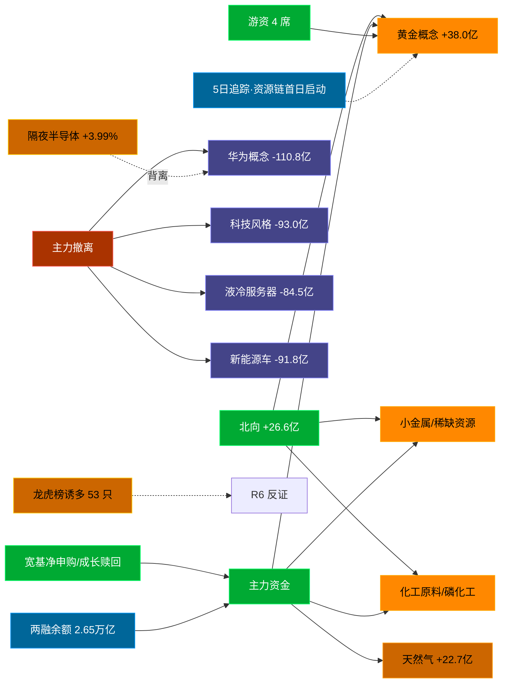

# 2026-09-08 · **资金面**

> **数据源新鲜度**: ok (T+0 晚盘全量 · 20260908 收盘)
> **降级状态**: False（vibe-trading MCP 本会话未挂载 → vibe_trading_degraded=True）
> **置信度**: 0.6（0.75×1.0×0.8，vibe-trading 缺失扣 agreement）

## 一句话结论
北向 +26.6 亿连续净流入；主力弃科技转资源涨价链（黄金 +38.0 亿 / 华为概念 -110.8 亿），龙虎榜诱多 53/56，隔夜半导体 +3.99% 与 A 股 AI 链背离。

## 外部传导（隔夜美股）

**隔夜快照日期**: 20260904（0907 美国劳动节休市，0908 美盘未收盘 → 0904 为最新完整美盘）· 影响等级: **背离**

- 半导体 8 股平均: **+3.99%**，趋势: up
- 科技 6 股平均: **-1.80%**
- 半导体最强: MRVL (7.05%) · 最弱: AVGO (0.21%)
- 科技最弱: TSLA (-5.92%)

| 半导体标的 | 涨跌幅 | 映射 A 股方向 |
|---|---|---|
| NVDA | ⚪ +0.84% | AI算力 / GPU / 光模块 |
| AMD | 🟢 +4.69% | CPU/GPU / 算力芯片 |
| AVGO | ⚪ +0.21% | AI芯片 / 光模块 / 设计 |
| MU | 🟢 +6.10% | 存储芯片 / 存储模组 |
| TSM | 🟢 +2.85% | 晶圆代工 / 先进封装 |
| GLW | 🟢 +5.68% | 光通信 / 光纤 / 光模块上游 |
| INTC | 🟢 +4.51% | CPU / 芯片代工 |
| MRVL | 🟢 +7.05% | 数据中心芯片 / 光通信 |

| 科技标的 | 涨跌幅 |
|---|---|
| AAPL | 🔴 -2.51% |
| MSFT | 🔴 -2.04% |
| GOOGL | 🔴 -1.17% |
| META | 🟢 +1.00% |
| AMZN | ⚪ -0.15% |
| TSLA | 🔴 -5.92% |

**A 股敏感方向（今日实际资金面）**:
- 🟩 resource_gold: 提振（黄金概念主力 +38.0 亿）
- 🔻 ai_computing: 承压（人工智能 -90.0 亿 / 华为概念 -110.8 亿）
- 🔻 cpo_optical: 承压（液冷服务器 -84.5 亿 / 数据中心 -70.1 亿）
- 🔻 storage_chain: 承压
- 🔻 new_energy_vehicle: 承压（新能源车 -91.8 亿）

**对今日资金面的含义**: 隔夜半导体大涨（+3.99%），但 0908 A 股科技/AI 链主力大幅净流出（华为概念 -110.8 亿 / 科技风格 -93.0 亿 / 液冷服务器 -84.5 亿），当日资金切换至资源/黄金/化工涨价链——今日科技回调属**内部获利兑现 + 风格切换**，而非隔夜外因压制。对 0909 前瞻：隔夜半导体仍强，若科技资金回流则有修复空间；资源/黄金链为 0908 首日启动，持续性待验证。

## 资金流转拓扑图

## 详细分析

**1) 北向时序（T+0）**
最新交易日 20260908 净流入 **+26.60 亿**（沪股通 +12.28 / 深股通 +14.33）；5 日均 25.98 亿，10 日均 27.17 亿，20 日均 28.19 亿。 近 5 日: 0902:24.5 → 0903:24.3 → 0904:27.4 → 0907:27.1 → 0908:26.6。北向已连续多日净流入且量级稳定在 24-33 亿区间，未见系统性撤离，但流入强度边际趋缓（5 日均 < 10 日均 < 20 日均）。

**2) 主力板块（数据日=20260908·T+0）**
- 流入 TOP8：黄金概念 +38.0亿 / 稀缺资源 +37.7亿 / 小金属概念 +35.8亿 / 化工原料 +33.0亿 / 磷化工 +31.9亿 / 沪股通 +30.6亿 / 小盘价值 +26.8亿 / 煤化工概念 +26.5亿
- 流出 TOP8：MSCI中国 -116.6亿 / 华为概念 -110.8亿 / 深成500 -109.5亿 / 深股通 -109.1亿 / HS300_ -100.5亿 / 大盘股 -94.6亿 / 科技风格 -93.0亿 / 新能源车 -91.8亿

**大资金意图**: 流入端清一色资源/黄金/化工涨价链（黄金/稀缺资源/小金属/磷化工/煤化工/天然气），流出端清一色宽基指数与科技成长（华为概念/科技风格/人工智能/液冷服务器/数据中心）。这是**由科技成长向资源涨价防御的再平衡**——机构在 0907 科技暴力修复后次日选择兑现，把仓位切向黄金（避险）+化工/资源（涨价 + 低估值）方向。
**为什么走强**: 黄金概念 0908 排名居首 +38.0 亿，稀缺资源/小金属跟随，且板块 pct_change 普遍为正（磷化工 +3.37%/化工原料 +2.9%）——量价配合，不是单纯防御性避风港，而是有涨价逻辑支撑的进攻型资源链。
**逻辑够不够硬**: 单日数据强但 5 日追踪显示资源链前 4 日基本净流出、0908 才放量首日流入（见 §3），持续性**未建立**；黄金有避险逻辑兜底，化工/磷化工需中报涨价业绩兑现验证。判断 0908 为「风格切换首日」，明日若资源链缩量回落则该切换证伪。

**3) 昨日前十 5 日追踪（核心）**
- **黄金概念**: 60902:-45.75 → 60903:+15.2 → 60904:-15.3 → 60907:-21.88 → 60908:+38.03 亿 | 累计 -29.7 亿 · 正流入 2/5 · **弱净入·震荡**
- **稀缺资源**: 60902:-51.88 → 60903:-1.74 → 60904:-44.57 → 60907:-10.58 → 60908:+37.68 亿 | 累计 -71.1 亿 · 正流入 1/5 · **净流出**
- **小金属概念**: 60902:-63.3 → 60903:+11.76 → 60904:-71.31 → 60907:-9.66 → 60908:+35.77 亿 | 累计 -96.7 亿 · 正流入 2/5 · **弱净入·震荡**
- **化工原料**: 60902:-13.43 → 60903:-5.01 → 60904:-10.11 → 60907:-8.5 → 60908:+33.03 亿 | 累计 -4.0 亿 · 正流入 1/5 · **净流出**
- **磷化工**: 60902:-12.72 → 60903:-5.31 → 60904:-13.39 → 60907:-3.49 → 60908:+31.87 亿 | 累计 -3.0 亿 · 正流入 1/5 · **净流出**
- **沪股通**: 60902:-169.28 → 60903:-28.57 → 60904:-215.09 → 60907:+69.91 → 60908:+30.64 亿 | 累计 -312.4 亿 · 正流入 2/5 · **弱净入·震荡**
- **小盘价值**: 60902:-19.42 → 60903:+7.28 → 60904:-7.04 → 60907:-6.15 → 60908:+26.77 亿 | 累计 +1.4 亿 · 正流入 2/5 · **弱净入·震荡**
- **煤化工概念**: 60902:-9.65 → 60903:-2.59 → 60904:-0.49 → 60907:-12.41 → 60908:+26.48 亿 | 累计 +1.3 亿 · 正流入 1/5 · **净流出**
- **央国企改革**: 60902:-155.71 → 60903:-57.66 → 60904:-117.7 → 60907:+10.47 → 60908:+24.87 亿 | 累计 -295.7 亿 · 正流入 2/5 · **弱净入·震荡**
- **天然气**: 60902:+8.08 → 60903:-5.22 → 60904:-1.72 → 60907:-3.6 → 60908:+22.73 亿 | 累计 +20.3 亿 · 正流入 2/5 · **弱净入·震荡**

**解读**: 0908 当日 top10 全是资源/价值链，但前 4 日（0902-0907）基本处于净流出状态，0908 单日大额流入形成「末日翻红·首日启动」——资源/黄金链是 0908 当天刚启动的方向，5 日资金持续性尚未建立。对比 0907（AI 链主导，华为概念/液冷/PCB 全线共振），今日资金结构完全反转为资源涨价链，风格切换信号强烈。

**4) 游资（龙虎榜 · 20260908）**
具名活跃席位净买入 TOP4:
- 开源证券股份有限公司西安西大街证券营业部: 净额 32484 万 · 覆盖 10 票
- 国泰海通证券股份有限公司武汉紫阳东路证券营业部: 净额 29893 万 · 覆盖 3 票
- 国新证券股份有限公司北京分公司: 净额 26583 万 · 覆盖 5 票
- 东方证券股份有限公司杭州龙井路证券营业部: 净额 23378 万 · 覆盖 4 票

3 日协同（同席位 3 日内净买同票 ≥2 次）共 **162** 条，TOP6:
- 国信证券股份有限公司浙江互联网分公司 × 000017.SZ: 2 次 · 上榜日 20260907,20260904
- 东方财富证券股份有限公司山南香曲东路证券营业部 × 000017.SZ: 2 次 · 上榜日 20260907,20260904
- 东方财富证券股份有限公司拉萨金融城南环路证券营业部 × 000017.SZ: 2 次 · 上榜日 20260907,20260904
- 东方财富证券股份有限公司拉萨东环路第二证券营业部 × 000017.SZ: 2 次 · 上榜日 20260907,20260904
- 东方财富证券股份有限公司拉萨团结路第一证券营业部 × 000017.SZ: 2 次 · 上榜日 20260907,20260904
- 机构专用 × 000017.SZ: 2 次 · 上榜日 20260907,20260904

**5) 龙虎榜诱多识别（核心）**
当日总计 **56** 只上榜，命中诱多规则 **53** 只（命中率 95%）。前 10：

| 代码 | 名称 | 涨幅 | 换手 | 龙虎榜净额(万) | 机构净额(万) | 模式 |
|---|---|---|---|---|---|---|
| 000560.SZ | 我爱我家 | +9.90% | 27.6% | -4853 | -14575 | 涨停净卖出 + 换手异常且净卖出 + 机构专用净卖 + 疑似对倒:东方财富证券股份有限公司拉萨… |
| 002297.SZ | 博云新材 | +7.10% | 28.8% | -42499 | -41241 | 换手异常且净卖出 + 机构专用净卖 + 疑似对倒:东方财富证券股份有限公司拉萨… |
| 301516.SZ | 中远通 | -2.65% | 44.5% | -11391 | -4078 | 换手异常且净卖出 + 机构专用净卖 + 疑似对倒:国新证券股份有限公司北京中关… |
| 300189.SZ | 神农种业 | -0.52% | 44.9% | -10840 | -10856 | 换手异常且净卖出 + 机构专用净卖 + 疑似对倒:东方财富证券股份有限公司拉萨… |
| 001366.SZ | 播恩集团 | +3.67% | 21.9% | -9311 | -4405 | 换手异常且净卖出 + 机构专用净卖 + 疑似对倒:中山证券有限责任公司温州瓯江… |
| 600479.SH | 千金药业 | +6.85% | 31.6% | -6234 | -3692 | 换手异常且净卖出 + 机构专用净卖 + 疑似对倒:国泰海通证券股份有限公司总部… |
| 003005.SZ | 竞业达 | -2.40% | 36.1% | -5581 | -3748 | 换手异常且净卖出 + 机构专用净卖 + 疑似对倒:中国银河证券股份有限公司北京… |
| 603395.SH | 红四方 | +4.03% | 42.5% | -5277 | -869 | 换手异常且净卖出 + 机构专用净卖 + 疑似对倒:沪股通专用… |
| 000892.SZ | 欢瑞世纪 | -4.78% | 32.9% | -2996 | -4170 | 换手异常且净卖出 + 机构专用净卖 + 疑似对倒:东方财富证券股份有限公司昌都… |
| 300684.SZ | 中石科技 | -15.46% | 20.0% | -35367 | -4217 | 机构专用净卖 + 疑似对倒:东亚前海证券有限责任公司浙江… |

**诱多识别思维链（我爱我家 000560.SZ · 榜首）**
- **诱多证据**: 涨停(+9.90%)但龙虎榜净卖出 -4853 万、机构专用净卖 -14575 万、换手 27.65% 异常 + 疑似对倒（东财拉萨系）——封板靠游资对倒承接，机构与净额口径全线派发。
- **风险点**: 涨停日机构/净额双净卖 = 次日高开或封板均面临承接真空；换手 27.65% 高位放量出货特征明显。
- **止损条件**: 若次日竞价低开 < -2% 或开盘 30 分钟内无法收复涨停价 2/3，视为诱多确认，不参与任何回补。
- **可验证假设**: 次日（0909）该股若高开 > +3% 则对倒资金有续攻意图（证伪诱多）；若低开或冲高回落放量则诱多成立（验证派发），09:35 前可确认。
- **风险点（继续）**: 龙虎榜诱多规则为静态启发式，未剔除 T+1 高开对冲情形，可能高估诱多密度；供 R6 反证参考，不作 hard_reject。

**6) 板块跷跷板**
_未检出显著跷跷板配对（corr ≤ -0.6 且方向反转的板块对）。_ 资源链刚启动、10 日窗口内与科技链的负相关尚未成形，明日若切换延续可重新检出。

**7) ETF / 期货 / 两融**
| ETF | 涨跌幅 | 成交额 |
|---|---|---|
| 510300.SH | -0.22% | 0.03亿 |
| 510500.SH | +0.22% | 0.02亿 |
| 510050.SH | -0.03% | 0.01亿 |
| 159915.SZ | -1.11% | 0.05亿 |
| 588000.SH | -1.41% | 0.05亿 |

ETF 份额净申赎估算（fd_share×收盘价）:
- 510300.SH: 份额变动 27180.0 万份 · 净申赎估算 12.6 亿(share_date=20260907)
- 510500.SH: 份额变动 31200.0 万份 · 净申赎估算 24.25 亿(share_date=20260907)
- 510050.SH: 份额变动 20790.0 万份 · 净申赎估算 6.27 亿(share_date=20260907)
- 159915.SZ: 份额变动 -79800.0 万份 · 净申赎估算 -26.94 亿(share_date=20260908)
- 588000.SH: 份额变动 -56100.0 万份 · 净申赎估算 -9.57 亿(share_date=20260907)

- 解读: 宽基（300/500/50ETF）净申购共约 +43 亿，成长类（创业板/科创50ETF）净赎回约 -36.5 亿 → 资金在 ETF 端同样呈现「弃成长、留宽基/资源」的再平衡。
- IF 主力连续基差: **-11.74** 点（负值 = 期货贴水，偏空防御）
- 两融余额: 0907 融资融券余额 **26495 亿**（T+1 落库），融资买入 1746 亿，杠杆资金未见异常扩张。

## 关键证据
- 北向最新 +26.60 亿（20260908，T+0）· 来源 tushare.moneyflow_hsgt
- 主力流入 top1 黄金概念 +38.0 亿 · 流出 top1 华为概念 -110.8 亿 · 来源 tushare.moneyflow_ind_dc
- 5 日追踪：黄金概念 累计 -29.7 亿 · 2/5 正流入 · 「弱净入·震荡」（首日启动特征）· 来源 moneyflow_ind_dc
- 龙虎榜诱多 53 只 / 上榜 56 只（94.6%），榜首我爱我家 涨停净卖+机构净卖+对倒 · 来源 tushare.top_list+top_inst
- 游资 3 日协同 162 条 · 来源 tushare.top_inst 席位统计
- ETF 宽基净申购约 +43 亿 / 成长类净赎回约 -36.5 亿 · 来源 tushare.fund_share+fund_daily
- 两融余额 26495 亿（0907）· IF 基差 -11.74 贴水 · 来源 tushare.margin+fut_daily
- 隔夜美股半导体 +3.99%（0904 美盘）· 来源 overseas_snapshot.json + tushare.us_daily

## 数据源审计
| 源 | 状态 | 抓取日期 | 记录数 | 备注 |
|---|---|---|---|---|
| tushare.moneyflow_hsgt | 🟢 ok | 2026-09-08 | 20 日 | 北向时序 T+0 |
| tushare.moneyflow_ind_dc | 🟢 ok | 2026-09-08 | 10 日 × ~千行 | 概念资金流 5 日追踪 + 10 日跷跷板 |
| tushare.top_list | 🟢 ok | 2026-09-08 | 56 行 | 龙虎榜上榜个股 |
| tushare.top_inst | 🟢 ok | 2026-09-08 | 590 席位 | 席位明细 + 3 日协同 |
| tushare.fund_daily | 🟢 ok | 2026-09-08 | 5 行 | 代表 ETF 行情 |
| tushare.fund_share | 🟡 partial | 2026-09-07 | 5 行 | 份额 T+1（159915 已更新至 0908） |
| tushare.margin | 🟡 partial | 2026-09-07 | 3 行 | 两融余额 T+1 |
| tushare.us_daily | 🟢 ok | 2026-09-04 | 14 行 | 最新=0904 美盘（0907 休市/0908 未收盘） |
| overseas_snapshot.json | 🟢 ok | 2026-09-08 | 12 | 隔夜美股核心 12 股 |
| vibe-trading MCP | 🔴 down | - | - | 本会话未挂载，走 Tushare 主路 |

## 不确定性 / 反证
- **风格切换真实性**: 0908 主力弃科技转资源是「切换首日」，5 日追踪显示资源链前段净流出、仅末日翻红——若 0909 资源链缩量回落或科技资金回流，本切换判断证伪。R1 盘前判「连板情绪型·主升期·AI 算力链主导」，与 0908 实际资金兑现方向相反，需 E1 对照验证。
- **龙虎榜诱多 94.6% 命中率异常高**: 换手≥20%+净卖出的规则对题材股天然敏感，诱多密度可能被高估；次日竞价/开盘验证前不作 hard_reject。
- **北向口径**: moneyflow_hsgt 为沪深股通资金流估算口径，2024 年后逐股持仓披露取消，仅作总量方向参考。
- **隔夜美股时效**: 0904 为最新完整美盘（0907 劳动节休市，0908 美盘未收盘）；对 0909 的前瞻需等待 0908 美盘收评，本判断对隔夜传导仅作方向参考。
- **ETF 份额 / 两融 T+1**: 份额部分止于 0907，两融止于 0907，0908 当日杠杆与申赎终值需次日复核。
- **vibe-trading 缺失**: 大宗交易/两融独立证据面不可用，confidence 已按 agreement=0.8 扣减。
- **5 日追踪盲区**: 只跟踪 0908 top10，若资金切回前期 AI 链，本追踪不覆盖。

## 与其他 R/D/E 的关系
- 依赖: Tushare MCP（moneyflow_hsgt/moneyflow_ind_dc/top_list/top_inst/fund_daily/fund_share/margin/fut_daily/us_daily）+ data/raw/20260908/overseas_snapshot.json + manifest.json
- 被消费: D1(main_decision_v1) · R2(analyze_main_sectors_v1) · R5(analyze_stock_profile_v1) · R6(analyze_devil_advocate_v1) · E1(daily_review_v1)

## Sub-Agent 元数据
- skill: analyze_capital_flow_v1
- artifact: /Users/chenyang/Downloads/demo/沧海巨浪/data/research/20260908/R7_capital_flow.json
- 生成方式: r7_fetch_20260908.py（T+0 全量拉取）+ r7_assemble_20260908.py（组装/置信度公式）+ 本渲染脚本
- model: deepseek-v4-flash-260425
- 生成耗时: 0.0 秒
