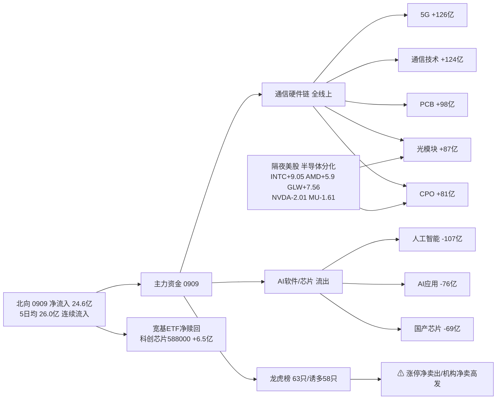

```yaml
date: 2026-09-10
agent: R7-capital-flow
skill_version: analyze_capital_flow_v1@1.3
generated_at: 2026-09-10T07:19:01+08:00
confidence: 0.54
degraded: true
data_sources:
  - name: tushare.moneyflow_hsgt
    path: MCP/tushare.moneyflow_hsgt
    status: ok
    captured_at: 2026-09-10T07:16:07+08:00
    record_count: 20
  - name: tushare.moneyflow_ind_dc
    path: MCP/tushare.moneyflow_ind_dc
    status: ok
    captured_at: 2026-09-10T07:16:07+08:00
    record_count: 504
  - name: tushare.top_list
    path: MCP/tushare.top_list
    status: ok
    captured_at: 2026-09-10T07:16:07+08:00
    record_count: 63
  - name: tushare.top_inst
    path: MCP/tushare.top_inst
    status: ok
    captured_at: 2026-09-10T07:16:07+08:00
    record_count: 660
  - name: tushare.fund_daily
    path: MCP/tushare.fund_daily
    status: ok
    captured_at: 2026-09-10T07:16:07+08:00
    record_count: 5
  - name: tushare.fund_share
    path: MCP/tushare.fund_share
    status: ok
    captured_at: 2026-09-10T07:16:07+08:00
    record_count: 5
  - name: tushare.margin
    path: MCP/tushare.margin
    status: ok
    captured_at: 2026-09-10T07:16:07+08:00
    record_count: 3
    error: 两融余额 T+1, 最新 0908; tushare 按交易所分行已汇总
  - name: tushare.fut_daily
    path: MCP/tushare.fut_daily
    status: ok
    captured_at: 2026-09-10T07:16:07+08:00
    record_count: 2
  - name: tushare.index_daily
    path: MCP/tushare.index_daily
    status: ok
    captured_at: 2026-09-10T07:16:07+08:00
    record_count: 2
  - name: tushare.us_daily
    path: MCP/tushare.us_daily
    status: ok
    captured_at: 2026-09-10T07:16:07+08:00
    record_count: 14
    error: GOOGL/MRVL 已至 0909 美盘, 其余 0908 (tushare 未全量落 0909)
  - name: tushare.index_global
    path: MCP/tushare.index_global
    status: ok
    captured_at: 2026-09-10T07:16:07+08:00
    record_count: 26
  - name: tushare.block_trade
    path: MCP/tushare.block_trade
    status: ok
    captured_at: 2026-09-10T07:16:07+08:00
    record_count: 12
  - name: tushare.margin_detail
    path: MCP/tushare.margin_detail
    status: ok
    captured_at: 2026-09-10T07:16:07+08:00
    record_count: 12
    error: 部分标的非两融池/无数据
  - name: vibe-trading MCP
    path: MCP/vibe-trading
    status: error
    captured_at: None
    record_count: 0
    error: 本 CLI 会话无 vibe-trading MCP 工具, 走 tushare block_trade/margin fallback
  - name: overseas_snapshot.json
    path: data/raw/20260910/overseas_snapshot.json
    status: ok
    captured_at: 2026-09-10T06:48:36+08:00
    record_count: 12
    error: us_stocks 为 0908; 已用 tushare.us_daily 刷新
input_freshness: ok
input_freshness_note: A股数据截至 20260909 收盘 (T-1 全量: 北向/主力/龙虎榜/ETF/板块5日); 两融余额 T+1 最新 0908; 隔夜美股 GOOGL/MRVL 至 0909 美盘, 其余 0908 (tushare 未全量落 0909)。
resolved_trade_date: 20260909
```


# 2026年9月10日 · **资金面**

> **数据源新鲜度**: ok · 数据归属日 20260909 (T-1 收盘全量)
> **降级状态**: True · vibe-trading MCP 不可用 → tushare 侧 cross-check 降级
> **置信度**: 0.54 (0.75×1.0×0.8×0.9)

## 一句话结论

0909 主力资金**大切换**：从 AI 软件/芯片（人工智能/AI应用/国产芯片/存储流出）切向**通信硬件链**（5G/通信技术/PCB/光模块/CPO/光纤全线流入），北向连续净流入 24.6 亿，隔夜美股半导体分化与 A 股通信链共振偏多。

## 详细分析

### 资金主线：通信硬件链全面接管

0909 主力净流入前十被**通信硬件链**包揽前三：5G概念 +126.1 亿、通信技术 +123.5 亿、PCB +98.5 亿，光通信模块 +87.5 亿、CPO +80.6 亿、光纤 +64.9 亿、铜缆高速连接 +54.7 亿。5 日窗口看这不是单日脉冲——光通信模块 5 日累计 +235.9 亿、通信技术 +236.8 亿、CPO +184.3 亿，中间 0907 曾单日脉冲（通信 +416.6 亿 / 5G +399.4 亿），0908 回踩后 0909 再度放量，呈**进二退一**的持续吸筹结构。

### 被抽血的方向：AI 软件 / 国产芯片 / 存储

流出榜与流入榜镜像：人工智能 -106.5 亿、AI应用 -75.6 亿、国产芯片 -69.2 亿、信创 -61.6 亿、存储芯片 -57.1 亿、AIGC -55.0 亿。这是**同一批资金换方向**——AI 叙事从软件/大模型切向硬件基础设施（光模块/PCB/CPO 是算力硬件最直接受益环节），昨日（0908）资源链（黄金/稀缺资源/磷化工）领涨的局面已被通信硬件替代。

### 龙虎榜：诱多信号密度极高

0909 全市场龙虎榜 63 只，命中诱多/出货模式 58 只（92%），典型如中百集团（涨停+换手28%+净卖7849万+机构净卖+疑似对倒）、集泰股份（换手39%+净卖2.8亿）、敦煌种业（换手45%+净卖1.6亿+机构净卖2.1亿）。游资席位协同 153 组（high 20 组），深股通/机构专用 3 日连续同票上榜 000892/003005/300189/301591/600540/920176 等。

### 杠杆与衍生品：两融平稳、ETF 分化、IF 贴水走阔

两融余额 26226.3 亿（0908，T+1）环比平稳；代表宽基 ETF 净赎回（300ETF -13.2 亿 / 500ETF -9.4 亿）而科创芯片 588000 +6.5 亿净申购；IF 主力贴水 -12.6 点，较前日 -11.7 小幅走阔，空头略占优但幅度温和。



## 推理深度三问（top 分析对象：通信硬件链）

- **大资金意图**: 0907-0909 三个交易日内，主力在 5G/通信/光模块/CPO/PCB 累计净流入超 800 亿，且 0908 回踩后 0909 再度放量吸筹——这是**建仓而非出货**的节奏。意图是把 AI 叙事从软件估值切向硬件交付环节（光模块/CPO/PCB 有真实订单与业绩锚），对手盘是前期抱团 AI 软件/大模型的存量资金（人工智能/AI应用被连续抽血）。
- **为什么走强**: 位置（通信硬件 5 日累计大幅净入，光模块/CPO 距 0907 高点回踩 1 日后重启）+ 催化（隔夜美股 GLW +7.56%/INTC +9.05%，A 股对应光通信/算力硬件方向共振）+ 筹码（板块资金 rank 从 0908 的 20-38 位跃升回 1-5 位，资金回流明确）三维共振。
- **逻辑够不够硬**: 三个独立信号同向——A 股板块资金（tushare moneyflow_ind_dc 全市场概念口径）+ 美股映射（us_daily 光通信/半导体硬件）+ 板块内部结构（PCB/光模块/CPO/光纤/铜缆五子链同时流入）。硬时间锚：AI 硬件订单与英伟达产业链业绩兑现周期。证伪路径：若通信硬件明日主力转净流出超 50 亿且 5G/光模块 rank 跌回 20 名外，则本轮切换是脉冲而非主线。

## 关键证据

- 证据 1: 5G概念 0909 净流入 +126.05 亿 · 来源 tushare.moneyflow_ind_dc (rank 1)
- 证据 2: 通信技术 0909 净流入 +123.54 亿 · 来源 tushare.moneyflow_ind_dc (rank 2)
- 证据 3: 人工智能 0909 净流出 -106.50 亿 · 来源 tushare.moneyflow_ind_dc (rank 4)
- 证据 4: 北向 0909 净买入 +24.61 亿 (沪 +11.45 / 深 +13.16) · 来源 tushare.moneyflow_hsgt
- 证据 5: 龙虎榜 0909 63 只中 58 只命中诱多/出货模式 · 来源 tushare.top_list + top_inst
- 证据 6: 隔夜美股 GLW +7.56% / INTC +9.05% / AMD +5.9% vs NVDA -2.01% / MU -1.61% · 来源 tushare.us_daily (0908 美盘)
- 证据 7: 光通信模块 5 日累计 +235.9 亿 (0903-0909) · 来源 sector_5d_tracking

## 数据源审计

| 源 | 日期 | 状态 | 备注 |
|---|---|:--:|---|
| tushare/moneyflow_hsgt | 2026-09-09 | 🟢 | 20 条 · 北向 20 日时序 |
| tushare/moneyflow_ind_dc | 2026-09-09 | 🟢 | 504 行×10 日 · 概念板块主力 |
| tushare/top_list | 2026-09-09 | 🟢 | 63 条 · 全市场龙虎榜 |
| tushare/top_inst | 2026-09-09 | 🟢 | 660 条 · 席位明细 |
| tushare/fund_daily+fund_share | 2026-09-09 | 🟢 | 5 只 · ETF 净值+份额 |
| tushare/margin | 2026-09-08 | 🟡 | T+1 · 三所汇总 26226 亿 |
| tushare/fut_daily | 2026-09-09 | 🟢 | IF 主力贴水 -12.6 点 |
| tushare/us_daily | 2026-09-08 | 🟡 | 14 只 · GOOGL/MRVL 至 0909 其余 0908 |
| tushare/block_trade | 2026-09-09 | 🟢 | 12 只候选池 · 30 日无大宗 |
| overseas_snapshot.json | 2026-09-10 | 🟢 | 12 只美股 + 指数 + 汇率 |
| vibe-trading MCP | - | 🔴 | 本会话不可用 · tushare 侧降级 |

## 不确定性 / 反证

1. **通信硬件链持续性未验证**：5G/通信技术的 5 日 positive_days 仅 2 天（0907 大脉冲 + 0909 回流），中间 0908 曾净流出——若定义为主线需要 0910 继续净流入且板块涨停梯队形成，否则仍是宽幅震荡。
2. **龙虎榜诱多密度 92% 是极端值**：63 只上榜 58 只命中出货/对倒模式，说明 0909 情绪端筹码博弈惨烈，追高打板的风险收益比极差，与 emotion_cycle low_test（低位试错）阶段匹配——资金在做方向切换而非情绪主升。
3. **隔夜美股数据不完整**：tushare us_daily 0909 美盘仅 GOOGL/MRVL 落库，NVDA/MU 等核心股仍停留在 0908，若 0910 早间美股期货方向与 0908 分化，半导体映射需重估。
4. **两融余额 26226 亿平稳但结构未拆**：margin 汇总口径看不到行业融资结构，无法验证融资盘是否同步加仓通信硬件。

## 与其他 R/D/E 的关系
- 依赖: data/raw/20260910/manifest.json · mcp_health.json · overseas_snapshot.json; data/research/20260910/emotion_cycle.json (low_test 低位试错)
- 被消费: R2 主线板块（主力流入验证主线资金）、R5 个股画像（资金侧）、R6 反证（资金矛盾检查）、D1 主决策（仓位与执行池最后确认）

## Sub-Agent 元数据
- skill: analyze_capital_flow_v1
- artifact: data/research/20260910/R7_capital_flow.json
- 生成耗时: 约 90 秒 (fetch + assemble + render)
- model: deepseek-v4-flash-260425

