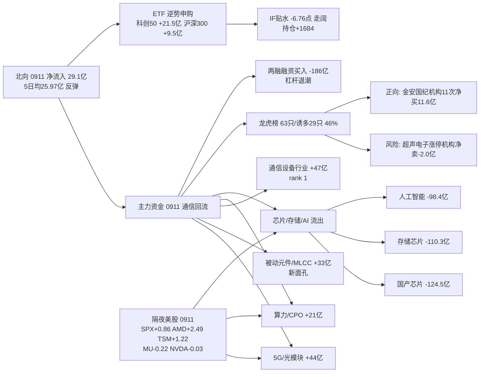

```yaml
date: 2026-09-14
agent: R7-capital-flow
skill_version: analyze_capital_flow_v1@1.3
generated_at: 2026-09-14T07:25:29+08:00
confidence: 0.5
degraded: true
data_sources:
  - name: tushare.moneyflow_hsgt
    path: MCP/tushare.moneyflow_hsgt
    status: ok
    captured_at: 2026-09-14T07:25:29+08:00
    record_count: 22
  - name: tushare.moneyflow_ind_dc
    path: MCP/tushare.moneyflow_ind_dc
    status: ok
    captured_at: 2026-09-14T07:25:29+08:00
    record_count: 2520
  - name: tushare.top_list
    path: MCP/tushare.top_list
    status: ok
    captured_at: 2026-09-14T07:25:29+08:00
    record_count: 309
  - name: tushare.top_inst
    path: MCP/tushare.top_inst
    status: ok
    captured_at: 2026-09-14T07:25:29+08:00
    record_count: 3270
  - name: tushare.margin
    path: MCP/tushare.margin
    status: stale
    captured_at: 2026-09-14T07:25:29+08:00
    record_count: 4
    error: 0911 SZSE 未落库, 用 0910 完整
  - name: tushare.fund_share
    path: MCP/tushare.fund_share
    status: ok
    captured_at: 2026-09-14T07:25:29+08:00
    record_count: 25
  - name: tushare.fut_daily
    path: MCP/tushare.fut_daily
    status: ok
    captured_at: 2026-09-14T07:25:29+08:00
    record_count: 5
  - name: tushare.index_daily
    path: MCP/tushare.index_daily
    status: ok
    captured_at: 2026-09-14T07:25:29+08:00
    record_count: 5
  - name: overseas_snapshot.json
    path: data/raw/20260914/overseas_snapshot.json
    status: ok
    captured_at: 2026-09-14T06:49:59+08:00
    record_count: 13
  - name: vibe-trading
    path: MCP/vibe-trading
    status: error
    captured_at: null
    record_count: 0
    error: MCP 网关 down (global_severity=3)
input_freshness: partial
input_freshness_note: A股数据截至 20260911 收盘 (T-1 全量: 北向/主力/龙虎榜/ETF/板块5日); 两融 0911 SZSE 未落库→用 0910 完整; 隔夜美股 0911 美盘 fresh; vibe-trading MCP down。
resolved_trade_date: 20260911
```


# 2026年9月14日 · **资金面**

> **数据源新鲜度**: partial · 数据归属日 20260911 (T-1 收盘全量)
> **降级状态**: True · vibe-trading MCP 网关 down (global_severity=3)
> **置信度**: 0.50 (0.75×0.9×0.85×0.9, severity cap 0.5)

## 一句话结论

0911 **通信硬件链(5G/光模块/被动元件)资金大回潮**、北向反弹至 29.1 亿、科创50 ETF 逆势申购 +21.5 亿——增量资金在低位重新做多科技硬件；但两融融资买入单日 -186 亿、龙虎榜诱多 46%（超声电子四重诱多），**杠杆盘退潮、机构/ETF 进场，筹码从游资转向中长线资金**。

## 详细分析

### 资金主线：通信硬件全面回流，被动元件(MLCC)异军突起

0911 概念板块主力净流入前十：5G概念 +44.9 亿、光通信模块 +43.4 亿、被动元件概念 +33.7 亿、MLCC +28.3 亿、超级电容 +24.3 亿、F5G概念 +24.0 亿、算力概念 +21.3 亿、CPO概念 +21.2 亿。行业口径同向：通信设备 +47.4 亿(rank 1)、通信 +44.3 亿、元件 +37.9 亿、被动元件 +29.1 亿、通信线缆及配套 +26.7 亿。**关键变化**：0910 兑现的通信链（通信 -48.8 亿/设备 -45.6 亿）在 0911 全面回补，且多了被动元件/MLCC 这个新面孔（0910 未进前十）——元件/MLCC 是 PCB 上游材料，暗示**资金从 PCB 成品向材料端扩散**，是硬件主线内部的"补涨 + 延伸"，而非新主线。

### 被抽血的方向：芯片/存储/AI 高位兑现

流出榜：国产芯片 -124.5 亿、存储芯片 -110.3 亿、人工智能 -98.4 亿、电池技术 -94.8 亿、消费电子 -65.1 亿、互联网金融 -65.1 亿。**信号**：0911 是"**中游通信硬件强、上游芯片弱**"的分化日——5G/光模块/MLCC 吃进 40+ 亿，芯片/存储/算力(AI)流出百亿级，与隔夜美股映射(AMD+2.49/TSM+1.22 强 vs MU-0.22/NVDA-0.03 平)一致：**算力叙事延续但存储半导体不跟**，资金更认可"通信硬件 + 元件材料"的国产链逻辑。

### 龙虎榜：诱多密度回落至 46%，机构在 PCB/农业高位兑现

0911 龙虎榜 63 只，命中诱多/出货 29 只(46%)，较 0910 的 60% 继续回落。典型风险：**超声电子** 涨停+换手30.75%+机构净卖 -2.04 亿(四重诱多)、**逸豪新材** 机构净卖 -2.25 亿(PCB 材料)、**金健米业** 机构净卖 -2.31 亿、敦煌种业 -1.03 亿——**PCB 涨停股和农业链都在被机构兑现**。正向信号：**金安国纪**(PCB) 机构专用 3 日 11 次净买 11.6 亿、崇达技术 7 次 3.9 亿、嘉立创 7 次 1.1 亿——PCB 板块机构分歧极大：**涨停的被卖、龙头被机构席位连续吸筹**，属于筹码交换而非单边出货。

### 杠杆与衍生品：融资买入骤降，ETF 逆势申购，期指贴水走阔

两融 0910 余额 26088 亿较 0909 -22 亿，但融资买入 rzmre 1357.9 亿较 0909 **-185.9 亿**——融资盘单日大幅收缩，杠杆情绪降温。ETF 份额(0911)：科创50 +21.5 亿、沪深300 +9.5 亿、上证50 +9.3 亿、创业板 +3.1 亿净申购；中证500 -16.0 亿赎回——**宽基逆势申购、中盘被赎**，与 0911 指数下跌(HS300 -0.84%)形成"越跌越买"的机构行为。期指 IF2609 贴水 -6.76 点，较 0910 -6.19 走阔，持仓 +1684 手——空头/套保加仓，与融资退潮同向。



## 推理深度三问（top 分析对象：通信硬件回流 + 被动元件新面孔）

- **大资金意图**: 5G/光模块 0911 回流 40+ 亿，被动元件/MLCC 从 0910 名次之外升至前三(+33.7 亿)——**主力没有离开硬件链，而是在 PCB 之后向材料端(MLCC/元件)扩散**。ETF 科创50 +21.5 亿逆势申购 + 北向 29.1 亿反弹，说明增量资金选择在指数回调日进场；两融 -186 亿说明存量杠杆在退——**增量机构资金 vs 存量杠杆资金的对倒，筹码在向中长线集中**。对手盘：0910 追高 PCB 涨停的游资（超声电子/逸豪新材被机构净卖 2 亿级）。
- **为什么走强**: 位置(通信硬件 0910 兑现后回踩 1 日)+ 映射(隔夜 AMD+2.49/TSM+1.22/GLW+2.01，康宁光缆链提振光通信)+ 筹码(金安国纪机构 3 日 11 次净买 11.6 亿、崇达/嘉立创 7 次)三维共振；被动元件是 PCB 材料的"低位补涨"，MLCC 行业口径 +29 亿 rank 5、风华高科等为板块资金流入前列。
- **逻辑够不够硬**: 通信硬件回流 = 板块资金 + 行业口径 + 美股映射 + 龙虎榜机构吸筹 四源同向，逻辑硬；被动元件/MLCC = 板块资金单日强 + 行业口径确认，但缺龙虎榜大额个股确认(风华高科未上榜)，属"资金先行、个股待验证"，逻辑中等偏上。**证伪路径**：0914 若 5G/光模块主力转净流出超 30 亿，则 0911 回流是单日脉冲；若金安国纪高开低走破位，则 PCB 机构吸筹也是诱多；若科创50 ETF 转为净赎回，则"越跌越买"终止。

## 关键证据

- 证据 1: 5G概念 0911 净流入 +44.88 亿(rank 1) · 5 日累计 +469.62 亿 · 来源 tushare.moneyflow_ind_dc + sector_5d_tracking
- 证据 2: 被动元件概念 +33.69 亿 / MLCC +28.28 亿 · 0910 未进前十 → 新面孔 · 来源 tushare.moneyflow_ind_dc
- 证据 3: 行业口径 通信设备 +47.41 亿(rank 1) / 元件 +37.87 亿 / 被动元件 +29.09 亿 · 来源 tushare.moneyflow_ind_dc (行业)
- 证据 4: 国产芯片 -124.47 亿 / 存储芯片 -110.30 亿 / 人工智能 -98.36 亿 · 来源 tushare.moneyflow_ind_dc
- 证据 5: 北向 0911 净买入 +29.13 亿 (沪 +14.23 / 深 +14.91) · 5 日均 25.97 亿 · 来源 tushare.moneyflow_hsgt
- 证据 6: 龙虎榜 0911 63 只中 29 只命中诱多 (46%) · 超声电子涨停机构净卖 -2.04 亿 · 来源 tushare.top_list + top_inst
- 证据 7: 游资协同 165 组 (high 75) · 金安国纪机构专用 3 日 11 次净买 11.6 亿 · 来源 tushare.top_inst 三日聚合
- 证据 8: 两融 0910 rzmre 1357.9 亿 较 0909 -185.9 亿 (融资买入骤降) · 来源 tushare.margin
- 证据 9: ETF 科创50 +21.54 亿净申购 / 中证500 -16.04 亿赎回 · 来源 tushare.fund_share×fund_daily
- 证据 10: 隔夜美股 SPX +0.86% / AMD +2.49% / TSM +1.22% / GLW +2.01% vs MU -0.22% / NVDA -0.03% · 来源 overseas_snapshot.json

## 数据源审计

| 源 | 日期 | 状态 | 备注 |
|---|---|:--:|---|
| tushare/moneyflow_hsgt | 2026-09-11 | 🟢 | 22 条 · 北向 20 日时序 |
| tushare/moneyflow_ind_dc | 2026-09-11 | 🟢 | 概念 504 行 × 5 日 + 行业 496 行 |
| tushare/top_list | 2026-09-11 | 🟢 | 5 日 309 条 · 全市场龙虎榜 |
| tushare/top_inst | 2026-09-11 | 🟢 | 5 日 3270 条 · 席位明细 + 三日聚合 |
| tushare/fund_share+fund_daily | 2026-09-11 | 🟢 | 5 只 · ETF 净值+份额 |
| tushare/margin | 2026-09-10 | 🟡 | 0911 SZSE 未落库 · 用 0910 完整 |
| tushare/fut_daily | 2026-09-11 | 🟢 | IF 主力贴水 -6.76 点 |
| tushare/index_daily | 2026-09-11 | 🟢 | 沪深300 基准 |
| overseas_snapshot.json | 2026-09-11 | 🟢 | 13 只美股 + 指数 + 汇率 (0911 美盘) |
| vibe-trading (4 工具) | - | 🔴 | MCP 网关 down (global_severity=3) |

## 不确定性 / 反证

1. **通信回流是否单日脉冲**：0910 通信 -48.8 亿 → 0911 +44 亿+，单日大幅反转；若 0914 不能延续 20 亿+ 净流入，则仍是高低切里的"一日游"轮动，R2 不应按新主线给重仓候选。
2. **PCB 机构分歧巨大**：金安国纪/崇达/嘉立创被机构席位连续吸筹，但超声电子/逸豪新材涨停被机构净卖 2 亿级——同一板块两种行为，说明 PCB 内部正在"弃高位、留龙头"，追 PCB 非龙头票（涨停板/高换手）风险高。
3. **杠杆盘退潮 + 期指贴水走阔**：融资买入 -186 亿、IF 持仓 +1684 手贴水 -6.76 点，若 0914 继续，则反弹高度受限，D1 总仓位不宜高于 R1 上限。
4. **vibe-trading 双源缺失**：本期资金面全部依赖 tushare 单源，龙虎榜席位交叉验证缺失；若 tushare 数据有误，整份 R7 判断失真——confidence 已压至 0.5。
5. **两融 0911 SZSE 未落库**：两融判断基于 0910 完整值，0911 融资盘实际变化需明日确认。

## 与其他 R/D/E 的关系

- 依赖: data/raw/20260914/manifest.json · mcp_health.json · overseas_snapshot.json; data/research/20260914/emotion_cycle.json (low_test 低位试错); data/research/20260911/R7_capital_flow_20260911.json (5 日追踪滚动)
- 被消费: R2 主线板块（主力流入验证主线资金 — 注意 0911 通信硬件回流 + 被动元件新面孔）、R5 个股画像（资金侧）、R6 反证（资金矛盾检查）、D1 主决策（仓位与执行池最后确认 — 注意两融退潮压仓 + 龙虎榜 PCB 分歧）

## Sub-Agent 元数据

- skill: analyze_capital_flow_v1
- artifact: data/research/20260914/R7_capital_flow_20260914.json
- 生成耗时: 约 12 分钟 (tushare 直连 fetch 12 源 + assemble + render)
- model: deepseek-v4-flash-260731
