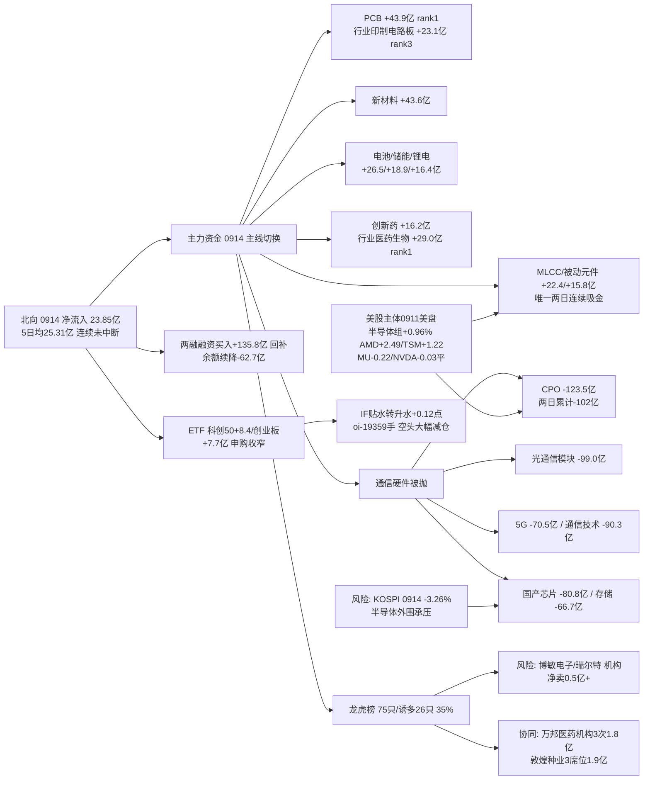

```yaml
date: 2026-09-15
agent: R7-capital-flow
skill_version: analyze_capital_flow_v1@1.3
generated_at: 2026-09-15T07:47:00+08:00
confidence: 0.5
degraded: true
data_sources:
  - name: tushare.moneyflow_hsgt
    path: MCP/tushare.moneyflow_hsgt
    status: ok
    captured_at: 2026-09-15T07:40:09+08:00
    record_count: 20
  - name: tushare.moneyflow_ind_dc(概念5日)
    path: MCP/tushare.moneyflow_ind_dc
    status: ok
    captured_at: 2026-09-15T07:40:09+08:00
    record_count: 2520
  - name: tushare.moneyflow_ind_dc(行业)
    path: MCP/tushare.moneyflow_ind_dc
    status: ok
    captured_at: 2026-09-15T07:40:09+08:00
    record_count: 496
  - name: tushare.top_list
    path: MCP/tushare.top_list
    status: ok
    captured_at: 2026-09-15T07:40:09+08:00
    record_count: 375
  - name: tushare.top_inst
    path: MCP/tushare.top_inst
    status: ok
    captured_at: 2026-09-15T07:40:09+08:00
    record_count: 4200
  - name: tushare.margin
    path: MCP/tushare.margin
    status: stale
    captured_at: 2026-09-15T07:40:09+08:00
    record_count: 2
    error: 0914 SSE+SZSE 均未落库, 用 0911 完整
  - name: tushare.fund_share/fund_daily
    path: MCP/tushare.fund_share
    status: ok
    captured_at: 2026-09-15T07:40:09+08:00
    record_count: 5
  - name: tushare.fut_daily IF2609
    path: MCP/tushare.fut_daily
    status: ok
    captured_at: 2026-09-15T07:40:09+08:00
    record_count: 1
  - name: tushare.index_daily
    path: MCP/tushare.index_daily
    status: ok
    captured_at: 2026-09-15T07:40:09+08:00
    record_count: 4
  - name: overseas_snapshot.json
    path: data/raw/20260915/overseas_snapshot.json
    status: partial
    captured_at: 2026-09-15T07:12:19+08:00
    record_count: 12
    error: 美股主体 0911 美盘(0914 美盘 tushare 未落库); status=degraded
  - name: vibe-trading
    path: MCP/vibe-trading
    status: error
    captured_at: null
    record_count: 0
    error: MCP 网关 down (global_severity=3)
input_freshness: partial
input_freshness_note: A股 0914 收盘全量 ok(tushare 直连: 北向/概念行业资金流/龙虎榜/ETF/期货/指数); 两融 0911 完整(0914 未落库); 美股主体 0911 美盘(0914 美盘未落库, GOOGL 例外 +3.22%); vibe-trading MCP down
resolved_trade_date: 20260914
```


# 2026年9月15日 · **资金面**

> **数据源新鲜度**: partial · 数据归属日 20260914 (T-1 收盘全量)
> **降级状态**: True · vibe-trading MCP 网关 down (global_severity=3)
> **置信度**: 0.50 (0.75×0.9×0.85×0.9, severity cap 0.5)

## 一句话结论

0914 **资金主线从通信硬件(5G/光模块/CPO)切换至 PCB材料+电池/新能源+创新药**——昨日 5G/光模块回流确认为单日脉冲；北向连续净流入未中断(23.85亿)，MLCC/被动元件是唯一两日连续吸金板块，PCB行业口径 +23.1亿印证概念第一。

## 详细分析

### 资金主线大切换：通信硬件被抛、PCB/电池/医药接棒

0914 概念板块主力净流入前十：**PCB +43.85 亿(rank1)、新材料 +43.55 亿、电池技术 +26.51 亿、MLCC +22.41 亿、固态电池 +19.41 亿、储能 +18.88 亿、培育钻石 +18.18 亿、新能源 +16.86 亿、锂电池 +16.42 亿、创新药 +16.18 亿**。行业口径同向：医药生物 +28.98 亿(rank1)、元件 +28.84 亿、**印制电路板 +23.1 亿(rank3)**、通用设备 +18.52 亿、磨具磨料 +18.1 亿。**关键变化**：0911 领涨的通信硬件（5G +44.9/光模块 +43.4/CPO +21.2）在 0914 全线大额流出——**CPO -123.49 亿、光通信模块 -98.95 亿、通信技术 -90.25 亿、5G -70.45 亿**。行业口径通信设备 -72.61 亿(rank46)、通信 -70.78 亿(rank44)、半导体 -71.0 亿(rank45)同步确认。**这直接证伪了昨日 md 的预设路径**：0914 5G/光模块转净流出超 30 亿 → 0911 回流是单日脉冲，实锤。

### 被抽血的方向：光模块/CPO/半导体 高位兑现，高低切明确

流出榜：CPO -123.49 亿、光通信模块 -98.95 亿、通信技术 -90.25 亿、国产芯片 -80.82 亿、数据中心 -72.51 亿、5G -70.45 亿、存储芯片 -66.73 亿、物联网 -65.72 亿。**信号**：0911 是"通信硬件强、芯片弱"的分化日，0914 演变为"通信硬件和芯片一起被抛、PCB/电池/医药吸金"的**全面高低切**——CPO 两日累计 -102 亿(0911 +21.2 → 0914 -123.5)，是 5 日窗口最弱的板块(cum -138 亿)。唯一例外是 **MLCC/被动元件两日连续吸金**(0911 +28.3/+33.7 → 0914 +22.4/+15.8)，5 日 cum 被动元件 +48 亿——资金在通信链内部"弃成品(光模块/PCB成品)、留上游材料(MLCC/元件)"。

### 龙虎榜：诱多密度降至 35%，游资换手、机构在连板股兑现

0914 龙虎榜 75 只，命中诱多/出货 26 只(35%)，较 0911 的 46% 继续回落。典型风险：**博敏电子**(PCB) 换手23.96%+机构净卖 -0.54 亿、**瑞尔特** -0.67 亿、**高斯贝尔**(PCB/通信) -0.25 亿、**澳洋健康** 涨停+换手31.5%+机构净卖(高位放量涨停·机构兑现)。**正向信号**：万邦医药机构专用 3 日 3 次净买 1.81 亿、敦煌种业 3 席位协同(国泰海通上海分+中信上海+中信深南中路合计 1.85 亿)——**PCB/农业方向机构分歧仍在，但协同吸筹强度低于 0911 的金安国纪(11 次)**。游资席位：量化基金 +7.96 亿、紫阳东路(超声电子/中京电子/双星新材 PCB链) +6.69 亿、量化打板 +6.47 亿活跃。

### 杠杆与衍生品：融资买入回补，期指贴水转升水、空头大幅减仓

两融 0911 余额 13310.65 亿较 0910 -62.72 亿(续降)，但**融资买入 rzmre 856.73 亿较 0910 +135.76 亿——融资盘从 0910 的骤降(-185.9 亿)回补**，杠杆情绪修复。ETF 份额(0914)：科创50 +8.37 亿、创业板 +7.73 亿、中证500 +4.8 亿净申购；沪深300 +0.2 亿、上证50 +0.46 亿几乎持平——**宽基申购继续但幅度较 0911(科创50 +21.5 亿)明显收窄**，"越跌越买"降温。期指 **IF2609 贴水转升水 +0.12 点**，oi **-19359 手(空头/套保大幅减仓)**——0911 的空头加仓(-6.76 贴水/+1684 手)在 0914 反转，衍生品压力显著释放。

### 外部传导：美股 0911 美盘偏暖但滞后，KOSPI 大跌是半导体外围风险

overseas_snapshot 美股主体停在 **0911 美盘**(周一 0914 美盘 tushare 未落库，仅 GOOGL +3.22% 更新至 0914)。半导体组平均 +0.96%：AMD +2.49/TSM +1.22/GLW +2.01 强，MU -0.22/NVDA -0.03 平。大科技组 +1.44%(AAPL +1.75/AMZN +1.94)。**风险信号**：韩国 KOSPI 0914 **-3.26% 大跌**——半导体外围(存储/三星链)承压，与 A 股存储芯片 -66.73 亿流出同向，今日存储/CPO 链情绪不乐观。恒指 0914 +0.45%，USDCNH 6.7092 人民币走强、北向顺风。



## 推理深度三问（top 分析对象：PCB/材料 + 通信硬件高低切）

- **大资金意图**: 0914 PCB 概念 +43.9 亿 + 行业印制电路板 +23.1 亿 rank3，同时 CPO -123.5/光模块 -99 亿被抛——**主力没有离场，是在通信链内部"弃成品、留材料"并外溢到电池/新能源**。北向 23.85 亿连续净流入 + 融资买入 +135.8 亿回补 + 期指空头减仓 1.9 万手，三线同向说明**增量资金在低位建仓、存量杠杆在修复**。对手盘：0911 追高 5G/光模块/CPO 的游资(紫阳东路今日 6.7 亿买 PCB 链是在接棒而非撤退)。
- **为什么走强**: 位置(PCB 0911 -40 亿回踩后低吸)+ 映射(隔夜 AMD+2.49/TSM+1.22/GLW+2.01 光缆+芯片代工强)+ 筹码(博敏电子/高斯贝尔等 PCB 涨停被机构卖但材料端 MLCC/元件连续 2 日吸金)三维共振；电池/新能源是低位补涨(电池 5 日 cum 仍 -119 亿，0914 首日转正 +26.5 亿)。
- **逻辑够不够硬**: PCB/材料 = 概念 + 行业 + 美股映射 + 龙虎榜机构行为 四源同向，逻辑硬但注意 PCB 概念成分复杂(材料/覆铜板/线路板混编)；MLCC/被动元件 = 唯一两日连续吸金 + 行业确认，最硬的持续性信号；电池/新能源 = 单日首日转正 + 5 日仍大幅净出，属"低位试错"级别，逻辑中等。**证伪路径**：0915 若 PCB/被动元件转净流出超 30 亿，则 0914 是脉冲；若 CPO 继续净流出超 50 亿，则通信硬件进入主跌段，R2 不应再给光模块候选重仓；若科创50 ETF 转为净赎回，则"越跌越买"终止。

## 关键证据

- 证据 1: PCB 概念 0914 净流入 +43.85 亿(rank1) · 行业印制电路板 +23.1 亿(rank3) · 来源 tushare.moneyflow_ind_dc + sector_5d_tracking
- 证据 2: CPO 概念 0914 -123.49 亿(两日累计 -102.3 亿) / 光通信模块 -98.95 亿 / 5G概念 -70.45 亿 · 证伪昨日"单日脉冲"路径 · 来源 tushare.moneyflow_ind_dc
- 证据 3: MLCC +22.41 亿 / 被动元件概念 +15.77 亿 · 0911→0914 两日连续吸金 · 来源 tushare.moneyflow_ind_dc
- 证据 4: 行业口径 医药生物 +28.98 亿(rank1) / 通信设备 -72.61 亿(rank46) / 半导体 -71.0 亿(rank45) · 来源 tushare.moneyflow_ind_dc (行业)
- 证据 5: 北向 0914 净买入 +23.85 亿 (沪 +11.21 / 深 +12.64) · 5 日均 25.31 亿 · 连续净流入未中断 · 来源 tushare.moneyflow_hsgt
- 证据 6: 龙虎榜 0914 75 只中 26 只命中诱多 (35%) · 博敏电子机构净卖 -0.54 亿 / 瑞尔特 -0.67 亿 · 来源 tushare.top_list + top_inst
- 证据 7: 游资协同 185 组 (high 28) · 万邦医药机构专用 3 日 3 次净买 1.81 亿 · 来源 tushare.top_inst 三日聚合
- 证据 8: 两融 0911 rzmre 856.73 亿 较 0910 +135.76 亿 (融资买入回补) · 余额续降 -62.72 亿 · 来源 tushare.margin
- 证据 9: ETF 科创50 +8.37 亿 / 创业板 +7.73 亿净申购(较 0911 收窄) · 来源 tushare.fund_share×fund_daily
- 证据 10: IF2609 0914 升水 +0.12 点 · oi -19359 手空头/套保大幅减仓 · 来源 tushare.fut_daily + index_daily
- 证据 11: 隔夜美股(0911 美盘) SPX +0.86% / AMD +2.49% / TSM +1.22% / GLW +2.01% vs MU -0.22% / NVDA -0.03% · GOOGL 0914 +3.22% · 来源 overseas_snapshot.json
- 证据 12: 韩国 KOSPI 0914 -3.26% 大跌 (半导体外围风险) · 恒指 +0.45% · 来源 overseas_snapshot.json::indices

## 数据源审计

| 源 | 日期 | 状态 | 备注 |
|---|---|:--:|---|
| tushare/moneyflow_hsgt | 2026-09-14 | 🟢 | 20 条 · 北向 20 日时序 (0914 已落库) |
| tushare/moneyflow_ind_dc | 2026-09-14 | 🟢 | 概念 504 行 × 5 日 + 行业 496 行 |
| tushare/top_list | 2026-09-14 | 🟢 | 5 日 375 条 · 全市场龙虎榜 |
| tushare/top_inst | 2026-09-14 | 🟢 | 5 日 4200 条 · 席位明细 + 三日聚合 |
| tushare/fund_share+fund_daily | 2026-09-14 | 🟢 | 5 只 · ETF 净值+份额 |
| tushare/margin | 2026-09-11 | 🟡 | 0914 SSE+SZSE 均未落库 · 用 0911 完整 |
| tushare/fut_daily | 2026-09-14 | 🟢 | IF2609 升水 +0.12 点 · oi -19359 |
| tushare/index_daily | 2026-09-14 | 🟢 | 沪深300 基准 · 上证 -0.07/创业板 -1.10 |
| overseas_snapshot.json | 2026-09-11(主体) | 🟡 | 12 只美股+指数+汇率 · 0914 美盘未落库 · status=degraded |
| vibe-trading (4 工具) | - | 🔴 | MCP 网关 down (global_severity=3) |

## 不确定性 / 反证

1. **PCB/材料是主升还是脉冲**：0914 PCB 首日 +43.9 亿但 0911 曾 -40.2 亿，5 日 cum 仅 +129.6 亿且靠 0909 单日 +98.5 亿撑起；若 0915 不能延续 20 亿+ 净流入，则是又一轮一日游。MLCC/被动元件两日连续吸金更可靠，但 0914 已是第 2 日加速，追高需防第 3 日分歧。
2. **通信硬件是否进入主跌**：CPO 两日累计 -102 亿、光模块 -99 亿，若 0915 继续净流出，则通信硬件链从"高位震荡"转"退潮"，R2 若还保留光模块主线需降权；但 0914 板块 pct_change 多为正(+0.37/+0.48)，说明是"高开兑现"而非恐慌抛售，存在 0915 弱转强修复可能。
3. **电池/新能源低位试错**：电池技术 5 日 cum 仍 -119 亿，0914 首日转正 +26.5 亿属左侧信号；创新药(医药生物行业 rank1)持续性待验证。这两方向按"低位试错"级别看待，不给重仓。
4. **两融与美股滞后一档**：两融 0911(0914 未落库)、美股主体 0911 美盘(0914 未落库)，今日判断中这两维存在 1 日信息差，实际 0914 两融变化需明日确认。
5. **vibe-trading 双源缺失**：本期资金面全部依赖 tushare 单源，龙虎榜席位交叉验证缺失；若 tushare 数据有误，整份 R7 判断失真——confidence 已压至 0.5。

## 与其他 R/D/E 的关系

- 依赖: data/raw/20260915/manifest.json · mcp_health.json · overseas_snapshot.json; data/research/20260915/emotion_cycle.json (high_chop 高位震荡); data/research/20260914/R7_capital_flow_20260914.json (5 日追踪滚动)
- 被消费: R2 主线板块（主力流入验证主线资金 — 注意 0914 主线切换：通信硬件→PCB/材料+电池+医药，MLCC 两日连续为最可靠信号）、R5 个股画像（资金侧）、R6 反证（资金矛盾检查 — 重点核查 R2 是否还推光模块/CPO 高位票）、D1 主决策（仓位与执行池最后确认 — 注意 0914 资金高低切 + 融资回补但余额续降，仓位不激进）

## Sub-Agent 元数据

- skill: analyze_capital_flow_v1
- artifact: data/research/20260915/R7_capital_flow_20260915.json (symlink: R7_capital_flow.json)
- 生成耗时: 约 12 分钟 (tushare 直连 fetch 10 源 + assemble + render)
- model: deepseek-v4-flash-260731
