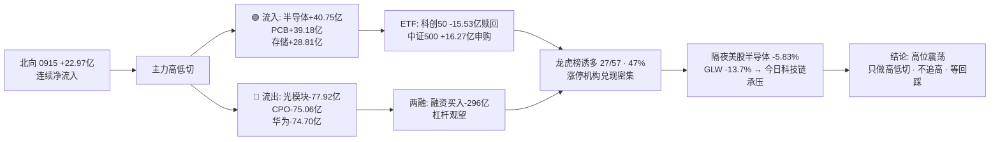

# 2026-09-16 · 💰 资金面

> **数据源新鲜度**: partial · **降级状态**: true · **置信度**: 0.5 · **staleness**: ok (resolved 20260915)

## 一句话结论
北向连续净流入(0915 +22.97亿), 主力资金从光模块/CPO/华为链(合计约-228亿)高低切向半导体/存储/PCB(合计约+92亿); 但隔夜美股半导体大跌(MU -5.25% · GLW -13.7%), 今日科技链承压, 高位震荡期资金只做高低切不追高。

## 详细分析

### 🌐 北向资金 · 温和流入未中断
0915 北向净买入 **22.97亿**(沪股通 10.71亿 / 深股通 12.26亿), 较 0914 的 23.85亿 小幅回落 -0.88亿, 连续净流入未中断。5日均 24.59亿 / 10日均 25.28亿 / 20日均 26.94亿 —— 均量微降但仍稳定在 22 亿以上, 无恐慌无抢筹, 属于**中性偏多的配置盘行为**。

### 🔄 主力资金 · 科技硬件内部高低切(核心判断)
0915 概念资金流出现极清晰的**卖高位算力 / 买中低位半导体**结构:

| 方向 | 板块 (净流入·亿) |
|---|---|
| 🟢 流入 | 半导体概念 +40.75 (#1) · PCB +39.18 (#2) · 存储芯片 +28.81 (#3) · 中芯概念 +22.76 (#4) · 新材料 +17.80 · 网络安全 +14.10 · 光刻胶 +13.24 · 国产芯片 +12.60 |
| 🔴 流出 | 光通信模块 -77.92 · CPO概念 -75.06 · 华为概念 -74.70 · 储能概念 -71.85 · 新能源车 -67.40 · 机器人概念 -56.23 · 锂矿概念 -51.02 |

行业口径同步验证: 半导体 +44.61亿 (#1) · 通信线缆及配套 +22.74亿 (#2) · 半导体设备 +16.81亿 (#3) 流入; 通信设备/半导体外延设备流出。**两口径同向 → 高低切信号可信**。

但**5日时序要泼冷水**: PCB 5日累计 **+164.12亿**(4/5 天净入, 唯一持续主线)、MLCC +53.94亿、光刻胶 +18.79亿 是"真净入"; 而半导体概念 5日累计 **-273.95亿**、国产芯片 **-304.09亿** —— 0915 的 +40.75亿 是**深度净出后的回补第一天**, 尚未形成持续净流入, 今天若不能续买则只是超跌反抽。

### 🏦 ETF / 两融 / 期货 · 杠杆观望 + 科创50 被赎回
- **科创50ETF 0915 净赎回约 -15.53亿**(份额 -94,800万份, 全篮子唯一净赎回) ↔ 中证500ETF +16.27亿净申购 · 沪深300ETF +6.31亿 · 上证50ETF +4.23亿 · 创业板ETF +3.14亿。半导体回补与科创50被赎回**背离**, 显示资金对高位半导体的分歧。
- 两融 0914(0915 未落库): 融资余额 25,976.56亿 较 0911 **-49.39亿**, 融资买入 1,302.51亿 较 0911 **-296.21亿** → **融资买入大幅萎缩**, 杠杆资金明显观望。
- IF2609 收 4,449.8 vs 沪深300 4,450.04 → **贴水 -0.24点**, 持仓 -12,676手(空头/套保减仓), 中性偏多。

### 🐉 龙虎榜 · 诱多命中率 47%, 涨停机构兑现密集
0915 龙虎榜 **57只**, 诱多模式命中 **27只(47%)** —— 高位震荡期典型特征。**涨停但机构净卖**的高危样本: 大金重工(涨停, 机构净卖 -4,491万) · 天顺风能(涨停, 机构净卖 -9,221万) · 北自科技(高换手涨停, 机构净卖 -7,506万) · 博汇科技(20cm, 机构净卖 -6,795万)。**今日对这些"涨停+机构跑"的票, 一律不接力**。

### 📡 外部传导 · 美股半导体隔夜重挫 → 今日科技链承压
美股主体 0914 美盘(0915 美盘未落库): 半导体组平均 **-5.83%**(MU -5.25% · NVDA -3.36% · AVGO -4.77% · AMD -4.40% · TSM -3.52% · **GLW(康宁光纤) -13.70%**); 大科技分化(GOOGL +3.22% · MSFT +1.97% vs TSLA -1.77%)。韩国 KOSPI 0915 **-0.85% 续跌**。→ **今日 A股存储/CPO/光模块链情绪直接承压**, 尤其 GLW -13.7% 对光模块/光纤链是硬压制 —— 与 0915 A股主力卖光模块的动作形成共振, 说明有资金提前离场; 半导体/存储链今日大概率低开分歧, **不宜追高, 只等回踩确认**。

### 🎯 昨日前十 5 日追踪(0915 龙虎榜净买前十)
| 股票 | 0915 净买 | 5日累计 | 近5日涨跌幅(0909→0915) |
|---|---|---|---|
| 通鼎互联 `002491.SZ` | 8.35亿 | 4.37% | 3.5897 -5.4005 0.8088 -4.6248 9.9951 |
| 天融信 `002212.SZ` | 2.0亿 | 15.91% | -2.099 0.3063 2.7481 9.9554 5.0 |
| 双星新材 `002585.SZ` | 1.87亿 | 30.58% | -0.333 0.7795 10.0552 10.0402 10.0365 |
| 大金重工 `002487.SZ` | 1.19亿 | 18.17% | -1.6309 2.9782 5.2475 1.5581 10.0139 |
| 意华股份 `002897.SZ` | 1.14亿 | 16.03% | -2.1462 0.6516 2.4791 10.0 5.0427 |
| 天顺风能 `002531.SZ` | 1.1亿 | 21.91% | -0.9464 10.0318 4.4863 -1.662 10.0 |
| 超声电子 `000823.SZ` | 0.87亿 | 38.47% | 2.8433 10.0 10.0 10.0146 5.612 |
| 金帝股份 `603270.SH` | 0.83亿 | 4.94% | 2.303 -2.34 -6.3694 6.576 4.772 |
| 满坤科技 `301132.SZ` | 0.82亿 | 39.84% | 10.0023 2.3266 1.4602 20.0041 6.0476 |
| 上海洗霸 `603200.SH` | 0.78亿 | -1.66% | -1.3206 -5.0805 -8.2507 2.988 10.0028 |

**解读**: 满坤科技(+39.84%)、超声电子(+38.47%)、双星新材(+30.58%)为高位连板票, 高位震荡期接力风险大; **通鼎互联** 5日累计仅 +4.37%, 0915 才爆量首板(净买 8.35亿 #1, 章盟主+紫阳东路双席位) —— **资金新进、位置相对低**, 是前十中唯一"低位新启动"型。

## 资金传导图

## 推理深度三问

### 对象一 · 半导体/存储 0915 单日主力回补(+40.75亿/+28.81亿)
- **大资金意图**: 从浮盈盘重的光模块/CPO 切向位置低+涨价叙事的半导体/存储/PCB, 是**高低切防御**而非全面进攻; 对手盘是高位科技获利盘与套牢盘。
- **为什么走强**: 位置(5日 -273.95亿 深度净出后的超跌回补)+ 催化(存储涨价/国产替代叙事延续)+ 筹码(PCB链游资席位持续: 紫阳东路扫 通鼎/双星/崇达)。
- **逻辑够不够硬**: 单日回补第一天, 5日累计仍净出, 未形成持续流入; 且隔夜美股半导体 -5.83% 外部压制未解除 —— **逻辑未验证, 需今明两日连续净流入才算数**。

### 对象二 · 科创50ETF -15.53亿净赎回(与半导体主力流入背离)
- **大资金意图**: 借道 ETF 的配置盘/散户在半导体回补前夜赎回, 可能是"聪明钱"提前撤, 也可能是错杀 —— 与中证500ETF +16.27亿净申购形成宽基内部分化。
- **为什么走弱**: 科创50 成分高度绑定高位半导体, 隔夜美股半导体大跌触发避险赎回。
- **逻辑够不够硬**: ETF 申赎是收盘后滞后截面, 单日大额赎回与当日主力净流入矛盾 → **资金分歧的直接证据**, 但不可单边解读为看空; 需与今日半导体板块实际走势互证。

## 观察池顶部(资金视角 · 非买入推荐)
### 通鼎互联 002491.SZ · 态度: 观察(资金新进, 但板块受GLW压制)
- **买入理由**: ① 0915 龙虎榜净买 8.35亿 全场第一, 章盟主+紫阳东路+量化基金三方席位; ② 5日累计仅 +4.37%, 相对低位, 通信线缆/算力叙事新启动。
- **风险点**: ① GLW 康宁 -13.70% 隔夜暴跌, 光通信/线缆链情绪压制; ② 首板次日溢价不确定, 高位震荡期首板隔日胜率低。
- **止损条件**: 跌破首板实体下沿约 20.20 元(0914 收盘)即放弃, 或低开>3% 且竞价无量不参与。
- **可验证假设**: 今日竞价量能 ≥ 昨日首板竞价 2 倍且高开 0~3% → 资金接力确认; 若低开无量 → 证伪, 降级。

### 双星新材 002585.SZ · 态度: 降级(3连板高位, 震荡期不接力)
- **买入理由**: ① 3连板高度, 紫阳东路+温州帮席位持续; ② 5日累计 +30.58%, 涨停潮链内最强之一。
- **风险点**: ① 3板位置高, 高位震荡期连板分歧(炸板率 42.9% 环境下连板晋级率低); ② 龙虎榜机构未确认承接, 涨停票机构兑现风险。
- **止损条件**: 开盘不转强(竞价低于 0915 收盘 -2%)即不参与; 参与后破前日涨停价 12.06 无条件走。
- **可验证假设**: 今日若分歧转一致(低开快速回封/换手>20% 承接) → 弱转强可半路; 若高开秒板缩量 → 诱多, 直接拦截。

## 关键证据
- 证据 1: 北向 0915 +22.97亿, 5日均 24.59亿, 连续净流入 · 来源 tushare.moneyflow_hsgt
- 证据 2: 概念资金流 半导体+40.75亿#1 / PCB+39.18亿#2 / 存储+28.81亿#3; 光模块-77.92亿 / CPO-75.06亿 · 来源 tushare.moneyflow_ind_dc
- 证据 3: PCB 5日累计 +164.12亿(4/5 净入) · MLCC +53.94亿 · 来源 moneyflow_ind_dc 5日追踪
- 证据 4: 龙虎榜 57只中诱多 27只(47%), 涨停机构净卖: 大金重工-4,491万 / 天顺风能-9,221万 / 北自科技-7,506万 · 来源 tushare.top_list + top_inst
- 证据 5: 通鼎互联 净买 8.35亿 #1, 章盟主/紫阳东路席位; 满坤科技/超声电子/双星新材 5日累计 +30%~40% · 来源 hm_detail + top_list
- 证据 6: 科创50ETF -15.53亿净赎回 vs 中证500ETF +16.27亿净申购 · 来源 tushare.fund_share
- 证据 7: 两融 0914 融资买入 1,302.51亿 较 0911 -296.21亿 · 来源 tushare.margin
- 证据 8: 美股半导体组 -5.83% (MU -5.25% · GLW -13.7%), KOSPI 0915 -0.85% · 来源 overseas_snapshot.json

## 数据源审计
| 源 | 日期 | 状态 | 备注 |
|---|---|---|:--:|
| tushare/moneyflow_hsgt | 2026-09-15 | 🟢 | 21条 · 北向 5/10/20日 |
| tushare/moneyflow_ind_dc | 2026-09-15 | 🟢 | 概念 5日 2520条 + 10日 5040条 + 行业 496条 |
| tushare/top_list | 2026-09-15 | 🟢 | 5日窗口 303条 · 龙虎榜 |
| tushare/top_inst | 2026-09-15 | 🟢 | 3日 1,800条 · 机构席位 |
| tushare/hm_detail | 2026-09-15 | 🟢 | 3日游资明细 |
| tushare/margin | 2026-09-14 | 🟡 | 0915 未落库, 用 0914(较昨日R7 的 0911 新一档) |
| tushare/fund_share + fund_daily | 2026-09-15 | 🟢 | 5只ETF 申赎估算 + 收盘 |
| tushare/fut_daily | 2026-09-15 | 🟢 | IF2609 贴水 -0.24点 |
| tushare/index_daily | 2026-09-15 | 🟢 | 沪深300 |
| tushare/daily | 2026-09-15 | 🟢 | 昨日前十 5日行情 60条 |
| overseas_snapshot.json | 2026-09-14 | 🟡 | 美股主体 0914 美盘, 0915 美盘未落库 |
| vibe-trading MCP | - | 🔴 | DOWN · 用 tushare block_trade/margin_detail 等价口径替代 |

## 不确定性 / 反证
1. **美股数据停在 0914 美盘**; 若 0915 美盘半导体实际反弹, 今日 A股科技链的压制逻辑将被削弱(反证方向: 低开高走)。
2. 北向为 moneyflow_hsgt 日度口径(非实时), 与盘中实际北向存在偏差。
3. 跷跷板配对 10日主题 universe 仅 1 对 <-0.6(人工智能↔军工 -0.563 为放宽补足), 信号弱 —— 本次以"板块资金高低切"替代跷跷板结论, 需 E2 评估是否放宽/换窗口。
4. 两融 0915 缺失用 0914; ETF 净申赎为份额×收盘价估算, 非一级市场真实流水。
5. 龙虎榜诱多 47% 为单日截面, 判断是否"真出货"需 E1 T+1 回填验证(如 大金重工/天顺风能 次日是否兑现)。
6. 本报告所有板块流入/流出为东财概念口径(DC), 与同花顺/申万口径存在差异。

## 与其他 R/D/E 的关系
- 依赖: data/raw/20260916/manifest.json · mcp_health.json · overseas_snapshot.json; data/research/20260915/R2_main_sectors.json(候选池参考, 0916 R2 未就绪)
- 被消费: D1(main_decision_v1) 资金维度 + staleness_status 消费(ok → 正常); R2(analyze_main_sectors_v1) 资金约束; R6(analyze_devil_advocate_v1) 诱多/出货佐证; E1(daily_review_v1) 资金面复盘 + 前十追踪回填

## Sub-Agent 元数据
- skill: analyze_capital_flow_v1 (chain: hot_money_synergy_v1 · detect_seesaw_pairs_v1 · render_kg_md_v1)
- artifact: data/research/20260916/R7_capital_flow_20260916.json
- 生成耗时: 2357 秒
- model: deepseek-v4-flash-ga-260731
