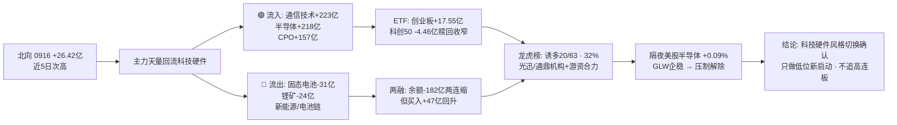

# 2026-09-17 · 💰 资金面

> **数据源新鲜度**: partial · **降级状态**: true · **置信度**: 0.5 · **staleness**: ok (resolved 20260916)

## 一句话结论
0916 主力资金**天量回流科技硬件**(通信技术 +223亿 · 半导体 +218亿 · CPO +157亿, 全面进攻非高低切), 北向 +26.42亿 回升, 隔夜美股半导体企稳(0915 美盘 +0.09%)内外共振; 但两融余额两连缩、科创50 续赎回 → **情绪修复 + 杠杆观望并存, 高位震荡期只做低位科技硬件, 不追高连板**。

## 详细分析

### 🌐 北向资金 · 净流入回升, 近5日次高
0916 北向净买入 **26.42亿**(沪股通 12.30亿 / 深股通 14.13亿), 较 0915 的 22.97亿 回升 **+3.45亿**, 连续净流入未中断。5日均 24.95亿 / 10日均 25.48亿 / 20日均 26.62亿 —— 均量稳定在 25 亿上下, 属**配置盘持续温和流入**, 无恐慌无抢筹。

### 🔄 主力资金 · 天量回流科技硬件(核心判断 · 风格切换确认)
0916 概念资金流出现**放量大反转**: 昨日(0915)被卖的光模块/CPO 链今日被天量买回, 且不是高低切而是**全面进攻**:

| 方向 | 板块 (净流入·亿) |
|---|---|
| 🟢 流入 | 通信技术 +223.03 (#1, +3.04%) · 半导体概念 +218.28 (#2, +3.57%) · 国产芯片 +194.69 (+3.06%) · 5G概念 +193.83 (+2.79%) · CPO概念 +157.20 (+4.41%) · 光通信模块 +142.44 (+4.14%) · 存储芯片 +132.11 (+4.21%) · 华为概念 +115.09 · 数据中心 +95.96 · 专精特新 +92.60 |
| 🔴 流出 | 固态电池 -31.51 · 动力电池回收 -26.71 · 蚂蚁金服概念 -26.65 · 锂矿概念 -24.20 · 麒麟电池 -22.64 |

行业口径同步验证: 电子 **+227.03亿** (#1, +3.8%) · 半导体 +136.51亿 (#2, +4.82%) · 通信设备 +106.34亿 · 通信 +105.44亿。**两口径同向 → 科技硬件全面回流可信**。流出方向集中在新能源/电池链 —— 昨日主力卖光模块买半导体的"高低切", 今日升级为**新能源/电池 → 科技硬件的大风格切换**。

**5日时序看持续性**: 通信技术 5日累计 +56.58亿 / 5G +79.11亿 / 存储芯片 +4.11亿(3/5 净入) 是"真净入"起步; 但半导体概念 5日累计仍 **-19.45亿**、CPO -73.11亿、光通信模块 -55.33亿、华为 -105.48亿 —— 0916 的天量买入是**深度净出后的暴力回补第一天**, 单日不足以覆盖 5 日净出, 需今明连续验证。

### 📊 昨日前十板块 · 5 日追踪(0916 概念净流入前十)
| 板块 | 5日累计 | 净入天数 | 逐日净流入(0910→0916) |
|---|---|---|---|
| 5G概念 | 79.11亿 | 2/5 | -56.71 44.88 -70.45 -32.44 193.83 |
| 通信技术 | 56.58亿 | 2/5 | -45.88 12.67 -90.25 -42.99 223.03 |
| 存储芯片 | 4.11亿 | 3/5 | 20.22 -110.3 -66.73 28.81 132.11 |
| 半导体概念 | -19.45亿 | 2/5 | -38.05 -184.46 -55.97 40.75 218.28 |
| 国产芯片 | -40.21亿 | 2/5 | -42.21 -124.47 -80.82 12.6 194.69 |
| 光通信模块 | -55.33亿 | 2/5 | -64.27 43.37 -98.95 -77.92 142.44 |
| CPO概念 | -73.11亿 | 2/5 | -52.92 21.16 -123.49 -75.06 157.2 |
| 专精特新 | -80.14亿 | 2/5 | -24.55 -129.45 -23.44 4.7 92.6 |
| 华为概念 | -105.48亿 | 1/5 | -52.5 -60.21 -33.16 -74.7 115.09 |
| 数据中心 | -128.95亿 | 1/5 | -55.73 -53.56 -72.51 -43.11 95.96 |

**解读**: 除通信技术/5G/存储芯片外, 其余 7 个板块 5 日累计仍为负 —— **0916 是全面回补第一天而非趋势确立**; 华为/数据中心 5日净出超百亿, 单日回补不改弱势结构。

### 🏦 ETF / 两融 / 期货 · 杠杆分歧收窄
- **ETF 净申赎**: 创业板ETF +17.55亿 · 中证500ETF +14.93亿 · 沪深300ETF +11.47亿 净申购; **科创50ETF -4.46亿 续赎回**(但较 0915 的 -15.53亿 大幅收窄) —— 资金借宽基加仓科技方向, 对高位半导体的分歧在收敛。
- **两融 0915**(0916 未落库): 融资余额 **25,794.39亿** 较 0914 **-182.17亿**(两连缩), 但融资买入 **1,349.99亿** 较 0914 **+47.48亿回升** → **余额缩但买入回暖**, 杠杆资金态度转积极。
- **IF2609 收 4,478.0 vs 沪深300 4,480.27 → 贴水 -2.27点**, 持仓 -19,714手(空头/套保大幅离场), **偏多信号**。

### 🐉 龙虎榜 · 诱多命中率 32%, 机构在净买前排
0916 龙虎榜(去重后) **63只**, 诱多模式命中 **20只(32%)**。重点高危样本:

| 超声电子 `000823.SZ` | 5.1% | 34.43% | 33269.27万 | -14828.07万 | 机构专用净卖 |
| 威尔高 `301251.SZ` | 20.0% | 8.79% | 17811.31万 | -5977.7万 | 机构专用净卖 |
| 北自科技 `603082.SH` | 10.01% | 33.46% | 13511.0万 | -2501.85万 | 机构专用净卖 · 高位放量涨停·机构兑现 |
| 西陇科学 `002584.SZ` | 10.02% | 11.74% | 13341.3万 | -970.88万 | 机构专用净卖 |
| 星网锐捷 `002396.SZ` | 10.0% | 18.34% | 12083.02万 | -1947.16万 | 机构专用净卖 |
| 瑞丰高材 `300243.SZ` | 20.01% | 24.85% | 5821.15万 | -242.52万 | 高位放量涨停·机构兑现 |
| 澳弘电子 `605058.SH` | 10.0% | 7.6% | 2244.05万 | -2079.69万 | 机构专用净卖 |
| 益坤电气 `920222.BJ` | 3.41% | 21.79% | -269.85万 | 74.93万 | 换手异常且净卖出 |
| 晶升股份 `688478.SH` | 19.99% | 6.16% | -358.29万 | 792.61万 | 涨停但龙虎榜净卖出 |
| 百迈科 `920268.BJ` | 0.7% | 41.29% | -852.7万 | -1403.74万 | 机构专用净卖 · 换手异常且净卖出 |

**关键反差**: 净买前十的**光迅科技(净买 10.15亿 · 机构净买 +3.79亿)** 与 **通鼎互联(净买 9.14亿 · 机构净买 +4.23亿)** 是"游资+机构合力"真买; 而 **超声电子(机构净卖 -1.48亿) · 威尔高(20cm 机构净卖 -5,978万) · 北自科技(高换手涨停机构净卖 -2,502万)** 是"涨停/高位但机构跑" —— **今天对这些"高位+机构兑现"票一律不接力**。

### 🎯 昨日前十 5 日追踪(0916 龙虎榜净买前十)
| 股票 | 0916 净买 | 5日累计 | 近5日涨跌幅(0910→0916) |
|---|---|---|---|
| 光迅科技 `002281.SZ` | 10.15亿 | 1.88% | -1.8601 -1.1316 -3.1292 -2.0022 10.0018 |
| 通鼎互联 `002491.SZ` | 9.14亿 | 10.77% | -5.4005 0.8088 -4.6248 9.9951 9.9865 |
| 有研硅 `688432.SH` | 7.06亿 | 19.67% | na na 2.0566 -2.3835 20.0 |
| 平潭发展 `000592.SZ` | 4.57亿 | 8.59% | 2.6055 -6.2878 4.5161 -2.2222 9.9747 |
| 超声电子 `000823.SZ` | 3.33亿 | 40.73% | 10.0 10.0 10.0146 5.612 5.1046 |
| 致尚科技 `301486.SZ` | 2.6亿 | 11.13% | -1.1557 -5.6858 -1.0422 -0.9867 19.9978 |
| 威尔高 `301251.SZ` | 1.78亿 | 38.69% | 4.8614 -1.2552 11.2881 3.7923 20.0 |
| 青山纸业 `600103.SH` | 1.42亿 | -5.65% | -4.5685 -2.3936 -1.6349 -7.2022 10.1493 |
| 凌玮科技 `301373.SZ` | 1.42亿 | 26.41% | -1.0781 -1.5943 0.7793 11.5181 16.7883 |
| 新农开发 `600359.SH` | 1.37亿 | -12.85% | 10.0457 0.8299 -9.9794 -9.9429 -3.8071 |

**解读**: **光迅科技**(CPO 龙头, 净买 10.15亿 #1, 5日仅 +1.88%)是"低位新启动+机构游资合力"型, 全场最值得跟踪; **通鼎互联** 5日 +10.77%(章盟主+紫阳东路+机构三方)、**凌玮科技** +26.41%、**致尚科技** +11.13% 为中位; **超声电子 +40.73% / 威尔高 +38.69%** 高位连板, 震荡期接力风险大; **青山纸业 -5.65% / 新农开发 -12.85%** 资金一日游被埋, 反证"龙虎榜净买≠次日溢价"。

### 🎰 游资协同 · 具名游资重仓进攻科技硬件
- 净买榜首: **紫阳东路 +12.30亿**(9票: 通鼎互联 +2.44亿 · 星网锐捷 +2.31亿 · 光迅科技 +2.26亿 · 平潭发展 +1.57亿 · 威尔高 +1.27亿) · **量化基金 +11.66亿**(31票) · 量化打板 +2.99亿; 净卖: **宁波桑田路 -3.74亿**(单票大卖)。
- **3日协同(0914-0916)**: 紫阳东路 双星新材(3日) / 通鼎互联 / 超声电子; 温州帮 双星新材(3日) / 北自科技; 章盟主 通鼎互联 / 天融信; 作手新一 博汇科技; 苏南帮 万邦医药 / 正和生态。
- **信号**: 紫阳东路+温州帮对双星新材 3 日连续上榜(昨日 3 连板高位, 今日未触发诱多, 需盯是否转一致); 通鼎互联获 章盟主+紫阳东路+机构三方向合力, 协同信号最强。

### 📡 外部传导 · 美股半导体企稳 → 科技链压制解除
美股主体 0915 美盘(0916 美盘未落库): 半导体组平均 **+0.09%**(AMD +2.19% · NVDA +0.57% · MU +0.39% · TSM -1.02% · AVGO -1.58% · **GLW -0.02%**, 从 0914 -13.7% 暴跌中企稳); 大科技组 -0.90%(META +0.70% vs AMZN -2.02% · MSFT -1.64%)。指数: SPX -0.45% / IXIC -0.78% 微跌; **韩国 KOSPI +1.37% / 恒指 +0.19% 外围回暖**。USDCNH 6.7076。
→ **昨日"GLW -13.7% 压制光模块"的外部利空解除**, 与 0916 A股主力天量回流通信/CPO 形成**内外共振**; 今日 A股存储/CPO/半导体链情绪偏暖, 但美股大盘指数仍微跌, 只做结构性进攻。

## 资金传导图

## 推理深度三问

### 对象一 · 0916 科技硬件天量回流(通信 +223亿 / 半导体 +218亿 / CPO +157亿)
- **大资金意图**: 昨日高低切(卖光模块买半导体)升级为**风格级切换(卖新能源/电池 → 买科技硬件)**, 资金从滞涨/弱势赛道抽血灌入通信+半导体主升方向; 对手盘是新能源套牢盘与高位科技获利盘。
- **为什么走强**: 位置(5日深度净出后的低位)+ 催化(隔夜 GLW 企稳解除压制 + 存储/通信涨价叙事)+ 筹码(紫阳东路/章盟主/机构三方合力扫 通鼎/光迅)。
- **逻辑够不够硬**: 单日天量是"回补第一天", 5日累计多数板块仍为净出, 且两融余额仍两连缩 —— **趋势未确认, 需今日(0917)续买形成 2 日连续净流入才成立**; 若今日冲高回落净流出, 则是"一日游"诱多。

### 对象二 · 科创50ETF -4.46亿续赎回 vs 宽基净申购(+17.55/+14.93/+11.47亿)
- **大资金意图**: 借宽基 ETF 加仓科技方向的配置盘与借科创50 减仓高位半导体的资金在**换手**; 科创50 赎回较昨日收窄(-15.53→-4.46亿), 分歧在收敛。
- **为什么分化**: 科创50 成分重仓高位半导体/设备, 昨日美股半导体大跌触发避险; 今日宽基申购说明增量资金更愿意借宽基间接参与。
- **逻辑够不够硬**: 单日 ETF 申赎是滞后截面, 与当日主力净流入方向一致(净申购为主) → 偏多佐证, 但需观察是否持续。

## 观察池顶部(资金视角 · 非买入推荐)
### 光迅科技 002281.SZ · 态度: 观察(资金新进 #1 + 内外共振, 但首板次日待验证)
- **买入理由**: ① 0916 龙虎榜净买 10.15亿 全场第一, 机构净买 +3.79亿 + 游资(紫阳东路 +2.26亿)合力; ② 5日累计仅 +1.88%, 相对低位, CPO/光模块龙头在隔夜 GLW 企稳后情绪修复; ③ 0916 涨停 +10.00%, 换手仅 5.24%(锁仓型涨停)。
- **风险点**: ① 首板次日溢价不确定, 高位震荡期首板隔日胜率低; ② CPO 板块 5日累计 -73.11亿, 单日回补未成趋势; ③ 昨日涨停成交额巨大, 获利盘兑现压力。
- **止损条件**: 低开 >3% 且竞价无量不参与; 参与后跌破 0916 涨停价约 41.60 元(需以实际为准)无条件走。
- **可验证假设**: 今日高开 0~3% 且竞价量 ≥ 昨日竞价 2 倍 → 接力确认; 若高开 >5% 缩量秒板 → 诱多, 直接拦截。

### 通鼎互联 002491.SZ · 态度: 观察(章盟主+紫阳东路+机构三方协同, 位置相对低)
- **买入理由**: ① 0916 净买 9.14亿 #2, 章盟主+紫阳东路+机构(+4.23亿)三方席位; ② 5日累计 +10.77%, 通信线缆/算力叙事持续; ③ 连续两日龙虎榜净买居前, 资金持续。
- **风险点**: ① 换手 24.5% 高位放量, 分歧加大; ② 高位震荡期连板分歧; ③ 5日累计涨幅已不小, 追高风险。
- **止损条件**: 跌破 0916 涨停价(约 24.4 元, 以实际为准)无条件走; 低开 >3% 无量不参与。
- **可验证假设**: 今日分歧转一致(低开快速回封/换手承接) → 半路机会; 高开缩量 → 诱多拦截。

### 双星新材 002585.SZ · 态度: 降级(高位 3 日游资协同但连板高度风险)
- **买入理由**: ① 紫阳东路+温州帮 3 日连续上榜(0914-0916), 游资锁仓; ② 涨停潮链内强势。
- **风险点**: ① 高位连板(昨日已 3 板后), 震荡期炸板风险大; ② 未出现在诱多列表但位置高, 追高盈亏比差。
- **止损条件**: 不参与为主; 若参与, 破前日涨停价无条件走。
- **可验证假设**: 今日若放量分歧后回封且机构不跑 → 弱转强; 若冲高回落机构净卖 → 兑现。

## 关键证据
- 证据 1: 北向 0916 +26.42亿(近5日次高), 5日均 24.95亿, 连续净流入 · 来源 tushare.moneyflow_hsgt
- 证据 2: 概念资金流 通信技术 +223.03亿#1 / 半导体 +218.28亿#2 / 国产芯片 +194.69亿 / CPO +157.20亿 / 光模块 +142.44亿; 流出 固态电池 -31.51亿 · 锂矿 -24.20亿 · 来源 tushare.moneyflow_ind_dc
- 证据 3: 行业口径 电子 +227.03亿#1 / 半导体 +136.51亿#2 / 通信设备 +106.34亿, 双口径同向 · 来源 tushare.moneyflow_ind_dc
- 证据 4: 通信技术 5日 +56.58亿 / 5G +79.11亿 / 存储 +4.11亿 真净入; 半导体/CPO/光模块 5日仍净出 · 来源 moneyflow_ind_dc 5日追踪
- 证据 5: 龙虎榜 63只中诱多 20只(32%), 高位机构净卖: 超声电子 -1.48亿 / 威尔高 -5,978万 / 北自科技 -2,502万 · 来源 tushare.top_list + top_inst
- 证据 6: 光迅科技 净买 10.15亿 + 机构净买 3.79亿; 通鼎互联 净买 9.14亿 + 机构净买 4.23亿; 紫阳东路 3日协同双星新材 · 来源 hm_detail + top_list
- 证据 7: 创业板ETF +17.55亿 / 中证500 +14.93亿 / 沪深300 +11.47亿 净申购, 科创50 -4.46亿续赎回(收窄) · 来源 tushare.fund_share
- 证据 8: 两融 0915 融资余额 25,794.39亿 两连缩 -182.17亿, 融资买入 1,349.99亿 回升 +47.48亿 · 来源 tushare.margin_detail
- 证据 9: IF2609 贴水 -2.27点, 持仓 -19,714手 空头离场 · 来源 tushare.fut_daily
- 证据 10: 美股半导体组 0915 美盘 +0.09%(AMD +2.19% · GLW -0.02% 企稳), KOSPI +1.37% / 恒指 +0.19% · 来源 overseas_snapshot.json

## 数据源审计
| 源 | 日期 | 状态 | 备注 |
|---|---|---|:--:|
| tushare/moneyflow_hsgt | 2026-09-16 | 🟢 | 21条 · 北向 5/10/20日 |
| tushare/moneyflow_ind_dc | 2026-09-16 | 🟢 | 概念 5日 2520条 + 10日 5040条 + 行业 496条 |
| tushare/top_list | 2026-09-16 | 🟢 | 去重后 63条 · 龙虎榜 |
| tushare/top_inst | 2026-09-16 | 🟢 | 730条 · 机构专用席位 |
| tushare/hm_detail | 2026-09-16 | 🟢 | 256条 · 游资明细 + 3日协同窗口 |
| tushare/margin_detail | 2026-09-15 | 🟡 | 0916 未落库, 用 0915(4445行, 较昨日R7的0914新一档) |
| tushare/fund_share + fund_daily | 2026-09-16 | 🟢 | 5只ETF 申赎估算 + 收盘 |
| tushare/fut_daily | 2026-09-16 | 🟢 | IF2609 贴水 -2.27点 · oi -19,714手 |
| tushare/index_daily | 2026-09-16 | 🟢 | 沪深300 4,480.27 |
| tushare/daily | 2026-09-16 | 🟢 | 昨日前十 5日行情 50条 |
| overseas_snapshot.json | 2026-09-15 | 🟡 | 美股主体 0915 美盘, 0916 美盘未落库 |
| vibe-trading MCP | - | 🔴 | 未在 session 工具集 · 用 tushare 等价口径替代 |

## 不确定性 / 反证
1. **美股数据停在 0915 美盘**; 若 0916 美盘半导体实际回落, 今日 A股科技链的"压制解除"逻辑将被削弱(反证方向: 高开低走)。
2. 北向为 moneyflow_hsgt 日度口径(非实时), 与盘中实际北向存在偏差。
3. 0916 天量回流是**单日截面**; 5日累计多数板块仍净出, 若 0917 冲高回落净流出, 则 0916 是"一日游"式反抽而非风格切换(需 E1 T+1 回填验证 光迅/通鼎 次日表现)。
4. 两融 0916 缺失用 0915; ETF 净申赎为份额×收盘价估算, 非一级市场真实流水; 上证50ETF 份额数据缺失。
5. 跷跷板配对 10日窗口 0 对 ≤ -0.5(今日概念 top20 全为科技硬件正相关), 真实跷跷板体现为"科技硬件 ↔ 新能源/电池"资金流切换, 非板块间负相关 —— 需 E2 评估算法口径。
6. 龙虎榜诱多 32% 为单日截面, 判断是否"真出货"需 E1 T+1 回填验证(如 超声电子/威尔高 次日是否兑现)。
7. 本报告所有板块流入/流出为东财概念口径(DC), 与同花顺/申万口径存在差异。

## 与其他 R/D/E 的关系
- 依赖: data/raw/20260917/manifest.json · mcp_health.json · overseas_snapshot.json; data/research/20260917/emotion_cycle.json(主升 · 参考)
- 被消费: D1(main_decision_v1) 资金维度 + staleness_status 消费(ok → 正常); R2(analyze_main_sectors_v1) 资金约束(科技硬件 5日净出 vs 单日回补的持续性判断); R6(analyze_devil_advocate_v1) 诱多/出货佐证(超声电子/威尔高/北自科技); E1(daily_review_v1) 资金面复盘 + 前十追踪回填

## Sub-Agent 元数据
- skill: analyze_capital_flow_v1 (chain: hot_money_synergy_v1 · detect_seesaw_pairs_v1 · render_kg_md_v1)
- artifact: data/research/20260917/R7_capital_flow_20260917.json
- 生成耗时: 197 秒
- model: deepseek-v4-flash-ga-260731
