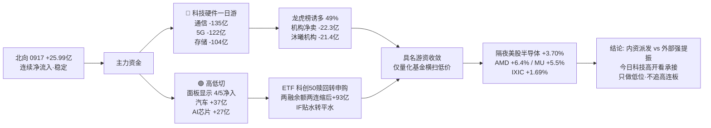

# 2026-09-18 · 💰 资金面

> **数据源新鲜度**: partial · **降级状态**: true · **置信度**: 0.5 · **staleness**: ok (resolved 20260917)
> ⚠️ 隔夜美股已刷新至 **0917 美盘**(周四收盘大涨), 为今日真正隔夜; 两融停在 0916(0917 半库)

## 一句话结论
0917 机构反手砸科技硬件(通信 -135亿 / 5G -122亿 / 存储 -104亿), **0916 天量回流确认"一日游"**; 资金高低切向 面板显示链(唯一 4/5 净入)+汽车链; 龙虎榜诱多 49% + 机构净卖 22.3亿 = **派发日**; 但隔夜美股半导体暴涨(AMD +6.4% / MU +5.5%)→ 今日科技链高开看承接, 高位震荡只做低位, 不追高连板。

## 详细分析

### 🌐 北向资金 · 连续净流入, 量能稳定
0917 北向净买入 **25.99亿**(沪股通 12.02亿 / 深股通 13.96亿), 较 0916 的 26.42亿 微降 0.43亿, 连续净流入未中断。5日均 25.67亿 / 10日均 25.65亿 / 20日均 26.48亿 —— 稳定在 25 亿上下的**配置盘持续温和流入**, 无恐慌无抢筹, 对 A股整体不构成方向性压力。

### 🔄 主力资金 · 科技硬件一日游确认, 高低切向面板/汽车
0917 概念资金流出现**反手大卖**: 昨日(0916)天量买入的通信/半导体今日被原样砸回:

| 方向 | 板块 (净流入·亿) |
|---|---|
| 🔴 流出 | 通信技术 **-134.64** (#1 流出) · 5G概念 **-121.60** · 存储芯片 **-103.65** · 华为概念 **-101.26** · PCB **-96.34** · 国产芯片 **-81.91** · 半导体概念 **-73.65** |
| 🟢 流入 | 智谱AI概念 +27.36 · AI芯片 +27.02 · 海工装备 +24.46 · MiniLED +24.44 · 新零售 +23.87 · 显示技术 +23.06 · MicroLED +22.92 · OLED +22.36 |

行业口径同步验证: **电子 -126.68亿** (#1 流出) · 元件 -80.96亿 · 印制电路板 -62.98亿 · 半导体 -47.55亿; 流入侧 **汽车 +37.08亿** (#1) · 汽车零部件 +30.40亿 · 面板 +23.09亿 · 光学光电子 +20.24亿。

**解读**: 0916 通信 +223亿 / 半导体 +218亿 的"风格切换", 0917 一个交易日被全部吐回 —— **昨日 R7 的"若冲高回落净流出则是'一日游'诱多"预警兑现**。且 0917 流入端全部 ≤27亿, 无任何主线级集中度 —— 资金进入**分散试错**状态(高位震荡退潮期典型)。高低切方向明确: **科技硬件 → 面板显示 / 汽车链**。

**5日时序证伪**: 通信技术 5日(0911→0917)累计 **-32.18亿** / 半导体概念 **-55.05亿** / 存储芯片 **-119.76亿** / 5G概念 +14.22亿 —— 昨日仍是"净出后暴力回补第一天", 今日即被打回, 科技硬件**无 2 日连续净流入**, 风格切换不成立。

### 📊 昨日前十板块 · 5 日追踪(0917 概念净流入前十)
| 板块 | 5日累计 | 净入天数 | 逐日净流入(0911→0917) |
|---|---|---|---|
| OLED | 36.12亿 | 3/5 | -38.44 -3.32 2.49 53.03 22.36 |
| AI芯片 | 29.41亿 | 3/5 | -18.32 -5.0 6.34 19.37 27.02 |
| 显示技术 | 26.47亿 | **4/5** | -9.84 2.52 3.41 7.32 23.06 |
| MicroLED | 22.35亿 | 3/5 | -14.12 5.35 -7.66 15.86 22.92 |
| 电子纸概念 | 18.85亿 | **4/5** | -11.22 1.89 1.58 6.47 20.13 |
| 裸眼3D | 17.85亿 | 3/5 | -0.81 1.88 -7.79 4.61 19.96 |
| 智谱AI概念 | 15.12亿 | 1/5 | -7.11 -3.24 -1.24 -0.65 27.36 |
| MiniLED | 5.05亿 | 2/5 | -20.46 -10.3 -11.07 22.44 24.44 |
| 新零售 | -1.62亿 | 3/5 | -21.35 16.14 -21.41 1.13 23.87 |
| 海工装备 | -17.48亿 | 2/5 | -2.49 -29.68 -16.15 6.38 24.46 |

**解读**: **面板显示链(显示技术 / 电子纸 4/5 净入, OLED / MicroLED 3/5)是全市场唯一连续多日净入的方向** —— 有真实资金持续性; AI芯片 3/5 但 0916-0917 才转强; 智谱AI 仅 1/5(单日脉冲, 不成立); 海工装备 2/5 累计仍负。但单日流入仅 20-27亿 量级, 对比 0916 通信 223亿 差一个数量级 —— **能不能成为新主线, 需今日(0918)续买放大验证**。

### 🏦 ETF / 两融 / 期货 · 杠杆转积极, 贴水转平水
- **ETF 净申赎(0917)**: 上证50ETF **+5.88亿** 净申购 · 科创50ETF **+3.56亿 赎回转申购**(此前连续赎回) · 沪深300ETF -4.24亿 · 中证500ETF -1.01亿 · 创业板ETF -0.73亿。→ **大盘防御 + 科创低位抄底**, 宽基赎回。
- **两融 0916**(0917 半库跳过): 融资余额 **25,887.21亿** 较 0915 **+92.82亿(两连缩后首回升)**, 融资买入 **1,694.91亿** 较 0915 **+344.92亿 大增** → **杠杆资金转积极**。
- **IF2609 收 4,460.2 vs 沪深300 4,460.16 → 基差 +0.04点(贴水转平水)**, 持仓 **-23,047手**(空头大幅离场), **偏多信号**。

### 🐉 龙虎榜 · 诱多命中 49%, 机构全场净卖 22.3亿(派发日)
0917 龙虎榜(去重后) **53只**, 诱多模式命中 **26只(49%)**, 且**机构专用席位全场合计净卖 -22.3亿**。重点高危样本:

| 股票 | 涨跌 | 换手 | 龙虎榜净额 | 机构净额 | 命中模式 |
|---|---|---|---|---|---|
| 沐曦股份 `688802.SH` | 14.44% | 44.97% | **-10.14亿** | **-21.42亿** | 换手异常且净卖出 · 机构专用净卖 |
| 西陇科学 `002584.SZ` | -0.31% | 53.92% | -2.73亿 | -2.67亿 | 换手异常且净卖出 · 机构专用净卖 |
| 桂林旅游 `000978.SZ` | -9.33% | 35.24% | -1.84亿 | -0.14亿 | 换手异常且净卖出 |
| 神农种业 `300189.SZ` | 8.62% | 34.48% | -1.53亿 | -1.74亿 | 换手异常且净卖出 · 机构专用净卖 |
| 沈鼓集团 `601091.SH` | 373.8%(新股) | 79.62% | +0.38亿 | **-1.51亿** | 机构专用净卖(上市首日机构兑现) |
| 世嘉科技 `002796.SZ` | 10.01% | 10.47% | -0.08亿 | -0.32亿 | 涨停但龙虎榜净卖出 · 机构专用净卖 |
| 金健米业 `600127.SH` | 9.97% | 30.02% | +2.15亿 | **-0.30亿** | 涨停但机构兑现 |
| 金石亚药 `300434.SZ` | 19.98% | 13.14% | +1.09亿 | -0.02亿 | 涨停但机构兑现 |

**关键信号**: **沐曦股份(AI芯片新贵)涨 14.4% 但龙虎榜净卖 10.1亿 / 机构净卖 21.4亿** —— 高位放量派发最典型样本; 沈鼓集团上市首日机构即兑现 1.5亿。机构在 AI芯片 / 高换手题材高位**集体兑现**, 与隔夜美股 AMD +6.4% 形成**内外反向**。

### 🎯 昨日前十 5 日追踪(0917 龙虎榜净买前十)
| 股票 | 0917 净买 | 5日累计 | 近5日涨跌幅(0911→0917) |
|---|---|---|---|
| 山子高科 `000981.SZ` | 3.94亿 | 14.32% | -2.26 10.04 5.96 -9.27 9.85 |
| 金健米业 `600127.SH` | 2.15亿 | -5.83% | -3.21 4.58 -10.02 -7.14 9.97 |
| 跨境通 `002640.SZ` | 2.14亿 | 10.49% | 0.58 -1.16 -4.71 5.86 9.91 |
| 共达电声 `002655.SZ` | 1.83亿 | 13.36% | -5.10 2.19 -3.74 10.00 10.01 |
| 华正新材 `603186.SH` | 1.72亿 | 6.41% | 4.47 0.42 10.00 0.96 -9.45 |
| 瑞丰高材 `300243.SZ` | 1.44亿 | 30.08% | -2.00 3.50 1.66 20.01 6.90 |
| 和胜股份 `002824.SZ` | 1.41亿 | 21.28% | -2.64 1.06 7.22 9.98 5.66 |
| 海马汽车 `000572.SZ` | 1.17亿 | 8.77% | -2.23 9.90 -3.70 -3.12 7.92 |
| 金石亚药 `300434.SZ` | 1.09亿 | 20.10% | -2.88 3.36 -1.63 1.26 19.98 |
| 众泰汽车 `000980.SZ` | 0.63亿 | 22.11% | 9.84 9.91 -3.00 -4.87 10.23 |

**解读**: 净买前十呈**汽车(海马 / 众泰 / 和胜) + 消费(金健米业 / 跨境通 / 金石亚药) + 题材(山子高科 / 共达电声 / 华正新材 PCB)** 结构, 无一只是科技硬件龙头 —— 游资接力方向整体从科技切向**低价 / 低位 / 消费复苏**。**金健米业 5日 -5.83% 相对低位**获 2.15亿净买(游资抄底); 华正新材 0917 大跌 -9.45% 但净买 1.72亿(PCB 逆势承接); 高位 30% 的 瑞丰高材 / 金石亚药 追高盈亏比差。

### 🎰 游资协同 · 量化基金独大, 具名游资转保守
- 净买榜首: **量化基金 +11.84亿**(26票, 极度分散) · 紫阳东路 +1.78亿(1票) · 量化打板 +1.63亿(13票) · 思明南路 +1.03亿; 净卖: 玉兰路 -0.71亿 · 温州帮 -0.47亿。**机构专用(单列) -22.3亿全场最大卖家**。
- **3日协同(0915-0917)**: 量化基金 金健米业 / 敦煌种业 / 北自科技 / 中京电子 / 锡华科技 / 博汇科技 6 只 high; 温州帮 北自科技(3日) high; 作手新一 博汇科技(3日) high。
- **信号**: 具名知名游资(章盟主 / 炒股养家 / 紫阳东路)今日明显收敛, 只剩量化基金在横扫低价题材 —— **游资风险偏好收缩**, 与机构派发日互相印证。

### 📡 外部传导 · 隔夜美股半导体全线暴涨 → 今日科技链强提振
**隔夜美股 0917 美盘(今日真正隔夜, 已刷新)**: 半导体组平均 **+3.70%** —— **AMD +6.36% · MU +5.50% · TSM +3.00% · NVDA +2.54% · GLW +2.52% · AVGO +2.29%**; 大科技组 +1.66%(TSLA +2.27% / AMZN +2.13% 最强)。指数: **SPX +1.14% / IXIC +1.69% / DJI +0.61% 全线上涨**。外围: 恒指 -0.44% / 韩股 -0.04% 偏弱。USDCNH 未取到(tushare fx 空)。
→ **外部利空解除 + 强正向外溢**: 今日 A股存储(MU +5.5%)/ CPO(GLW +2.5%)/ 半导体(NVDA +2.5% / AMD +6.4%)/ 算力链情绪**强提振**。但注意 —— 昨日内资机构刚在科技硬件大额派发(通信 -135亿 / 机构净卖 22.3亿), 今日高开后的**承接质量**才是关键: 放量承接 = 内外共振反包; 高开缩量 = 借利好出货的诱多。

## 资金传导图

## 推理深度三问

### 对象一 · 0917 科技硬件单日反手净出(通信 -135亿 / 5G -122亿 / 存储 -104亿)
- **大资金意图**: 0916 天量买入(通信 +223亿)本质是**抢反弹的短线盘**, 0917 无 2 日续买即集体撤退 —— 说明 0916 的"风格切换"只是超跌反弹, 不是机构建仓; 对手盘是 0916 追高接盘的跟风资金, 0917 全部被埋。
- **为什么走弱**: 位置(0916 单日暴涨后已到套牢密集区)+ 催化缺失(无新增产业催化, 全靠超跌反弹情绪)+ 筹码(机构 0917 龙虎榜净卖 22.3亿, 高位 AI芯片/PCB 遭机构兑现)。
- **逻辑够不够硬**: 证伪确凿 —— 5日累计通信技术 -32亿 / 存储 -120亿 / 半导体 -55亿, "2日连续净流入"完全未成立; 昨日 R7 的"一日游"预警被市场验证。**科技硬件资金面主线地位正式下修**。

### 对象二 · 面板显示链 5日 4/5 净入(显示技术 +26.47亿 / 电子纸 +18.85亿 / OLED +36.12亿)
- **大资金意图**: 高低切中唯一有**多日持续性**的方向 —— 资金不是单日脉冲, 而是连续 3-4 日边洗边买; 面板涨价/显示景气叙事 + 位置低(前期未炒作)。
- **为什么走强**: 位置(相对低位)+ 持续(4/5 净入是资金用脚投票)+ 筹码(无高位套牢, 抛压轻)。
- **逻辑够不够硬**: 持续性在资金面是全场最强, 但**量级不足**(单日 20-27亿, 对比科技硬件巅峰 200亿+), 且尚未出现板块内涨停潮与龙头高度 —— **作为观察主线成立, 作为进攻主线证据仍不足**, 需今日续买放大。

### 对象三 · 隔夜美股半导体全线大涨(AMD +6.4% / MU +5.5%) vs 内资机构派发
- **大资金意图**: 美股周四大涨(IXIC +1.69%)由半导体龙头业绩/存储涨价驱动, 是**外部基本面利多**; A股机构 0917 派发是**内部资金面行为**, 两者驱动源不同。
- **为什么背离**: 美股存储链(美光 MU +5.5%)与 A股存储/CPO 强联动, 但 A股机构刚从这些方向撤退, 存在**时间差** —— 今日高开是肯定的, 关键是机构是否回补。
- **逻辑够不够硬**: 外部分子强(硬数据), 内部分子弱(机构刚卖)—— **方向看高开, 质量看承接**; 若高开 2%+ 缩量, 大概率是内资借利好出货的二次诱多。

## 观察池顶部(资金视角 · 非买入推荐)
### 沐曦股份 688802.SH · 态度: 拦截(机构高位派发 21.4亿, 但隔夜 AMD +6.4% 或刺激高开)
- **买入理由**: ① AI芯片国产算力核心, 隔夜 AMD +6.36% 最强映射; ② 0917 逆势涨 14.44%, 人气未散。
- **风险点**: ① 0917 龙虎榜净卖 **-10.14亿**, 机构净卖 **-21.42亿** —— 全场最大派发样本, 主力在涨停附近出货; ② 换手 44.97% 天量, 筹码已彻底松动; ③ 高位震荡期 20cm 连板接力盈亏比极差。
- **止损条件**: 不参与为主; 若隔夜利多刺激高开 >5% 缩量 → 直接拦截; 高开 0-3% 且竞价量 ≥ 昨日 2 倍 → 才进入观察(不追高)。
- **可验证假设**: 今日若高开缩量冲高回落 → 确认借利好出货, 全周回避; 若放量反包涨停且机构席位转净买 → 内资回补, 弱转强成立。

### 金健米业 600127.SH · 态度: 观察(游资量化基金 3 日协同 + 低位消费, 但机构涨停兑现)
- **买入理由**: ① 0917 龙虎榜净买 2.15亿 #2, 量化基金 3 日连续上榜(high 协同); ② 5日累计 **-5.83% 相对低位**, 农业/消费防御属性; ③ 0917 涨停换手 30%, 游资在低位做多。
- **风险点**: ① 涨停但机构专用净卖 -0.30亿 —— 游资买机构卖, 接力资金单一; ② 消费复苏题材逻辑一般, 无硬催化; ③ 高位震荡期防御票爆发力有限。
- **止损条件**: 参与后跌破 0917 涨停价(约 13.02 元)无条件走; 低开 >3% 且无量不参与。
- **可验证假设**: 今日若高开 0-3% 放量承接且不破均价 → 低位做多成立; 若高开低走回补缺口 → 游资一日游, 观察池移除。

### 山子高科 000981.SZ · 态度: 观察(LHB 净买第一 3.94亿, 中位 5日 +14.32%)
- **买入理由**: ① 0917 龙虎榜净买 **3.94亿 全场第一**; ② 低价题材股, 波动大弹性足。
- **风险点**: ① 5日 +14.32% 已属中位, 高位震荡期接力风险大; ② 题材属性(无主线归属), 资金一日游概率高; ③ 0916 曾 -9.27% 巨震, 筹码不稳。
- **止损条件**: 不参与为主; 若参与, 破前日涨停价(约 3.01 元)无条件走。
- **可验证假设**: 今日若竞价高开 >5% 缩量秒板 → 诱多; 若平开分歧后放量转强 → 中位弱转强, 仅超短仓。

## 关键证据
- 证据 1: 北向 0917 +25.99亿, 5日均 25.67亿, 连续净流入 · 来源 tushare.moneyflow_hsgt
- 证据 2: 概念资金流 流出 通信技术 -134.64亿 / 5G -121.60亿 / 存储 -103.65亿 / 华为 -101.26亿 / PCB -96.34亿; 流入 智谱AI +27.36亿 / AI芯片 +27.02亿 / MiniLED +24.44亿 · 来源 tushare.moneyflow_ind_dc
- 证据 3: 行业口径 电子 -126.68亿 / 元件 -80.96亿 / PCB -62.98亿; 汽车 +37.08亿 / 面板 +23.09亿, 双口径同向 · 来源 tushare.moneyflow_ind_dc
- 证据 4: 通信技术 5日 -32.18亿 / 半导体 -55.05亿 / 存储 -119.76亿 —— 0916 回补全部吐回 · 来源 moneyflow_ind_dc 5日追踪
- 证据 5: 面板显示链 显示技术 +26.47亿(4/5) / 电子纸 +18.85亿(4/5) / OLED +36.12亿(3/5) 全场唯一持续净入 · 来源 moneyflow_ind_dc 5日追踪
- 证据 6: 龙虎榜 53只中诱多 26只(49%), 机构专用全场净卖 -22.3亿; 沐曦股份 机构净卖 -21.42亿 · 来源 tushare.top_list + top_inst
- 证据 7: 游资量化基金 +11.84亿(26票) 独大, 3日协同 金健米业/敦煌种业/北自科技/博汇科技 · 来源 tushare.hm_detail
- 证据 8: ETF 上证50 +5.88亿 / 科创50 +3.56亿 净申购, 300/500/创业板赎回 · 来源 tushare.fund_share
- 证据 9: 两融 0916 融资余额 25,887.21亿 +92.82亿(两连缩后首回升), 融资买入 1,694.91亿 +344.92亿 · 来源 tushare.margin_detail
- 证据 10: IF2609 基差 +0.04点(贴水转平水), 持仓 -23,047手 空头离场 · 来源 tushare.fut_daily
- 证据 11: 隔夜美股 0917 美盘 半导体组 +3.70%(AMD +6.36% / MU +5.50% / TSM +3.00% / NVDA +2.54% / GLW +2.52%), SPX +1.14% / IXIC +1.69% · 来源 tushare.us_daily + index_global

## 数据源审计
| 源 | 日期 | 状态 | 备注 |
|---|---|---|---|
| tushare/moneyflow_hsgt | 2026-09-17 | 🟢 | 20条 · 北向 5/10/20日 |
| tushare/moneyflow_ind_dc | 2026-09-17 | 🟢 | 概念5日 2345条 + 10日 4690条 + 行业 496条 |
| tushare/top_list | 2026-09-17 | 🟢 | 58条原始 · 去重后 53只 |
| tushare/top_inst | 2026-09-17 | 🟢 | 620条 · 机构专用席位 |
| tushare/hm_detail | 2026-09-17 | 🟢 | 218条 · 游资明细 + 3日协同窗口 |
| tushare/margin_detail | 2026-09-16 | 🟡 | 0917 半库(2343行)跳过, 用 0916 完整(4447行, 较昨日R7的0915新一档) |
| tushare/fund_share + fund_daily | 2026-09-17 | 🟢 | 5只ETF 申赎估算 + 收盘 |
| tushare/fut_daily | 2026-09-17 | 🟢 | IF2609 基差 +0.04 · oi -23,047手 |
| tushare/index_daily | 2026-09-17 | 🟢 | 沪深300 4,460.16 |
| tushare/daily | 2026-09-17 | 🟢 | 昨日前十 5日行情 50条 |
| tushare/us_daily + index_global | 2026-09-17 | 🟢 | 隔夜美股 0917 美盘 12股 + 6指数 |
| overseas_snapshot.json | 2026-09-16 | 🟡 | 初始 us_stocks 0916 美盘, 已由 tushare 刷新至 0917 |
| vibe-trading MCP | - | 🔴 | 未在 session 工具集 · 用 tushare 等价口径替代 |

## 不确定性 / 反证
1. **隔夜美股是 0917 美盘大涨(已是最新)**, 但这是 A股 0917 收盘后的增量 —— 今日高开确定性高, 高开后的承接质量未知; 若高开缩量 → 内资借利好二次出货, "外部提振"逻辑反而成为诱多工具。
2. **机构专用净卖 -22.3亿 为单日截面**; "真出货"与否需 E1 T+1 回填验证(沐曦 / 金健 / 金石亚药次日是否兑现)。
3. **面板显示链 4/5 净入但单日仅 ~24亿**, 主线级集中度不足(对比 0916 通信 223亿), 能否升级为新主线需今日续买放大, 否则只是高低切中的过渡方向。
4. 两融 0917 半库(2343 行)缺失用 0916 完整; ETF 净申赎为份额×收盘价估算, 非一级市场真实流水; USDCNH 未取到。
5. 龙虎榜诱多 49% 为规则截面(机构净卖 / 高换手净卖 / 涨停净卖), 命中率高企本身就反映派发日特征, 但非每只都"真出货"。
6. 跷跷板 10日窗口 0 对 ≤ -0.6; 真实高低切为"科技硬件 → 面板/汽车"的资金流切换, 非板块间负相关 —— 算法口径偏差留 E2 评估。
7. 本报告所有板块流入/流出为东财概念口径(DC), 与同花顺/申万口径存在差异。

## 与其他 R/D/E 的关系
- 依赖: data/raw/20260918/manifest.json(global_severity=3) · mcp_health.json · overseas_snapshot.json; data/research/20260918/emotion_cycle.json(高位震荡 high_chop · 参考); R1/R2 未就绪(07:30 并行)
- 被消费: D1(main_decision_v1) 资金维度 + staleness_status 消费(ok → 正常); R2(analyze_main_sectors_v1) 板块资金约束(科技硬件一日游 vs 面板显示持续净入); R6(analyze_devil_advocate_v1) 机构派发佐证(沐曦股份 / 西陇科学 / 金石亚药); E1(daily_review_v1) 资金面复盘 + 前十追踪回填

## Sub-Agent 元数据
- skill: analyze_capital_flow_v1 (chain: hot_money_synergy_v1 · detect_seesaw_pairs_v1 · render_kg_md_v1)
- artifact: data/research/20260918/R7_capital_flow.json (dated copy: R7_capital_flow_20260917.json)
- 生成耗时: ~230 秒
- model: deepseek-v4-flash-ga-260731
