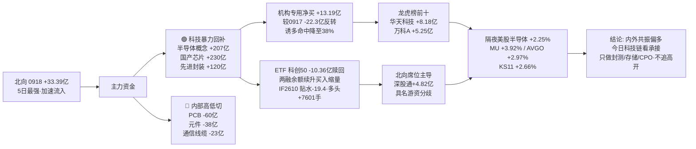

# 2026-09-21 · 💰 资金面

> **数据源新鲜度**: partial · **降级状态**: true · **置信度**: 0.5 · **staleness**: ok (resolved 20260918)
> ⚠️ 数据基日为 **0918(周五)收盘**, 为今日真正最新可得; 隔夜美股已刷新至 **0918 美盘**(周五, 半导体续强); 两融停在 0917(0918 半库)

## 一句话结论
0918 内资机构**反手回补科技**——半导体/国产芯片/CPO/先进封装全线大幅净入, 机构专用席位净买 **+13.19亿**(较 0917 的 -22.3亿 大反转), 北向 **+33.39亿** 创 5 日最强; 叠加隔夜美股半导体续强(MU +3.92% / AVGO +2.97%)→ **今日科技链内外共振偏多**, 但科创50ETF 大额赎回 -10.36亿 + 两融买入缩量 → 高开勿追, 只做封测/存储/CPO 低位与龙头承接。

## 详细分析

### 🌐 北向资金 · 5 日最强, 加速净流入
0918 北向净买入 **33.39亿**(沪股通 16.12亿 / 深股通 17.28亿), 较 0917 的 25.99亿 **大幅放量 +7.40亿**, 为近 5 日最强。5日均 26.52亿 / 10日均 26.25亿 / 20日均 26.81亿——连续净流入未中断且**量能台阶上移**, 配置盘+交易盘同步转积极, 对 A股整体构成温和正支撑。

### 🔄 主力资金 · 科技暴力回补, 机构从派发转回补
0918 概念资金流与 0917 完全反转——**昨日(0917)被砸的科技硬件今日被暴力买回**:

| 方向 | 板块 (净流入·亿) |
|---|---|
| 🟢 流入 | 融资融券 +383.5 · MSCI中国 +280.91 · 深股通 +245.57 · **国产芯片 +229.91** · 富时罗素 +213.59 · **半导体概念 +207.28** · 深成500 +196.3 · 科技风格 +184.83 · 百元股 +160.19 · **CPO概念 +141.91** |
| 🔴 流出 | **PCB -60.19** · 东方财富热股 -58.58 · 昨日高振幅 -41.5 · 风能 -26.17 · PEEK材料 -25.07 · 海工装备 -20.46 · 特高压 -19.3 · 昨日高换手 -17.76 |

行业口径同步验证: **电子 +198.54亿** (#1) · **半导体 +182.20亿** · 数字芯片设计 +75.35亿 · 通信网络设备 +67.53亿 · **集成电路封测 +50.83亿**; 流出侧 **印制电路板 -41.17亿** · 元件 -38.06亿 · 通信线缆 -22.80亿。

**解读**: 0917 R7 的"科技一日游"预警, 0918 被**一个交易日内反转**——不是新资金, 是同一批资金(融资融券 +383.5亿 全场第一)在 **PCB/元件 → 半导体/芯片/CPO/封测** 内部高低切。**机构专用席位 0918 净买 +13.19亿, 从 0917 的 -22.3亿 派发转为回补**, 是今日最重要的资金面拐点。

### 📊 昨日前十板块 · 5 日追踪(0918 概念净流入前十·过滤宽基/风格/杠杆)
| 板块 | 5日累计 | 净入天数 | 逐日净流入(0914→0918) |
|---|---|---|---|
| 半导体概念 | 336.69亿 | 3/5 | -56.0 40.8 218.3 -73.7 207.3 |
| 国产芯片 | 274.47亿 | 3/5 | -80.8 12.6 194.7 -81.9 229.9 |
| **先进封装** | **168.89亿** | **4/5** | -15.6 11.9 78.0 0.8 93.9 |
| 存储芯片 | 124.66亿 | 3/5 | -66.7 28.8 132.1 -103.7 134.1 |
| 物联网 | 93.94亿 | 2/5 | -65.7 -13.7 67.8 -17.1 122.7 |
| CPO概念 | 70.26亿 | 2/5 | -123.5 -75.1 157.2 -30.3 141.9 |
| 通信技术 | 59.96亿 | 2/5 | -90.2 -43.0 223.0 -134.6 104.8 |
| 人工智能 | 48.66亿 | 2/5 | -40.2 -43.5 38.5 -23.3 117.1 |
| 消费电子概念 | 39.77亿 | 2/5 | -40.0 -30.8 47.2 -39.4 102.8 |
| 数据中心 | 15.07亿 | 2/5 | -72.5 -43.1 96.0 -57.1 91.8 |

**解读**: **先进封装 4/5 净入 + 0918 单日 93.9亿 加速** = 全市场唯一"连续 4 日净入 + 末日加速"的方向, 资金持续性最强; 半导体概念/国产芯片 3/5 但 0918 单日 200亿+ 天量回补(207.3 / 229.9亿), 属于**暴力反转**; 存储芯片 0918 单日 +134.1亿(单日最强之一) + 隔夜 MU +3.92% → **内外共振最强链**。PCB/元件 5 日仍在净出, 高低切方向明确。

### 🏦 ETF / 两融 / 期货 · 高开兑现 vs 防御补仓
- **ETF 净申赎(0918)**: 科创50ETF **-10.36亿 大幅赎回**(当日 +2.83% 高开兑现) · 创业板ETF **-9.77亿 赎回** · 上证50ETF **+5.06亿 净申购** · 中证500ETF +2.54亿 · 沪深300ETF -1.90亿。→ **科技涨而 ETF 赎回 = 兑现盘**, 宽基防御补仓。
- **两融 0917**(0918 半库跳过): 融资余额 **25,911.00亿** 较 0916 **+23.79亿(连续回升)**, 融资买入 **1,621.32亿** 较 0916 **-73.59亿(缩量)** → 余额续升但买入缩量, **杠杆温和不追高**。
- **IF2610**(IF2609 0918 交割移仓): 收 **4,488.0** vs 沪深300 4,507.39 → **基差 -19.39点(贴水 -0.43%)**, 持仓 **+7,601手(多头进场)**。移仓后贴水扩大属正常, 持仓增加显示多头温和进场。

### 🐉 龙虎榜 · 诱多命中 38%(较 0917 的 49% 下降), 机构净买 +13.19亿(回补日)
0918 龙虎榜(去重后) **50只**, 诱多模式命中 **19只(38%)**, **机构专用席位全场合计净买 +13.19亿**(较 0917 的 -22.3亿 反转)。重点高危样本:

| 股票 | 涨跌 | 换手 | 龙虎榜净额 | 机构净额 | 命中模式 |
|---|---|---|---|---|---|
| 电科思仪 `301689.SZ` | 20.00% | 49.34% | **-1.19亿** | **-2.35亿** | 涨停净卖出 · 换手异常净卖 · 机构净卖 · 机构兑现 |
| 沐曦股份 `688802.SH` | 1.52% | 30.65% | -2.19亿 | **-1.95亿** | 换手异常且净卖出 · 机构专用净卖 |
| 中晶科技 `003026.SZ` | 0.54% | 39.65% | -1.59亿 | -1.61亿 | 换手异常且净卖出 · 机构专用净卖 |
| 华软科技 `002453.SZ` | 10.10% | 13.44% | -0.67亿 | -0.85亿 | 涨停净卖出 · 机构净卖 · 机构兑现 |
| 百迈科 `920268.BJ` | 16.56% | 56.85% | -0.16亿 | -0.08亿 | 涨停净卖出 · 高换手净卖 · 机构兑现 |
| 新宏泽 `002836.SZ` | 9.96% | 5.50% | -0.39亿 | -0.72亿 | 涨停净卖出 · 机构净卖 · 机构兑现 |

**关键信号**: **电科思仪(军工电子)涨 20% 但龙虎榜净卖 1.19亿 / 机构净卖 2.35亿** = 高位 20cm 派发最典型; 沐曦股份(AI芯片)连续两日上榜净卖, 机构在兑现。**但整体机构已由卖转买(+13.19亿)**, 派发压力较 0917 大幅缓解——诱多命中率下降 + 机构净买转正, 确认回补日特征。

### 🎯 昨日前十 5 日追踪(0918 龙虎榜净买前十)
| 股票 | 0918 净买 | 5日累计 | 近5日涨跌幅(0914→0918) |
|---|---|---|---|
| **华天科技 `002185.SZ`** | **8.18亿** | 11.29% | -1.23 2.25 3.00 -2.73 10.01 |
| **万科A `000002.SZ`** | **5.25亿** | 8.62% | -0.33 -0.98 0.33 -0.33 9.93 |
| 惠科股份 `001399.SZ` | 4.19亿 | 18.21% | 4.22 4.10 1.42 -1.54 10.02 |
| 金健米业 `600127.SH` | 3.37亿 | 7.37% | 4.58 -10.02 -7.14 9.97 9.98 |
| 铭普光磁 `002902.SZ` | 2.69亿 | 1.45% | -3.05 -2.34 1.95 -2.11 7.00 |
| 华盛昌 `002980.SZ` | 1.85亿 | 1.31% | -2.92 -4.52 1.39 -2.64 10.00 |
| 托伦斯 `301583.SZ` | 1.80亿 | 27.52% | 2.21 2.73 3.41 -0.83 20.00 |
| 国芳集团 `601086.SH` | 1.72亿 | 0.22% | 10.03 -10.01 -10.01 0.21 10.00 |
| 科森科技 `603626.SH` | 1.61亿 | 27.13% | 9.98 -5.36 2.49 10.03 10.00 |
| 星徽股份 `300464.SZ` | 1.40亿 | 39.16% | 1.85 1.21 20.00 -1.30 17.39 |

**解读**: 净买前十呈 **科技封测(华天科技 8.18亿 全场第一) + 地产顺周期(万科A 5.25亿) + 面板(惠科股份) + 题材(托伦斯/星徽股份 20cm 高位)** 结构。**华天科技 5 日 +11.29% 且 0918 涨停** = 集成电路封测方向龙头获龙虎榜最大净买, 与行业资金流(封测 +50.83亿)呼应, 是科技回补的首选载体; 万科A 低位首板+5.25亿 = 顺周期低位资金进场; 托伦斯/星徽股份 5日 +27%~+39% 高位 20cm, 追高盈亏比极差。

### 🎰 游资协同 · 北向席位主导, 具名游资分歧
- 净买前列(hm_detail 口径): **深股通专用 +4.82亿**(12票) · 量化打板 +4.24亿 · 紫阳东路 +3.92亿 · 沪股通专用 +3.88亿 · **佛山系 +3.31亿** · 量化基金 +2.47亿; 净卖: **T王 -1.86亿** · 徐留胜 -1.72亿 · 机构专用 -1.04亿(hm_detail 口径, 与 top_inst 口径差异)。
- **3日协同(0916-0918)**: **141 flags / 22 high**。high 样本: 西陇科学 `002584.SZ`(深股通+机构 3日) · 百迈科 `920268.BJ` · 锡华科技 `603248.SH`(国泰海通+高盛+华泰 3日) · 北自科技 `603082.SH`(沪股通+国泰海通+摩根大通 3日) · 金健米业 · 洛轴股份 · 万邦医药。
- **信号**: **北向席位(深/沪股通专用)成为龙虎榜最大买家** = 外资借道互联互通直接参与题材; 具名游资分歧(T王/徐留胜净卖), 但佛山系/紫阳东路转多 → 游资风险偏好修复中。

### 📡 外部传导 · 隔夜美股半导体续强(周五美盘) → 今日科技链继续提振
**隔夜美股 0918 美盘(今日真正隔夜, 已刷新)**: 半导体组平均 **+2.25%** —— **MU +3.92% · AVGO +2.97% · AMD +2.70% · GLW +1.58% · NVDA +1.34% · TSM +1.02%**; 大科技组 **-0.40%**(META -2.43% / MSFT -0.80% / AAPL -0.26% / TSLA -0.53%, AMZN +1.00% / GOOGL +0.64%)。指数: **SPX +0.17% / IXIC +0.39% / DJI -0.18%** 平盘; 韩股 **KS11 +2.66%**(半导体映射强); 恒指 +0.60%。USDCNH 未取到(tushare fx 空)。
→ **外部偏正 + 内部机构回补 = 内外共振**: 今日 A股存储(MU +3.92%)/ 半导体(AVGO +2.97%)/ CPO(GLW +1.58%)链情绪继续提振, 且与 0918 内资机构回补方向一致——**这是 0917"外部强内资弱"格局的修复**。但注意大科技组转弱(META -2.43%), 消费电子/AI应用映射减弱, 焦点集中在硬科技(存储/封测/CPO)。

## 资金传导图

## 推理深度三问

### 对象一 · 0918 科技暴力回补(半导体 +207亿 / 国产芯片 +230亿 / 机构净买 +13.19亿)
- **大资金意图**: 0917 的"一日游"式卖出(通信 -135亿)本质是**获利兑现**, 0918 在同一批方向以更大资金量买回 = 机构**洗盘后回补**, 而非撤退; 融资融券 +383.5亿 全场第一说明**杠杆资金是主力推手**, 对手盘是 0917 追跌割肉的散户与 T+0 量化。
- **为什么走强**: 位置(0917 单日回吐后回到 0916 起涨点下方, 洗盘充分)+ 催化(隔夜美股半导体连续两日大涨, MU 两日 +9.5%)+ 筹码(机构 0917 刚卖完, 0918 无套牢盘直接买回)。
- **逻辑够不够硬**: 三源共振——概念资金流 + 行业资金流 + 机构席位(tushare 三口径独立), 且与隔夜美股半导体方向一致; 证伪路径: 若 0921 高开缩量冲高回落且机构席位转净卖 → 仍是"两日游"级别反弹, 不构成主升。

### 对象二 · 先进封装 5日 4/5 净入 + 0918 加速(单日 +119.79亿)
- **大资金意图**: 全市场唯一"连续 4 日净入 + 末日加速"的方向, 资金在**半导体内部选持续性最强的子链**(封测/先进封装受益 AI 芯片放量+HBM 需求), 不是单日脉冲而是连续建仓; 集成电路封测行业 +50.83亿 + 华天科技龙虎榜净买第一 8.18亿 三口径指向同一方向。
- **为什么走强**: 持续性(4/5 净入是资金用脚投票)+ 龙头(华天科技涨停获最大净买)+ 产业催化(先进封装 = AI 芯片刚需环节, 美股 TSM/AVGO 持续走强)。
- **逻辑够不够硬**: 资金面持续性全场最强 + 龙虎榜/行业/概念三源共振, 硬逻辑成立; 证伪路径: 若 0921 先进封装概念转净出且华天科技断板 → 高位兑现, 回踩后再看。

### 对象三 · 科创50ETF -10.36亿 大额赎回 vs 机构回补(方向背离)
- **大资金意图**: 机构(龙虎榜/主力资金)在**二级市场买股票**, ETF 投资者在**一级市场赎回份额** = 两批资金、两种行为; ETF 赎回通常滞后于股价上涨(周五 +2.83% 触发获利了结), 是**兑现盘**而非看空。
- **为什么走强**(方向背离的走强判定): 科创50 0918 涨 2.83%, 持有者借反弹赎回降低仓位; 而机构通过股票通道直接买半导体/封测个股——**指数 ETF 与个股主力存在 1-2 日时间差**, 机构在个股端仍偏多, 走强方向未被 ETF 赎回否决。
- **逻辑够不够硬**: ETF 赎回是高频兑现信号, 对指数层面是**压制因素**(宽基赎回 = 指数资金净流出), 对个股层面不影响机构方向; 今日若科创50继续放量上攻而 ETF 仍赎回 → 兑现盘被增量吃掉, 更偏多; 若缩量 → 赎回压制显现。

## 观察池顶部(资金视角 · 非买入推荐)
### 华天科技 002185.SZ · 态度: 观察(龙虎榜净买第一 8.18亿 + 封测方向资金最强, 但 0918 已涨停·今日追高需谨慎)
- **买入理由**: ① 0918 龙虎榜净买 **8.18亿 全场第一**, 集成电路封测行业 +50.83亿 最强; ② 先进封装概念 5日 4/5 净入 + 单日 119.79亿 加速, 全市场资金持续性第一; ③ 隔夜美股半导体续强(TSM +1.02% / AVGO +2.97%)产业映射。
- **风险点**: ① 0918 已涨停, 0921 高开追入成本高; ② 5日 +11.29% 中位偏上, 若高开 >5% 盈亏比恶化; ③ 高位震荡期(emotion_cycle=high_chop)涨停接力炸板风险。
- **止损条件**: 若参与, 破 0918 涨停价(约 18.03 元)无条件走; 高开 >5% 缩量不追。
- **可验证假设**: 今日若平开/低开 0-3% 放量承接且不破均价 → 封测主线确认, 弱转强成立; 若高开缩量冲高回落 → 一日游, 观察池移除。

### 万科A 000002.SZ · 态度: 观察(顺周期低位首板 + 龙虎榜净买 5.25亿)
- **买入理由**: ① 0918 龙虎榜净买 **5.25亿 #2**, 地产/顺周期方向资金进场; ② 位置低(5日 +8.62%, 前期未炒作), 高位震荡期低位补涨属性; ③ 大市值 + 高流动性, 承接盘厚。
- **风险点**: ① 地产无新硬催化, 更多是"高低切"过渡方向; ② 首板后若大盘调整, 大票弹性差; ③ 机构/游资在顺周期的持续性弱于科技主线。
- **止损条件**: 破 0918 涨停价(约 3.32 元)无条件走; 若 2 日不创新高减半。
- **可验证假设**: 今日若科技分歧, 地产能否承接资金成为第二主线 → 看万科A 是否 2 连板 + 板块 3 家以上涨停。

### 电科思仪 301689.SZ · 态度: 拦截(涨 20% 但机构净卖 2.35亿·高位 20cm 派发)
- **买入理由**: 无——军工电子题材人气高, 但资金面已明确派发。
- **风险点**: ① 涨停 + 换手 49.34% 天量 + 龙虎榜净卖 1.19亿 + **机构净卖 2.35亿**, 四重派发信号全中; ② 20cm 高位(单日 +20%)次日溢价不可持续; ③ 高位震荡期 20cm 连板接力盈亏比极差。
- **止损条件**: 不参与; 若持有, 竞价低开 >3% 无条件走。
- **可验证假设**: 今日若高开缩量冲高回落 → 确认借利好出货, 全周回避; 若放量反包涨停且机构转净买 → 弱转强(概率低, 仅记录)。

## 关键证据
- 证据 1: 北向 0918 +33.39亿(沪 16.12 / 深 17.28), 5日均 26.52亿, 5日最强加速 · 来源 tushare.moneyflow_hsgt
- 证据 2: 概念资金流 流入 国产芯片 +229.91亿 / 半导体概念 +207.28亿 / CPO +141.91亿 / 存储芯片 +195.74亿(单日); 流出 PCB -60.19亿 / 元件(行业) -38.06亿 · 来源 tushare.moneyflow_ind_dc
- 证据 3: 行业口径 电子 +198.54亿 / 半导体 +182.20亿 / 数字芯片设计 +75.35亿 / 集成电路封测 +50.83亿; PCB -41.17亿, 双口径同向 · 来源 tushare.moneyflow_ind_dc
- 证据 4: 先进封装 5日 4/5 净入 + 单日 119.79亿 加速; 半导体概念/国产芯片 3/5 暴力反转 · 来源 moneyflow_ind_dc 5日追踪
- 证据 5: 龙虎榜 50只中诱多 19只(38%, 较 0917 49% 下降), 机构专用全场净买 +13.19亿(反转); 电科思仪 机构净卖 -2.35亿 · 来源 tushare.top_list + top_inst
- 证据 6: LHB 净买前十 华天科技 +8.18亿 / 万科A +5.25亿 / 惠科股份 +4.19亿 · 来源 tushare.top_list
- 证据 7: 游资 深股通专用 +4.82亿(12票) / 量化打板 +4.24亿 / 紫阳东路 +3.92亿; 3日协同 141 flags / 22 high(西陇科学 / 锡华科技 / 北自科技) · 来源 tushare.hm_detail + top_inst
- 证据 8: ETF 科创50 -10.36亿 / 创业板 -9.77亿 赎回, 上证50 +5.06亿 净申购 · 来源 tushare.fund_share
- 证据 9: 两融 0917 融资余额 25,911.00亿 +23.79亿(连续回升), 融资买入 1,621.32亿 -73.59亿(缩量) · 来源 tushare.margin_detail
- 证据 10: IF2610 基差 -19.39点(贴水 -0.43%), 持仓 +7,601手 多头进场(IF2609 0918 交割移仓) · 来源 tushare.fut_daily + index_daily
- 证据 11: 隔夜美股 0918 美盘 半导体组 +2.25%(MU +3.92% / AVGO +2.97% / AMD +2.70%), 大科技 -0.40%(META -2.43%), SPX +0.17% / IXIC +0.39% / KS11 +2.66% · 来源 tushare.us_daily + index_global + overseas_snapshot.json

## 数据源审计
| 源 | 日期 | 状态 | 备注 |
|---|---|---|---|
| tushare/moneyflow_hsgt | 2026-09-18 | 🟢 | 20条 · 北向 5/10/20日 |
| tushare/moneyflow_ind_dc | 2026-09-18 | 🟢 | 概念5日 2520条 + 10日 5040条 + 行业 496条 |
| tushare/top_list | 2026-09-18 | 🟢 | 55条原始 · 去重后 50只 |
| tushare/top_inst | 2026-09-18 | 🟢 | 580条 · 机构专用席位 |
| tushare/hm_detail | 2026-09-18 | 🟢 | 207条 · 游资明细 + 3日协同窗口 |
| tushare/margin_detail | 2026-09-17 | 🟡 | 0918 半库(2002行)跳过, 用 0917 完整(4448行, 较昨日R7的0916新一档) |
| tushare/fund_share + fund_daily | 2026-09-18 | 🟢 | 5只ETF 申赎估算 + 收盘 |
| tushare/fut_daily | 2026-09-18 | 🟢 | IF2610 基差 -19.39 · oi +7,601手(IF2609 交割) |
| tushare/index_daily | 2026-09-18 | 🟢 | 沪深300 4,507.39 |
| tushare/daily | 2026-09-18 | 🟢 | 昨日前十 5日行情 50条 |
| tushare/us_daily + index_global | 2026-09-18 | 🟢 | 隔夜美股 0918 美盘 12股 + 5指数 |
| overseas_snapshot.json | 2026-09-18 | 🟢 | us_stocks 0918 美盘 12条(本次重跑成功) |
| vibe-trading MCP | - | 🔴 | MCP down(mcp_health timeout>45s) · 用 tushare 等价口径替代 |

## 不确定性 / 反证
1. **0918 科技回补是"洗盘后回补"还是"诱多二波"?** 机构净买 +13.19亿 为单日截面; 需 E1 T+1 回填验证(华天科技/万科A 次日是否承接)。若 0921 高开缩量 → 借利好二次派发。
2. **科创50ETF -10.36亿 大额赎回** 是明确兑现信号, 与机构回补方向背离; 若指数层面赎回持续, 科技反弹高度受限。
3. **两融买入缩量(-73.59亿)** — 杠杆余额续升但增量放缓, 若融资买入继续萎缩, 反弹动能衰减。
4. 两融 0918 半库(2002 行)缺失用 0917 完整; ETF 净申赎为份额×收盘价估算, 非一级市场真实流水; USDCNH 未取到。
5. 龙虎榜诱多 38% 为规则截面(机构净卖 / 高换手净卖 / 涨停净卖), 命中率下降但单票仍可能"真出货"(电科思仪/沐曦)。
6. 跷跷板 10日窗口 0 对 ≤ -0.6; 真实切换为科技硬件**内部**高低切(PCB→半导体/封测), 非板块间负相关 —— 算法口径偏差留 E2 评估。
7. 本报告所有板块流入/流出为东财概念口径(DC), 与同花顺/申万口径存在差异。
8. 隔夜美股为周五(0918)美盘, 周一(0921)盘前美股期货未纳入; 若周末出现黑天鹅(地缘/政策), 外部传导结论失效。

## 与其他 R/D/E 的关系
- 依赖: data/raw/20260921/manifest.json(global_severity=3) · mcp_health.json · overseas_snapshot.json; data/research/20260921/emotion_cycle.json(高位震荡 high_chop · 参考); R1/R2 未就绪(07:30 并行)
- 被消费: D1(main_decision_v1) 资金维度 + staleness_status 消费(ok → 正常); R2(analyze_main_sectors_v1) 板块资金约束(半导体/封测/存储净入 vs PCB 净出); R6(analyze_devil_advocate_v1) 高位派发佐证(电科思仪 / 沐曦股份); E1(daily_review_v1) 资金面复盘 + 前十追踪回填

## Sub-Agent 元数据
- skill: analyze_capital_flow_v1 (chain: hot_money_synergy_v1 · detect_seesaw_pairs_v1 · render_kg_md_v1)
- artifact: data/research/20260921/R7_capital_flow_20260921.json (legacy: R7_capital_flow.json)
- 生成耗时: ~270 秒
- model: deepseek-v4-flash-ga-260731
