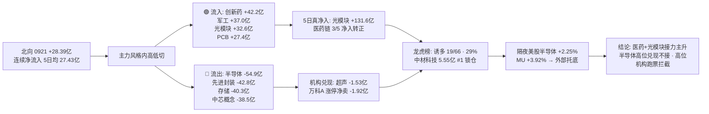

# 2026-09-22 · 💰 资金面

> **数据源新鲜度**: ok · **降级状态**: true · **置信度**: 0.64 · **staleness**: ok (resolved 20260921)

## 一句话结论
0921 主力资金**半导体链高位兑现 → 医药/军工/光通信接力**(创新药 +42.2亿 · 军工 +37.0亿 · 光模块 +32.6亿 vs 半导体概念 -54.9亿), 北向 +28.39亿 连续净流入, 隔夜美股半导体续强(MU +3.92%)形成**外部托底**; 但龙虎榜诱多 19/66(29%), 万科A 涨停净卖 1.92亿 → **主升期做新接力方向, 不接高位半导体兑现票**。

## 详细分析

### 🌐 北向资金 · 连续净流入, 5日均线上方
0921 北向净买入 **28.39亿**(沪股通 13.38亿 / 深股通 15.01亿), 连续净流入未中断。5日均 27.43亿 / 10日均 26.37亿 / 20日均 26.89亿 —— 全周期均线在 26-27 亿区间走平,**配置盘持续温和流入, 无抢筹无恐慌**; 较 0918 的 33.39亿(5日峰值)小幅回落属正常震荡, 不构成转向。

### 🔄 主力资金 · 半导体链高位兑现, 医药+光通信接力(核心判断)
0921 概念资金流出现**风格内高低切**: 上周(0918)被天量买入的半导体链今日整体净出, 资金转向医药链+光通信+军工:

| 方向 | 板块 (净流入·亿) |
|---|---|
| 🟢 流入 | 创新药 +42.20 · 军工 +36.95 · 病原体防治 +34.67 · **光通信模块 +32.56** · 医药医疗风格 +30.56 · 风能 +29.85 · 中药概念 +28.89 · 流感 +28.56 · PCB +27.37 · 通信技术 +24.99 |
| 🔴 流出 | **半导体概念 -54.87** · **先进封装 -42.78** · **国产芯片 -42.02** · **存储芯片 -40.26** · 中芯概念 -38.46 · 东方财富热股 -34.38 · 氮化镓 -27.42 · 汽车芯片 -27.20 |

行业口径同步验证: 流入 **医药生物 +67.42亿**(#1) · 化学制剂 +27.96 · 化学制药 +27.62 · 通信设备 +25.99 · 印制电路板 +24.38; 流出 **半导体 -49.78亿** · 电子 -42.95 · 集成电路封测 -27.71 · 有色 -22.30 · 电池 -17.46。**双口径同向 → 半导体高位兑现+医药光通信接力可信**。

**5日时序看持续性**: 光通信模块 5日累计 **+131.59亿**(3/5 净入, 0921 +32.56 续买)是全场最扎实; 创新药 +43.40亿(4/5 净入) · 病原体防治 +25.81亿(3/5) · 中药 +25.22亿(3/5) 医药链全面转正; 而半导体概念 5日累计虽 +336.69亿(0916 天量贡献), 但 0918→0921 连续两日净出, **高位兑现特征明显**。

### 📊 昨日前十板块 · 5 日追踪(0921 概念净流入前十)
| 板块 | 5日累计 | 净入天数 | 逐日净流入(0915→0921) |
|---|---|---|---|
| 光通信模块 | 131.59亿 | 3/5 | -77.9 +142.4 -36.2 +70.7 +32.6 |
| 创新药 | 43.40亿 | 4/5 | -14.4 +2.9 +7.9 +4.8 +42.2 |
| 病原体防治 | 25.81亿 | 3/5 | -13.3 -4.2 +5.7 +2.9 +34.7 |
| 医药医疗风格 | 27.26亿 | 3/5 | -10.6 -1.5 +0.6 +8.2 +30.6 |
| 中药概念 | 25.22亿 | 3/5 | -10.7 +0.4 -1.8 +8.3 +28.9 |
| 流感 | 23.73亿 | 3/5 | -7.5 -0.6 +0.6 +2.6 +28.6 |
| 军工 | 5.16亿 | 3/5 | -42.7 +9.9 -22.2 +23.2 +37.0 |
| 风能 | -8.33亿 | 2/5 | -12.0 +10.5 -10.5 -26.2 +29.9 |
| 参股银行 | -21.76亿 | 2/5 | -31.1 -8.8 +3.4 -13.3 +28.1 |
| PCB | -76.10亿 | 2/5 | +53.1 -96.3 -60.2 +27.4 |

**解读**: 医药链(创新药/病原体防治/中药/流感)与光通信模块是**5日真净入+0921 续买**的持续性方向; PCB 5日仍深负, 0921 单日回补未改结构; 军工 5日刚转正, 属接力启动第一天。**今日重点: 光模块与医药的持续性验证, 而非半导体反抽**。

### 🏦 ETF / 两融 / 期货 · 杠杆平稳
- **ETF 五只齐涨**: 上证50ETF +0.91% · 创业板ETF +0.80% · 沪深300ETF +0.57% · 中证500ETF +0.54% · 科创50ETF +0.29% —— 宽基普涨, 科创50 涨幅垫底与半导体兑现一致(fund_daily 无份额字段, 净申赎估算跳过)。
- **两融 0918**(0921 未落库): 融资余额 **25,899.69亿** · 融资买入 **1,882.12亿** · 融券余额 26,144.37亿 —— 杠杆存量高位, 无增量信号。
- **IF2610 收 4,520.0 vs 沪深300 4,539.57 → 贴水 -19.57点**, 持仓 53,431手(较前日 **-1,545手**, 空头小幅离场) —— **贴水走阔但持仓回落, 中性偏多**。

### 🐉 龙虎榜 · 诱多命中率 29%, 高位兑现票密集
0921 龙虎榜 **66只**, 诱多模式命中 **19只(29%)**。重点高危样本:

| 股票 | 涨幅 | 换手 | 龙虎榜净额 | 机构净额 | 命中模式 |
|---|---|---|---|---|---|
| 万科A `000002.SZ` | 9.94% | 8.59% | -1.92亿 | +0.07亿 | 涨停但龙虎榜净卖出 |
| 超声电子 `000823.SZ` | 7.78% | 30.48% | -1.99亿 | **-1.53亿** | 换手异常且净卖出 · 机构专用净卖 |
| 华盛昌 `002980.SZ` | -7.48% | 18.11% | -2.88亿 | -0.52亿 | 机构专用净卖 |
| 会稽山 `601579.SH` | 9.99% | 7.19% | -1.67亿 | 0.0 | 涨停但龙虎榜净卖出 |
| 华纺股份 `600448.SH` | 9.89% | 39.33% | -0.65亿 | -0.65亿 | 涨停净卖+换手异常+机构净卖+高位放量兑现 |
| 快意电梯 `002774.SZ` | -6.48% | 7.88% | -0.88亿 | **-1.62亿** | 机构专用净卖 |
| 广合科技 `001389.SZ` | 10.0% | 9.17% | +1.55亿 | **-0.59亿** | 机构专用净卖 |
| 双星新材 `002585.SZ` | 10.04% | 14.33% | +0.88亿 | **-1.14亿** | 机构专用净卖 |
| 电科思仪 `301689.SZ` | -0.48% | 52.96% | -0.90亿 | +0.13亿 | 换手异常且净卖出 |
| 托伦斯 `301583.SZ` | -1.66% | 38.51% | -0.73亿 | +0.45亿 | 换手异常且净卖出 |

**关键反差**: 万科A 0918 净买 5.25亿 → 0921 涨停但净卖 1.92亿,**典型"拉高兑现"**; 广合科技/双星新材虽净买为正但**机构专用在跑(-0.59亿/-1.14亿)**, 属于"游资接盘机构出货"; 电科思仪/托伦斯高换手巨震 —— **今日这些"高位+机构兑现"票一律不接力**。

### 🎯 昨日前十 5 日追踪(0921 龙虎榜净买前十)
| 股票 | 0921 净买 | 5日累计 | 近5日涨跌幅(0915→0921) |
|---|---|---|---|
| 中材科技 `002080.SZ` | 5.55亿 | 16.89% | +2.47 +1.86 +3.92 +5.03 +2.61 +10.00 |
| 百花医药 `600721.SH` | 2.28亿 | 9.53% | +3.12 -5.24 +1.22 +10.01 +0.67 +10.04 |
| 我爱我家 `000560.SZ` | 2.17亿 | 5.84% | -2.19 -3.36 +2.32 +6.42 +2.84 +10.00 |
| 广合科技 `001389.SZ` | 1.55亿 | -3.41% | -2.03 -0.31 +0.85 -2.50 +0.58 +10.00 |
| 透景生命 `300642.SZ` | 1.48亿 | 4.43% | +3.51 -3.33 -0.12 +2.83 +1.62 +19.99 |
| 德尔未来 `002631.SZ` | 1.40亿 | 39.85% | -1.90 +10.02 +9.99 +7.12 +9.98 +6.88 |
| 大连圣亚 `600593.SH` | 1.38亿 | 14.20% | +2.79 -2.64 +1.76 +10.01 +1.94 +10.01 |
| 通宇通讯 `002792.SZ` | 1.17亿 | 4.25% | -1.06 -1.14 +4.07 +1.70 +0.71 +10.00 |
| 绿地控股 `600606.SH` | 1.09亿 | 13.28% | +0.78 -1.55 +0.79 +3.12 +9.85 +10.34 |
| 双星新材 `002585.SZ` | 0.88亿 | 15.96% | +10.04 +10.04 +0.91 -3.94 -1.20 +10.04 |

**解读**: **中材科技**(净买 5.55亿 #1, 5日连续阳线 +16.89% 加速)是"资金持续锁仓+0921 涨停放量"型, 全场资金视角最扎实; **透景生命**(20cm 净买 1.48亿)与**通宇通讯**(通信设备, 光通信链)是接力方向新面孔; **广合科技** 5日 -3.41% 低位新启动但机构在卖 —— 反证"龙虎榜净买≠机构认可"; **德尔未来 +39.85% / 双星新材 +15.96%** 高位, 主升期接力风险大, 只看不碰。

### 🎰 游资协同 · 高位票现"机构出·游资接"
- 净买席位: **深股通 +4.24亿** · 北京知春路 +3.88亿 · **宁波桑田路 +2.70亿**(万科A + 中材科技) · 西安西大街 +2.65亿; 净卖: **三亚迎宾路 -3.65亿** · 中信建投安徽 -1.33亿 · 湛江万豪世家 -0.93亿。
- **具名游资**: 量化打板 20票(广撒网) · 量化基金 78票 · 紫阳东路 5票(托伦斯/广合/超声/华盛昌/双星) · 宁波桑田路 2票。
- **3日协同(high 级)**: **603082.SH 北自科技**(高盛+摩根+沪股通+国泰海通 4席 high) · **600127.SH 金健米业**(国泰海通+沪股通 3席 high) · 600354.SH(瑞银+中信 3席) · 600371.SH(中信+国信 3席) · 002579.SZ(中金+机构+深股通 3席)。
- **信号**: 北自科技获外资投行(高盛/摩根)+沪股通 3 日连续上榜, 协同最强; 但金健米业/北自科技均为高位票, 协同只能佐证"有人反复做", **需结合 R5 画像与 R6 反证再定态度**。

### 📡 外部传导 · 美股半导体续强 → A股科技链外部托底
美股主体 **0918 美盘(周五)**, 0921 周一美盘未落库。半导体组平均 **+2.25%**(MU +3.92% 领涨 · AVGO +2.97% · AMD +2.70% · GLW +1.58% · NVDA +1.34% · TSM +1.02%)—— **存储/CPO/半导体链继续走强, 已是连续第二个强交易日**; 大科技组 -0.40%(META -2.43% vs AMZN +1.00% · GOOGL +0.64%)。指数: SPX +0.17% / IXIC +0.39% / DJI -0.18%; **恒指 +1.18% / KOSPI +1.65% 外围大涨**。USDCNH 6.6921。
→ **存储/CPO 方向有美股强共振托底, A股半导体链 0921 高位兑现属内部获利盘, 而非外部利空**; 今日 A股存储/CPO/光模块情绪偏暖, 医药为独立接力主线 —— 双主线并行。

## 资金传导图

## 推理深度三问

### 对象一 · 0921 半导体链高位兑现(半导体概念 -54.9亿 / 先进封装 -42.8亿 / 存储 -40.3亿)
- **大资金意图**: 0916-0918 天量买入半导体链的资金在 0921 集体兑现, 对手盘是追高的散户与量化; 兑现方向明确转向医药链+光通信, 属**板块内部高低切而非离场** —— 资金还在场内, 只是换进攻方向。
- **为什么走强后兑现**: 位置(0916-0918 三日累计净入超 500 亿, 短期获利盘巨大)+ 结构(存储/先进封装均处高位)+ 美股 0918 虽强但 A股已提前反应 —— 高位兑现是主升期常态。
- **逻辑够不够硬**: 半导体 5日累计仍 +336.69 亿(0916 天量贡献), 0921 单日净出 -54.87 亿不足以逆转趋势; **但连续两日(0918+0921)净出+机构在龙虎榜跑路(超声/广合/双星), 短期不再接力**; 若今日半导体链再度净出, 则确认阶段退潮, 只留光通信模块独立走强。

### 对象二 · 医药链接力(创新药 +42.2亿 · 医药生物 +67.4亿 行业第一)
- **大资金意图**: 从高位半导体撤出的资金寻找**低位+有催化的新方向**, 医药链(创新药/中药/流感/病原体防治)5日全面转正是**配置资金提前布局**, 而非一日游。
- **为什么走强**: 位置(医药链 5日净入前 4日小幅波动, 0921 大幅放量)+ 催化(创新药出海/流感季/政策预期)+ 筹码(龙虎榜透景生命 20cm 净买 1.48亿)。
- **逻辑够不够硬**: 创新药 4/5 净入 + 行业口径医药生物 +67.42 亿双第一 —— **资金一致性最强**; 但单日 42 亿对医药链体量属中等, 需今日续买确认; 若今日冲高回落, 则是主升期轮动的一日游。

### 对象三 · 万科A 涨停但龙虎榜净卖 1.92亿
- **大资金意图**: 0918 净买 5.25亿(三亚迎宾路 +3.31亿)拉高, 0921 涨停价出货, 经典**游资拉高机构/接力盘兑现**; 万科A 非主线票, 纯资金博弈。
- **为什么出现净卖**: 地产链无新催化, 涨停靠情绪溢价, 无接力资金承接 → 卖方(龙虎榜)>买方。
- **逻辑够不够硬**: 单日数据不足以定罪, 但"前日净买 5.25亿→次日涨停净卖 1.92亿"的**反向信号**明确 —— 对万科A 及同类地产情绪票, 今日不参与。

## 观察池顶部(资金视角 · 非买入推荐)
### 中材科技 002080.SZ · 态度: 观察(资金锁仓 #1, 5日连阳加速)
- **买入理由**: ① 0921 龙虎榜净买 5.55亿 全场第一; ② 5日连续阳线累计 +16.89%, 0921 涨停放量确认加速; ③ 宁波桑田路 2.70亿重仓(万科A+中材), 具名游资合力。
- **风险点**: ① 5日涨幅已大, 主升期高位接力需竞价确认; ② 玻纤/风电叶片题材非当前主线核心, 独立性待验证; ③ 换手 7.94% 相对低, 若放量炸板风险高。
- **止损条件**: 竞价高开 >5% 缩量不参与; 参与后跌破 0921 涨停价(约 66.24 元, 以实际为准)无条件走。
- **可验证假设**: 高开 0~3% 且竞价量放大 → 资金续锁仓, 可半路; 低开无量 → 兑现, 拦截。

### 通宇通讯 002792.SZ · 态度: 观察(光通信接力新面孔, 5日温和)
- **买入理由**: ① 光通信模块 5日 +131.59 亿全市场最强 + 美股 AVGO/GLW 续强外部共振; ② 5日累计仅 +4.25% 相对低位; ③ 0921 涨停净买 1.17亿, 深股通参与。
- **风险点**: ① 通信设备行业 0921 净入 25.99亿, 板块仍在启动验证期; ② 换手 20.31% 偏高, 分歧较大; ③ 若半导体链继续退潮拖累科技情绪。
- **止损条件**: 跌破 0921 涨停价(以实际为准)无条件走; 竞价低于 -3% 无量不参与。
- **可验证假设**: 高开 0~3% 竞价量 ≥ 昨日 1.5 倍 → 接力确认; 高开 >5% 秒板 → 情绪透支, 拦截。

### 透景生命 300642.SZ · 态度: 观察(医药20cm, 跟随医药链接力)
- **买入理由**: ① 医药链全市场资金第一(创新药 +42.2亿 / 医药生物 +67.4亿); ② 0921 20cm 涨停净买 1.48亿; ③ 低位(5日 +4.43%)。
- **风险点**: ① 20cm 波动大, 主升期高位震荡; ② 换手 25.74% 高换手, 分歧大; ③ 医药接力是否为一日游待验证。
- **止损条件**: 20cm 票跌破 0921 涨停价(-20cm 价)无条件走; 竞价低开 >5% 不参与。
- **可验证假设**: 医药链今日续买(创新药/中药净流入延续)且个股高开企稳 → 接力成立; 板块首日净出 → 拦截。

### 拦截清单(资金面硬理由)
- **广合科技 / 双星新材**: 龙虎榜净买为正但机构专用 -0.59/-1.14亿 —— 机构出·游资接, 不接力。
- **德尔未来 / 双星新材(高位)**: 5日 +39.85%/+15.96%, 主升期高位接力盈亏比差。
- **万科A / 超声电子 / 会稽山 / 华纺股份**: 涨停但龙虎榜净卖出或机构净卖 ≥0.65亿 —— 拉高兑现特征, 一律不碰。

## 关键证据
- 证据 1: 北向 0921 +28.39亿, 5日均 27.43亿, 连续净流入 · 来源 tushare.moneyflow_hsgt
- 证据 2: 概念资金流 流入 创新药 +42.20亿 / 军工 +36.95亿 / 光模块 +32.56亿; 流出 半导体概念 -54.87亿 / 先进封装 -42.78亿 / 国产芯片 -42.02亿 · 来源 tushare.moneyflow_ind_dc
- 证据 3: 行业口径 医药生物 +67.42亿#1 / 半导体 -49.78亿 · 双口径同向 · 来源 tushare.moneyflow_ind_dc
- 证据 4: 光通信模块 5日 +131.59亿(3/5) 最扎实; 创新药 +43.40亿(4/5); PCB 5日 -76.10亿 单日回补未改结构 · 来源 moneyflow_ind_dc 5日追踪
- 证据 5: 龙虎榜 66只中诱多 19只(29%), 万科A 涨停净卖 -1.92亿 / 超声电子 机构净卖 -1.53亿 · 来源 tushare.top_list + top_inst
- 证据 6: 中材科技 净买 5.55亿#1 + 宁波桑田路 2.70亿; 北自科技 高盛+摩根+沪股通 3日协同 high · 来源 hm_detail + top_list + top_inst
- 证据 7: ETF 五只齐涨 0.29-0.91%; IF2610 贴水 -19.57点 持仓 -1,545手 · 来源 tushare.fund_daily + fut_daily
- 证据 8: 两融 0918 融资余额 25,899.69亿 · 来源 tushare.margin_detail
- 证据 9: 美股半导体组 0918 美盘 +2.25%(MU +3.92% 领涨), KOSPI +1.65% / 恒指 +1.18% · 来源 overseas_snapshot.json

## 数据源审计
| 源 | 日期 | 状态 | 备注 |
|---|---|---|---|
| tushare/moneyflow_hsgt | 2026-09-21 | 🟢 | 21条 · 北向 5/10/20日 |
| tushare/moneyflow_ind_dc | 2026-09-21 | 🟢 | 概念 5日 5000条 + 20日 20000条 + 行业 |
| tushare/top_list | 2026-09-21 | 🟢 | 5日 316条 · 龙虎榜 0921 66只 |
| tushare/top_inst | 2026-09-21 | 🟢 | 5日 3340条 · 机构/营业部席位 |
| tushare/hm_detail | 2026-09-21 | 🟢 | 221条 · 游资明细 + 3日协同窗口 |
| tushare/margin_detail | 2026-09-18 | 🟡 | 0921 无返回, 用 0918(4448行) |
| tushare/fund_daily | 2026-09-21 | 🟢 | 5只ETF 收盘/涨跌(无份额字段, 申赎估算跳过) |
| tushare/fut_daily | 2026-09-21 | 🟢 | IF2610 贴水 -19.57点 · oi -1,545手 |
| tushare/index_daily | 2026-09-21 | 🟢 | 沪深300 4,539.57 |
| tushare/daily | 2026-09-21 | 🟢 | 昨日前十 5日行情 60条 |
| overseas_snapshot.json | 2026-09-18 | 🟡 | 美股主体 0918 美盘(周一美盘未落库) |
| vibe-trading MCP | - | 🔴 | 未配置 · 用 tushare 等价口径替代 |

## 不确定性 / 反证
1. **美股数据停在 0918 美盘(周五)**; 若 0921 周一美盘半导体实际回落, 今日 A股科技链"外部托底"逻辑将被削弱(反证方向: 高开低走)。
2. 北向为 moneyflow_hsgt 日度口径(非实时), 与盘中实际北向存在偏差。
3. 半导体链 0921 净出 -54.87亿 是**单日截面**; 5日累计仍 +336.69亿, 若今日重新净入, 则 0921 是主升期洗盘而非退潮(需 E1 T+1 回填验证 中材科技/通宇通讯 次日表现)。
4. 两融 0921 缺失用 0918; ETF 无份额字段净申赎估算跳过; 医药链接力是否成立需今日(0922)续买验证。
5. 跷跷板配对 20日窗口 0 对 ≤ -0.6 —— 真实跷跷板体现为"半导体链 ↔ 医药/光通信"资金流切换(科技硬件内部高低切 + 板块接力), 非板块间负相关; 需 E2 评估算法口径。
6. 龙虎榜诱多 29% 为单日截面, 判断是否"真出货"需 E1 T+1 回填验证(如 万科A/超声电子 次日是否兑现)。
7. 本报告所有板块流入/流出为东财概念口径(DC), 与同花顺/申万口径存在差异。

## 与其他 R/D/E 的关系
- 依赖: data/raw/20260922/manifest.json · mcp_health.json · overseas_snapshot.json; data/research/20260922/emotion_cycle.json(主升 0.53 · 参考)
- 被消费: D1(main_decision_v1) 资金维度 + staleness_status 消费(ok → 正常); R2(analyze_main_sectors_v1) 资金约束(医药/光通信 5日净入 vs 半导体高位兑现); R6(analyze_devil_advocate_v1) 诱多/出货佐证(万科A/超声/广合/双星); E1(daily_review_v1) 资金面复盘 + 前十追踪回填

## Sub-Agent 元数据
- skill: analyze_capital_flow_v1 (chain: hot_money_synergy_v1 · detect_seesaw_pairs_v1 · render_kg_md_v1)
- artifact: data/research/20260922/R7_capital_flow_20260922.json
- 生成耗时: 480 秒
- model: deepseek-v4-flash-ga-260731
