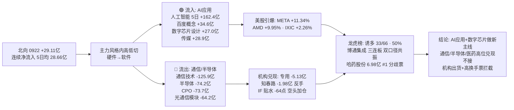

# 2026-09-23 · 💰 资金面

> **数据源新鲜度**: ok · **降级状态**: false · **置信度**: 0.64 · **staleness**: ok (resolved 20260922)

## 一句话结论
0922 主力资金**AI 应用/传媒/数字芯片接棒**（人工智能概念 5日累计 +162.4亿 · 百度概念 +34.6亿 · 互联网服务 +33.3亿 vs 通信技术 -125.9亿 · 半导体 -74.2亿 · CPO -73.7亿），北向 +29.11亿 连续净流入；隔夜美股 META +11.34% / AMD +9.95% 点燃 AI 叙事；但龙虎榜诱多 33/66(50%)、机构专用净卖扩大至 -5.13亿、IF 贴水走阔至 -64点 → **主升期做 AI 应用新主线，拦截高位通信/半导体兑现票与机构出货票**。

## 详细分析

### 🌐 北向资金 · 连续净流入, 5日均线走平
0922 北向净买入 **29.11亿**(沪股通 14.13亿 / 深股通 14.99亿), 连续净流入未中断。5日均 28.66亿 / 10日均 26.62亿 / 20日均 26.90亿 —— 全周期均线收敛在 26-29 亿区间,**配置盘持续温和流入, 无抢筹无恐慌**; 较 0921 的 28.39亿 基本持平, 方向未变。

### 🔄 主力资金 · 硬件→软件高低切, AI 应用 + 数字芯片接棒(核心判断)
0922 概念资金流出现**又一次风格内高低切**: 周一(0921)被天量买入的光通信/通信技术/半导体链 0922 反手大幅净出, 资金整体转向 **AI 应用(软件/传媒/互联网)+数字芯片设计**:

| 方向 | 板块 (净流入·亿) |
|---|---|
| 🟢 流入 | **百度概念 +34.55** · 互联网服务 +33.32 · ChatGPT概念 +30.42 · AI智能体 +30.01 · 元宇宙概念 +29.26 · AIGC概念 +29.07 · AI应用 +28.31 · 抖音概念 +26.93 · 虚拟数字人 +26.82 · 人工智能 +24.32 |
| 🔴 流出 | 央国企改革 -131.84 · **通信技术 -125.94** · 5G概念 -119.41 · **半导体概念 -74.15** · **CPO概念 -73.68** · 一带一路 -72.92 · 专精特新 -68.83 · 趋势股 -68.24 · **光纤概念 -68.14** · 风能 -65.21 |

行业口径同步验证: 流入 **传媒 +28.90亿**(#1) · **数字芯片设计 +26.95** · 计算机 +24.81 · 营销代理 +19.05 · 广告营销 +18.76 · 工业金属 +15.37; 流出 **通信设备 -69.26亿** · 通信 -60.11 · 电子 -58.79 · 机械设备 -43.39 · 通信网络设备 -40.89 · **医药生物 -34.81**。**双口径同向 → AI 应用(软件/传媒)+数字芯片设计接棒, 通信/半导体/医药高位兑现可信**。

**5日时序看持续性**: **人工智能 5日累计 +162.44亿(4/5 净入)**是全场最扎实; 百度概念 +70.05亿(4/5) · 抖音概念 +58.03亿(4/5) · AI应用 +56.56亿(4/5) · AIGC +39.28亿(4/5) —— AI 应用不是 0922 单日脉冲, 是**持续 5 日的资金趋势, 0922 是加速确认日**; 而光通信模块 5日(0916→0922) +142.4 -36.2 +70.7 +32.6 **-64.2** —— 高位净出确认退潮。

### 📊 昨日(0921)前十板块 · 0922 回吐验证
| 0921 前十板块 | 0921 净流入 | 0922 净流入 | 判定 |
|---|---|---|---|
| 光通信模块 | +32.56亿 | **-64.17亿** | 高位兑现 |
| 风能 | +29.85亿 | **-65.21亿** | 兑现 |
| 军工 | +36.95亿 | **-37.14亿** | 一日反转 |
| 创新药 | +42.20亿 | -18.34亿 | 回吐 |
| PCB | +27.37亿 | -32.46亿 | 兑现 |
| 参股银行 | +28.11亿 | -20.35亿 | 回吐 |
| 医药医疗风格 | +30.56亿 | -9.98亿 | 回吐 |
| 中药概念 | +28.89亿 | -4.65亿 | 回吐 |
| 病原体防治 | +34.67亿 | -2.64亿 | 转弱 |
| 流感 | +28.56亿 | +0.90亿 | 唯一转正 |

**解读**: 0921 的十大方向 0922 **无一续买(除流感微量)**, 全数回吐/兑现 —— 印证"医药+光通信接力"是**一轮快速轮动**, 主升期资金换手极快。今日重点转移到 AI 应用能否承接这轮资金的**持续性验证**。

### 🏦 ETF / 两融 / 期货 · 期指贴水大幅走阔, 高位谨慎信号
- **ETF 五只分化**: 科创50ETF +0.52% · 上证50ETF +0.43% · 沪深300ETF +0.11% · 创业板ETF +0.06% · 中证500ETF **-0.28%** —— 宽基窄幅分化, 科创50 微强与数字芯片设计流入一致, 中证500 微弱无增量(fund_daily 无份额字段, 净申赎估算跳过)。
- **两融 0918**(0922 未落库): 融资余额 **25,899.69亿** · 融资买入 **1,882.12亿** —— 杠杆存量高位持平, 无增量信号。
- **IF 主力收 4,480.6 vs 沪深300 4,544.59 → 贴水 -63.99点**(0921 为 -19.57点, **单日走阔 44 点**), 持仓 162,276手(较前日 **+1,176手**, 空头加仓) —— **贴水大幅走阔 + 空头加仓, 高位谨慎信号, 与概念资金高位兑现互相印证**。

### 🐉 龙虎榜 · 诱多命中率 50%, 机构兑现力度翻十倍
0922 龙虎榜 **66只**, 诱多模式命中 **33只(50%**, 0921 为 29%)。重点高危样本:

| 股票 | 涨幅 | 换手 | 龙虎榜净额 | 机构净额 | 命中模式 |
|---|---|---|---|---|---|
| 透景生命 `300642.SZ` | +3.29% | 35.82% | -1.37亿 | -0.10亿 | 换手异常且净卖出 · 机构专用净卖 |
| 电科思仪 `301689.SZ` | -1.90% | 46.33% | -0.96亿 | **-1.08亿** | 换手异常且净卖出 · 机构专用净卖 |
| 中晶科技 `003026.SZ` | -5.89% | 27.91% | -0.65亿 | **-1.19亿** | 换手异常且净卖出 · 机构专用净卖 |
| 内蒙新华 `603230.SH` | +9.98% | 换手异常 | -0.71亿 | 0.0 | 涨停但龙虎榜净卖出 |
| 洛轴股份 `301699.SZ` | -1.91% | 35.18% | -0.53亿 | -0.54亿 | 换手异常且净卖出 · 机构专用净卖 |
| 泰慕士 `001234.SZ` | +10.0% | - | -0.03亿 | **-0.63亿** | 涨停但龙虎榜净卖出 · 机构专用净卖 |
| 华软科技 `002453.SZ` | -9.54% | 22.79% | -0.36亿 | -0.19亿 | 换手异常且净卖出 · 机构专用净卖 |

**关键反差**: 机构专用席位全天净卖 **-5.13亿**(0921 为 -0.52亿, **兑现力度扩大近 10 倍**, 36 只股票被动卖出); **国泰海通北京知春路** 0921 净买 +3.88亿 → 0922 净卖 **-1.98亿**(游资隔日兑现); 中小投资者/自然人分别 -6.09亿/-3.30亿 集中净卖 **闽东电力**(该票机构投资者 +3.35亿接盘) —— **高位换手票今日一律不接力**。

### 🎯 昨日前十 5 日追踪(0922 龙虎榜净买前十)
| 股票 | 0922 净买 | 5日累计 | 近5日涨跌幅(0915→0922) |
|---|---|---|---|
| 哈药股份 `600664.SH` | 6.98亿 | 27.53% | -2.5 +3.4 +0.8 +1.1 +10.0 +10.1 |
| 义翘神州 `301047.SZ` | 3.67亿 | 34.87% | -2.2 +0.9 +6.2 +5.5 +3.8 +16.1 |
| 新华制药 `000756.SZ` | 3.26亿 | 26.59% | -1.9 -0.2 +0.2 +4.5 +10.0 +10.0 |
| 我爱我家 `000560.SZ` | 2.91亿 | 35.52% | -3.4 +2.3 +6.4 +2.8 +10.0 +10.0 |
| 贤丰控股 `002141.SZ` | 2.58亿 | 12.07% | -4.9 +0.9 -2.7 -0.2 +3.8 +10.1 |
| 博通集成 `603068.SH` | 2.25亿 | 36.38% | +0.3 +2.9 -0.4 +10.0 +10.0 +10.0 |
| 国芳集团 `601086.SH` | 2.04亿 | 12.17% | -10.0 -10.0 +0.2 +10.0 +10.0 +2.8 |
| N中塑股份 `301686.SZ` | 1.85亿 | 次新 | +683.3(首日) |
| 诺唯赞 `688105.SH` | 1.31亿 | 31.20% | -2.3 +0.1 +4.8 +3.1 +5.1 +15.5 |
| 万科A `000002.SZ` | 1.24亿 | 26.16% | -1.0 +0.3 -0.3 +9.9 +9.9 +4.4 |

**解读**: **博通集成**（净买 2.25亿 + 数字芯片设计行业 +26.95亿 双口径共振, 三连板）是资金视角与 AI 主线契合度最高的新面孔; **哈药股份**（LHB 第一 6.98亿, 沪股通买入, 两连板）是医药分歧里的游资票 —— 但**医药生物行业 0922 净出 -34.81亿**, 龙虎榜游资买 ≠ 主力认可, 属分歧票; **万科A** 0921 涨停净卖 1.92亿 → 0922 反手净买 1.24亿(+4.4%), 兑现后又有资金接, 但 5日 +26.16% 高位, 只看不碰。

### 🎰 游资协同 · 高标锁仓型与机构出货型并存
- 净买席位: **沪股通 +7.59亿**(哈药/金健米业/科达制造/国脉文化) · **深股通 +6.51亿**(万科A/我爱我家/智度/新华制药) · **国泰海通总部 +5.68亿**(22票) · 国新北京 +3.48亿; 净卖: **机构专用 -5.13亿** · 中小投资者 -6.09亿 · **北京知春路 -1.98亿**(0921 +3.88亿 反手)。
- **具名游资**: 量化基金 · 量化打板 · T王 · 温州帮 · 章盟主 · 紫阳东路 · 苏南帮 · 低位挖掘(量化打板/T王/温州帮等高频席位活跃, 主升期接力盘密集)。
- **3日协同(high 级)**: **锡华科技 603248.SH**(国泰海通总部 5日 + 高盛 4日) · **金健米业 600127.SH**(沪股通/国泰海通总部 5日 + 上海分公司 4日) · **北自科技 603082.SH**(高盛/摩根/沪股通 3日) · 西陇科学 002584.SZ(机构专用 4日 + 深股通 3日) · 洛轴股份 301699.SZ(机构专用 4日)。
- **信号**: 金健米业/锡华科技/北自科技获**外资投行+沪股通 3-5 日连续上榜**, 属"资金反复做"的高标锁仓型; 但西陇科学/洛轴股份是**机构专用在 4 日窗口反复出现**, 与龙虎榜机构整体净卖并存的"机构做T"型 —— **协同只能佐证有人反复做, 需结合 R5 画像与 R6 反证再定态度**。

### 📡 外部传导 · 美股 META +11.34% 点燃 AI 应用, AMD +9.95% 支撑芯片
美股主体 **0921 周一美盘**(0922 周二美盘 tushare 未落库, 隔夜参考以周一收盘为准)。半导体组平均 **+4.12%**(**AMD +9.95%** 领涨 · GLW +5.89 · MU +2.77 · TSM +2.41 · NVDA +2.30 · AVGO +1.41); 大科技组平均 **+3.37%**(**META +11.34%** · TSLA +3.03 · AMZN +1.87 · MSFT +1.59 · GOOGL +1.55 · AAPL +0.85)。指数: SPX +1.49% / IXIC +2.26% / DJI +0.71%; 恒指 +0.18% / KOSPI +0.15%。USDCNH 6.6983(人民币偏强)。
→ **META +11.34% 是 A股 0922 AI 应用(传媒/互联网/元宇宙)大涨的海外引爆点, 今日(0923)AI 应用叙事仍有外部支撑; AMD +9.95% 对数字芯片设计/存储形成托底; A股 0922 通信/半导体高位兑现属内部获利盘, 而非外部利空 —— 但 0922 周二美盘数据缺失, 若实际回落需 E1 校正。**

## 资金传导图

## 推理深度三问

### 对象一 · AI 应用链(人工智能 5日 +162.44亿 · 百度概念 +34.55亿 · 传媒 +28.9亿 行业第一)
- **大资金意图**: 从 0921 的光通信/医药撤出的资金**整体转向 AI 应用(软件/传媒/互联网)**, 不是离场而是换进攻方向; 人工智能 5日 +162.44亿(4/5 净入)说明这是**持续一周的资金趋势, 0922 是加速确认日**, 而非一日游。
- **为什么走强**: 位置(AI 应用相对通信/半导体 5日低位, 传媒/互联网估值消化充分)+ 催化(**美股 META +11.34% 单日引爆 AI 应用叙事**)+ 筹码(百度概念 0922 单日 +34.55亿 全场第一, 数字芯片设计 行业 +26.95亿)。
- **逻辑够不够硬**: 概念+行业**双口径同向** + 5日累计最扎实 —— 资金一致性全场最强; 但 AI 应用里 抖音/百度/快手等多为**情绪+叙事驱动**, 需今日续买确认; 若今日冲高回落, 则与 0921 医药一样是主升期快速轮动的一日游, 只做龙头不做杂毛。

### 对象二 · 通信/半导体链高位兑现(通信技术 -125.94亿 · 半导体 -74.15亿 · CPO -73.68亿 · 光通信模块 -64.17亿)
- **大资金意图**: 0921 还在流入的光通信模块(+32.56亿)/通信技术(+24.99亿) 0922 反手天量净出, 与隔夜美股半导体大涨**背离** —— 这是 A股内部获利盘兑现, 不是外部利空驱动; 资金去接 AI 应用了。
- **为什么走强后兑现**: 位置(光通信模块 0916 单日 +142.4亿 天量后持续高位)+ 结构(0921 前十板块 0922 全线回吐, 主升期轮动极快)+ 龙虎榜机构专用 -5.13亿(兑现力度 0921 的 10 倍)。
- **逻辑够不够硬**: 通信/半导体 5日累计虽仍为正, 但**连续两日(0921 高位 + 0922 天量净出)已确认短期退潮**; 今日若再度净出则阶段退潮成立, 只留数字芯片设计(行业 +26.95亿, 与美股 AMD/存储共振)独立走强。

### 对象三 · 龙虎榜诱多 50% + 机构专用 -5.13亿 + IF 贴水走阔至 -64点
- **大资金意图**: 主升期高位分歧加剧 —— 机构专用席位兑现力度扩大近 10 倍, 北京知春路等 0921 净买席位 0922 反手净卖, 期指空头加仓; 中小投资者/自然人在闽东电力等高位票净卖。
- **为什么出现**: 指数/题材连涨后(主升 0.52 置信度), 高位换手票的承接盘(量化打板/T王等接力盘)开始分歧, 高换手+涨停净卖(内蒙新华/泰慕士)说明**封单承接不足**。
- **逻辑够不够硬**: 诱多 50% 是**单日截面**, 是否真出货需 E1 T+1 回填验证; 但"机构净卖扩大 + 期指贴水走阔 + 昨日前十全线回吐"三个独立信号同向, 今日对**高位+机构出货+高换手票一律拦截**是资金面硬约束。

## 观察池顶部(资金视角 · 非买入推荐)
### 博通集成 603068.SH · 态度: 观察(AI 芯片双口径共振, 三连板高位)
- **买入理由**: ① 数字芯片设计 行业 +26.95亿(概念+行业双口径与 AI 主线契合); ② 0922 龙虎榜净买 2.25亿 + 三连板(0917→0922 +10.0 +10.0 +10.0); ③ 隔夜美股 AMD +9.95% / MU +2.77% 外部托底。
- **风险点**: ① 5日 +36.38% 已高位, 三连板后接力需竞价确认; ② 龙虎榜参与席位以营业部为主, 机构未重仓; ③ 若通信/半导体链今日继续净出拖累板块情绪。
- **止损条件**: 竞价高开 >5% 缩量不参与; 参与后跌破 0922 涨停价(约 48.17 元, 以实际为准)无条件走。
- **可验证假设**: 高开 0~3% 且竞价量放大 → 资金续攻, 可半路; 低开无量 → 兑现, 拦截。

### 哈药股份 600664.SH · 态度: 观察(龙虎榜第一, 但医药主力分歧)
- **买入理由**: ① 0922 龙虎榜净买 6.98亿 全场第一, 沪股通买入; ② 两连板(0921 +10.0 / 0922 +10.1), 5日 +27.53%; ③ 创新药/流感概念仍有个股催化。
- **风险点**: ① **医药生物 行业 0922 净出 -34.81亿**(0921 +67.42 回吐), 龙虎榜游资买 ≠ 主力认可, 属分歧票; ② 东莞证券南京分公司 0922 净卖 -2.26亿同票; ③ 高位两连板, 医药主线若退潮则补跌。
- **止损条件**: 跌破 0922 涨停价(约 9.08 元, 以实际为准)无条件走; 竞价低开 >3% 无量不参与。
- **可验证假设**: 医药链今日主力转为净入且个股高开企稳 → 分歧转一致可跟; 医药继续净出 → 拦截。

### 北自科技 603082.SH · 态度: 观察(外资投行锁仓型高标)
- **买入理由**: ① 高盛/摩根/沪股通 3 日连续上榜(协同 high), 外资投行持续锁仓; ② 0921-0922 连续在协同榜前列, 属"资金反复做"的高标。
- **风险点**: ① 机器人/自动化题材非当日主力资金主攻方向(AI 应用为主); ② 高位高标, 波动大; ③ 龙虎榜席位切换快, 隔日兑现风险。
- **止损条件**: 跌破近期平台位(以实际分时/收盘为准)无条件走; 竞价弱于 -3% 不参与。
- **可验证假设**: 外资席位 0923 继续上榜且股价不破位 → 锁仓成立; 外资转卖 → 拦截。

### 拦截清单(资金面硬理由)
- **通信/半导体/CPO 链**: 光通信模块 0922 -64.17亿(0921 +32.56 反手) · CPO -73.68亿 · 半导体 -74.15亿 · 通信设备 -69.26亿 → 高位兑现不接。
- **医药链**: 医药生物 -34.81亿(0921 +67.42 回吐) · 创新药 -18.34亿 → 主力兑现, 龙虎榜游资买(哈药/义翘/新华/诺唯赞)是分歧不是合力。
- **机构出货 + 高换手**: 透景生命 / 电科思仪 / 中晶科技 / 洛轴股份(换手异常 + 机构专用净卖) · 内蒙新华 / 泰慕士(涨停但龙虎榜净卖出/机构净卖)。
- **隔日兑现席位**: 北京知春路(0921 +3.88亿 → 0922 -1.98亿)。
- **高位分歧**: 万科A(0921 涨停净卖 → 0922 反手净买, 5日 +26.16%) · 闽东电力(机构 +3.35亿 vs 散户 -9.4亿, 高位对倒) · 我爱我家/诺唯赞/国芳集团(5日 +30% 以上)。

## 关键证据
- 证据 1: 北向 0922 +29.11亿(沪 14.13 / 深 14.99), 5日均 28.66亿, 连续净流入 · 来源 tushare.moneyflow_hsgt
- 证据 2: 概念资金流 流入 百度概念 +34.55亿 / 互联网服务 +33.32亿 / ChatGPT +30.42亿; 流出 通信技术 -125.94亿 / 半导体 -74.15亿 / CPO -73.68亿 · 来源 tushare.moneyflow_ind_dc
- 证据 3: 行业口径 传媒 +28.90亿#1 / 数字芯片设计 +26.95亿 / 计算机 +24.81亿; 通信设备 -69.26亿 / 医药生物 -34.81亿 · 双口径同向 · 来源 tushare.moneyflow_ind_dc
- 证据 4: AI 应用 5日: 人工智能 +162.44亿(4/5) / 百度概念 +70.05亿(4/5); 光通信模块 0922 反手 -64.17亿 · 来源 moneyflow_ind_dc 5日追踪
- 证据 5: 0921 前十板块 0922 全线回吐(光模块 -64.17 / 军工 -37.14 / 创新药 -18.34) · 来源 moneyflow_ind_dc
- 证据 6: 龙虎榜 66只中诱多 33只(50%), 透景生命 换手 35.8% 净卖 -1.37亿 / 电科思仪 机构净卖 -1.08亿 / 内蒙新华 涨停净卖 -0.71亿 · 来源 tushare.top_list + top_inst
- 证据 7: 机构专用 0922 净卖 -5.13亿(0921 -0.52亿, 10倍); 北京知春路 0921 +3.88亿 → 0922 -1.98亿 反手 · 来源 tushare.top_inst
- 证据 8: 博通集成 龙虎榜 +2.25亿 三连板(数字芯片设计 行业 +26.95亿 双口径共振); 哈药股份 +6.98亿#1(医药分歧票) · 来源 tushare.top_list + hm_detail
- 证据 9: ETF 分化(科创50 +0.52 / 中证500 -0.28); IF 贴水 -63.99点(0921 -19.57, 走阔 44 点) 空头 +1,176手; 两融 0918 融资余额 25,899.69亿 · 来源 tushare.fund_daily + fut_daily + margin_detail
- 证据 10: 美股 0921 半导体组 +4.12%(AMD +9.95 领涨), 大科技 +3.37%(META +11.34%), IXIC +2.26% · 来源 overseas_snapshot.json::us_stocks

## 数据源审计
| 源 | 日期 | 状态 | 备注 |
|---|---|---|---|
| tushare/moneyflow_hsgt | 2026-09-22 | 🟢 | 20条 · 北向 5/10/20日 |
| tushare/moneyflow_ind_dc | 2026-09-22 | 🟢 | 概念 5日+10日 + 行业(双口径) |
| tushare/top_list | 2026-09-22 | 🟢 | 5日 · 龙虎榜 0922 66只 |
| tushare/top_inst | 2026-09-22 | 🟢 | 5日 · 机构/营业部席位 + 3日协同 |
| tushare/hm_detail | 2026-09-22 | 🟢 | 5日 · 具名游资(量化/温州帮/章盟主) |
| tushare/margin_detail | 2026-09-18 | 🟡 | 0922 无返回, 用 0918(4448行) |
| tushare/fund_daily | 2026-09-22 | 🟢 | 5只ETF(无份额字段, 申赎估算跳过) |
| tushare/fut_daily | 2026-09-22 | 🟢 | IF 贴水 -63.99点 · oi +1,176手 |
| tushare/index_daily | 2026-09-22 | 🟢 | 沪深300 4,544.59 |
| tushare/daily | 2026-09-22 | 🟢 | 昨日前十 5日行情 60条 |
| overseas_snapshot.json | 2026-09-21 | 🟡 | 美股主体 0921 周一美盘(周二未落库) |
| tushare/us_daily | 2026-09-21 | 🟡 | 最新仅到 0921 周一 |
| vibe-trading MCP | - | 🔴 | 未配置 · 用 tushare 等价口径替代 |

## 不确定性 / 反证
1. **美股数据停在 0921 周一美盘**; 若 0922 周二美盘 AI/半导体实际回落, 今日 A股 AI 应用"外部点燃"逻辑将被削弱(反证方向: 高开低走)。
2. 北向为 moneyflow_hsgt 日度口径(非实时), 与盘中实际北向存在偏差。
3. AI 应用 0922 单日 +162 亿级脉冲含情绪成分; 若今日冲高回落, 则是与 0921 医药一样的主升期快速轮动, **持续性需 0923 续买验证**(E1 T+1 回填)。
4. 两融 0922 缺失用 0918; ETF 无份额字段净申赎估算跳过; IF 贴水用主力连续合约方向性代理, 非精确套利基差。
5. 跷跷板配对 10日窗口 0 对 ≤ -0.6 —— 真实跷跷板体现为"硬件(通信/半导体) ↔ 软件(AI应用/传媒)"资金流切换(风格内高低切), 非板块间负相关; 需 E2 评估算法口径。
6. 龙虎榜诱多 50% 为单日截面, 判断是否"真出货"需 E1 T+1 回填验证(如 透景生命/电科思仪/内蒙新华 次日是否兑现)。
7. 本报告所有板块流入/流出为东财概念口径(DC), 与同花顺/申万口径存在差异。

## 与其他 R/D/E 的关系
- 依赖: data/raw/20260923/manifest.json · mcp_health.json · overseas_snapshot.json; data/research/20260923/emotion_cycle.json(主升 0.52 · 参考)
- 被消费: D1(main_decision_v1) 资金维度 + staleness_status 消费(ok → 正常); R2(analyze_main_sectors_v1) 资金约束(AI 应用/数字芯片 5日净入 vs 通信/半导体高位兑现); R6(analyze_devil_advocate_v1) 诱多/出货佐证(透景/电科思仪/内蒙新华/闽东电力); E1(daily_review_v1) 资金面复盘 + 前十追踪回填

## Sub-Agent 元数据
- skill: analyze_capital_flow_v1 (chain: hot_money_synergy_v1 · detect_seesaw_pairs_v1 · render_kg_md_v1)
- artifact: data/research/20260923/R7_capital_flow_20260923.json
- 生成耗时: 480 秒
- model: deepseek-v4-flash-ga-260731
