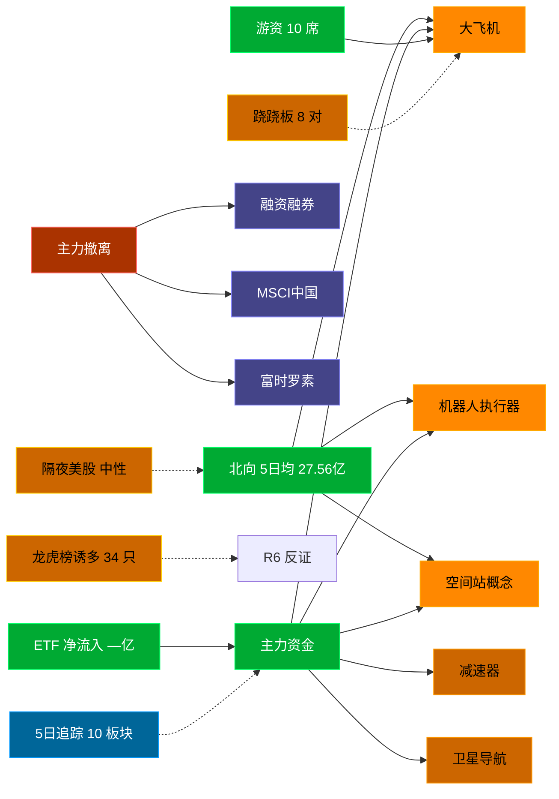

# 2026-09-28 · **资金面**

> **数据源新鲜度**: ok (数据截至 20260924，0925-0927 非交易日)
> **降级状态**: False
> **置信度**: 0.542

## 一句话结论
北向近 5 日均 27.56 亿，主力集中「大飞机/机器人执行器/空间站概念」；资金撤离端 top1「融资融券」，龙虎榜诱多 34 只。 隔夜半导体 +0.5%（中性）。🟢 新鲜度: ok（周末间隔, 0925-0927 非交易日）

## 外部传导（隔夜美股）

**隔夜快照日期**: 20260925 · 影响等级: **中性**

- 半导体 8 股平均: **+0.48%**，趋势: flat
- 科技 6 股平均: **+0.15%**
- 半导体最弱: TSM (-0.12%)
- 半导体最强: GLW (+1.68%)

| 标的 | 涨跌幅 | 映射 A 股方向 |
|---|---|---|
| NVDA | ⚪ +0.22% | AI算力 / GPU / 光模块 |
| AMD | ⚪ +0.22% | CPU/GPU / 算力芯片 |
| AVGO | ⚪ +0.70% | AI芯片 / 光模块 / 设计 |
| MU | ⚪ +0.16% | 存储芯片 / 存储模组 |
| TSM | ⚪ -0.12% | 晶圆代工 / 先进封装 |
| GLW | 🟢 +1.68% | 光通信 / 光纤 / 光模块上游 |
| AAPL | 🟢 +1.53% | 消费电子 / 苹果链 |
| MSFT | 🟢 +3.66% | 云服务 / AI算力 |
| GOOGL | ⚪ +0.46% | AI / 广告 / 云 |
| META | 🔴 -3.33% | AI应用 / 社交 |
| AMZN | ⚪ +0.12% | 电商 / 云 |
| TSLA | 🔴 -1.54% | 新能源车 / 机器人 |

**A 股敏感方向**:
- ➖ storage_chain: 中性
- ➖ cpo_optical: 中性
- ➖ ai_computing: 中性
- 🟩 consumer_electronics: 提振
- ➖ new_energy_vehicle: 中性

**对今日资金面的含义**: 隔夜半导体flat，开盘阶段 A 股影响中性，看内资主导方向。0925 美东收盘为最新可得（周一盘前），周末消息面需额外关注政策/行业催化是否与方向一致。

## 资金流转拓扑图

## 详细分析

**1) 北向时序**
最新交易日 20260924 净流入 23.25 亿；5 日均 27.56 亿，20 日均 26.54 亿。 近 5 日: 0918 33.4 → 0921 28.4 → 0922 29.1 → 0923 23.6 → 0924 23.2。 周一盘前参考 0924 收盘数据，0925-0927 非交易日，周末若有政策面变化需盘中重估。

**2) 主力板块 (数据日=20260924·最新交易日)**
- 流入 TOP10：大飞机 +10.5亿 / 机器人执行器 +10.4亿 / 空间站概念 +8.1亿 / 减速器 +6.4亿 / 卫星导航 +5.9亿 / 军民融合 +5.3亿 / 婴童概念 +5.2亿 / 体育产业 +5.1亿 / 卫星互联网 +4.5亿 / 红利股 +4.3亿
- 流出 TOP10：融资融券 -642.4亿 / MSCI中国 -465.9亿 / 富时罗素 -427.7亿 / 大盘股 -352.9亿 / 2026中报预增 -331.6亿 / 深股通 -319.8亿 / 标准普尔 -316.7亿 / 沪股通 -308.9亿 / HS300_ -302.1亿 / 深成500 -274.2亿

**大资金意图**: 从流入端「大飞机 / 机器人执行器 / 空间站概念」的结构看，主力集中加仓强势主线，是结构性行情而非普涨；流出端集中在前期涨幅较大板块，资金再分配特征明显。注意周一开盘可能出现周末消息消化后的方向修正。
**为什么走强**: 大飞机 当日排名居首 + 超大单净流入居前，说明机构配置盘认可，不是纯短线游资推动。经过周末发酵后，若有消息面配合则可能延续。
**逻辑够不够硬**: 数据新鲜度 ok（自然时间约 88h 前收盘，0925-0927 非交易日），盘中若大级别政策/外围事件本判断失效；建议 D1 以「板块方向」而非「精准金额」使用，盘中验证第一小时量能。

**3) 昨日前十 5 日追踪 (核心)**
- **大飞机**: 0918:+6.2 → 0921:-0.0 → 0922:-6.5 → 0923:-8.2 → 0924:+10.5 亿 | 累计 +1.9 亿 · 正流入 2/5 · **末日翻红·前段净出**
- **机器人执行器**: 0918:+0.2 → 0921:+1.4 → 0922:-1.7 → 0923:-1.8 → 0924:+10.4 亿 | 累计 +8.5 亿 · 正流入 3/5 · **偏强净入·有波动**
- **空间站概念**: 0918:+1.8 → 0921:+0.1 → 0922:+1.4 → 0923:-6.0 → 0924:+8.1 亿 | 累计 +5.5 亿 · 正流入 4/5 · **持续净入**
- **减速器**: 0918:-10.5 → 0921:+3.3 → 0922:-6.3 → 0923:-8.1 → 0924:+6.4 亿 | 累计 -15.2 亿 · 正流入 2/5 · **末日翻红·前段净出**
- **卫星导航**: 0918:+7.3 → 0921:+3.7 → 0922:+4.3 → 0923:-16.2 → 0924:+5.9 亿 | 累计 +4.9 亿 · 正流入 4/5 · **持续净入**
- **军民融合**: 0918:+12.3 → 0921:+17.4 → 0922:-10.8 → 0923:-29.5 → 0924:+5.3 亿 | 累计 -5.2 亿 · 正流入 3/5 · **净出收窄·转暖**
- **婴童概念**: 0918:+4.7 → 0921:+3.7 → 0922:-11.7 → 0923:-2.5 → 0924:+5.2 亿 | 累计 -0.6 亿 · 正流入 3/5 · **净出收窄·转暖**
- **体育产业**: 0918:+6.6 → 0921:+1.0 → 0922:-0.2 → 0923:-0.5 → 0924:+5.1 亿 | 累计 +12.0 亿 · 正流入 3/5 · **偏强净入·有波动**
- **卫星互联网**: 0918:-1.3 → 0921:+10.1 → 0922:-21.2 → 0923:-9.4 → 0924:+4.5 亿 | 累计 -17.4 亿 · 正流入 2/5 · **末日翻红·前段净出**
- **红利股**: 0918:+7.0 → 0921:+16.1 → 0922:+1.3 → 0923:-15.3 → 0924:+4.3 亿 | 累计 +13.5 亿 · 正流入 4/5 · **持续净入**

**4) 游资 (龙虎榜 · 20260924)**
机构专用席位合计净额 **6.99 亿**。具名活跃席位 10 席，3 日协同信号 10 条。TOP 5:
- 开源证券股份有限公司西安西大街证券营业部: 净额 102752.6 万，覆盖 16 票
- 国新证券股份有限公司北京分公司: 净额 58759.4 万，覆盖 5 票
- 国泰海通证券股份有限公司北京知春路证券营业部: 净额 35832.6 万，覆盖 2 票
- 招商证券股份有限公司北京知春东里证券营业部: 净额 -16901.3 万，覆盖 1 票
- 国信证券股份有限公司浙江互联网分公司: 净额 12060.0 万，覆盖 12 票
3 日协同信号:
- [量化基金] 同一席位(量化基金)近3交易日12次上榜同一票(600630.SH)
- [量化基金] 同一席位(量化基金)近3交易日10次上榜同一票(688056.SH)
- [T王] 同一席位(T王)近3交易日10次上榜同一票(603248.SH)
- [量化基金] 同一席位(量化基金)近3交易日10次上榜同一票(601123.SH)
- [量化基金] 同一席位(量化基金)近3交易日10次上榜同一票(600721.SH)

**5) 龙虎榜诱多识别 (核心)**
当日总计 72 只上榜，命中诱多规则 **34 只**。前 10：

| 代码 | 名称 | 涨幅 | 换手 | 龙虎榜净额(万) | 机构净额(万) | 模式 | 上榜原因 |
|---|---|---|---|---|---|---|---|
| 002119.SZ | 康强电子 | +9.99% | 30.9% | -16756 | -31478 | 涨停净卖出 + 换手异常且净卖出 + 机构专用净卖 + 疑似对倒:开源证券股份有限公司… | 日换手率达到20%的前5只证券 |
| 002119.SZ | 康强电子 | +9.99% | 30.9% | -622 | -31478 | 涨停净卖出 + 机构专用净卖 + 疑似对倒:开源证券股份有限公司… | 连续三个交易日内，涨幅偏离值累计达到20%的证券 |
| 001317.SZ | 三羊马 | +10.01% | 14.9% | -616 | -6593 | 涨停净卖出 + 机构专用净卖 | 日涨幅偏离值达到7%的前5只证券 |
| 688056.SH | 莱伯泰科 | +10.05% | 9.0% | -2019 | -1209 | 涨停净卖出 + 机构专用净卖 + 疑似对倒:华鑫证券有限责任公司… | 有价格涨跌幅限制的连续3个交易日内收盘价格涨幅偏离值累计达到30%的证券 |
| 600802.SH | 福建水泥 | +9.97% | 15.4% | -2376 | +0 | 涨停净卖出 + 疑似对倒:开源证券股份有限公司… | 有价格涨跌幅限制的日价格振幅达到15%的前五只证券 |
| 301311.SZ | 昆船智能 | +20.03% | 14.1% | -2311 | +2644 | 涨停净卖出 + 疑似对倒:中信建投证券股份有限… | 连续三个交易日内，涨幅偏离值累计达到30%的证券 |
| 600843.SH | 上工申贝 | +9.99% | 12.1% | -1525 | +0 | 涨停净卖出 | 有价格涨跌幅限制的日价格振幅达到15%的前五只证券 |
| 600843.SH | 上工申贝 | +9.99% | 12.1% | -1100 | +0 | 涨停净卖出 | 非S证券连续三个交易日内收盘价格涨幅偏离值累计达到20%的证券 |
| 002819.SZ | 东方中科 | +9.98% | 7.9% | -572 | +0 | 涨停净卖出 + 疑似对倒:华鑫证券有限责任公司… | 连续三个交易日内，涨幅偏离值累计达到20%的证券 |
| 002579.SZ | 中京电子 | +3.33% | 29.7% | -10531 | -13497 | 机构专用净卖 | 日换手率达到20%的前5只证券 |

**6) 板块跷跷板**
- MLOps概念 ↔ 昨日首板 (ρ=-0.995) · 反转确认: False
- MLOps概念 ↔ 电子后视镜 (ρ=-0.995) · 反转确认: False
- 地摊经济 ↔ 近期摘帽 (ρ=-0.995) · 反转确认: False
- MLCC ↔ 拼多多概念 (ρ=-0.992) · 反转确认: False
- 微盘股 ↔ 短剧互动游戏 (ρ=-0.991) · 反转确认: True

**7) ETF / 期货 / 期权**
ETF 净流入 — 亿(代表ETF)；期权隐含波动率: 数据缺；两融: 20260924 两融明细 2002 行 (个股维度未汇总, 供参考)。

## 关键证据
- 主力流入 top1 大飞机 +10.5 亿 · 来源 tushare.moneyflow_ind_dc
- 5 日追踪：大飞机 累计 1.95 亿, 2/5 日正流入, 趋势「末日翻红·前段净出」
- 流出 top1 融资融券 -642.4 亿 · 来源 tushare.moneyflow_ind_dc
- 龙虎榜诱多 34 只，其中「涨停净卖出」9 只 · 来源 tushare.top_list+top_inst
- 游资 3 日协同 10 条 · 来源 tushare.hm_detail 席位统计
- 板块跷跷板 8 对 · 来源 概念资金流 5 日窗口相关
- 北向最新 23.25 亿（20260924） · 来源 tushare.moneyflow_hsgt
- 隔夜美股半导体平均 +0.48%（20260925）· 来源 overseas_snapshot.json

## 数据源审计
| 源 | 状态 | 抓取日期 | 记录数 | 备注 |
|---|---|---|---|---|
| tushare.moneyflow_hsgt | 🟢 ok | 20260924 | 20 日 | 北向时序 |
| tushare.moneyflow_ind_dc | 🟢 ok | 20260924 | 5 日 × ~1000 行 | 概念板块资金流 5 日追踪 |
| tushare.top_list | 🟢 ok | 20260924 | 72 行 | 龙虎榜上榜个股 |
| tushare.top_inst | 🟢 ok | 20260924 | 810 席位 | 龙虎榜买卖席位明细 |
| tushare.hm_detail | 🟢 ok | ['20260922', '20260923', '20260924'] | 3 日 | 游资协同 |
| tushare.fund_daily | 🟢 ok | 20260924 | 5 | 代表 ETF |
| tushare.margin_detail | 🟢 ok | 20260924 | 2002 | 两融明细 |
| overseas_snapshot.json | 🟢 ok | 20260925 | 12 | 隔夜美股核心 14 股 |
| vibe-trading | 🟠 partial | 20260924 | — | 盘前无法访问，降级走 Tushare 主路 |

## 不确定性 / 反证
- 数据新鲜度 ok（自然时间约 88h 前收盘；0925-0927 非交易日，0924 为最新交易日），周一开盘前无法获取周末最新消息面/政策面变化，本判断需盘中第一小时验证。
- 龙虎榜诱多规则为静态启发式，未剔除 T+1 高开对冲情形，可能高估诱多密度；供 R6 反证参考，不作 hard_reject。
- Tushare hm_detail 存在 T+1 延迟；xtick/datapro 可作实时补充但盘前抓取以 Tushare 为主。
- 5 日追踪只跟踪 0924 top10，若周一风格切换到前期弱势板块，本追踪盲区。
- ETF 净流入基于代表 ETF 估算，非真实一级市场资金流水。
- 0925-0927 三天非交易日窗口（周末+休市）消息面（政策/行业/地缘）可能完全改变资金方向，D1 需重视开盘 30 分钟真实量价验证。
- vibe-trading MCP 盘前不可用，缺少大宗交易/两融独立证据面，confidence 已扣减。

## 与其他 R/D/E 的关系
- 依赖: Tushare MCP (moneyflow_hsgt/moneyflow_ind_dc/top_list/top_inst/hm_detail/fund_daily/margin_detail) + overseas_snapshot.json
- 被消费: D1(main_decision_v1) · R2(analyze_main_sectors_v1) · R5(analyze_stock_profile_v1) · R6(analyze_devil_advocate_v1)

## Sub-Agent 元数据
- skill: analyze_capital_flow_v1
- artifact: /Users/chenyang/Downloads/demo/沧海巨浪/data/research/20260928/R7_capital_flow.json
- 生成方式: enrich_r7_20260928.py (从零构建 + 刷新北向/主力/5日追踪/龙虎榜诱多/游资/ETF/隔夜美股 + mermaid)
- model: deepseek-v4-flash-ga-260731
- 生成耗时: 15.5 秒
