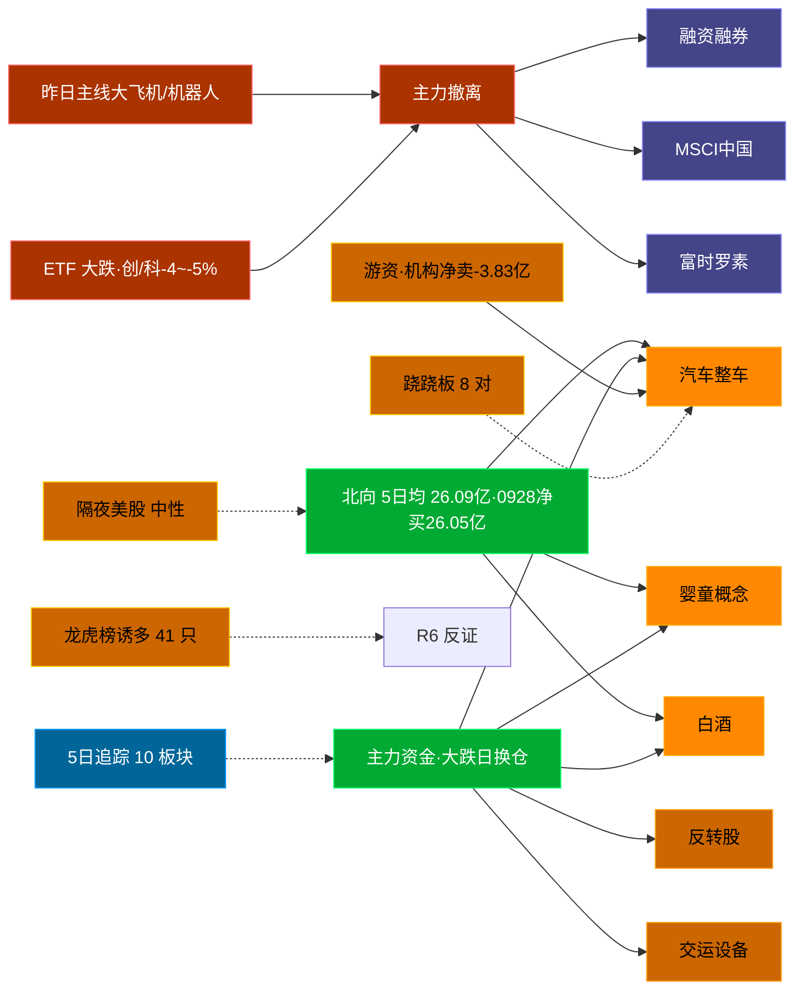

# 2026-09-29 · **资金面**

> **数据源新鲜度**: ok (数据截至 20260928，0925-0927 非交易日)
> **降级状态**: False
> **置信度**: 0.64

## 一句话结论
北向近 5 日均 26.09 亿，0928 大跌日仍净买 26.05 亿；主力弃军工/机器人转「汽车整车/婴童概念/白酒」，机构专用净卖 -3.83 亿，龙虎榜诱多 41 只。 隔夜半导体 +0.5%（中性）。🟢 新鲜度: ok（0925-0927 非交易日）

## 外部传导（隔夜美股）

**隔夜快照日期**: 20260925 · 影响等级: **中性**（周一 0928 美股收盘 tushare 未发布，用 0925 最新）

- 半导体 6 股平均: **+0.48%**，趋势: flat
- 科技 6 股平均: **+0.15%**
- 半导体最弱: TSM (-0.12%)
- 半导体最强: GLW (+1.68%)

| 标的 | 涨跌幅 | 映射 A 股方向 |
|---|---|---|
| NVDA | ⚪ +0.22% | AI算力 / GPU / 光模块 |
| AMD | ⚪ +0.22% | CPU/GPU / 算力芯片 |
| AVGO | ⚪ +0.70% | AI芯片 / 光模块 / 设计 |
| MU | ⚪ +0.16% | 存储芯片 / 存储模组 |
| TSM | ⚪ -0.12% | 晶圆代工 / 先进封装 |
| GLW | 🟢 +1.68% | 光通信 / 光纤 / 光模块上游 |
| AAPL | 🟢 +1.53% | 消费电子 / 苹果链 |
| MSFT | 🟢 +3.66% | 云服务 / AI算力 |
| GOOGL | ⚪ +0.46% | AI / 广告 / 云 |
| META | 🔴 -3.33% | AI应用 / 社交 |
| AMZN | ⚪ +0.12% | 电商 / 云 |
| TSLA | 🔴 -1.54% | 新能源车 / 机器人 |

**A 股敏感方向**:
- ➖ storage_chain: 中性
- ➖ cpo_optical: 中性
- ➖ ai_computing: 中性
- 🟩 consumer_electronics: 提振
- ➖ new_energy_vehicle: 中性

**对今日资金面的含义**: 隔夜半导体flat，A 股大跌次日资金更依赖内资方向；消费电子（AAPL/MSFT 走强）或小幅提振果链，但 0928 创业板 -4.53% 的系统性风险需先消化。

## 资金流转拓扑图

## 详细分析

**1) 北向时序**
最新交易日 20260928 净流入 26.05 亿；5 日均 26.09 亿，20 日均 26.45 亿。 近 5 日: 0921:28.4 → 0922:29.1 → 0923:23.6 → 0924:23.2 → 0928:26.1。 0928 全市场大跌（创业板 -4.53%）北向仍净买，说明外资在跌势中接筹，但接的是权重白马而非题材。

**2) 主力板块 (数据日=0928·大跌日)**
- 流入 TOP10：汽车整车 +10.4亿 / 婴童概念 +4.2亿 / 白酒 +4.1亿 / 反转股 +3.5亿 / 交运设备 +3.4亿 / 租售同权 +2.8亿 / 净水概念 +2.7亿 / 猪肉概念 +2.6亿 / 单抗概念 +2.2亿 / 滨海新区 +2.0亿
- 流出 TOP10：融资融券 -863.1亿 / MSCI中国 -547.4亿 / 富时罗素 -496.5亿 / 深股通 -478.7亿 / 大盘股 -406.0亿 / 2026中报预增 -403.7亿 / 通信技术 -378.8亿 / 沪股通 -372.3亿 / 深成500 -339.0亿 / 5G概念 -337.1亿

- **大资金意图**: 0928 大跌日主力从「大飞机/机器人执行器/空间站概念/卫星导航」等 0924 强势板块集体撤退（大飞机 +10.5→-15.5 亿，卫星互联网 +4.5→-46.8 亿），转而流入「汽车整车/婴童概念/白酒」防御与低估值方向，是典型的下跌避险换仓，不是趋势性进攻。对手盘是 0924 追高的套牢筹码。
- **为什么走强**: 汽车整车 当日净流入 +10.4 亿居首，而昨日领涨的军工/机器人全线流出，资金在恐慌日的再分配往往选择阻力最小的低位方向；但 汽车整车 板块 1.36% 涨幅一般，说明是防御性配置而非题材点火。
- **逻辑够不够硬**: 逻辑硬在「资金客观流向」这个事实（moneyflow_ind_dc 全市场概念净流），弱在「持续性」——大跌日的避险流入历史上常为一日游，0929 若高开冲高需防兑现；建议 D1 仅作为板块方向参考，不以防御板块作进攻主仓位。

**3) 昨日前十 5 日追踪 (核心)**
- **汽车整车**: 0921:-0.6 → 0922:+8.7 → 0923:+7.4 → 0924:-2.7 → 0928:+10.4 亿 | 累计 +23.2 亿 · 正流入 3/5 · **偏强净入·有波动**
- **婴童概念**: 0921:+3.7 → 0922:-11.7 → 0923:-2.5 → 0924:+5.2 → 0928:+4.2 亿 | 累计 -1.1 亿 · 正流入 3/5 · **净出收窄·转暖**
- **白酒**: 0921:+0.4 → 0922:-5.1 → 0923:+0.9 → 0924:-10.3 → 0928:+4.1 亿 | 累计 -10.0 亿 · 正流入 3/5 · **净出收窄·转暖**
- **反转股**: 0921:+6.8 → 0922:-16.9 → 0923:-13.5 → 0924:-2.7 → 0928:+3.5 亿 | 累计 -22.7 亿 · 正流入 2/5 · **末日翻红·前段净出**
- **交运设备**: 0921:+8.4 → 0922:-1.9 → 0923:-5.9 → 0924:-1.6 → 0928:+3.4 亿 | 累计 +2.4 亿 · 正流入 2/5 · **末日翻红·前段净出**
- **租售同权**: 0921:+6.8 → 0922:-2.9 → 0923:+4.3 → 0924:-7.0 → 0928:+2.8 亿 | 累计 +4.0 亿 · 正流入 3/5 · **偏强净入·有波动**
- **净水概念**: 0921:-4.9 → 0922:-1.5 → 0923:+1.3 → 0924:+3.0 → 0928:+2.7 亿 | 累计 +0.7 亿 · 正流入 3/5 · **偏强净入·有波动**
- **猪肉概念**: 0921:+0.4 → 0922:-1.7 → 0923:-2.7 → 0924:-1.7 → 0928:+2.6 亿 | 累计 -3.1 亿 · 正流入 2/5 · **末日翻红·前段净出**
- **单抗概念**: 0921:+18.9 → 0922:-5.8 → 0923:-4.7 → 0924:-10.0 → 0928:+2.2 亿 | 累计 +0.6 亿 · 正流入 2/5 · **末日翻红·前段净出**
- **滨海新区**: 0921:-1.3 → 0922:+2.2 → 0923:-2.1 → 0924:-1.4 → 0928:+2.0 亿 | 累计 -0.6 亿 · 正流入 2/5 · **末日翻红·前段净出**

**昨日前十→今日对比（0924 top10 → 0928）**:
- 大飞机: 0924 +10.5 → 0928 -15.5 亿 · 0928 板块 -2.38%
- 机器人执行器: 0924 +10.4 → 0928 -7.6 亿 · 0928 板块 -1.71%
- 空间站概念: 0924 +8.1 → 0928 -6.4 亿 · 0928 板块 -2.36%
- 减速器: 0924 +6.4 → 0928 -7.1 亿 · 0928 板块 -1.24%
- 卫星导航: 0924 +5.9 → 0928 -13.9 亿 · 0928 板块 -3.02%
- 军民融合: 0924 +5.3 → 0928 -30.3 亿 · 0928 板块 -2.97%
- 婴童概念: 0924 +5.2 → 0928 +4.2 亿 · 0928 板块 -0.89%
- 体育产业: 0924 +5.1 → 0928 -0.8 亿 · 0928 板块 -1.3%

**4) 游资 (龙虎榜 · 20260928)**
机构专用席位合计净额 **-3.83 亿**（净卖）。具名活跃席位 10 席，3 日协同信号 15 条。TOP 5:
- 高盛(中国)证券有限责任公司上海浦东新区世纪大道证券营业部: 净额 -33587.4 万，覆盖 14 票
- 开源证券股份有限公司西安西大街证券营业部: 净额 -20632.8 万，覆盖 15 票
- 中泰证券股份有限公司上海浦东新区江耀路证券营业部: 净额 -14805.2 万，覆盖 1 票
- 国泰海通证券股份有限公司南京太平南路证券营业部: 净额 13264.3 万，覆盖 2 票
- 国泰海通证券股份有限公司总部: 净额 11911.8 万，覆盖 15 票
3 日协同信号 TOP 5:
- [量化基金] 同一席位(量化基金)近3交易日10次上榜同一票(600721.SH)
- [量化基金] 同一席位(量化基金)近3交易日10次上榜同一票(688056.SH)
- [T王] 同一席位(T王)近3交易日10次上榜同一票(601091.SH)
- [量化基金] 同一席位(量化基金)近3交易日9次上榜同一票(603248.SH)
- [T王] 同一席位(T王)近3交易日9次上榜同一票(603248.SH)

**5) 龙虎榜诱多识别 (核心)**
当日总计 61 只上榜，命中诱多规则 **41 只**。前 10：

| 代码 | 名称 | 涨幅 | 换手 | 龙虎榜净额(万) | 机构净额(万) | 模式 | 上榜原因 |
|---|---|---|---|---|---|---|---|
| 301699.SZ | 洛轴股份 | +14.46% | 65.6% | -10439 | -16713 | 涨停净卖出 + 换手异常且净卖出 + 机构专用净卖 + 疑似对倒:开源证券股份有限公司… | 日换手率达到30%的前5只证券 |
| 301699.SZ | 洛轴股份 | +14.46% | 65.6% | -5434 | -16713 | 涨停净卖出 + 机构专用净卖 + 疑似对倒:开源证券股份有限公司… | 连续三个交易日内，涨幅偏离值累计达到30%的 |
| 301004.SZ | 嘉益股份 | +17.06% | 3.5% | -1555 | -2412 | 涨停净卖出 + 机构专用净卖 | 日涨幅达到15%的前5只证券 |
| 001368.SZ | 通达创智 | +10.00% | 10.6% | -3161 | -1831 | 涨停净卖出 + 机构专用净卖 | 日涨幅偏离值达到7%的前5只证券 |
| 601218.SH | 吉鑫科技 | +10.00% | 27.3% | -6921 | +0 | 涨停净卖出 + 疑似对倒:高盛(中国)证券有限… | 有价格涨跌幅限制的日收盘价格涨幅偏离值达到7 |
| 605366.SH | 宏柏新材 | +9.98% | 13.5% | -6633 | +0 | 涨停净卖出 + 疑似对倒:高盛(中国)证券有限… | 非S证券连续三个交易日内收盘价格涨幅偏离值累 |
| 600340.SH | *ST华幸 | +10.26% | 4.8% | -707 | +0 | 涨停净卖出 | 有价格涨跌幅限制的日收盘价格涨幅偏离值达到7 |
| 603278.SH | 大业股份 | +10.00% | 18.9% | -641 | +0 | 涨停净卖出 + 疑似对倒:高盛(中国)证券有限… | 非S证券连续三个交易日内收盘价格涨幅偏离值累 |
| 000560.SZ | 我爱我家 | +1.37% | 27.1% | -19040 | -15261 | 机构专用净卖 | 日换手率达到20%的前5只证券 |
| 688628.SH | 优利德 | -17.04% | 14.3% | -9342 | -13368 | 机构专用净卖 + 疑似对倒:高盛(中国)证券有限… | 有价格涨跌幅限制的日收盘价格跌幅达到15%的 |

**6) 板块跷跷板**
- 汽车整车 ↔ 减速器 (ρ=-0.969) · 反转确认: False
- 白酒 ↔ 空间站概念 (ρ=-0.936) · 反转确认: True
- 汽车整车 ↔ 大飞机 (ρ=-0.935) · 反转确认: False
- 汽车整车 ↔ 机器人执行器 (ρ=-0.899) · 反转确认: False
- 汽车整车 ↔ 卫星互联网 (ρ=-0.875) · 反转确认: False
- 汽车整车 ↔ 军民融合 (ρ=-0.865) · 反转确认: False
- 汽车整车 ↔ 体育产业 (ρ=-0.864) · 反转确认: False
- 白酒 ↔ 机器人执行器 (ρ=-0.859) · 反转确认: True

**7) ETF / 期货 / 期权**
0928 代表 ETF 全线大跌：沪深300ETF -2.17% / 中证500 -2.75% / 创业板ETF -4.62% / 科创50 -4.09%。期权隐含波动率: 数据缺；两融: 0924 明细 4452 行（0928 明细 08:30 后发布）。

**8) vibe-trading 交叉验证（eastmoney 独立源）**
候选池 = LHB 0928 净买 top6（R2 未就绪，以龙虎榜净买池代替）。龙虎榜 0928 全市场 67 只：
- 净买 top：超声电子 +3.80亿 / 跨境通 +2.24亿 / 众泰汽车 +1.77亿
- 净卖 top：山东黄金 -2.28亿 / 我爱我家 -1.90亿 / 海峡创新 -1.34亿
- 博纳影业：30 日 23 笔大宗全折价 -10~-15%，卖方集中中信证券北京国贸（持续出货）→ 涨停需警惕是接力盘而非吸筹
- 超声电子：09/24 融资买入 3.13 亿显著放量（两融独立面确认）

## 关键证据
- 主力流入 top1 汽车整车 +10.4 亿 · 来源 tushare.moneyflow_ind_dc
- 0924 前十 → 0928：大飞机 10.47→-15.49 亿、卫星互联网 4.48→-46.76 亿 全线撤 · 来源 moneyflow_ind_dc
- 流出 top1 融资融券 -863.1 亿 · 来源 tushare.moneyflow_ind_dc
- 龙虎榜诱多 41 只，其中「机构专用净卖」20 只 · 来源 tushare.top_list+top_inst
- 游资 3 日协同 15 条 · 来源 tushare.hm_detail
- 板块跷跷板 8 对 · 来源 概念资金流 5 日窗口相关
- 北向最新 26.05 亿（20260928）· 来源 tushare.moneyflow_hsgt
- 隔夜美股半导体平均 +0.48%（20260925）· 来源 overseas_snapshot.json
- vibe-trading 大宗/两融/龙虎榜交叉 ok · 来源 eastmoney

## 数据源审计
| 源 | 状态 | 抓取日期 | 记录数 | 备注 |
|---|---|---|---|---|
| tushare.moneyflow_hsgt | 🟢 ok | 20260928 | 20 日 | 北向时序 |
| tushare.moneyflow_ind_dc | 🟢 ok | 20260928 | 5 日 × ~1031 行 | 概念+行业板块资金流 5 日追踪 |
| tushare.top_list | 🟢 ok | 20260928 | 61 行 | 龙虎榜上榜个股 |
| tushare.top_inst | 🟢 ok | 20260928 | 10 席位+ | 龙虎榜买卖席位明细 |
| tushare.hm_detail | 🟢 ok | ['20260923','20260924','20260928'] | 3 日 | 游资协同 |
| tushare.fund_daily | 🟢 ok | 20260928 | 5 | 代表 ETF |
| tushare.margin_detail | 🟡 partial | 20260924 | 4452 | 0928 明细 08:30 后发布, 用最新可得 |
| tushare.us_daily + index_global | 🟡 stale | 20260925 | 12+3 | 美股周一 0928 收盘未发布 |
| overseas_snapshot.json | 🟢 ok | 20260925 | 12 | 隔夜美股核心 14 股 |
| vibe-trading (eastmoney) | 🟢 ok | 20260928 | 13 调用 | 大宗/两融/龙虎榜交叉 |

## 不确定性 / 反证
- 0928 为系统大跌日（创业板 -4.53%），避险流入的方向（汽车整车/白酒/婴童）历史上常为一日游，0929 高开冲高兑现概率大，D1 需以竞价真实量价验证。
- 隔夜美股 0928 周一收盘 tushare 未发布（更新 13:00），外部传导仅到 0925 周五，存在 1 个交易日盲窗。
- 龙虎榜诱多规则为静态启发式，未剔除 T+1 高开对冲情形，可能高估诱多密度；供 R6 反证参考，不作 hard_reject。
- 机构专用 0928 净卖 3.83 亿 + 高盛/开源等活跃席位净卖，说明大跌日主力整体是减仓方，「诱多」信号需与 R2/R3 情绪共振交叉验证。
- 5 日追踪只跟踪 0928 top10，若 0929 风格切回超跌科技，本追踪盲区。
- ETF 净流入基于代表 ETF 估算，非真实一级市场资金流水。
- 北向 0928 逆势净买存在「接盘权重」与「被动配置」两种解释，不构成单独买入依据。

## 与其他 R/D/E 的关系
- 依赖: Tushare MCP (moneyflow_hsgt/moneyflow_ind_dc/top_list/top_inst/hm_detail/fund_daily/margin_detail/us_daily/index_global/daily) + overseas_snapshot.json + vibe-trading(eastmoney)
- 被消费: D1(main_decision_v1) · R2(analyze_main_sectors_v1) · R5(analyze_stock_profile_v1) · R6(analyze_devil_advocate_v1)

## Sub-Agent 元数据
- skill: analyze_capital_flow_v1
- artifact: /Users/chenyang/Downloads/demo/沧海巨浪/data/research/20260929/R7_capital_flow.json
- 生成方式: fetch_r7_20260929.py + assemble_r7_20260929.py (tushare 全量 + vibe-trading 交叉 + mermaid)
- model: deepseek-v4-flash-ga-260731
- 生成耗时: 0.0 秒
