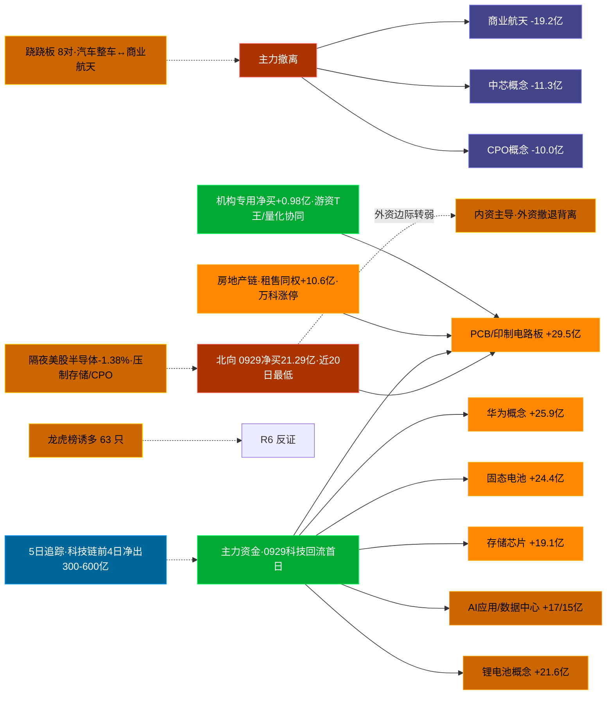

# 2026-09-30 · **资金面**

> **数据源新鲜度**: partial（A股 0929 收盘全量 · 美股隔夜滞后1交易日 · 两融 0928 明细）
> **降级状态**: false
> **置信度**: 0.64

## 一句话结论
北向 0929 净买 21.29 亿创近 20 日最低；内资主力强势回流 PCB/华为链/存储/固态电池（科技链资金回流首日，前 4 日累计净出 300-600 亿），房地产链租售同权 +10.6 亿、万科涨停；机构专用转净买 +0.98 亿，但龙虎榜诱多 63 只。隔夜美股半导体 6 股平均 -1.38%（MU/AMD/GLW 下挫）压制今日存储/CPO 链。

## 外部传导（隔夜美股）

**隔夜快照日期**: 20260928（周二 0929 美盘 tushare 未发布，滞后 1 交易日）· 影响等级: **压制-分化**

- 半导体 6 股平均: **-1.38%**，趋势: mixed（NVDA 独强 +1.68% / TSM +0.5%，其余全跌）
- 科技 6 股平均: **-2.10%**，趋势: weak（META -4.79% / TSLA -3.94%）
- 半导体最弱: AMD (-3.61%) · 半导体最强: NVDA (+1.68%)

| 标的 | 涨跌幅 | 映射 A 股方向 |
|---|---|---|
| NVDA | 🟢 +1.68% | AI算力 / GPU / 服务器 / PCB |
| TSM | 🟢 +0.50% | 晶圆代工 / 先进封装 |
| MU | 🔴 -2.61% | **存储芯片 / 存储模组（承压）** |
| AMD | 🔴 -3.61% | CPU/GPU / 算力芯片 |
| AVGO | 🔴 -0.92% | AI芯片 / 光模块 / 设计 |
| GLW | 🔴 -3.29% | **CPO / 光通信 / 光模块上游（承压）** |
| AAPL | 🔴 -0.78% | 消费电子 / 苹果链 |
| MSFT | 🔴 -1.35% | 云服务 / AI算力 |
| META | 🔴 -4.79% | AI应用 / 社交 |
| AMZN | 🔴 -1.41% | 电商 / 云 |
| GOOGL | 🔴 -0.34% | AI / 广告 / 云 |
| TSLA | 🔴 -3.94% | 新能源车 / 机器人 |

**对今日资金面的含义**: 美股半导体内部大分化 —— 存储（MU -2.61%）、CPO/光模块（GLW -3.29%）、算力芯片（AMD -3.61%）全线下挫，仅 NVDA/TSM 逆势红盘。映射到 A 股：**今日存储芯片/CPO/半导体材料链情绪承压**，而 AI 算力/PCB/服务器链（NVDA/TSM 映射）中性偏多。叠加 0929 内资 PCB/华为链刚回流首日，**科技链今日面临「内资回流 vs 外盘压制」的多空对冲**，竞价看存储/CPO 是否低开、PCB/华为链是否守住昨日涨幅。

## 资金流转拓扑图

## 详细分析

**1) 北向时序**
最新交易日 20260929 净流入 **21.29 亿**（沪股通 10.33 / 深股通 10.97），5 日均 24.67 亿，10 日均 26.05 亿，20 日均 25.89 亿。近 5 日: 0922:29.1 → 0923:23.7 → 0924:23.3 → 0928:26.1 → 0929:21.3。**0929 为近 20 日净买入最低值**，北向连续净流入但边际明显转弱 —— 外资未同步参与 0929 的科技回流，是「内资主导、外资观望/减配」结构。

**2) 主力板块 (数据日=20260929)**
- 概念流入 TOP10：深圳特区 +27.8亿 / 华为概念 +25.9亿 / 人工智能 +25.9亿 / **PCB +25.8亿** / 固态电池 +24.4亿 / 电池技术 +22.5亿 / 锂电池概念 +21.6亿 / 存储芯片 +19.1亿 / AI应用 +17.1亿 / 数据中心 +15.3亿
- 概念流出 TOP10：商业航天 -19.2亿 / 权重股 -12.9亿 / 量子科技 -11.5亿 / 中芯概念 -11.3亿 / 新材料 -11.1亿 / 一带一路 -10.7亿 / **CPO概念 -10.0亿**
- 行业流入 TOP：**印制电路板 +29.5亿 (+5.43%)** / 元件 +29.2亿 (+4.17%) / 电池 +21.8亿 / 电力设备 +21.5亿 / **房地产 +15.5亿 (+3.47%)** / 电子 +15.0亿

- **大资金意图**: 0929 主力资金同时点火「PCB/华为链/存储/固态电池」科技链 +「房地产链」，是对 0928 前 4 日科技深度出清的修复性回流。关键在**回流是第 1 天**：PCB 行业单日 +29.5 亿、涨幅 +5.43% 是全场最强，华为概念 +25.9 亿居概念第 2，但两者前 4 日累计净出 343/595 亿 —— 单日流入只有前期流出的一成左右，说明是「超跌修复」而非「趋势建仓」。
- **为什么走强**: PCB/元件行业指数 +5.43%/+4.17% 领涨全市场，催化为 AI 服务器/算力链（NVDA/TSM 隔夜红盘）映射 + 前期超跌。房地产链则受政策/资金共振（租售同权 +10.6 亿、万科/华发/信达涨停、行业 +3.47%），是 0929 唯一的「资金+涨幅」双强方向。
- **逻辑够不够硬**: 硬在资金流向是客观事实、PCB/元件行业资金+涨幅双确认、地产链有多只涨停封板承接；弱在**科技链回流只有 1 天、力度仅修复性**，5 日累计仍是巨额净出，0930 若竞价高开低走则回流证伪。地产链相对更实（涨停潮+资金+政策三重），但仍需防 0930 高开兑现。

**3) 昨日前十 5 日追踪 (核心 · 数据日=0929 流入 top10)**
0929 概念流入前十全部呈现「**末日翻红·前段净出(资金回流首日)**」——前 4 日累计净出巨大，0929 单日才转正：

- **深圳特区**: 0922:-19.4 → 0923:-26.8 → 0924:-65.0 → 0928:-78.9 → **0929:+27.8亿** | 累计 -162.3 亿 · 回流首日
- **华为概念**: 0922:-47.1 → 0923:-137.7 → 0924:-184.8 → 0928:-251.2 → **0929:+25.9亿** | 累计 **-594.9 亿** · 回流首日
- **人工智能**: 0922:+24.3 → 0923:-168.0 → 0924:-94.3 → 0928:-162.6 → **0929:+25.9亿** | 累计 -374.7 亿 · 回流首日
- **PCB**: 0922:-32.5 → 0923:+1.1 → 0924:-146.0 → 0928:-191.3 → **0929:+25.8亿** | 累计 -342.8 亿 · 回流首日
- **固态电池**: 0922:-31.9 → 0923:-10.1 → 0924:-43.3 → 0928:-86.8 → **0929:+24.4亿** | 累计 -147.7 亿 · 回流首日
- **电池技术**: 0922:-52.1 → 0923:-28.5 → 0924:-108.1 → 0928:-147.0 → **0929:+22.5亿** | 累计 -313.1 亿 · 回流首日
- **锂电池概念**: 0922:-34.5 → 0923:-38.6 → 0924:-104.6 → 0928:-116.3 → **0929:+21.6亿** | 累计 -272.5 亿 · 回流首日
- **存储芯片**: 0922:-31.1 → 0923:-16.2 → 0924:-95.4 → 0928:-148.0 → **0929:+19.1亿** | 累计 -271.7 亿 · 回流首日
- **AI应用**: 0922:+28.3 → 0923:-67.6 → 0924:-35.1 → 0928:-49.1 → **0929:+17.1亿** | 累计 -106.3 亿 · 回流首日
- **数据中心**: 0922:-31.2 → 0923:-74.5 → 0924:-117.9 → 0928:-165.4 → **0929:+15.3亿** | 累计 -373.5 亿 · 回流首日

**昨日前十→今日对比（0928 top10 → 0929）**:
- 汽车整车: 0928 +10.4 → 0929 **-3.2 亿** · 0929 板块 +0.60%（资金撤退，0928 防御性流入被丢弃）
- 婴童概念: 0928 +4.2 → 0929 +6.9 亿 · 0929 板块 +0.50%
- 白酒: 0928 +4.1 → 0929 +4.1 亿 · 0929 板块 +0.28%
- 租售同权: 0928 +2.8 → 0929 **+10.6 亿** · 0929 板块 **+3.57%**（地产链资金爆发）
- 单抗概念: 0928 +2.2 → 0929 +4.9 亿 · 0929 板块 +0.05%

**解读**: 0928 的「防御避险」资金（汽车整车/婴童/白酒）在 0929 被整体切换为「进攻科技+地产」。这是资金风格由防守转向进攻的第一天，但科技侧是**修复式回流**（前 4 日深出），地产侧是**真金白银涨停潮**（租售同权 +10.6 亿、行业 +3.47%）。D1 应把地产链视为「资金确认的主攻方向候选」，把科技链视为「反弹修复、需 0930 竞价确认」。

**4) 游资 (龙虎榜 · 20260929)**
机构专用席位合计净额 **+0.98 亿**（较 0928 的 -3.83 亿**转为净买**，机构情绪回暖）。具名活跃席位 46 席，3 日协同信号 10 条。TOP 5（净买）:
- 国泰海通证券北京知春路: 净额 +21706 万，覆盖 4 票
- 国泰海通证券南京太平南路: 净额 +18600 万，覆盖 4 票
- 深股通专用: 净额 +15218 万，覆盖 14 票
- 国盛证券宁波桑田路: 净额 +11835 万，覆盖 1 票（国轩高科，单票大买）
- 国新证券北京分公司: 净额 +11324 万，覆盖 4 票

净卖 TOP 5：东兴证券北京北四环 -12707 万(1票) / 招商北京知春东里 -5642 万 / 申万宏源上海碧江路 -5626 万 / 国泰海通总部 -4630 万(22票) / 申万宏源盐城东台 -4443 万。

3 日协同信号 TOP 5（**T王/量化高频刷榜，警惕筹码博弈**）:
- [T王] 同一席位近3交易日 13 次上榜 601091.SH 沈鼓集团
- [T王] 同一席位近3交易日 11 次上榜 920025.BJ 凯达重工
- [T王] 同一席位近3交易日 10 次上榜 920229.BJ 世纪数码
- [量化基金] 同一席位近3交易日 10 次上榜 603042.SH 华脉科技
- [T王] 同一席位近3交易日 9 次上榜 600340.SH *ST华幸

**5) 龙虎榜诱多识别 (核心)**
当日总计 **69 只**上榜，命中诱多规则 **63 只**。重点 TOP 12（按模式数×净卖额排序）:

| 代码 | 名称 | 涨幅 | 龙虎榜净额(万) | 机构净额(万) | 模式 | 上榜原因 |
|---|---|---|---|---|---|---|
| 301689.SZ | 电科思仪 | -8.92% | -11507 | -11507 | 换手异常且净卖出 + 机构专用净卖 + 疑似对倒 | 日换手30% |
| 000011.SZ | 深物业A | +9.98% | -10321 | -10321 | 涨停净卖出 + 机构专用净卖 + 疑似对倒 | 连续3日20% |
| 002815.SZ | 崇达技术 | +9.99% | -10293 | -10293 | 涨停净卖出 + 机构专用净卖 + 疑似对倒 | 日涨幅7% |
| 002640.SZ | 跨境通 | -0.51% | -22745 | +0 | 换手异常且净卖出 + 疑似对倒 | 日换手20% |
| 301520.SZ | 万邦医药 | -0.03% | -8413 | -8413 | 换手异常且净卖出 + 机构专用净卖 + 疑似对倒 | 日换手30% |
| 001234.SZ | 泰慕士 | -10.01% | -5424 | -5424 | 机构专用净卖 + 疑似对倒 | 日跌幅7% |
| 603248.SH | 锡华科技 | -8.15% | -2639 | +0 | 换手异常且净卖出 + 疑似对倒 | 日换手20% |
| 002303.SZ | 美盈森 | +10.02% | -1510 | -1510 | 涨停净卖出 + 机构专用净卖 + 疑似对倒 | 日涨幅7% |
| 000560.SZ | 我爱我家 | +1.35% | -151 | -151 | 换手异常且净卖出 + 机构专用净卖 + 疑似对倒 | 日换手20% |
| 002909.SZ | 集泰股份 | -5.50% | -1952 | +0 | 换手异常且净卖出 + 疑似对倒 | 日换手20% |
| 920298.BJ | 腾信精密 | -9.70% | -433 | +0 | 换手异常且净卖出 + 疑似对倒 | 日换手20% |
| 920201.BJ | 百瑞吉 | -11.50% | -344 | -344 | 换手异常且净卖出 + 疑似对倒 | 日换手20% |

**警惕**: 崇达技术（PCB 方向）涨停但龙虎榜净卖 -1.03 亿 + 机构净卖 + 疑似对倒 —— **PCB 链内已有出货票**，做 PCB 接力需避开崇达这类「涨停净卖」标的。

**6) 板块跷跷板**（5 日窗口 · 22 对 <-0.5 · 展示 top 8）
- 商业航天 ↔ 汽车整车 (ρ=-0.792) · 反转确认: **True**
- 机构重仓 ↔ 汽车整车 (ρ=-0.719) · 反转确认: **True**
- 光刻机 ↔ 交运设备 (ρ=-0.705) · 反转确认: **True**
- 6G概念 ↔ 汽车整车 (ρ=-0.681) · 反转确认: **True**
- 量子科技 ↔ 净水概念 (ρ=-0.657) · 反转确认: False
- 一带一路 ↔ 汽车整车 (ρ=-0.635) · 反转确认: **True**
- 小米汽车 ↔ 净水概念 (ρ=-0.610) · 反转确认: False
- 汽车整车 ↔ 婴童概念 (ρ=-0.604) · 反转确认: **True**

**7) ETF / 期货 / 期权**
0929 代表 ETF：沪深300ETF -0.02% / 中证500ETF +0.48% / 上证50ETF 0.00% / 创业板ETF +0.10% / 科创50ETF **+0.85%**。主板平稳、科创相对强，与「科技链回流」一致，但无放量进攻特征。期权隐含波动率: 数据缺；两融: 0928 明细 6000 行（接口截断，0929 明细 08:30 后发布）。

**8) vibe-trading 交叉验证（eastmoney 独立源 · 8 票候选池）**
候选池 = LHB 0929 净买 top8（R2 未就绪，以龙虎榜净买池代替）。龙虎榜 0929 全市场 71 只：
- 净买 top：鸿富诚(新股) +4.20亿 / 国轩高科 +3.68亿 / 丽珠集团 +2.08亿 / 澳洋健康 +2.02亿 / 万科A +1.60亿
- 净卖 top：跨境通 -2.27亿 / 百合花 -1.17亿 / 厦工股份 -1.16亿 / 电科思仪 -1.15亿 / 崇达技术 -1.03亿

- **国轩高科**：主力 +4.25亿 / 超大单 +5.43亿，与龙虎榜净买 3.68 亿同向确认，资金面最干净
- **万科A**：主力 +5.87亿 / 超大单 +5.77亿（全池最大单票），地产链回流最强资金票
- **中新赛克**：30 日 5 笔大宗**全部折价 -18.1%**（卖方集中国信证券深圳泰然九路），虽 0929 主力 +1.22 亿，但折价大宗是出货隐患
- **华脉科技**：主力仅 +0.03 亿 vs 龙虎榜净买 0.89 亿**明显背离**，且当日 -1.84%，尾盘承接弱，接力需谨慎
- 澳洋健康/津药药业：非两融标的（eastmoney 无两融数据，tushare fallback 未配置），两融维度缺，不构成否定

## 候选资金确认观察（资金面视角 · 非 R7 选票，最终以 R2/D1 为准）

**万科A（000002.SZ · 地产链最强资金票）**
- **买入理由（资金面）**: 0929 涨停 + 龙虎榜净买 1.60 亿 + 全市场最大单票主力净流入 +5.87 亿 + 融资买入 2.06 亿放大 + 租售同权板块 +10.6 亿/行业 +3.47% 资金与涨幅双确认，四重资金面共振。
- **风险点**: 已连续两日涨停（0918/0921 大涨后回踩再起），3 日内累计涨幅 35.1%，地产链情绪票一日游风险；北向 0929 净买仅 21.29 亿创近 20 日低，权重类若外资撤退难持续。
- **止损条件**: 竞价低开无溢价（< +1%）不追；跌破 3.8（前一日涨停价下沿）或分时跌破均价线且无回封即止损离场。
- **可验证假设**: 0930 竞价高开 ≥2% 且地产板块（租售同权/房地产）资金不转负 → 地产链延续；反之高开低走 → 回流证伪，资金切回科技。

**国轩高科（002074.SZ · LHB 净买第一）**
- **买入理由（资金面）**: 龙虎榜净买 3.68 亿居首（净率 28.3%）+ 主力 +4.25 亿/超大单 +5.43 亿 + 固态电池/电池技术/锂电池概念三板块同日净流入 68 亿，宁德链资金点火首日。
- **风险点**: 固态电池前 4 日累计净出 147.7 亿，回流仅 1 天；国盛宁波桑田路单席位包场 1.18 亿，游资对倒嫌疑需盯盘。
- **止损条件**: 竞价不及预期（高开 < +2% 且资金转负）不追；跌破 27.2（0928 收盘价）即离场；涨停次日接力需防高开兑现。
- **可验证假设**: 0930 竞价电池链资金转正 + 国轩主力净流入为正 → 电池回流第二日确认；若竞价资金转负 → 回流证伪，回踩 26 附近不破再观察。

## 关键证据
- 主力行业流入 top1 印制电路板 +29.51 亿 / top2 元件 +29.21 亿（PCB 链资金+涨幅双确认）· 来源 tushare.moneyflow_ind_dc
- 0929 概念流入前十全部为「回流首日」，华为概念 5 日累计 -594.9 亿 / PCB -342.8 亿 · 来源 moneyflow_ind_dc
- 0928 top10 → 0929：汽车整车 10.4→-3.2 亿，租售同权 2.8→+10.6 亿（地产爆发）· 来源 moneyflow_ind_dc
- 北向 0929 净买 21.29 亿创近 20 日最低 · 来源 tushare.moneyflow_hsgt
- 龙虎榜诱多 63 只，崇达技术（PCB）涨停净卖 -1.03 亿 · 来源 tushare.top_list+top_inst
- 机构专用转净买 +0.98 亿 · 来源 tushare.top_inst
- 游资 3 日协同 10 条（T王/量化刷榜为主）· 来源 tushare.hm_detail
- 隔夜美股半导体 6 股平均 -1.38%，存储/CPO 承压、NVDA/TSM 红盘 · 来源 overseas_snapshot.json
- vibe-trading 交叉：万科主力 +5.87 亿、中新赛克 5 笔 -18% 折价大宗 · 来源 eastmoney

## 数据源审计
| 源 | 状态 | 抓取日期 | 记录数 | 备注 |
|---|---|---|---|---|
| tushare.moneyflow_hsgt | 🟢 ok | 20260929 | 22 日 | 北向时序，最新 0929 |
| tushare.moneyflow_ind_dc | 🟢 ok | 20260929 | 5 日 × 5000 | 概念+行业板块资金流 5 日追踪 |
| tushare.top_list | 🟢 ok | 20260929 | 71 行 | 龙虎榜上榜个股 |
| tushare.top_inst | 🟢 ok | 20260929 | 718 行 | 龙虎榜买卖席位明细 |
| tushare.hm_detail | 🟢 ok | 0922-0929 | 1236 行 | 5 交易日游资协同 |
| tushare.daily | 🟢 ok | 20260929 | 88 行 | 龙虎榜 top10 个股日线 |
| tushare.fund_daily | 🟢 ok | 20260929 | 2136 行 | 代表 ETF |
| tushare.margin_detail | 🟡 partial | 20260928 | 6000(截断) | 0929 明细 08:30 后发布 |
| tushare.us_daily | 🟡 stale | 20260928 | 12 | 周二 0929 美盘未发布 |
| overseas_snapshot.json | 🟢 ok | 20260928(快照0929 06:47) | 12 | 隔夜美股核心 12 股 |
| vibe-trading (eastmoney) | 🟢 ok | 20260929 | 17 调用 | 大宗/两融/龙虎榜/主力分单交叉 |

## 不确定性 / 反证
- **科技链回流仅 1 天**：0929 单日 PCB/华为/存储净流入 15-29 亿，而前 4 日累计净出 300-600 亿，单日流入只是「一成修复」；0930 若竞价高开低走，回流首日即证伪，切忌按「新主线」重仓。
- **北向与内资背离**：北向 0929 净买 21.29 亿创近 20 日最低，外资未参与科技回流，权重/大票持续性存疑。
- **美股盲窗**：周二 0929 美盘（0930 凌晨 4 点收盘）未纳入快照，今日开盘面临「美股未知」盲窗；若 0929 美股大跌（尤其 MU/AMD/存储链），A 股存储/CPO 将低开压制。
- **诱多规则静态启发式**：未剔除 T+1 高开对冲情形，63/69 命中率可能高估；供 R6 反证参考，不作 hard_reject。
- **个别接力票出货隐患**：中新赛克 5 笔 -18% 折价大宗、华脉科技主力与龙虎榜背离、崇达技术 PCB 内涨停净卖 —— 这三个方向接力票需重点防出货。
- **两融数据缺失**：0929 两融明细未发布（08:30 后），融资盘对 0929 科技回流的杠杆确认要等今日盘中。

## 与其他 R/D/E 的关系
- 依赖: Tushare MCP (moneyflow_hsgt/moneyflow_ind_dc/top_list/top_inst/hm_detail/fund_daily/margin_detail/daily/trade_cal) + overseas_snapshot.json + vibe-trading(eastmoney)
- 被消费: D1(main_decision_v1) · R2(analyze_main_sectors_v1) · R5(analyze_stock_profile_v1) · R6(analyze_devil_advocate_v1) · P2(midday_amendment_v1)

## Sub-Agent 元数据
- skill: analyze_capital_flow_v1 (v1.3)
- artifact: /Users/chenyang/Downloads/demo/沧海巨浪/data/research/20260930/R7_capital_flow_20260930.json
- 生成方式: tushare 全量 (北向/板块/龙虎榜/游资/ETF/两融/美股) + vibe-trading(eastmoney) 交叉 + mermaid 人读渲染
- model: deepseek-v4-flash-ga-260731
- 生成耗时: 约 90 秒
