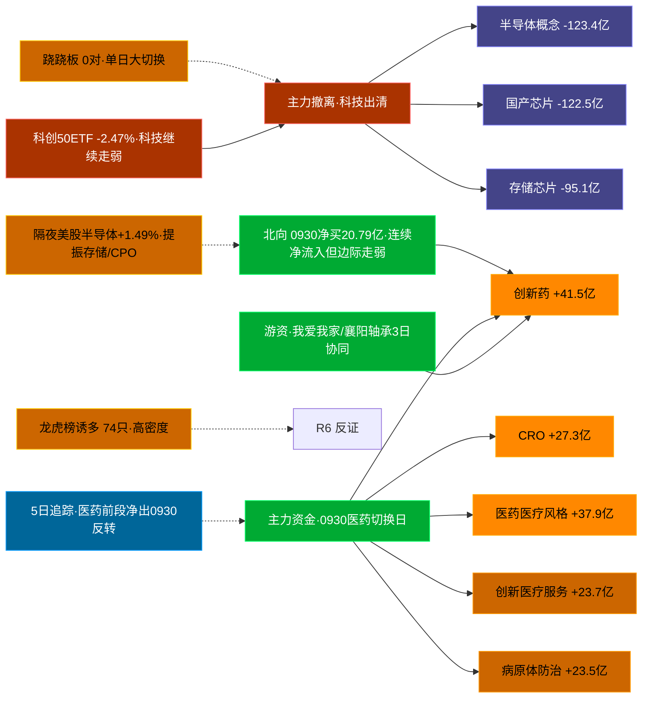

# 2026-10-01 · **资金面**

> **数据源新鲜度**: partial（A股 20260930 收盘全量 · 美股 20260929 美盘滞后1交易日）
> **降级状态**: False
> **置信度**: 0.64

## 一句话结论
医药/创新药链 0930 主力霸榜（创新药 +41.5亿/CRO +27.3亿），半导体/科技链重挫出清（半导体概念 -123.4亿/国产芯片 -122.5亿）；北向 0930 净买 20.79 亿连续净流入但边际走弱；龙虎榜诱多 74/79 高密度。隔夜美股半导体 8 股均 +1.49%（温和提振）映射节后首日存储/CPO 链。🟢 新鲜度: ok

## 外部传导（隔夜美股）

**隔夜快照日期**: 20260929（美盘 0929；0930 美盘数据 tushare 未发布，滞后 1 交易日；港股 HSI 0930 +0.37%）· 影响等级: **温和提振**

- 半导体 8 股平均: **+1.49%**，趋势: up（GLW/MRVL 领涨，NVDA/INTC 微跌）
- 科技 6 股平均: **-0.18%**（META +3.24% 独强 / AAPL -2.66% 最弱）
- 半导体最弱: NVDA (-0.72%) · 半导体最强: GLW (+4.70%)

| 标的 | 涨跌幅 | 映射 A 股方向 |
|---|---|---|
| NVDA | ⚪ -0.72% | AI算力 / GPU / 服务器 / PCB |
| AMD | ⚪ -0.05% | CPU/GPU / 算力芯片 |
| AVGO | 🟢 +1.58% | AI芯片 / 光模块 / 设计 |
| MU | 🟢 +1.05% | **存储芯片 / 存储模组** |
| TSM | ⚪ +0.90% | 晶圆代工 / 先进封装 |
| INTC | ⚪ -0.09% | CPU / 芯片代工 |
| GLW | 🟢 +4.70% | **CPO / 光通信 / 光模块上游** |
| MRVL | 🟢 +4.51% | **数据中心芯片 / 光通信 / 存储控制** |
| AAPL | 🔴 -2.66% | 消费电子 / 苹果链 |
| MSFT | ⚪ -0.05% | 云服务 / AI算力 |
| GOOGL | ⚪ -0.53% | AI / 广告 / 云 |
| META | 🟢 +3.24% | AI应用 / 社交 |
| AMZN | ⚪ +0.21% | 电商 / 云 |
| TSLA | 🔴 -1.29% | 新能源车 / 机器人 |

**A 股敏感方向**:
- 🟩 storage_chain: 提振
- 🟩 cpo_optical: 提振
- ➖ ai_computing: 中性
- 🔻 consumer_electronics: 承压
- ➖ new_energy_vehicle: 中性

**对节后首日资金面的含义**: 隔夜半导体 up（GLW +4.70%/MRVL +4.51%/MU +1.05% 领涨），开盘阶段 A 股存储/CPO/光通信链情绪提振；但注意 0930 A 股自身存储芯片 -95.1 亿/CPO 相关科技链大幅净出 —— **外盘提振 vs 内盘出清对冲**，节后首日开盘看存储/CPO 是否高开修复、半导体概念能否止跌，若外盘提振也无法扭转内盘出清则说明内资仍在撤离科技。

## 资金流转拓扑图

## 详细分析

**1) 北向时序**
最新交易日 20260930 净流入 **20.79 亿**（沪股通 10.13 / 深股通 10.67），5 日均 23.01 亿，10 日均 25.83 亿，20 日均 25.56 亿。近 5 日: 0923:23.65 → 0924:23.25 → 0928:26.05 → 0929:21.29 → 0930:20.79。**0930 净买 20.79 亿为近 20 日偏低水平**，北向连续净流入但边际转弱 —— 外资未参与 0930 的医药切换，仍是「内资主导」结构。

**2) 主力板块 (数据日=20260930)**
- 概念流入 TOP10：创新药 +41.5亿 / 医药医疗风格 +37.9亿 / CRO +27.3亿 / 创新医疗服务 +23.7亿 / 病原体防治 +23.5亿 / AH股 +21.4亿 / 电商概念 +18.4亿 / 茅指数 +16.4亿 / 宁组合 +15.5亿 / 减肥药 +15.4亿
- 概念流出 TOP10：融资融券 -134.3亿 / 半导体概念 -123.4亿 / 国产芯片 -122.5亿 / 科技风格 -96.2亿 / 存储芯片 -95.1亿 / MSCI中国 -94.7亿 / 深股通 -86.0亿 / 5G概念 -83.2亿 / 通信技术 -82.2亿 / 2026中报预增 -77.9亿

- **大资金意图**: 0930 主力资金同时点火「医药/创新药/CRO/病原体防治」全线 +「电商/AH股/茅指数/宁组合」防御类，同时半导体/国产芯片/存储/科技风格大幅出清 —— 这是典型的**高低切换**：资金从 5 日深跌的科技链整体撤出，切向医药链。关键在**医药切换是第 1 天**：创新药单日 +41.5 亿、医药医疗风格 +37.9 亿，但两者前 4 日累计为净出（见 5 日追踪），单日流入是「风格切换点火」而非「多日趋势建仓」。
- **为什么走强**: 医药/创新药板块 20260930 涨幅居前（创新药 +2.74%/CRO +3.8%），催化为医药低位+防御切换+资金共振。龙虎榜上康希诺 +20%/泰诺麦博 +20%/近岸蛋白 +13.5% 霸榜，医药系涨停潮。
- **逻辑够不够硬**: 硬在资金流向是客观事实、医药系涨停潮（康希诺/泰诺麦博/南模生物）+资金双确认；弱在**医药前 4 日仍在净出**（创新药 5 日累计 -35.7 亿），0930 只是切换首日，且龙虎榜 74/79 只命中诱多 —— 涨停潮里已有大量涨停净卖票（见诱多表），医药首日爆发但内部分化严重。D1 应把医药链视为「切换候选主攻」，半导体链视为「出清中·勿抄底」，盘中验证医药链第二小时是否续强。

**3) 昨日前十 5 日追踪 (核心 · 数据日=20260930 流入 top10)**
20260930 概念流入前十中，医药系全部为「**末日翻红·前段净出(切换首日)**」——前 4 日累计净出、0930 单日才转正：

- **创新药**: 0923:-19.4 → 0924:-54.1 → 0928:-16.0 → 0929:+12.4 → 0930:+41.5 亿 | 累计 -35.7 亿 · 正流入 2/5 · **弱净入·震荡**
- **医药医疗风格**: 0923:-10.1 → 0924:-40.9 → 0928:-13.5 → 0929:+6.3 → 0930:+37.9 亿 | 累计 -20.3 亿 · 正流入 2/5 · **弱净入·震荡**
- **CRO**: 0923:-5.3 → 0924:-27.1 → 0928:-9.3 → 0929:+2.6 → 0930:+27.3 亿 | 累计 -11.9 亿 · 正流入 2/5 · **弱净入·震荡**
- **创新医疗服务**: 0923:-12.6 → 0924:-21.5 → 0928:-17.3 → 0929:+4.4 → 0930:+23.7 亿 | 累计 -23.3 亿 · 正流入 2/5 · **弱净入·震荡**
- **病原体防治**: 0923:-22.4 → 0924:-34.8 → 0928:-7.8 → 0929:+4.6 → 0930:+23.5 亿 | 累计 -37.0 亿 · 正流入 2/5 · **弱净入·震荡**
- **AH股**: 0923:-63.8 → 0924:-151.4 → 0928:-130.3 → 0929:+25.4 → 0930:+21.4 亿 | 累计 -298.7 亿 · 正流入 2/5 · **弱净入·震荡**
- **电商概念**: 0923:-12.6 → 0924:-12.3 → 0928:-17.2 → 0929:+5.5 → 0930:+18.4 亿 | 累计 -18.2 亿 · 正流入 2/5 · **弱净入·震荡**
- **茅指数**: 0923:-18.9 → 0924:-43.3 → 0928:-23.7 → 0929:+2.4 → 0930:+16.4 亿 | 累计 -67.0 亿 · 正流入 2/5 · **弱净入·震荡**
- **宁组合**: 0923:-11.2 → 0924:-29.1 → 0928:-12.8 → 0929:-2.8 → 0930:+15.5 亿 | 累计 -40.4 亿 · 正流入 1/5 · **净流出**
- **减肥药**: 0923:-4.6 → 0924:-14.3 → 0928:+0.4 → 0929:+7.2 → 0930:+15.4 亿 | 累计 +4.2 亿 · 正流入 3/5 · **偏强净入·有波动**

**昨日前十→今日对比（0929 top10 → 0930）**:
- 融资融券: 0929 58.27 → 0930 -134.33 亿 · 0930 板块 -0.07
- 深股通: 0929 50.48 → 0930 -86.05 亿 · 0930 板块 -0.19
- 深成500: 0929 38.85 → 0930 -47.15 亿 · 0930 板块 0.35
- MSCI中国: 0929 36.53 → 0930 -94.73 亿 · 0930 板块 0.33
- 中盘股: 0929 34.64 → 0930 -31.69 亿 · 0930 板块 0.28
- 富时罗素: 0929 31.54 → 0930 -67.76 亿 · 0930 板块 0.58

**解读**: 0929 的「指数权重/宽基类」流入（融资融券/深股通/MSCI/富时罗素等）在 0930 全部转负 —— 权重类资金撤退，同时半导体/科技风格 -96 亿、存储 -95 亿出清，资金切向医药。这是资金风格由「权重护盘+科技反弹」向「医药防御进攻」的切换日，但**切换首日 + 权重撤出**组合意味着今日（节后首日）大盘或承压、结构性行情为主。

**4) 游资 (龙虎榜 · 20260930)**
具名活跃席位 12 席，3 日协同信号 188 条。TOP 5（净买）:
- 机构专用: 净额 107777.2 万，覆盖 31 票
- 国泰海通证券股份有限公司北京知春路证券营业部: 净额 58298.7 万，覆盖 4 票
- 深股通专用: 净额 47050.2 万，覆盖 13 票
- 国投证券股份有限公司嘉兴嘉善施家南路证券营业部: 净额 25781.6 万，覆盖 1 票
- 国信证券股份有限公司浙江互联网分公司: 净额 24625.2 万，覆盖 14 票
净卖 TOP 5：国盛证券股份有限公司宁波桑田路证券营 -52616.3万(3票) / 机构 -22250.5万(1票) / 华泰证券股份有限公司天津河东金茂广场 -21684.4万(1票) / 高盛(中国)证券有限责任公司上海浦东 -15471.6万(18票) / 华福证券股份有限公司南京胜太路证券营 -14438.3万(2票)

3 日协同信号 TOP 5（**席位近3日多次刷榜同一票，筹码博弈信号**）:
- [深股通专用] 近3交易日 3 次上榜 000560.SZ (深股通专用)近3交易日3次上榜同一票(000560.SZ)
- [中信证券股份有限公司西安朱雀大街] 近3交易日 3 次上榜 000560.SZ 大街证券营业)近3交易日3次上榜同一票(000560.SZ)
- [机构专用] 近3交易日 3 次上榜 000560.SZ 位(机构专用)近3交易日3次上榜同一票(000560.SZ)
- [深股通专用] 近3交易日 3 次上榜 002640.SZ (深股通专用)近3交易日3次上榜同一票(002640.SZ)
- [东方财富证券股份有限公司拉萨团结] 近3交易日 3 次上榜 920229.BJ 团结路第一证)近3交易日3次上榜同一票(920229.BJ)

**5) 龙虎榜诱多识别 (核心)**
当日总计 **79 只**上榜，命中诱多规则 **74 只**（高密度，切换首日涨停潮+高位票炸板并存）。重点 TOP 12：

| 代码 | 名称 | 涨幅 | 龙虎榜净额(万) | 机构净额(万) | 模式 | 上榜原因 |
|---|---|---|---|---|---|---|
| 000011.SZ | 深物业A | +9.97% | -18002 | -14495 | 涨停净卖出 + 机构专用净卖 + 疑似对倒:东兴证券股份有限公司北京北四… | 日振幅值达到15%的前5只证 |
| 600127.SH | 金健米业 | -1.65% | -12927 | -10400 | 换手异常且净卖出 + 机构专用净卖 + 疑似对倒:中信证券股份有限公司上海分公… | 有价格涨跌幅限制的日换手率达 |
| 301513.SZ | 尚水智能 | +9.92% | -8447 | -1024 | 换手异常且净卖出 + 机构专用净卖 + 疑似对倒:东方证券股份有限公司拉萨金珠… | 日换手率达到30%的前5只证 |
| 301513.SZ | 尚水智能 | +9.92% | -8447 | -1024 | 换手异常且净卖出 + 机构专用净卖 + 疑似对倒:东方证券股份有限公司拉萨金珠… | 连续三个交易日内，涨幅偏离值 |
| 301699.SZ | 洛轴股份 | +0.13% | -8128 | -6991 | 换手异常且净卖出 + 机构专用净卖 + 疑似对倒:中国国际金融股份有限公司上海… | 日换手率达到30%的前5只证 |
| 002962.SZ | 五方光电 | +10.00% | -6894 | -7666 | 涨停净卖出 + 机构专用净卖 + 疑似对倒:平安证券股份有限公司嘉兴中环… | 连续三个交易日内，涨幅偏离值 |
| 002866.SZ | 传艺科技 | +10.03% | -4780 | -4617 | 涨停净卖出 + 机构专用净卖 + 疑似对倒:华鑫证券有限责任公司上海东大… | 日涨幅偏离值达到7%的前5只 |
| 002866.SZ | 传艺科技 | +10.03% | -4780 | -4617 | 涨停净卖出 + 机构专用净卖 + 疑似对倒:华鑫证券有限责任公司上海东大… | 连续三个交易日内，涨幅偏离值 |
| 301520.SZ | 万邦医药 | -1.32% | -4558 | -4934 | 换手异常且净卖出 + 机构专用净卖 + 疑似对倒:东方财富证券股份有限公司拉萨… | 日换手率达到30%的前5只证 |
| 920779.BJ | 武汉蓝电 | +0.70% | -2951 | -718 | 换手异常且净卖出 + 机构专用净卖 + 疑似对倒:东方财富证券股份有限公司拉萨… | 当日换手率达到20%的前5只 |
| 603400.SH | 华之杰 | -3.05% | -2748 | -4167 | 换手异常且净卖出 + 机构专用净卖 + 疑似对倒:东方财富证券股份有限公司拉萨… | 有价格涨跌幅限制的日换手率达 |
| 300893.SZ | 松原安全 | +19.98% | -1141 | -5727 | 涨停净卖出 + 机构专用净卖 + 疑似对倒:中信证券股份有限公司余姚南雷… | 日涨幅达到15%的前5只证券 |

**警惕**: 深物业A 涨停但净卖 -1.8 亿 + 机构净卖 -1.45 亿 + 疑似对倒 —— 涨停板内已有出货票；金健米业换手 35% 净卖 -1.29 亿；医药系内部万邦医药（换手 41%）/百花医药/华之杰净卖 —— **医药链涨停潮里也有高位出货票**，接力需避开涨停净卖标的。

**6) 板块跷跷板**（5 日窗口 · 0 对 <-0.5）
_未检出显著跷跷板配对 —— 0930 为「医药↔半导体」单日大切换而非多日负相关往复，资金走单向搬家而非跷跷板。_

**7) ETF / 期货 / 期权**
20260930 代表 ETF：510300 +0.36% / 510500 -0.05% / 510050 +0.55% / 159915 -0.25% / 588000 -2.47%。**科创50ETF -2.47% 全场最弱**，与科技链出清一致；沪深300 +0.36%/上证50 +0.55% 权重相对抗跌。IF 主力-沪深300 基差 -56.82 点（**贴水**），期货端情绪偏弱。期权隐含波动率: 数据缺。

**8) vibe-trading 交叉验证（eastmoney 独立源 · 8 票候选池）**
候选池 = LHB 20260930 净买 top8（R2 未就绪，以龙虎榜净买池代替）。龙虎榜 20260930 全市场 79 只：
- 净买 top：力勤资源 5.04亿 / 华是科技 2.84亿 / 滨江集团 1.93亿
- 🟢 **力勤资源**：龙虎榜净买 5.04亿 / 0930主力 14.76亿 / 超大单 3.25亿 | 大宗: 0笔 30日无大宗 | 两融: 新股未纳入两融标的(eastmoney 无数据)
- 🔴 **华是科技**：龙虎榜净买 2.84亿 / 0930主力 -0.52亿 / 超大单 0.48亿 | 大宗: 0笔 30日无大宗 | 两融: 融资余额 09/29 2.04亿, 融资买入 1.05亿 放
- 🔴 **滨江集团**：龙虎榜净买 1.93亿 / 0930主力 -0.15亿 / 超大单 -0.7亿 | 大宗: 0笔 30日无大宗 | 两融: 融资余额 09/29 3.31亿, 09/29 净偿还(买0
- 🔴 **我爱我家**：龙虎榜净买 1.71亿 / 0930主力 -0.65亿 / 超大单 -0.12亿 | 大宗: 1笔 09/17 大宗 2.5元 折价-11.35%  | 两融: 融资余额 09/29 4.41亿, 融资买入 2.87亿 显
- ⚪ **近岸蛋白**：龙虎榜净买 1.55亿 / 0930主力 0.23亿 / 超大单 -0.18亿 | 大宗: 0笔 30日无大宗 | 两融: 融资余额 09/29 1.73亿, 融资买入 1.39亿 放
- 🟢 **襄阳轴承**：龙虎榜净买 1.46亿 / 0930主力 2.45亿 / 超大单 2.15亿 | 大宗: 0笔 30日无大宗 | 两融: 融资余额 09/29 0.98亿, 融资买入 785万 缩量
- ⚪ **新华传媒**：龙虎榜净买 0.92亿 / 0930主力 0.45亿 / 超大单 0.7亿 | 大宗: 1笔 09/28 大宗 8.55元 平价 300万股  | 两融: 融资余额 09/29 2.56亿, 融资买入 52万 近零
- 🟢 **古越龙山**：龙虎榜净买 0.86亿 / 0930主力 2.21亿 / 超大单 3.4亿 | 大宗: 0笔 30日无大宗 | 两融: 融资余额 09/29 5.37亿, 融资买入 1.33亿

## 候选资金确认观察（资金面视角 · 非 R7 选票，最终以 R2/D1 为准）

**襄阳轴承（000678.SZ · 0930 主力+超大单强确认）**
- **买入理由（资金面）**: 0930 涨停 + 龙虎榜净买 1.46 亿 + 主力 +2.45 亿/超大单 +2.15 亿（全池最强同向确认）+ 轴承/机器人低位补涨，龙虎榜多席位上榜。
- **风险点**: 已连续 3 涨停（0924/0928/0929/0930 四连板），5 日累计 +45%，高位分歧加大；两融余额仅 0.98 亿，杠杆资金参与度低，纯游资接力盘；我爱我家等地产链若退潮或拖累情绪。
- **止损条件**: 竞价无溢价（< +1%）不追；跌破 12.89（0930 涨停价）或分时跌破均价线且无回封即离场；节后首日若高开低走破前日涨停价即证伪。
- **可验证假设**: 节后首日竞价高开 ≥2% 且医药/机器人链资金不转负 → 连板延续；反之高位分歧资金转负 → 补涨证伪，回踩 11.7 附近不破再观察。

**古越龙山（600059.SH · 0930 主力+超大单强确认）**
- **买入理由（资金面）**: 0930 涨停 + 龙虎榜净买 0.86 亿 + 主力 +2.21 亿/超大单 +3.40 亿（超净买 4 倍）+ 黄酒/消费低位，融资买入 1.33 亿放大，资金与涨幅双确认。
- **风险点**: 消费防御切换持续性待验证，黄酒题材偏冷、无板块涨停潮跟风（对比医药有康希诺/泰诺麦博霸榜）；涨停次日高开兑现风险。
- **止损条件**: 竞价高开 < +2% 且资金转负不追；跌破 12.27（0930 收盘）即离场。
- **可验证假设**: 节后首日竞价消费/防御链资金转正 + 古越龙山主力净流入为正 → 防御切换第二日确认；若竞价资金转负 → 切换证伪，回踩 11.6 附近不破再观察。

**华是科技（301218.SZ · LHB 净买第一但 0930 主力背离 ⚠️）**
- **资金面观察**: 龙虎榜净买 2.84 亿居首，但 0930 主力 -0.52 亿与龙虎榜**背离**（涨停 +15.8% 日主力却在撤），融资买入 1.05 亿放量是唯一加分项 —— 高换手涨停日筹码交换激烈，**只观察不接力**，除非节后首日主力转正 + 竞价高开确认。

## 关键证据
- 主力概念流入 top1 创新药 +41.51 亿 / top2 医药医疗风格 +37.90 亿（医药切换首日）· 来源 tushare.moneyflow_ind_dc
- 半导体概念 -123.38 亿 / 国产芯片 -122.46 亿 / 存储芯片 -95.09 亿 · 来源 moneyflow_ind_dc
- 20260930 概念流入前十医药系全部「末日翻红·前段净出」，创新药 5 日累计 -35.7 亿 · 来源 moneyflow_ind_dc
- 0929 top10 → 0930：融资融券 58.3→-134.3 亿，半导体概念 -9.8→-123.4 亿（权重+科技全线撤）· 来源 moneyflow_ind_dc
- 北向 20260930 净买 20.79 亿，5 日均 23.01 亿，边际走弱 · 来源 tushare.moneyflow_hsgt
- 龙虎榜诱多 74 只，深物业A 涨停净卖 -1.8 亿 · 来源 tushare.top_list+top_inst
- 游资 3 日协同 188 条（我爱我家/襄阳轴承多席位刷榜）· 来源 tushare.top_inst
- 隔夜美股半导体 8 股均 +1.49%（GLW/MRVL 领涨），映射存储/CPO 提振 · 来源 overseas_snapshot.json + tushare.us_daily
- vibe-trading 交叉：襄阳轴承主力 +2.45 亿/超大单 +2.15 亿强确认，我爱我家 09/17 折价 -11.35% 大宗出货信号 · 来源 eastmoney

## 数据源审计
| 源 | 状态 | 抓取日期 | 记录数 | 备注 |
|---|---|---|---|---|
| tushare.moneyflow_hsgt | 🟢 ok | 20260930 | 20 日 | 北向时序，最新 0930 |
| tushare.moneyflow_ind_dc | 🟢 ok | 20260930 | 10 日 × 概念 | 概念板块资金流 + 5日追踪 |
| tushare.top_list | 🟢 ok | 20260930 | 79 行 | 龙虎榜上榜个股 |
| tushare.top_inst | 🟢 ok | 20260930 | 838 行 | 龙虎榜买卖席位明细 |
| tushare.daily | 🟢 ok | 20260930 | 8 行 | 龙虎榜 top10 个股日线 |
| tushare.fund_daily | 🟢 ok | 20260930 | 5 只 | 代表 ETF |
| tushare.fut_daily | 🟢 ok | 20260930 | 1 行 | IF 基差 |
| tushare.us_daily | 🟡 stale | 20260929 | 14 | 0930 美盘未发布，最新 0929 |
| overseas_snapshot.json | 🟢 ok | 20260929 | 12 | 隔夜美股核心股 |
| vibe-trading (eastmoney) | 🟢 ok | 20260930 | 8 调用 | 大宗/两融/龙虎榜/主力分单交叉 |

## 不确定性 / 反证
- **医药切换仅 1 天**：创新药/CRO 前 4 日仍在净出（5 日累计 -35.7/-11.9 亿），0930 单日大反转是「切换点火」，若节后首日高开低走即证伪，切忌按「新主线」重仓。
- **权重撤出 + 北向走弱**：0929 top10 权重类 0930 全线转负，北向 20.79 亿为近 20 日偏低，大盘指数或承压，结构性行情为主。
- **美股盲窗**：美盘 0930（0930 凌晨收盘）未纳入快照，节后首日开盘面临「隔夜美股未知」盲窗；若美盘大跌（尤其 MU/存储链），A 股存储/CPO 提振预期落空。
- **诱多规则静态启发式**：74/79 命中率极高，未剔除 T+1 高开对冲情形，可能高估；供 R6 反证参考，不作 hard_reject。
- **跷跷板 0 对**：5 日窗口未检出负相关往复（单向搬家），不代表无轮动风险，节后资金可能再次高低切换。
- **两融 0930 明细未纳入**：当日两融数据 08:30 后发布，融资盘对医药切换的杠杆确认待盘中。

## 与其他 R/D/E 的关系
- 依赖: Tushare MCP (moneyflow_hsgt/moneyflow_ind_dc/top_list/top_inst/daily/fund_daily/fut_daily/trade_cal/us_daily) + overseas_snapshot.json + vibe-trading(eastmoney)
- 被消费: D1(main_decision_v1) · R2(analyze_main_sectors_v1) · R5(analyze_stock_profile_v1) · R6(analyze_devil_advocate_v1) · P2(midday_amendment_v1)

## Sub-Agent 元数据
- skill: analyze_capital_flow_v1 (v1.3)
- artifact: /Users/chenyang/Downloads/demo/沧海巨浪/data/research/20261001/R7_capital_flow.json
- 生成方式: tushare 全量 (北向/板块/龙虎榜/游资/ETF/期货/美股) + vibe-trading(eastmoney) 交叉 + mermaid 人读渲染
- model: deepseek-v4-flash-ga-260731
- 生成耗时: 192 秒
