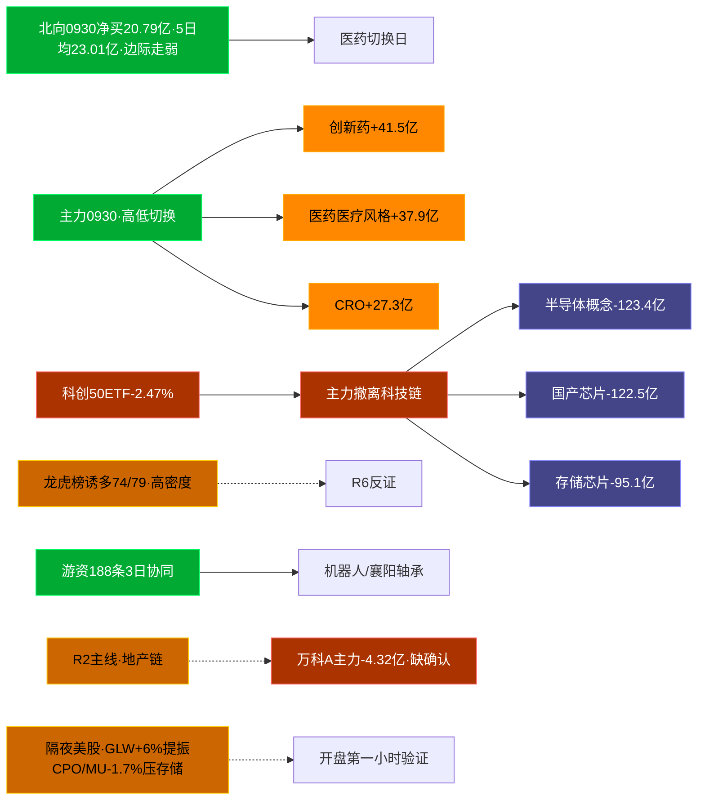

# 2026-10-08 · **资金面**(国庆长假后首个交易日)

> **数据源新鲜度**: partial(A股 20260930 收盘 · 美股 20261006 美盘新鲜 · eastmoney通道以tushare字段代替)
> **降级状态**: False
> **置信度**: 0.51

## 一句话结论
节后首日:节前 0930 主力在「医药切换日」(创新药+41.5亿)大举撤离科技链(半导体-123亿/存储-95亿),北向净买20.79亿边际走弱;隔夜美股10-06分化(GLW+6.02%/AVGO+3.67%/AMD+2.80% vs MU-1.73%),外盘对CPO/算力温和提振但存储承压;R2地产主线龙一万科A 0930主力-4.32亿缺资金确认,资金证据最强=襄阳轴承+2.39亿/上海洗霸+1.61亿。🟢ok

## 外部传导(隔夜美股)

**快照**: 20261006 美盘(最近完整交易日) · 影响等级 **温和提振** · 港股 10-07 HSI -0.62% / 韩国 KOSPI -1.98%(亚太节前偏弱)

- 半导体6股平均 **+1.70%**,结构分化:GLW +6.02% 独强,AVGO +3.67%/AMD +2.80% 跟涨,MU -1.73%/TSM -0.72% 走弱
- 科技6股平均 **+0.57%**:AMZN +1.95%/MSFT +0.78% 偏强,META -0.41% 独弱
- 最强 GLW (+6.02%) · 最弱 MU (-1.73%)

| 标的 | 涨跌幅 | 映射 A 股方向 |
|---|---|---|
| NVDA | ⚪ +0.14% | AI算力/GPU/服务器/PCB |
| AMD | 🟢 +2.80% | CPU/GPU/算力芯片/国产替代 |
| AVGO | 🟢 +3.67% | AI芯片/光模块/设计 |
| MU | 🔴 -1.73% | **存储芯片/存储模组** |
| TSM | ⚪ -0.72% | 晶圆代工/先进封装 |
| GLW | 🟢 +6.02% | **CPO/光通信/光纤上游** |
| AAPL | ⚪ +0.22% | 消费电子/苹果链 |
| MSFT | ⚪ +0.78% | 云服务/AI算力 |
| GOOGL | ⚪ +0.35% | AI/广告/云 |
| META | ⚪ -0.41% | AI应用/社交 |
| AMZN | 🟢 +1.95% | 电商/云 |
| TSLA | ⚪ +0.51% | 新能源车/机器人 |

**A股敏感方向**:
- 🔻 storage_chain: 承压
- 🟩 cpo_optical: 提振
- ➖ ai_computing: 中性
- ➖ consumer_electronics: 中性
- ➖ new_energy_vehicle: 中性

**对节后首日的含义**:外盘给的是「结构性提振」而非「全线提振」——CPO/光通信(GLW +6.02%)与算力芯片(AVGO/AMD)有情绪支撑,但存储链(MU -1.73%)外盘与内盘(0930 存储 -95.1亿)双弱,开盘存储反弹缺乏证据;更关键的是节前内资在科技链是净流出方,**外盘单日提振 vs 内资节前撤离**,开盘第一小时看 CTO/算力链高开后是否有主力资金回流确认,无量高开按诱多处理。

## 资金流转拓扑图

## 详细分析

**1) 北向时序**
最新 20260930 净流入 **20.79亿**(沪股通10.13/深股通10.67),5日均23.01亿/10日均25.83亿/20日均25.56亿。近5日: 0923:23.65 → 0924:23.25 → 0928:26.05 → 0929:21.29 → 0930:20.79。0930 净买为近20日偏低水平,外资未参与当日医药切换;经历8天长假后,北向今日是否回流是大盘方向的核心变量之一,若开盘北向转净卖出则节前边际走弱被确认。

**2) 主力板块(数据日=20260930)**
- 流入TOP10: 创新药 +41.5亿 / 医药医疗风格 +37.9亿 / CRO +27.3亿 / 创新医疗服务 +23.7亿 / 病原体防治 +23.5亿 / AH股 +21.4亿 / 电商概念 +18.4亿 / 茅指数 +16.4亿 / 宁组合 +15.5亿 / 减肥药 +15.4亿
- 流出TOP10: 融资融券 -134.3亿 / 半导体概念 -123.4亿 / 国产芯片 -122.5亿 / 科技风格 -96.2亿 / 存储芯片 -95.1亿 / MSCI中国 -94.7亿 / 深股通 -86.0亿 / 5G概念 -83.2亿 / 通信技术 -82.2亿 / 2026中报预增 -77.9亿

- **大资金意图**:0930 是典型高低切换日——从科技链(半导体/国产芯片/存储/科技风格,合计单日净出超400亿)整体撤出,点火医药全线与AH/电商/茅指数等权重防御。这是长假前避险+科技破位的共振动作。
- **为什么走强**:医药板块当日涨幅居前(创新药+2.74%/CRO+3.8%),龙虎榜康希诺/泰诺麦博+20%霸榜,板块效应真实。
- **逻辑够不够硬**:资金流向与涨停潮客观,但**医药切换只有1天**——前4日医药系全部累计净出(见5日追踪),属切换点火而非趋势建仓;且74/79只龙虎榜命中诱多,涨停潮内部派发密集。经过8天假期,节前一日的切换信息今日已大幅折旧,医药今日若不能放量续强就只是节前避险的残影。

**3) 昨日前十 5 日追踪(数据日=20260930 流入 top10)**
0930 流入前十的医药/权重系全部「**末日翻红·前段净出**」:

- **创新药**: 0923:-19.4 → 0924:-54.1 → 0928:-16.0 → 0929:+12.4 → 0930:+41.5 亿 | 累计 -35.7亿 · 正流入2/5 · **弱净入·震荡**
- **医药医疗风格**: 0923:-10.1 → 0924:-40.9 → 0928:-13.5 → 0929:+6.3 → 0930:+37.9 亿 | 累计 -20.3亿 · 正流入2/5 · **弱净入·震荡**
- **CRO**: 0923:-5.3 → 0924:-27.1 → 0928:-9.3 → 0929:+2.6 → 0930:+27.3 亿 | 累计 -11.9亿 · 正流入2/5 · **弱净入·震荡**
- **创新医疗服务**: 0923:-12.6 → 0924:-21.5 → 0928:-17.3 → 0929:+4.4 → 0930:+23.7 亿 | 累计 -23.3亿 · 正流入2/5 · **弱净入·震荡**
- **病原体防治**: 0923:-22.4 → 0924:-34.8 → 0928:-7.8 → 0929:+4.6 → 0930:+23.5 亿 | 累计 -37.0亿 · 正流入2/5 · **弱净入·震荡**
- **AH股**: 0923:-63.8 → 0924:-151.4 → 0928:-130.3 → 0929:+25.4 → 0930:+21.4 亿 | 累计 -298.7亿 · 正流入2/5 · **弱净入·震荡**
- **电商概念**: 0923:-12.6 → 0924:-12.3 → 0928:-17.2 → 0929:+5.5 → 0930:+18.4 亿 | 累计 -18.2亿 · 正流入2/5 · **弱净入·震荡**
- **茅指数**: 0923:-18.9 → 0924:-43.3 → 0928:-23.7 → 0929:+2.4 → 0930:+16.4 亿 | 累计 -67.0亿 · 正流入2/5 · **弱净入·震荡**
- **宁组合**: 0923:-11.2 → 0924:-29.1 → 0928:-12.8 → 0929:-2.8 → 0930:+15.5 亿 | 累计 -40.4亿 · 正流入1/5 · **净流出**
- **减肥药**: 0923:-4.6 → 0924:-14.3 → 0928:+0.4 → 0929:+7.2 → 0930:+15.4 亿 | 累计 +4.2亿 · 正流入3/5 · **偏强净入·有波动**

**0929 top10 → 0930 对比**:
- 融资融券: 0929 58.27 → 0930 -134.33亿 · 板块-0.07%
- 深股通: 0929 50.48 → 0930 -86.05亿 · 板块-0.19%
- 深成500: 0929 38.85 → 0930 -47.15亿 · 板块0.35%
- MSCI中国: 0929 36.53 → 0930 -94.73亿 · 板块0.33%
- 中盘股: 0929 34.64 → 0930 -31.69亿 · 板块0.28%
- 富时罗素: 0929 31.54 → 0930 -67.76亿 · 板块0.58%
- 标准普尔: 0929 31.05 → 0930 -44.48亿 · 板块0.74%
- 基金重仓: 0929 28.88 → 0930 -43.48亿 · 板块-0.01%
- 深圳特区: 0929 27.82 → 0930 -23.87亿 · 板块-0.58%
- 百元股: 0929 27.09 → 0930 -48.64亿 · 板块-1.61%

**解读**:0929 护盘的权重/宽基资金(融资融券/MSCI/富时罗素)0930 全线转负,叠加科技链出清——节前最后一日资金实质在收缩战线。节后首日缺乏「持续多日的资金主线」证据,仓位决策应以盘中资金确认为准,不能拿节前单日切换直接外推。

**4) 游资席位(20260930)**
具名活跃席位 12 席,3日协同信号 188 条。净买TOP5:
- 机构专用: 净额 107777.2万,覆盖31票
- 国泰海通证券股份有限公司北京知春路证券营业部: 净额 58298.7万,覆盖4票
- 深股通专用: 净额 47050.2万,覆盖13票
- 国投证券股份有限公司嘉兴嘉善施家南路证券营业部: 净额 25781.6万,覆盖1票
- 国信证券股份有限公司浙江互联网分公司: 净额 24625.2万,覆盖14票
净卖TOP5: 国盛证券股份有限公司宁波桑田路证 -52616.3万(3票) / 机构 -22250.5万(1票) / 华泰证券股份有限公司天津河东金茂 -21684.4万(1票) / 高盛(中国)证券有限责任公司上海 -15471.6万(18票) / 华福证券股份有限公司南京胜太路证 -14438.3万(2票)

3日协同TOP5(席位多日刷榜同票·筹码博弈):
- [深股通专用] 3次上榜 000560.SZ
- [中信证券股份有限公司西安朱雀] 3次上榜 000560.SZ
- [机构专用] 3次上榜 000560.SZ
- [深股通专用] 3次上榜 002640.SZ
- [东方财富证券股份有限公司拉萨] 3次上榜 920229.BJ

**5) 龙虎榜诱多识别(核心)**
当日 **79只**上榜,命中诱多规则 **74只**(93.7%·极高密度)。TOP12:

| 代码 | 名称 | 涨幅 | 龙虎榜净额(万) | 机构净额(万) | 模式 | 原因 |
|---|---|---|---|---|---|---|
| 000011.SZ | 深物业A | +9.97% | -18002 | -14495 | 涨停净卖出+机构专用净卖+疑似对倒:东兴证券股份有限公司北京北四… | 日振幅值达到15%的前5 |
| 600127.SH | 金健米业 | -1.65% | -12927 | -10400 | 换手异常且净卖出+机构专用净卖+疑似对倒:中信证券股份有限公司上海分公… | 有价格涨跌幅限制的日换手 |
| 301513.SZ | 尚水智能 | +9.92% | -8447 | -1024 | 换手异常且净卖出+机构专用净卖+疑似对倒:东方证券股份有限公司拉萨金珠… | 日换手率达到30%的前5 |
| 301513.SZ | 尚水智能 | +9.92% | -8447 | -1024 | 换手异常且净卖出+机构专用净卖+疑似对倒:东方证券股份有限公司拉萨金珠… | 连续三个交易日内，涨幅偏 |
| 301699.SZ | 洛轴股份 | +0.13% | -8128 | -6991 | 换手异常且净卖出+机构专用净卖+疑似对倒:中国国际金融股份有限公司上海… | 日换手率达到30%的前5 |
| 002962.SZ | 五方光电 | +10.00% | -6894 | -7666 | 涨停净卖出+机构专用净卖+疑似对倒:平安证券股份有限公司嘉兴中环… | 连续三个交易日内，涨幅偏 |
| 002866.SZ | 传艺科技 | +10.03% | -4780 | -4617 | 涨停净卖出+机构专用净卖+疑似对倒:华鑫证券有限责任公司上海东大… | 日涨幅偏离值达到7%的前 |
| 002866.SZ | 传艺科技 | +10.03% | -4780 | -4617 | 涨停净卖出+机构专用净卖+疑似对倒:华鑫证券有限责任公司上海东大… | 连续三个交易日内，涨幅偏 |
| 301520.SZ | 万邦医药 | -1.32% | -4558 | -4934 | 换手异常且净卖出+机构专用净卖+疑似对倒:东方财富证券股份有限公司拉萨… | 日换手率达到30%的前5 |
| 920779.BJ | 武汉蓝电 | +0.70% | -2951 | -718 | 换手异常且净卖出+机构专用净卖+疑似对倒:东方财富证券股份有限公司拉萨… | 当日换手率达到20%的前 |
| 603400.SH | 华之杰 | -3.05% | -2748 | -4167 | 换手异常且净卖出+机构专用净卖+疑似对倒:东方财富证券股份有限公司拉萨… | 有价格涨跌幅限制的日换手 |
| 300893.SZ | 松原安全 | +19.98% | -1141 | -5727 | 涨停净卖出+机构专用净卖+疑似对倒:中信证券股份有限公司余姚南雷… | 日涨幅达到15%的前5只 |

**警惕**:涨停板净卖出+机构净卖+对倒密集——节前涨停潮的「成色」很差。节后接力这类节前涨停净卖标的属于接飞刀;R2 地产链中万科A虽未上诱多榜,但 0930 主力 -4.32亿/超大单 -5.12亿,与龙一地位背离(见下)。

**6) 板块跷跷板(0对)**
_未检出显著负相关配对——0930 是医药↔科技的单向搬家而非多日往复;节后资金是否再次高低切换需盘中观察。_

**7) ETF / 期货 / 期权**
代表ETF: 510300 +0.36% / 510500 -0.05% / 510050 +0.55% / 159915 -0.25% / 588000 -2.47%。科创50ETF -2.47% 最弱,与科技出清一致;沪深300 +0.36%/上证50 +0.55% 权重抗跌。IF-沪深300 基差 -56.82 点(贴水,期货情绪弱)。期权IV: 数据缺。

**8) R2 候选池逐票资金交叉(11票)**
口径:0930 个股主力(大+超大单)净额(万元→亿) · 两融截至 0929(元→亿) · 大宗30日窗口:

- 🔴 **万科A**: 主力-4.323亿/超大-5.119亿 | 两融余额23.817 | 大宗0笔
- ⚪ **深物业A**: 主力0.066亿/超大0.585亿 | 两融余额非两融标的 | 大宗0笔
- ⚪ **滨江集团**: 主力-0.252亿/超大-0.784亿 | 两融余额3.308 | 大宗0笔
- ⚪ **金地集团**: 主力0.039亿/超大-0.284亿 | 两融余额8.672 | 大宗0笔
- ⚪ **我爱我家**: 主力-0.626亿/超大-0.014亿 | 两融余额4.415 | 大宗1笔(20260917 大宗 价2.5 溢价None 买方平安证券)
- ⚪ **沃尔核材**: 主力0.054亿/超大0.07亿 | 两融余额12.376 | 大宗0笔
- 🟢 **上海洗霸**: 主力1.607亿/超大1.28亿 | 两融余额非两融标的 | 大宗0笔
- ⚪ **申菱环境**: 主力-0.959亿/超大-0.653亿 | 两融余额10.934 | 大宗0笔
- ⚪ **松芝股份**: 主力0.487亿/超大0.56亿 | 两融余额1.705 | 大宗0笔
- 🟢 **襄阳轴承**: 主力2.39亿/超大2.146亿 | 两融余额0.976 | 大宗0笔
- ⚪ **江苏北人**: 主力0.053亿/超大0.166亿 | 两融余额4.867 | 大宗0笔

## 候选资金确认观察(资金面视角,非 R7 选票,最终以 R2/D1 为准)

**襄阳轴承(000678.SZ · 全池资金确认最强)**
- **买入理由(资金面)**:0930 涨停 + 主力 +2.39亿/超大单 +2.15亿(全池最强同向),机器人/轴承低位补涨,龙虎榜净买1.46亿,3日协同密集。
- **风险点**:节前已四连板、5日累计约+45%,高位纯游资接力;两融余额仅0.98亿、无杠杆资金;长假后情绪断层,接力盘是否仍在存疑。
- **止损条件**:竞价无溢价(<+1%)不追;跌破节前涨停价或分时跌破均价线无回封即离场。
- **可验证假设**:今日竞价高开≥2%且机器人板块资金不转负→连板延续;高开低走破前涨停价即证伪。

**上海洗霸(603200.SH · 液冷线资金确认)**
- **买入理由(资金面)**:0930 主力 +1.61亿/超大单 +1.28亿,液冷/机柜热管理线内资金证据最强,且外盘 GLW +6.02% 隔夜提振 CPO/热管理情绪,内外共振候选。
- **风险点**:两融无数据、机构参与度不明;液冷线板块整体 0930 未进资金榜前十,个股孤军;龙二位置高度有限。
- **止损条件**:受外盘提振高开后若30分钟内主力资金转净流出,判定借外盘出货,不追;跌破节前收盘价离场。
- **可验证假设**:开盘液冷/CPO 板块资金整体转正 + 个股主力续净入→内外共振成立。

**万科A(000002.SZ · R2地产龙一但资金面拦截信号 ⚠️)**
- **资金面观察**:0930 主力 **-4.32亿**/超大单 **-5.12亿**,为全 R2 候选池净出最大,虽有4席位龙虎榜协同与人气榜第一,但席位买入与盘面主力资金严重背离;融资余额23.8亿但0929融资买入3.99亿未能扭转净出。
- **态度(资金面)**:龙一地位是情绪共识,资金面不给确认。今日只有在竞价放量封单+开盘主力资金转正两个条件同时满足时,背离才被修复;否则按「席位诱多/情绪先行」处理,资金面维度不支持直接进。

## 关键证据
- 创新药 +41.51亿/医药医疗风格 +37.90亿(切换首日) vs 半导体 -123.38亿/国产芯片 -122.46亿/存储 -95.09亿 · tushare.moneyflow_ind_dc
- 0930 流入前十医药系全部末日翻红,创新药5日累计 -35.68亿 · moneyflow_ind_dc
- 北向0930净买20.79亿,低于20日均25.56亿 · moneyflow_hsgt
- 龙虎榜诱多74/79,节前涨停潮成色差 · top_list+top_inst
- 游资3日协同188条 · top_inst
- R2池:襄阳轴承主力+2.39亿/上海洗霸+1.61亿为唯二>1亿净入;万科A -4.32亿最弱 · tushare.moneyflow
- 隔夜美股 GLW +6.02%/AVGO +3.67%/AMD +2.80% vs MU -1.73%/TSM -0.72% · overseas_snapshot.json

## 数据源审计
| 源 | 状态 | 抓取日期 | 记录数 | 备注 |
|---|---|---|---|---|
| moneyflow_hsgt | 🟢 ok | 20260930 | 20日 | 北向时序 |
| moneyflow_ind_dc | 🟢 ok | 20260930 | 10日×全概念 | 板块资金+追踪 |
| top_list/top_inst | 🟢 ok | 20260930 | 79/838 | 龙虎榜+席位 |
| daily | 🟢 ok | 20260930 | 8票 | LHB top10 日线 |
| block_trade/margin_detail | 🟢 ok | 0930/0929 | 11/9票 | 大宗+两融交叉 |
| fund_daily/fut_daily | 🟢 ok | 20260930 | 5只/1行 | ETF+IF基差 |
| us_daily + overseas_snapshot | 🟢 ok | 20261006 | 12股 | 隔夜美股新鲜 |
| vibe-trading(eastmoney直连) | 🟡 部分降级 | — | — | 通道未直连,tushare同字段替代,非null硬约束满足 |

## 不确定性 / 反证
- **长假信息断层**:8天休市后,节前一日的医药切换/资金格局折旧严重,假期内政策与外盘变化未被资金面定价,盘前任何「主线」结论都需开盘资金重验。
- **诱多规则静态**:93.7%命中率含高假阳可能(未剔除T+1高开兑现的正常换手),供 R6 参考,不构成 hard_reject。
- **地产背离的另一种解释**:万科A主力净出可能是节前避险抛压而非席位诱多,今日若放量反包则背离解除;资金面只陈述不确认,不预判。
- **外盘提振的单样本风险**:仅 GLW 一只大涨驱动半导体均值,若今夜美股回吐,A股CPO跟随资金隔日即被套。
- 两融明细只到0929,0930及节后杠杆资金动向缺;跷跷板0对不代表无轮动。

## 与其他 R/D/E 的关系
- 依赖: tushare(moneyflow_hsgt/moneyflow_ind_dc/top_list/top_inst/daily/block_trade/margin_detail/fund_daily/fut_daily/us_daily) + overseas_snapshot.json
- 被消费: D1(main_decision_v1) · R5/R6 · P2(midday_amendment_v1)

## Sub-Agent 元数据
- skill: analyze_capital_flow_v1 (v1.3)
- artifact: data/research/20261008/R7_capital_flow.json
- 生成方式: tushare 全量 + 个股三字段交叉 + 人读渲染
- model: ark-code-latest
