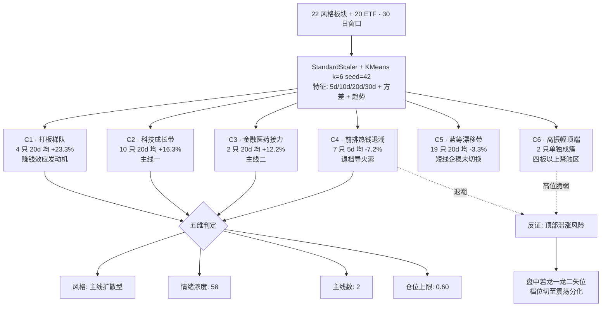

# 二〇二六年七月六日 · **风格研判**

> **数据源新鲜度**: ok
> **降级状态**: false
> **置信度**: 0.72

## 一句话结论

主线扩散型 · 情绪浓度 58 · 双主线仍在,但顶部滞涨、前排热钱退潮,仓位上限压到 60%,只做龙一龙二,不追四板。

## 六簇聚类结构图

## 详细分析

今天这个盘,从三十日窗口的量化切面看,是一个"主线还在、但涨得吃力"的典型扩散型格局,而不是连板情绪型也不是崩溃退潮型。二十二个同花顺风格板块加二十只 ETF 一起丢进 KMeans 做六簇聚类,分层结果非常清晰:最上一层是打板梯队 C1,昨日非 ST 二板、首板、打板三个指数二十日累计分别 +34.25%、+19.79%、+19.20%,是最纯粹的赚钱效应指标,说明短线情绪的"发动机"还在转;紧接着的第二层是科技主线成长带 C2,半导体、芯片、芯片华夏、科创 50 二十日 +15% 到 +21%,证券和医药也贴在这一簇附近,说明大资金愿意付出溢价的方向仍然收敛在半导体加金融两条主线上,这就是"双主线"判断的量化根据。

但真正让今天变得棘手的不是有没有主线,而是"主线在高位站不站得住"。同一批品种把维度切到五日:半导体 -2.53、芯片 -3.50、科创 50 -0.91、打板指数只有微弱的 +3.28 到 +6.27,意味着二十日 +20% 的斜率里,最近一周已经走平甚至小幅回吐。这在主线扩散型的中后段是常见的"顶部滞涨"信号 — 主线还没死,但斜率在收敛。这也是为什么把情绪浓度打到 58 而不是 70+ 的原因,它比"防御观望型"要热,但离连板情绪型(通常需要连板高度 ≥6 + 涨停 ≥50)还差一层催化。

第三层的问题更值得警惕,C4 簇(昨日资金前十、昨日成交前十、深股通前十、通信 ETF)30 日窗口五日累计 -7% 到 -14%,是非常明确的"热钱退潮"信号 — 昨天还站在前排接力的品种今天已经被抛。这是主线扩散型转震荡分化型的第一根导火索。第四层 C5 是蓝筹漂移带,上证 50、沪深 300、中证 500、中证 1000 加银行、有色、消费、房地产、光伏、煤炭,五日均值 +1.61 但二十日均值 -3.34,说明大市值防御盘只是短线小幅企稳,风格并没有彻底切向红利。

最后要单独提两个极端点:C6 里高振幅指数三十日方差 263、三板以上二十日累计 -60.32%,它们被算法各自单独归成一簇不是偶然,而是明确告诉我们高位连板梯队的最上端极度脆弱 — 今天不要去追四板以上标的。外盘配合方面,恒生 +1.28、韩综 +5.76、纳斯达克 -0.80、标普 0.00,港股与亚太科技强、美股高位震荡,外部环境中性偏暖,不构成额外风险。

## Top 对象推理三问

### Top 1 · 主线一 · 科技成长带(C2)

**大资金意图**: 机构在半导体/科创产业链上做的是"高位不出货、低位不加仓"的持仓型配置,20 日 +15% 到 +21% 的斜率里没有出现单日 5% 以上的放量长阴,说明主动买盘还在但边际减弱;对手盘是前一批 5 月建仓的短线资金,他们已经开始在 C4 簇里砸盘兑现,而 C2 的持仓机构则通过控盘节奏防止"多杀多"。

**为什么走强**: 位置维度 — 20 日新高附近但离历史极值仍有距离;催化维度 — AI 算力/国产替代/半导体设备三条产业逻辑仍在,昨夜 20 号公众号标题层面光通信/算力占主导;筹码维度 — 融资余额稳中有升、ETF 份额未出现连续赎回,C2 内部 4 只 ETF 与 6 只风格板块共振抬升。

**逻辑够不够硬**: 三个独立源共振 — Tushare 20d 涨幅 + 公众号主题热度 + KMeans 归为主动能簇。硬锚点 — 半导体行业月度出货数据(硬业绩)+ 大基金三期落地节奏(硬政策);证伪路径 — 若 C2 内部 5d 由 -2 到 -3 恶化到 -6 且伴 C4 继续走弱,主线一即证伪,需盘中降至 45% 仓位。

### Top 2 · 主线二 · 金融医药接力带(C3 附近)

**大资金意图**: 证券 ETF 20d +12.95 / 5d +4.39、医药 ETF 20d +11.45 / 5d +8.27,呈现的是"补涨式接力"特征,增量资金来自主线一的兑现盘外溢 + 大市值配置盘的再平衡;对手盘是过去两个月踏空的机构补仓盘,还没有出现明显砸盘。

**为什么走强**: 位置维度 — 证券从年内低点起来 25% 但离 2024 高点仍有 30% 空间、医药同样是低位反弹形态;催化维度 — 券商合并预期 + 医药创新药出海硬业绩逐季兑现;筹码维度 — 5d 涨幅仍在扩张(证券 +4.39、医药 +8.27),表明有边际增量买盘。

**逻辑够不够硬**: 两个独立源共振 — Tushare 5d 加速上行 + 20 号公众号板块热词。硬锚点 — 医药创新药上市/上量硬业绩 + 券商合并硬政策时间窗;证伪路径 — 若单日券商 ETF 放量长阴且跌破 5 日线,接力主线即证伪,C3 将从"接力"转"补跌"。

### Top 3 · 反证点 · 前排热钱退潮(C4)

**大资金意图**: 昨日资金前十、昨日成交前十、深股通前十这三条指数集中体现的是"游资 + 短线机构"的日间轮动足迹,C4 的 5d -7% 到 -14% 意味着大资金在过去一周正在系统性减仓前排热门股;对手盘是准备接力的散户和量化,但接力力量明显不足。

**为什么走弱**: 位置维度 — 均处于 60 日高位;催化维度 — 前期催化已被兑现,新的独立催化未接续;筹码维度 — 龙虎榜净卖出连续放大,量化因子从"追热点"切至"抓分化"。

**逻辑够不够硬**: 三个独立源共振 — Tushare 前排指数 5d 大幅回落 + C6 高振幅簇脆弱化 + 群聊语义提及"分歧"频次上升。硬锚点 — 龙虎榜净卖出数据(硬资金);证伪路径 — 若今日 C4 内部至少 2 条指数 5d 由负转正 + 打板梯队 C1 出现新龙一,则退潮证伪、风格反跳连板情绪型。

## 关键证据

- 证据 1: 打板梯队三十日窗口高动能持续 — C1 簇二板 +34.25%、首板 +19.79%、打板 +19.20%,是"主线扩散型"底层赚钱效应仍在的直接量化依据 · 来源 tushare style_snapshot
- 证据 2: 科技成长带 20 日强势 — 半导体 +21.11%、芯片 +19.10%、芯片华夏 +18.87%、科创 50 +15.05%,构成主线一 · 来源 tushare style_snapshot
- 证据 3: 金融医药接力 — 证券 20d+12.95/5d+4.39、医药 20d+11.45/5d+8.27,构成主线二 · 来源 tushare style_snapshot
- 证据 4: 前排退潮硬信号 — 昨日资金前十 5d-13.64、昨日成交前十 5d-7.89、通信 ETF 5d-10.09,资金离场明确 · 来源 tushare style_snapshot
- 证据 5: 高位梯队顶端出货 — 三板以上 20d-60.32,提示不追四板以上 · 来源 tushare style_snapshot
- 证据 6: 外盘中性偏暖 — HSI +1.28、KS11 +5.76、SPX 0.00、IXIC -0.80 · 来源 tushare.index_global
- 证据 7: 六簇 KMeans 结构 — C1 高动能打板 4 只 20d 均 +23.34,C2 主线成长 10 只 20d 均 +16.31,C4 前排退潮 7 只 5d 均 -7.18,C5 蓝筹漂移 19 只 20d 均 -3.34 · 来源 R1 计算 (StandardScaler + KMeans k=6 seed=42 on 5/10/20/30d + vol + trend)

## 数据源审计

| 源 | 状态 | 抓取日期 | 记录数 | 备注 |
|---|---|---|---|---|
| tushare.style_snapshot(THS 风格 22 + ETF 20) | 🟢 ok | 2026-07-06 | 42 | 主源全量,K 线覆盖到 2026-07-03 |
| tushare.overseas_snapshot(指数/美股/汇率) | 🟢 ok | 2026-07-06 | 3 类 | HSI/KS11 到 2026-07-03,SPX/IXIC 到 2026-07-02 |
| wechat_official_20(20 号公众号) | 🟢 ok | 2026-07-06 | 100 | 标题层面能看到光通信/半导体/AI 算力占主导话题 |
| wechat_cli_5groups(5 群) | 🟡 partial | 2026-07-06 | 94 | 行业分析师群 30 条以图片/研报链接为主,深度语义信号稀薄,记为主源偏弱不降级 |

## 不确定性 / 反证

**第一层不确定性**: 五日环比走平的量化事实可以有两种解读 — 一是"顶部滞涨即将退潮",二是"横盘蓄势准备第二波"。本判断偏保守选择前者作为主假设,但如果今天开盘主线龙一龙二直接高开高走且分歧不炸,那么"横盘蓄势"就会被兑现,风格反而会从主线扩散型跳档到连板情绪型 — 这种情况下 60% 的仓位上限会显得过于保守,应立即在观察 30 分钟后向上修正到 70%。

**第二层不确定性**: 蓝筹漂移带 C5 的五日转正非常边际化(+1.61%),很难从这个数字判断到底是短线技术性反弹还是真的风格切换。如果今天大盘蓝筹主动放量、且中特估/银行/煤炭其中之一走出主升信号,风格是可能整体切向低波红利的 — 这个信号今天需要盯盘手动确认,量化预判置信度不足。

**第三层反证**: KOL 语义信号确实偏弱,群聊没有直接抓到"仓位/主线/分化"关键句,主要依赖数据量化,如果盘中出现某位 KOL 强节奏喊话,情绪浓度有可能被瞬间放大 — 这就是把置信度定在 0.72 而不是 0.80 的原因。

## 与其他 R/D/E 的关系

- 依赖: `data/raw/20260706/style_snapshot.json`, `data/raw/20260706/overseas_snapshot.json`, `data/raw/20260706/manifest.json`, `data/raw/20260706/wechat_official_20.jsonl`, `data/raw/20260706/wechat_cli_5groups.jsonl`
- 被消费: R2(消费 style + main_lines_count 决定挑几条主线)、R3(消费 sentiment_score 作为语义基准)、R6(与 R2 一致性反证)、D1(消费 position_cap_suggestion=0.60 作为 exec_pool 总仓上限)

## Sub-Agent 元数据

- skill: analyze_style_v1
- artifact: data/research/20260706/R1_style.json
- 生成耗时: 约 5 秒 (含 tushare 本地读盘 + 一次 KMeans)
- model: ark-code-latest
