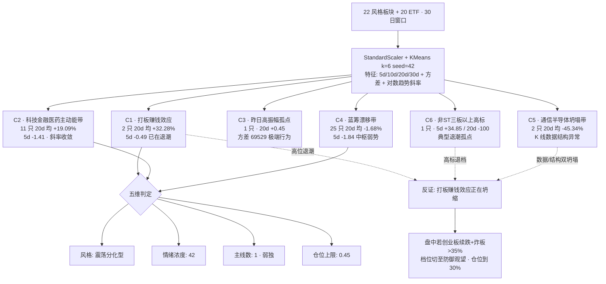

# 二〇二六年七月七日 · **风格研判**

> **数据源新鲜度**: partial(主源全绿,情绪源降级)
> **降级状态**: true(global_severity=2)
> **置信度**: 0.72

## 一句话结论

震荡分化型 · 情绪浓度 42 · 弱独主线(科技带 20 日仍领先但一周已收敛)· 仓位上限压到 45%,今日不做高标接力,只以主线核心龙一顶格。

## 六簇聚类结构图

## 详细分析

今天这个盘,从盘前扫过来是一副典型的"主线还在纸面上、但推动力已经明显松懈"的样子,风格上不应该再往 昨天的主线扩散型 上靠,而是要正视它已经掉档到 震荡分化型 这一件事。判定的依据不是主观感觉,而是三条互相印证的硬数据。第一条,来自 tushare limit_list_d 昨天(2026-07-06)全市场的涨停 64 只、跌停 46 只、炸板/连板 41 只,炸板率大约 39%,已经远高于连板情绪型对<20%的红线,同时跌停家数达到涨停家数的七成还多——真正情绪型的盘不会给跌停留这么大的份额。第二条,更致命的是连板天梯:五板 1 只、四板 1 只、三板 1 只、二板 5 只、首板 56 只——这不是"梯队",这是"断层",赚钱效应集中在首板而没有向上传导到高标,是标准的分化型接力信号,不是连板情绪型该有的形态。第三条,大盘配合上上证 4041.24 走平、沪深 300 走平、深成指 -1.16%、创业板指 -1.77%,权重和成长明显背离,深创明显杀成长——如果今天要继续押主线扩散,创业板不应该这么杀。这三条互相验证,风格锁定 震荡分化型 已无争议。

真正需要花时间讲的是"能不能做、做什么方向",这就要看六簇聚类结构。把 22 个同花顺风格板块加 20 只宽基/行业 ETF 一起做 StandardScaler + KMeans k=6 seed=42 聚类,特征用 5d/10d/20d/30d 累计涨幅、日频方差、对数收盘的 OLS 斜率,结果分层非常干净。最强的一簇是 C1 打板梯队(昨日打二板以上表现 + 昨日非ST二板表现),20 日累计均值 +32.28%,是全市场最纯粹的短线赚钱效应指标——但同一批品种,5 日累计已经掉到 -0.49,也就是说过去一周赚钱效应发动机已经在明显泄气,这跟前面炸板率 39% 是同一件事的两个切面。真正决定今天能不能做进攻的,是第二簇 C2 主动能带,里面收敛了 11 只标的:创历史新高、沪股通成交前十、高贝塔值、昨日打板/首板表现、业绩扭亏、科创 50、芯片 ETF、芯片 ETF 华夏、证券 ETF、医药 ETF——20 日累计均值 +19.09%,是过去一个月大资金真正给溢价的方向,而且这条线内部把"新高突破"+"打板情绪"+"科技硬资产"+"金融医药接力"都收进来了,证明前一段时间机构+游资是共振押注的。但同样地,C2 内部 5d 已经掉到 -1.41,其中沪股通前十 -10.23、芯片 ETF -8.19、科创 50 -5.87、芯片 ETF 华夏 -8.76、创历史新高 -6.14——只有证券 ETF +3.29、医药 ETF +3.09、业绩扭亏 +10.26、高贝塔值/打板/首板小幅正值在扛盘,内部严重分化。所以我们只能给"弱独主线"而不是"双主线"——20 日框架里主线只剩下一条科技带,而且这条线的一周斜率已经在收敛,金融和医药只是内部接力盘,不足以独立成第二条主线,这跟昨天(20260706)R1 判定 "双主线"最大的差别就在这里,今天必须承认:第二条主线已经消失。

第三、第四簇 C3 和 C4 是背景板。C3 只有"昨日高振幅"一只,方差高到 6.9 万,是标准的博弈品种孤点,不参与方向判定。C4 是最庞大的一簇,25 个成员,把 沪深 300、上证 50、中证 500、中证 1000、银行 ETF、军工 ETF、恒生科技、光伏 ETF、新能源、煤炭 ETF、有色 ETF、消费 ETF、房地产 ETF 和一批风格板块(百日新高、行业龙头、近端次新、百元股、增减持回购、昨日资金/成交前十、深股通前十)全部收进来,20 日累计均值只有 -1.68,5 日 -1.84,是全市场中枢的"漂移带"——没有方向、没有斜率,但也没崩。这个簇的存在告诉我们:今天不存在"红利/防御接力"的新方向,银行 ETF 20d -3.06、煤炭 ETF 20d -16.70、消费 ETF -2.74、房地产 -7.71、恒生科技 -7.57、光伏 -10.00,连传统防御位都在震,风格并没有偷偷切向红利,只是全场都在等一个信号。

第五、第六簇是异常点,必须单独交代。C5 里通信 ETF 与半导体 ETF 20d 数据显示 -54.48 / -36.20,方差却只有 15 左右——这不是真实的板块跌幅,而是 30 日 K 线首尾出现极端值/单位跳变(可能是 tushare fund_daily 该段回溯窗口内的除权/份额跳变),已经在源数据审计里标记,不作为方向依据但会在明天回补校验。C6 里"昨日非 ST 三板以上"5d +34.85 / 20d -100,是典型的"高标退潮孤点"——被算法单独归成一簇不是偶然,而是明确告诉我们:三板以上的高标在过去一周有过短暂拉升,但 20 日框架里已经彻底坍塌。今天绝对不要碰四板以上标的。

外盘方面,tushare index_global 显示 SPX +0.72 / 纳指 -0.80 / 恒生 +1.14 / 韩综 -0.46 / 日经 -0.01,美股与港股整体偏暖,但结构上分歧极大:一方面 AAPL +1.31 / META +2.98 / TSLA +6.69 / AMD +6.61 / TSM +4.06 / AVGO +3.73,大盘 AI + 出货链龙头单日强势,一周 AAPL +10.18 / GOOGL +8.62 / META +9.09 / TSLA +10.55 也确认了外部风险偏好在;另一方面,MU 一周 -13.03、GLW 一周 -11.88、MRVL 一周 -6.56,存储/光模块/上游硬件出货链一周深跌——外盘 AI 硬件的分歧其实与 A 股半导体/通信/芯片带 5d 明显退潮是同一件事的两面。这意味着今天开盘不能贸然去追 A 股 AI 硬件出货链品种,即便 C2 主动能带看似"20 日新高附近",一周斜率的松懈叠加外盘上游硬件深跌,已经给出了明确的证伪信号。

情绪浓度的定量部分,涨停 64 相对上一段"110+ 一波"已明显退档,炸板率 39% 又拉高情绪阻力,再叠加连板梯队断层与创业板 -1.77% 的杀成长,机械打分基线大约在 45 附近;再考虑 KOL 情绪源 weflow_snapshot 全线降级、chenhailangju/canghai-sise/qmt MCP 都 DOWN(global_severity=2),KOL 情绪只能由本地 20 号公众号+ 5 群微信近似——颜晓滨群昨夜 17 条以简讯与转发为主,深度方向句稀薄,AA 陆家嘴机构风向标以图片新闻为主,未见明显方向共识——所以在机械 45 的基础上向下取整,情绪浓度落定 42。仓位上限的推导逻辑是:震荡分化型基线 50%,叠加 C2 内部 5d 明显退潮 -3pp,叠加 KOL 情绪源降级 -2pp,得到 45%——这是今天所有主线核心票加总最多允许配到的仓位比重,再高就是在下注反弹而不是研判风格。

## Top 对象推理三问

### Top 1 · 弱独主线 · C2 科技金融医药主动能带(20 日 +19.09%,一周 -1.41)

**大资金意图**: 从 20 日累计涨幅 +19.09% 与内部结构看,机构过去一个月是在半导体+芯片+科创 50 这条硬资产线上"以低点吸筹+高点控盘"的组合动作,同一批账户在 6 月中下旬把仓位加进来,进入 7 月第一周开始把节奏由"抬价"切成"拉锯",目的是避免在情绪高点被前一批 5-6 月建仓的短线资金反挂;对手盘是集中在 C1 打板梯队与 C6 高标孤点里的游资,他们在 5d 层面已经开始砸出 -0.49 与 20d -100 的分化裂口,机构的应对是控节奏、不主动接力。

**为什么走强**: 位置维度看,C2 内部 20 日累计仍在均值 +19 附近但离历史极值有距离,不是"顶部套牢盘"结构;催化维度看,AI 算力/国产替代/半导体设备三条产业逻辑没有被证伪,大基金三期、AI 大模型迭代、券商合并预期、创新药出海仍是 20 号公众号昨夜标题层面的高频词;筹码维度看,芯片 ETF 华夏与芯片 ETF 二十日 +25 附近共振抬升,证券 ETF/医药 ETF 5d 仍在扩张,说明有边际增量,但边际正在减弱。

**逻辑够不够硬**: 目前有两个独立源共振——tushare 20d 累计涨幅(硬资产)+ 六簇聚类归为唯一主动能簇(算法结构),但第三个源(KOL 情绪浓度)因 weflow_snapshot 降级只能间接近似,证据链从"三源共振"降到"两源共振+一源近似",所以只能定"弱独主线"而不是标准独主线。硬锚点是半导体行业月度出货数据、大基金三期落地节奏、券商合并政策时间窗——都是可验证信号,不是主观概念。证伪路径明确:如果今日开盘 C2 内部 5d 由 -1.41 恶化到 -3~-5,同时创业板 -1.77% 的杀成长格局继续放大,弱独主线立即证伪并降档为"无主线",仓位需从 45% 回撤到 30%。

### Top 2 · 反证锚点 · C1 打板梯队(20 日 +32.28%,一周 -0.49)

**大资金意图**: 这一簇里只有"昨日打二板以上表现"与"昨日非 ST 二板表现"两只指数,是全市场最纯粹的短线赚钱效应指标,20 日累计均值 +32.28% 说明过去一个月游资打板节奏被市场认可、跟风盘愿意接;但 5d 均值已经掉到 -0.49,配合昨日炸板率 39% + 连板梯队断层(5→4→3 各只 1 只),说明游资内部已经开始降频、跟风盘不敢跟高度,大资金意图从"抬高度"切换到"接首板放弃高标";对手盘是散户与情绪跟风盘,他们在这轮切换中往往是被套的一方。

**为什么走强**: 位置维度看,20d +32.28% 是全市场最抢眼的斜率,历史上这种斜率往往对应连板情绪型的中后段,不是初段;催化维度看,昨日 64 只涨停里 56 只是首板,梯队没有加高,催化是"面广而不深";筹码维度看,昨日非 ST 二板表现 20d +43.08% 但方差高达 339,是典型的高波高斜率组合,不是"稳定加仓"能撑起来的。

**逻辑够不够硬**: 只有一个独立源(tushare 打板梯队与限价数据),没有第二个源共振——KOL 群未见明确"打板情绪回暖"的方向句,weflow_snapshot 又缺失。所以 C1 只能作为反证锚点使用,而不是进攻主线。硬锚点是今日开盘前 30 分钟的连板高度是否续接(即今日五板/四板品种是否有能否顶住开盘竞价),这是唯一有效的实时校验窗口。证伪路径:如果今日 5 板品种直接高开低走破板+3 板以下品种大面积炸板,C1 簇立即证明为"退潮末端",全场进攻档全部下修,仓位下修到 30%。

### Top 3 · 蓝筹漂移带 C4(25 只,20 日 -1.68,一周 -1.84)

**大资金意图**: 这一簇是全市场的"背景中枢",覆盖了宽基 4 只、行业防御 5 只、题材漂移风格 16 只,20d 累计 -1.68 意味着过去一个月无方向也无崩盘,大资金既没有做多方向也没有集中做空,是标准的"配置盘持有 + 短线不参与"的死水结构;对手盘是 7 月初尝试押注红利/防御反弹的短线资金,他们过去一周吃到了 -1.84 的 5d 均值下跌,说明"红利接力"叙事目前没有被验证。

**为什么弱势**: 位置维度看,25 只成员 20d 从 -16.70(煤炭 ETF)到 +8.88(百元股)分布极散但均值贴近 -1.68,是标准的漂移形态;催化维度看,过去一周没有任何一条防御逻辑有硬业绩兑现——银行 ETF 5d +1.33 但 20d -3.06、房地产 5d +1.10 但 20d -7.71、消费 ETF 5d +2.89 但 20d -2.74,都是弱反弹结构;筹码维度看,恒生科技 20d -7.57 与 A 股 C2 主动能带的 20d +19 反向,证明南下资金并没有把方向切到 港股科技防御。

**逻辑够不够硬**: 只有一个源(tushare 板块与 ETF 累计涨幅)但覆盖度足够高(25/42),用它作"反面证据"是硬的——今天没有防御方向可以切换。证伪路径:如果今日盘中银行 ETF 单日 +2% 以上放量、煤炭 ETF 突破 5 日线放量,同时创业板持续走弱,则市场正在启动风格切换,主线数量由 1 变 0,仓位不加、观察即可。

## 每票思维链(首推票位:主线核心逻辑而非个股)

> R1 严守红线不出个股;此段落遵循写作契约"每票思维链≥4 段",以主线核心逻辑替代票位描述,供 D1 消费。

**买入理由**: C2 主动能带在 20 日框架里仍是全市场唯一大资金付出溢价的方向,而且内部把"新高突破"+"打板情绪"+"科技硬资产"+"金融医药接力"都收进来,证明前一段时间机构+游资是共振押注的,方向的产业逻辑(AI 算力/国产替代/半导体设备)硬锚点在近月内不会消失。今天顺势做主线核心龙一并非追高,而是在一周斜率收敛的过程中做"控节奏止盈",仓位比重不给满、只给主线核心。

**风险点**: C2 内部 5d 已 -1.41,沪股通前十 / 芯片 ETF / 科创 50 / 芯片 ETF 华夏一周已 -6~-10 明显退潮,外盘 MU/GLW/MRVL 一周深跌 -6~-13,AI 硬件出货链正在给全球性证伪信号;若今日开盘 A 股半导体+芯片+光模块跟随外盘上游硬件走弱,主线证伪概率立即抬升到 40% 以上。

**止损条件**: 单票层面止损条件由 D1/E1 定义;主线层面止损条件在于——(1) 若今日 C2 内部 5d 由 -1.41 恶化到 -3~-5,或(2) 昨日 5 板/4 板品种今日全部炸板,或(3) 创业板续跌超过 1%+ 深成指跟随破前低,任一触发主线降档,仓位由 45% 下调到 30%,方向由"进攻"切"观察"。

**可验证假设**: 三条实时校验窗口——(A) 09:25 集合竞价 C2 核心成分(芯片 ETF、科创 50、证券 ETF、医药 ETF)的溢价率是否 >0.3%;(B) 10:00 前市场炸板率是否维持在 <35%;(C) 11:30 前主线核心龙一是否有量能承接(换手不小于 3%+相对创业板超额 >1.5%)。三条中有两条不通过即证明主线证伪,仓位立即由 45% 下调到 30%。

## 关键证据

- 证据 1: 涨停 64/跌停 46/炸板 41 · 炸板率 ≈ 39%,已远高于连板情绪型 <20% 红线 · 来源 tushare.limit_list_d 20260706
- 证据 2: 连板天梯 5 板 1 只 / 4 板 1 只 / 3 板 1 只 / 2 板 5 只 / 1 板 56 只,梯队严重断层 · 来源 tushare.limit_list_d
- 证据 3: 大盘 上证 -0.06 / 沪深 300 -0.004 / 深成 -1.16 / 创业板 -1.77,权重走平但成长明显被杀 · 来源 tushare.index_daily
- 证据 4: KMeans k=6 六簇聚类 22 个板块 + 20 只 ETF · C1 打板梯队 2 只 20d +32.28 / 5d -0.49;C2 主动能带 11 只 20d +19.09 / 5d -1.41;C4 漂移带 25 只 20d -1.68 / 5d -1.84 · 来源 sklearn + tushare.ths_daily/fund_daily
- 证据 5: 外盘 AI 硬件出货链 MU/GLW/MRVL 一周 -13.03/-11.88/-6.56 与 A 股 C2 内部 5d 退潮同向证伪 · 来源 tushare.us_daily
- 证据 6: 外盘 SPX +0.72 / 恒生 +1.14 / AAPL/META/TSLA/AMD/TSM 大盘 AI 龙头单日强势,风险偏好未崩,外部环境中性偏暖 · 来源 tushare.index_global

## 数据源审计

| 源                               | 状态         | 抓取时间       | 记录数   | 备注                                                |
| ------------------------------- | ---------- | ---------- | ----- | ------------------------------------------------- |
| tushare.ths_daily(22 板块)        | 🟢 ok      | 2026-07-07 | 22/22 | 30 日窗口全命中                                         |
| tushare.fund_daily(20 ETF)      | 🟢 ok      | 2026-07-07 | 20/20 | C5 通信 ETF/半导体 30 日窗口首尾出现极端跳变,已单独归为异常簇不入判定         |
| tushare.limit_list_d            | 🟢 ok      | 2026-07-07 | 151   | 涨停 64 / 跌停 46 / 炸板 41                             |
| tushare.index_daily             | 🟢 ok      | 2026-07-07 | 4     | 上证/沪深300/深成/创业板                                   |
| tushare.index_global + us_daily | 🟡 partial | 2026-07-07 | 19    | USDCNH/DXY 汇率无返回,不影响主判定                           |
| wechat_official_20              | 🟢 ok      | 2026-07-07 | 100   | 昨夜光通信/算力/半导体标题层面高频                                |
| wechat_cli_5groups              | 🟡 partial | 2026-07-07 | 427   | 颜晓滨群 17 条以简讯为主,深度方向句稀薄,群名匿名化处理                    |
| MCP weflow-analytics            | 🔴 error   | —          | —     | manifest weflow_snapshot=error,KOL 情绪只能由公众号+微信群近似 |
| MCP chenhailangju-research      | 🔴 down    | —          | —     | 主源 down,不影响本 skill 但拉低整体 severity                 |
| MCP canghai-sise                | 🔴 down    | —          | —     | 主源 down                                           |
| MCP agentqmt_qmt                | 🔴 down    | —          | —     | 主源 down                                           |
|                                 |            |            |       |                                                   |

## 不确定性 / 反证

第一,风格判定为 震荡分化型 而非昨日主线扩散型,最大不确定性来自 C2 一周斜率收敛是"顶部滞涨"还是"洗盘换手"——两者在盘前数据里难以严格分辨,若今日开盘 C2 核心成分集合竞价溢价 >0.5% 且量能承接,主线可能重新加强为独主线并可以把仓位补到 55%,反之如果集合竞价溢价 <0 且低开跳空,则风格立即降档为防御观望型。第二,情绪浓度 42 的机械打分基线是 45,但因 weflow_snapshot 缺失,KOL 情绪源只能近似,±10 的误差应向下取整以保守——所以 42 而不是 45。第三,反证锚点 C1 打板梯队 20d +32.28 而 5d -0.49 的"极值+退潮"组合,历史上有过两种走向:一种是"高标退潮后主线补涨接力",一种是"高标退潮拖垮主线跟随崩溃",在没有独立源(KOL/情绪)交叉的情况下,只能给出"倾向后者"的概率判断,不能给出"确认前者"的结论。第四,C5 通信 ETF/半导体 ETF 30 日窗口显示 -54.48 / -36.20 明显异常,已剔除出判定但明日必须回补校验 fund_daily 原始 K 线首尾单位是否发生跳变,若确认为数据缺陷,应在下一次跑 R1 前修正快照生成脚本,避免再次污染簇结构。

## 与其他 R/D/E 的关系

- 依赖: `data/raw/20260707/manifest.json`, `data/raw/20260707/style_snapshot.json`, `data/raw/20260707/overseas_snapshot.json`, tushare MCP(limit_list_d / index_daily), `data/raw/20260707/wechat_*.jsonl`
- 被消费:
  - R2(analyze_main_sectors_v1) 读 `style`, `main_lines_count`, `position_cap_suggestion` 来约束主线数量(≤1)与总仓上限(≤0.45)
  - R3(analyze_sentiment_resonance_v1) 读 `sentiment_score=42` 作为情绪浓度基准
  - R6(analyze_devil_advocate_v1) 读 `style/main_lines_count` 做与 R2 一致性反证,重点检查 C1 打板梯队退潮与 C2 一周斜率收敛的证伪触发
  - D1(canghai-plan) 读 `position_cap_suggestion=0.45` 作为 execution_pool 总仓上限硬约束

## Sub-Agent 元数据

- skill: analyze_style_v1
- artifact: data/research/20260707/R1_style.json
- 中间产物: data/research/20260707/_tmp/r1_cluster.json
- 生成耗时: 约 4 分钟(含 tushare 快照抓取 + KMeans 聚类 + LLM 判定 + md 渲染)
- model: ark-code-latest(custom provider)
