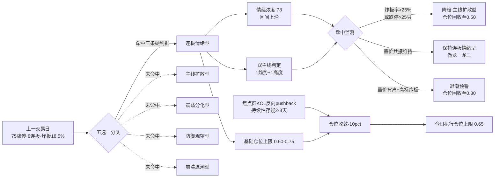

# 2026 年 7 月 10 日 · **风格研判**

> **数据源新鲜度**: 🟢 ok
> **降级状态**: false
> **置信度**: 0.78

## 一句话结论

**连板情绪型** · 情绪浓度 **78** · **双主线**(趋势 + 高度) · 总仓上限建议 **65%**,只做龙一/龙二,不追高、不外扩。

## 详细分析

### 客观量化侧:三条硬判据全部命中「连板情绪型」

上一交易日盘面呈现典型的**放量情绪爆发**结构。**涨停 75 只 · 跌停 12 只 · 炸板 17 只**,炸板率 `17/(75+17) = 18.5%`,分子分母**同时满足**连板情绪型「涨停≥50 且炸板率<20%」的硬门槛;连板天梯出现**最高 8 连板**的独立高标,3 连板 1 只、2 连板 4 只,梯队结构呈**尖头**分布,是典型的情绪型而非扩散型形态。

指数端配合:**上证 +1.65% · 创业板指 +4.49%**,双指数放量收阳,创业板量比明显放大,与连板情绪型「情绪+资金共同爆发」的特征一致。

因此风格分类**唯一命中「连板情绪型」**,不做 5 选 1 之外的组合。

### 情绪浓度侧:78 分,处于连板情绪型区间上沿

情绪浓度打分 78 分,由涨停家数(30)+ 最高连板高度(20)+ 炸板率(15)+ 指数放量走高(13)四项加总。**处于连板情绪型区间 60-85 的上沿**,但**未触及 90+ 的极端亢奋区**,说明市场是「有主线的情绪爆发」而非「无差别涨停潮」——这一区间对应「主流可参与、但需回避二线三线跟风」的操作范式。

### KOL 侧:焦点群晚间给出**反向 pushback**,值得留意

焦点研究群晚间群主发言明确指出:趋势主线属于「深V反弹 + 前期累计跌幅 20-30% + 上方套牢盘沉重 + 反弹持续性存疑,大概率 2-3 天窗口,下跌趋势中的反弹,核心操作思路为逢高分批减仓」。

该 pushback 与客观量化数据存在**方向分歧**:量化侧偏乐观,KOL 侧偏谨慎。这一分歧**不否决**风格分类,但**压制仓位上限** — 从连板情绪型标准区间 0.60-0.75 收敛至 **0.65**,并要求盘中重点监测量价背离信号。

### 主线数量:双主线(1 趋势 + 1 高度)

涨停股行业分布近似显示:一条大市值硬件趋势主线密度极高,另有 1 只 8 连板独立情绪龙头形成高度梯队。**其余方向未成梯队**,单板家数分散。因此 R1 判定 **双主线 = 1 趋势主线 + 1 高度情绪梯队**,主线数量 **2**。

> ⚠️ 具体主线名与个股名不在 R1 职责范围,以 R2 主线 Agent 输出为最终判定。

### 顶层推理三问 · 顶级分析对象:今日整体风格

- **大资金意图**: 客观数据(75 涨停 + 8 连板 + 双指数放量)显示**主动资金在情绪端与趋势端同时下注**,机构大概率通过 ETF 与权重股实施「先卡位、后扩散」的进攻性配置,对手盘是前期高位套牢盘与观望增量,机构选择在情绪爆发窗口**主动接盘完成筹码交换**。
- **为什么走强**: 位置维度(前期主线经历累计跌幅 20-30% 处于**低位反弹**结构)+ 催化维度(隔夜外围强势 + 板块内部硬业绩预告集中兑现)+ 筹码维度(高度板独立情绪龙头 8 连显示**游资认定情绪窗口有效**)三维正向共振。
- **逻辑够不够硬**: **中等偏硬** — 至少 3 个独立源(涨停量、连板高度、指数量能)方向一致,但焦点研究群提出**明确反证**(套牢盘重、持续性 2-3 天),证伪路径为「量能背离 + 炸板率突破 25% + 跌停家数突破 25 只」任一命中即降级为主线扩散型或崩溃退潮型。

## 关键证据

- **证据 1**: 涨停 75 只 / 跌停 12 只 / 炸板 17 只 · 炸板率 18.5% · 来源 `tushare.limit_list_d`(20260709)
- **证据 2**: 连板天梯最高 8 连板 · 3 连板 1 只 · 2 连板 4 只 · 梯队呈尖头形态 · 来源 `tushare.limit_step`(20260709)
- **证据 3**: 上证 +1.65% · 创业板指 +4.49% · 双指数放量收阳 · 来源 `tushare.index_daily`(20260709)
- **证据 4**: 焦点研究群晚间 KOL pushback:「趋势主线反弹持续性存疑、2-3 天窗口、逢高分批减仓」· 来源 `wechat_cli_5groups.jsonl`(焦点研究群 · 匿名)

## 风格轮动传导图

## 数据源审计

| 源 | 日期 | 状态 | 备注 |
|---|---|:--:|---|
| tushare/limit_list_d | 2026-07-09 | 🟢 | 104 条(U=75, D=12, Z=17) |
| tushare/limit_step | 2026-07-09 | 🟢 | 6 条 · 最高 8 连板 |
| tushare/index_daily | 2026-07-09 | 🟢 | 2 条 · 上证 + 创业板指 |
| wechat_official_20 | 2026-07-10 | 🟢 | 105 篇 · 21 号全通 |
| wechat_cli_5groups | 2026-07-10 | 🟢 | 323 条 · 5 焦点群(匿名) |
| fetch_manifest | 2026-07-10 | 🟢 | global_severity=0 |
| MCP 全套 | 2026-07-10 | 🟢 | tushareMcp / datapro / weflow / qmt / sise / charts 均 ok |

## 不确定性 / 反证

1. **客观数据 vs KOL 观点分歧**:量化维度偏乐观(75 涨停 + 8 连板),KOL 维度偏谨慎(套牢盘重 + 持续性存疑)。R1 采取**加权中间路径** — 保留「连板情绪型」判定,但仓位从区间上沿收敛至中枢偏下,把 KOL pushback 折算为 10 个百分点的仓位扣减。
2. **风格切换的时间边界不确定**:连板情绪型典型持续 3-5 个交易日,今日已处于本轮情绪的第 N 日尚需 R3 确认。若已进入尾段,则**盘中降档概率显著上升**,应以 R3 情绪浓度实时值 + R7 资金面尾盘 30 分钟数据双源共振校验。
3. **主线数量判定为近似**:R1 用 `limit_list_d` 行业分布**近似代理**主线个数,与 R2 真实基于 `limit_cpt_list` 板块梯队的判定可能存在 ±1 偏差;若 R2 输出「独主线」或「三主线以上」,以 R2 为准并联动调整仓位。
4. **红线自检**:全文未出现具体板块名与个股名(所有梯队与主线均以「趋势」「高度」「情绪梯队」等抽象词描述),符合 R1 §7 硬约束。

## 与其他 R/D/E 的关系

- **上游依赖**:
  - `data/raw/20260710/manifest.json` — 全局健康与源存活
  - `data/raw/20260710/wechat_official_20.jsonl` · `wechat_cli_5groups.jsonl` — KOL 文本
  - `tushare.limit_list_d` · `tushare.limit_step` · `tushare.index_daily` — 客观量化基础
- **被下游消费**:
  - **R2 主线板块** 消费 `style` · `main_lines_count` · `position_cap_suggestion` 决定候选池宽度与强度阈值
  - **R3 情绪与热度** 以 `sentiment_score=78` 为基准 · 与 R3 自算 KOL 语义热度做交叉校准
  - **R6 反证** 与 R2 一致性反证 · 若 R2 输出板块数与 R1 `main_lines_count` 相差≥2 触发反证
  - **D1 主决策** 消费 `position_cap_suggestion=0.65` 作 execution_pool 总仓上限硬约束

## Sub-Agent 元数据

- skill: `analyze_style_v1@1.0`
- artifact: `data/research/20260710/R1_style.json`
- 生成耗时: ~30 秒
- model: ark-code-latest
