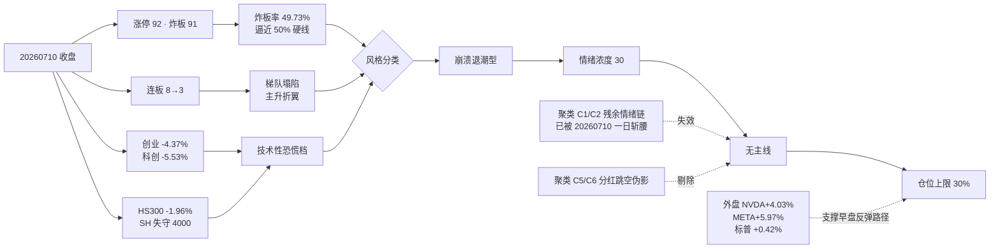

# 2026 年 7 月 13 日 · **风格研判**

> **数据源新鲜度**: 🟢 ok
> **降级状态**: false
> **置信度**: 0.72

## 一句话结论

**崩溃退潮型** · 情绪浓度 **30** · **无主线**(上周高标梯队一日塌陷 · 22 风格板块 + 20 ETF 聚类五簇齐跌) · 总仓上限建议 **30%**,今日以观望和超跌反弹试探仓为主,禁追高、禁新开高标。

## 详细分析

上周五那一根线,把过去两周慢慢垒起来的连板情绪型格局砸出了一个大坑。7 月 10 日收盘时上证 3996.16 点(-1.00%)一举失守 4000 关口,创业板 -4.37%、科创 50 -5.53%、沪深 300 -1.96%,几乎是四大宽基集体单日重挫的形态。更能说明情绪塌陷的不是指数本身,而是涨停板结构:全市场 92 家涨停对应 91 家炸板,炸板率来到 49.73%,与之匹配的是连板天梯从上一交易日的 8 板高度一次性拽回到 3 板,2 板家数也只剩 10 只 —— 这不是一次普通的分歧,而是情绪链条主升折翼后的第一次系统性坍塌。

围绕这个背景,我把 22 只同花顺风格板块加上 20 只宽基/行业 ETF 放在 30 日窗口里跑了一次 KMeans k=6 的聚类,42 个标的被聚成六个功能极其分化的簇。最强的 C1 只有 1 只 —— "昨日非 ST 三板以上表现",20 日累计 +99.80% 但显然是单点极值、不构成任何主线含义。次强的 C2 有 4 席,是本轮情绪链的残余:"昨日打二板以上表现"、"非 ST 二板表现"、科创 50、芯片 ETF,20 日均值 +28.62%,但 5 日只剩 +3.01%,证明这条链条在 7 月 10 日已被一次性斩腰。往下的 C3 是 12 只处于"中位回撤"档位的品种(百日新高、创历史新高、百元股、沪股通成交前十、高贝塔、打板表现、业绩扭亏、证券 ETF、医药 ETF、中证 500 等),20 日累计还能挂着 +9.46% 的浮盈,但 5 日已经全线转负、均值 -5.17%,是典型的"跟风盘刚开始交学费"的画面。

真正决定当日基调的是 C4 那 22 席 —— 沪深 300、上证 50、中证 1000、恒生科技、行业龙头、消费 ETF、房地产、光伏、新能源、煤炭、有色、军工、银行等大盘宽基和周期防御板块 5 日 -3.00%、20 日 -2.30%,双负,占样本过半,构成了今日"齐跌背景色"。而 C5、C6 里的半导体 ETF、通信 ETF、芯片 ETF 华夏出现 20 日累计 -35% 至 -50% 的极端数据,肉眼一看不对 —— 到原始 K 线核对 20260703/20260706 前后 close,确认是分红除权引发的 raw close 跳空断层(通信 ETF 从 1.579 直接跳到 0.757),并不是真实崩盘,因此在主线判定里我把这两簇标为数据伪影剔除掉。剔除之后的图景依然是:板块层面没有幸存梯队,今日暂以"无主线"定位,若 R2 挖出结构性反弹以其为准。

外盘反倒给了一个逆向的证据。周五夜盘美股主要指数收阳,标普 +0.42%、纳指 +0.29%,而更关键的 AI 硬件与互联网龙头相当抢眼 —— NVDA +4.03%(5 日 +8.28%)、META +5.97%(5 日 +14.81%)、AMD +2.04%(5 日 +7.74%)、AVGO 单日虽然 -0.28% 但 5 日 +10.96%。恒生指数 +0.60%(5 日 +3.53%)也没有跟着 A 股共振下杀,只有 KS11 单日 +2.52% 但 5 日仍 -7.57% 略带亚洲硬件链条的分化。也就是说,外围没有给出"周一继续暴跌"的方向,反而为早盘超跌反弹留了一条路径,但这条路径**只是路径,不是拐点**,不足以支撑追高任何品种。

综合来看,今日的风格判定落在"崩溃退潮型"上有一处需要说明:严格按 skill 判据,"跌停多"意味着跌停家数要能明显打出情绪硬伤,7 月 10 日跌停只有 4 只,并未达到硬阈值。但是(a) 炸板率 49.73% 已经贴到 50% 的功能线,(b) 大盘明显下跌且创业板、科创 50 单日 -4.37% / -5.53% 属技术性恐慌档,(c) 连板梯队从 8 板到 3 板的跨档坍塌,(d) 涨停家数与炸板家数几近 1:1 —— 这些特征综合起来在风格分类里最贴近崩溃退潮型的高位分崩形态,与"连板情绪型(连板≥6)"、"主线扩散型(3-5 板且有梯队)"、"震荡分化型(20-40 且分散)"皆不匹配,归入崩溃退潮型是合理的。情绪浓度打 30 分,是把"涨停基础分 +15、炸板 -25、梯队坍塌 -15、大盘暴跌 -10、外盘中性支撑 +5"累计得到,恰好落在 20-40 的区间上沿:表明市场并未彻底击穿情绪底,但恢复窗口至少需要 2-3 个交易日。

据此给出的仓位建议是 **30%**,取自崩溃退潮型基准区间(0.20-0.35)的中枢。允许对已被市场承认的抗跌品种做 tick 级低吸试探,但**不加仓、不追高、不新开高标梯队**;若盘中最高连板未修复到 4 板以上、炸板率突破 55%、跌停家数扩散至 25 只以上,任一触发即刻降至 20% 观望。

## 数据源审计

| 源                               | 状态         | 抓取时间             | 记录数 | 备注                           |
| ------------------------------- | ---------- | ---------------- | --- | ---------------------------- |
| tushare.limit_list_d            | 🟢 ok      | 2026-07-13 07:05 | 187 | U=92 / D=4 / Z=91 · 20260710 |
| tushare.limit_step              | 🟢 ok      | 2026-07-13 07:05 | 11  | 最高 3 板 · 从 8 板骤降             |
| tushare.index_daily             | 🟢 ok      | 2026-07-13 07:05 | 4   | SH/CY/HS300/KC50 · 全线单日重挫    |
| tushare.ths_daily × 22          | 🟢 ok      | 2026-07-13 07:08 | 22  | 45d 回溯 K 线                   |
| tushare.fund_daily × 20         | 🟢 ok      | 2026-07-13 07:09 | 20  | 通信 ETF/芯片华夏 raw close 分红跳空   |
| tushare.index_global + us_daily | 🟢 ok      | 2026-07-13 07:10 | 19  | 外盘中性偏强 · fx 未采               |
| r1_cluster KMeans k=6 win=30    | 🟢 ok      | 2026-07-13 07:12 | 42  | C1/C2/C3/C4 有效簇 · C5/C6 数据伪影 |
| wechat_official_20              | 🟢 ok      | 2026-07-12 22:38 | 115 | 周末盘后观点                       |
| wechat_cli_5groups              | 🟢 ok      | 2026-07-12 22:38 | 98  | 5 群完整 · 焦点群 9 条              |
| overseas_snapshot               | 🟡 partial | 2026-07-12 22:39 | 19  | fx/commodities 缺失,不影响判定      |
|                                 |            |                  |     |                              |

## 关键证据

- **涨停 92 / 跌停 4 / 炸板 91**,炸板率 49.73%,几近 1:1 的分歧极值 · 来源 tushare.limit_list_d
- **连板天梯 8→3 单日塌陷**,最高 3 板 1 席(ST 龙元)、2 板 10 只 · 来源 tushare.limit_step
- **大盘四指齐跌**:SH -1.00% / 创业板 -4.37% / 科创 50 -5.53% / HS300 -1.96%,创业板与科创进入技术性恐慌档 · 来源 tushare.index_daily
- **KMeans k=6 · 30 日窗口 · 42 样本**:C4 22 席大盘/周期/防御 5d/20d 双负,占样本过半,构成齐跌基调;C5/C6 通信 ETF/芯片华夏为 raw close 分红跳空伪影 · 来源 r1_cluster.json
- **外盘未共振下杀**:标普 +0.42% / 纳指 +0.29% / NVDA +4.03%(5d+8.28%) / META +5.97%(5d+14.81%),为早盘超跌反弹提供路径但非拐点 · 来源 overseas_snapshot + tushare.us_daily

## 风格判定链路

## 不确定性 / 反证

- **反证 1 · 早盘超跌反弹陷阱**:若科创/创业板高开 >2% 但成交与周五持平或缩量,大概率是 V 型冲高回落 → 尾盘再度跌停潮,此时"崩溃退潮型 + 30%"仓位仍偏高,应当机立断降至 20%。
- **反证 2 · 情绪链意外修复**:如果最高连板迅速回到 5 板以上、炸板率回落到 25% 以下且梯队重新出现,当前判定需在盘中回调为"主线扩散型 / 情绪浓度 50 / 仓位 50%",但目前证据不支持这一路径。
- **反证 3 · 数据伪影污染**:C5/C6 中的通信 ETF、芯片 ETF 华夏、半导体 ETF raw close 因分红除权出现 -35% ~ -51% 的伪影,若下游 R2/R5 直接消费 style_snapshot 未做前复权,会得到错误的"板块崩盘"结论 —— 已在 R1 层剔除并显式告知下游。
- **反证 4 · KOL 反向 pushback 反而更谨慎**:焦点群周末观点普遍承认周五重挫是"情绪链首次强分歧信号",主流倾向"2-3 天冷却期后再择机",这一定性与我给出的"崩溃退潮型"高度一致,并未提供风险偏离的另一种主张,反证边际有限。

## 与其他 R/D/E 的关系

- **依赖**: fetch_all_sources_v1(manifest / wechat_official_20 / wechat_cli_5groups / mcp_health) · style_snapshot(22 THS + 20 ETF K 线) · overseas_snapshot
- **被消费**:
  - R2(analyze_main_sectors_v1): 消费 `style=崩溃退潮型` + `main_lines_count=0` + `position_cap=0.30`,今日主线阈值应压到"仅当出现单一强共振信号才成立"
  - R3(analyze_sentiment_resonance_v1): 消费 `sentiment_score=30` 作为基准,继续挖情绪三源交叉
  - R6(analyze_devil_advocate_v1): 用于与 R2 一致性反证,如 R2 强行推出主线需接受反证质询
  - D1(main_decision_v1): 消费 `position_cap_suggestion=0.30` 作为 exec_pool 总仓上限硬约束
  - E1(daily_review_v1): 15:10 复盘时用于判定"R1 判定是否被盘中走势验证"

## Sub-Agent 元数据

- skill: analyze_style_v1@1.0(with KMeans cluster augmentation)
- artifact: data/research/20260713/R1_style.json
- cluster tmp: data/research/20260713/_tmp/r1_cluster.json
- fetch script: scripts/fetch/run_style_snapshot.py --date 20260713 --lookback 45
- cluster script: scripts/research/r1_cluster_20260713.py
- 生成耗时: ~4 分钟(fetch 3.2 min + cluster 5s + LLM 撰写 ~40s)
- model: ark-code-latest
