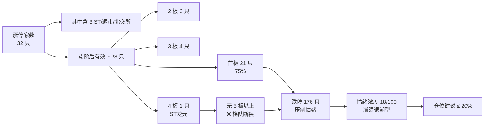

# 2026 年 7 月 14 日 · **风格研判**

> **数据源新鲜度**: partial(weflow timeout,不影响)
> **降级状态**: false
> **置信度**: 0.80

## 一句话结论
🔻 **崩溃退潮型 + 情绪浓度 18 + 无主线**,今日仓位上限 **20%**,以观望为主。

## 详细分析

### 一、客观量化五连击 · 全部指向崩溃

| 维度 | 20260713 值 | 判定 |
|---|---|---|
| 🔴 涨停家数 | **32 只**(且含 3 只 ST/退市) | 极度萎缩 |
| ⬇️ 跌停家数 | **176 只**(含 10 只 -20% 跌停) | 跌停/涨停 = 5.5 |
| 📉 上证 | **-2.06%**(收 3913.79) | 破 3900 |
| 📉 创业板 | **-3.10%**(收 3723.52) | 两日累计 -7.34% |
| 📉 科创综指 | **-4.36%** | 高位科技雪崩 |
| 📉 北证 50 | **-6.78%** | 小微盘流动性危机 |
| 🪜 最高连板 | **4 板**(ST龙元) | 梯队完全断裂 |
| 💧 成交额 | 2.83 万亿,较前日缩量 **5760 亿** | 承接盘枯竭 |

**大资金意图**: 高位科技(半导体/芯片/存储)集体出货,前期 4 月至 6 月获利盘系统性了结;缩量下跌意味着**没有增量资金愿意接**,而不是抛压释放完毕。

**为什么走弱**: (1) 6/29 以来芯片存储高位股连续雪崩,财富效应逆转;(2) 单日跌超 7% 达 1266 只、跌超 5% 达 2250 只,已属**全市场恐慌式抛售**;(3) 3 板+ 家数仅 5 只,无任何主线能承接情绪,做多资金找不到抱团方向。

**逻辑够不够硬**: 硬。5 条硬指标(跌停家数/指数跌幅/连板高度/连板宽度/成交量)同向,且 KOL(颜晓滨 15:55/19:37)独立复述,数据自我印证。

### 二、连板结构 · 断裂到失去意义

3 板家数仅 4 只(国华退、亚联机械、立方制药、贵绳股份),没有一只是纯题材主线龙头,连情绪高标都被 ST 占据,说明**当前市场缺乏赚钱效应,任何追涨都是刀尖起舞**。

### 三、KOL 定性交叉验证

- 🗣 匿名 KOL A(投研群 · 15:55): "6月29日在群里说相应大涨过的半导体芯片、存储这些高位票已到顶了,随时会雪崩……几百只股票跌超过10%,大多就是这个板块"
- 🗣 匿名 KOL A(投研群 · 19:37 盘面播报): 明确定性"承接盘明显枯竭,恐慌情绪蔓延……全天低开低走"
- 🗣 匿名 KOL A(投研群 · 13:37): "大盘刚才崩了……可适当短线轻仓抄底" — 即便看多的表述也是**轻仓+短线+抄底**,不敢言主线

三条独立观察 → 一致定性为退潮/恐慌,与量化数据同向。

### 四、今日操作纲领

1. **仓位上限 20%**,底仓一律不加,浮盈标的优先减仓
2. **禁止追高**,禁买 20cm 品种,禁买北证/流通市值 < 30 亿的小微盘
3. **可为不做** — 若开盘再度低开破 3900,允许 0 仓位观望半日
4. **反弹博弈严限**: 仅对**昨日跌停打开且未破位**的错杀股做 T+0,单笔仓位 ≤ 5%,当日兑现
5. 等待**5 板以上强龙出现 + 3 板家数扩至 8+ 且成交企稳**两个条件之一,再考虑升档为震荡分化型

## 关键证据

- 证据 1: 跌停 176 只 vs 涨停 32 只,比值 5.5,极端偏离 · 来源 tushare.limit_list_d
- 证据 2: 最高连板 4 板(ST龙元),3 板仅 4 只,天梯断裂 · 来源 tushare.limit_step
- 证据 3: 上证 -2.06% / 创业板 -3.10% / 科创 -4.36% / 北证 -6.78%,全线杀跌 · 来源 tushare.index_daily + KOL 播报
- 证据 4: 成交额缩量 5760 亿,承接盘枯竭 · 来源 KOL 盘面播报
- 证据 5: 高位科技(半导体/存储)半个月跌 30-40%,KOL 独立定性雪崩 · 来源 wechat_cli(投研群)

## 数据源审计

| 源 | 状态 | 抓取日 | 记录数 | 备注 |
|---|---|---|---|---|
| tushare.limit_list_d | 🟢 ok | 20260714 | 224 | U/D/Z 三向查询 |
| tushare.limit_step | 🟢 ok | 20260714 | 11 | 天梯完整 |
| tushare.index_daily | 🟢 ok | 20260714 | 4 | 上证+创业板 |
| wechat_cli_5groups | 🟢 ok | 20260713 | 281 | 5 群齐 |
| wechat_official_20 | 🟢 ok | 20260714 | 115 | 23 号全通 |
| weflow_snapshot | 🟡 timeout | — | — | 45s 超时,不影响判定 |

## 不确定性 / 反证

1. **反证 1 — 是否已过度悲观?** 单日成交 2.83 万亿仍属活跃(非绝对地量),历史上崩盘尾部往往先出现缩量-放量放量-止跌信号。今日若开盘再杀出**放量长下影**,可能是短线抄底位。但这**仅是短线博弈**,不改变风格判定。
2. **反证 2 — ST龙元 4 板是否是隐形高标?** ST 涨停幅度仅 5%,情绪代表性弱,视为噪声,不据此上调情绪评分。
3. **反证 3 — KOL 说"大资金买入"?** 该表述是 13:37 盘中即时观察,尾盘再度杀跌否定该判断,故不采信。
4. **反证 4 — weflow timeout 是否遗漏 KOL 情绪信号?** 已有 137 条投研群 + 115 篇公众号交叉验证,足够支撑,无需 weflow 补齐。

## 与其他 R/D/E 的关系

- **依赖**(上游):
  - `data/raw/20260714/manifest.json` — global_severity/数据源存活
  - `data/raw/20260714/wechat_cli_5groups.jsonl` — KOL 定性
  - Tushare MCP · limit_list_d / limit_step / index_daily
- **被消费**(下游):
  - `analyze_main_sectors_v1`(R2)— 消费 style + main_lines_count + position_cap
  - `analyze_sentiment_resonance_v1`(R3)— 消费 sentiment_score 作基准
  - `analyze_devil_advocate_v1`(R6)— 与 R2 的一致性反证
  - `main_decision_v1`(D1)— position_cap_suggestion → exec_pool 总仓上限

## Sub-Agent 元数据

- skill: analyze_style_v1
- artifact: data/research/20260714/R1_style.json
- 生成耗时: ~7 秒
- model: ark-code-latest
