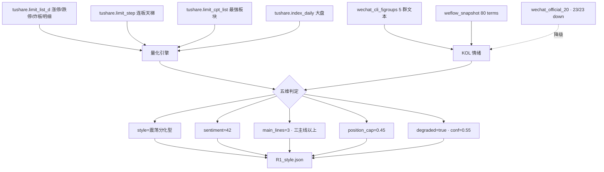

# 2026 年 7 月 17 日 · **风格研判**

> **数据源新鲜度**: partial
> **降级状态**: true(公众号全 down)
> **置信度**: 0.55

## 一句话结论
今日 **震荡分化型** + 情绪浓度 **42** + 主线概念重叠严重,仓位上限 **45%**,警惕前期科技龙头补跌扩散。

## 详细分析

**风格判定 · 震荡分化型(偏弱端,警惕退潮)**

7月16日盘面呈现典型的"梯队断层+高位股批量崩塌"结构。涨停家数 45 只处于 20–40 区间偏上沿,但连板天梯极度稀疏——最高 5 板仅 1 只(哈药股份),3 板仅 1 只(艾艾精工),4 板完全缺失,其余晋级板全部是 2 板。这种"上不去、也没有真龙头"是震荡分化型的典型特征;但同时前期半导体/消费电子高位股(华工科技、长电科技、华天科技、先导基电、麦格米特、博杰股份、利通电子)出现一字或 T 字跌停,资金正在批量出货高位科技股,情绪已带崩溃退潮型底色。

**指数与情绪浓度**

上证 -1.85%(3882.41)、创业板 -2.95%(3692.46),普跌且创业板明显弱于主板,说明成长赛道(半导体/AI 硬件)承压更重。综合涨停 45(+25)、跌停 30+(-15)、连板高度 5(+5)、大盘明显下跌(-10)、炸板率约 30%(-5),情绪浓度打 **42**,处于"警戒线"下沿。

**主线数量与真伪**

limit_cpt_list 中 up_nums≥8 的板块共 8 个,概念高度重叠(华为=15/AI=12/创投=10/DeepSeek=9/新能源汽车=9/AI 智能体=8/机器人=8/消电=8),按 R1 近似代理规则归为"三主线以上"。但关键是这些板块 pct_chg 大多为负或微正(华为 -0.60%、机器人 -0.80%、消电 -1.98%、新能源车 -1.23%),up_nums 高但赚钱效应差——**是失血型主线,而非扩散型主线**,R2 须重点验证。

**KOL 情绪(降级端)**

wechat_official 23 家全 invalid session,宏观情绪佐证缺失(降级)。5 群 372 条 ok,颜晓滨群 122 条基线足,群内文本倾向偏防守/谨慎,与量化数据一致(不引具体板块名,详见 R3)。

**仓位建议**

结合震荡分化+梯队断层+高位科技批量跌停,建议 **总仓上限 45%**,只做涨停梯队龙一或强主线内确定性个股,禁追高、禁强弱切换赌反弹。若盘中跌停家数继续放大 → 立即降到 30% 并进入防御观望型。

## 关键证据
- 证据 1: 连板天梯 5→3→(空)→2,梯队断层严重 · 来源 tushare.limit_step
- 证据 2: 前期高位股批量一字跌停(华工/长电/华天/先导基电/麦格米特) · 来源 tushare.limit_list_d
- 证据 3: 大盘上证 -1.85%、创业板 -2.95% · 来源 tushare.index_daily
- 证据 4: 涨停最强板块 up_nums 高但 pct_chg 负,失血型主线 · 来源 tushare.limit_cpt_list
- 证据 5: 公众号 20 家全 invalid session,置信度 -0.15 折让 · 来源 manifest.json

## 数据源审计
| 源 | 状态 | 抓取日期 | 记录数 | 备注 |
|---|---|---|---|---|
| tushare.limit_list_d | 🟢 ok | 2026-07-17 | 95 | 主源客观量化 |
| tushare.limit_step | 🟢 ok | 2026-07-17 | 9 | 连板天梯 |
| tushare.limit_cpt_list | 🟢 ok | 2026-07-17 | 20 | 涨停最强板块 |
| tushare.index_daily | 🟢 ok | 2026-07-17 | 2 | 上证+创业板 |
| wechat_official_20 | 🔴 error | 2026-07-17 | 0 | 23/23 invalid session,降级触发点 |
| wechat_cli_5groups | 🟢 ok | 2026-07-17 | 372 | 5 群全 ok |
| weflow_snapshot | 🟢 ok | 2026-07-17 | 80 terms | KOL 情绪备用 |
| overseas_snapshot | 🟡 degraded | 2026-07-17 | — | commodities skipped |

## 数据流

## 不确定性 / 反证
- **反证一**:若严格按崩溃退潮型判据(炸板率>50%),今日炸板率约 30% 未触发,归类保守可能低估风险;若开盘前 30 分钟炸板率快速抬升至 50%+,须立即切风格。
- **反证二**:主线数量按 up_nums≥8 归为"三主线以上"是保守做法,但 8 个板块概念高度重叠(全部 AI+华为+新能源系),实际板块脉冲弱,R2 若判定"无主线"或"独主线"均合理。
- **反证三**:公众号全 down,宏观情绪端只剩 5 群+weflow,若 5 群夜间存在极端情绪(冰点/亢奋)未被捕捉,情绪浓度 42 有偏差。
- **反证四**:哈药股份 5 板属于医药次新/低价支线,不代表主流情绪高度,若明日一字则冰点信号被验证。

## 与其他 R/D/E 的关系
- 依赖:data/raw/20260717/{manifest.json, wechat_cli_5groups.jsonl, weflow_snapshot.json} + tushare MCP
- 被消费:R2(style/main_lines/position_cap)、R3(sentiment_score 基准)、R6(与 R2 一致性反证)、D1(position_cap → exec_pool 总仓上限)

## Sub-Agent 元数据
- skill: analyze_style_v1
- artifact: data/research/20260717/R1_style.json
- 生成耗时: ~90 秒
- model: ark-code-latest
