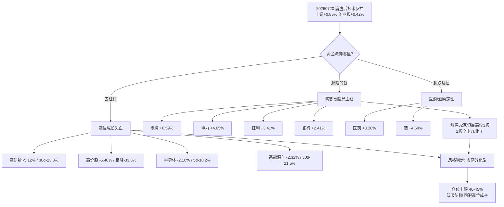

# 2026年7月21日 · **风格研判**

> **数据源新鲜度**: partial（基准日 20260720，目标日无当日抓取）
> **降级状态**: true（公众号全 down + weflow timeout，情绪面单源）
> **置信度**: 0.62

## 一句话结论

崩盘后的脆弱反抽，资金只认防御高股息，高位成长仍在失血 —— 今日 **震荡分化型**，仓位上限 **40-45%**，只做低吸不追高。

## 详细分析

先把上一根 K 线的性质说清楚：20260720 是一次**崩盘之后的技术反抽**，不是趋势反转。往前数一天，07月17日上证暴跌 3.05%、创业板指更是重挫 7.15%，一天之内把两周的犹豫全部宣泄干净。20260720 上证收在 3796 点、微涨 0.85%，创业板收 3443 点、涨 0.42% —— 指数是红的，但这抹红色是超跌后的自救，而非新增资金进场做多。判断一个反抽是"钱回来了"还是"只是喘口气"，最干净的办法是看谁在涨，而 20260720 领涨的名单，恰恰暴露了这轮反抽的防御底色。

反弹日的资金流向高度一致地指向**防御性高股息**：煤炭单日暴涨 6.59%、电力涨 4.65%、红利涨 3.41%、银行涨 2.41%，再叠加超跌反抽的医药（+3.30%）和白酒（+4.60%）。这不是进攻的钱，这是避险的钱在超跌位置找确定性。与之形成刺眼对照的，是**高位成长赛道仍在持续失血**：同花顺高动量板块单日再跌 5.12%、5 日累计 -13.5%、30 日 -23.3%；高价股单日 -5.40%、5 日 -19.8%、距离月内高点已回撤 33.3%；半导体 ETF 5 日 -18.2%，新能源车 30 日 -21.5%，光伏 30 日 -26.4%。一边是防御板块在反抽，一边是成长龙头在去杠杆，这就是典型的**杀高位 + 防御高低切**格局。

涨停梯队的结构进一步坐实了"没有进攻主线"这个判断。20260720 全市场涨停 52 家，数字看着不低，但**最高连板仅 3 板**（立新能源孤身一人），2 板梯队清一色是电力、化工这类公用事业和周期防御品种。一个健康的进攻市场，应该有 5 板、6 板以上的高度龙头带着人气梯队往上打；而现在的天梯又矮又散，说明市场根本没有能凝聚人气、值得资金抱团进攻的方向。与此同时跌停仍有 38 家，恐慌尚未完全出清。涨停多而无高度、跌停仍不少、方向散于防御 —— 这三条凑在一起，只能归入震荡分化型，既不够格称连板情绪型（需要 6 板以上高度），也谈不上主线扩散型（需要清晰的进攻梯队）。

外部环境也不支持情绪修复。隔夜海外全线下挫：标普 -1.01%、纳指 -1.40%、英伟达 -2.21%、恒生 -1.78%、韩国 KS11 更是暴跌 6.37%。全球风险偏好收缩的大背景下，A 股高位科技板块很难获得外部估值支撑，这也是为什么 20260720 反抽里成长股集体缺席的原因之一。热榜层面创新药、CPO、存储、算力租赁仍在榜，煤炭、绿电新晋 —— 前者是情绪残留，后者才是当下真金白银认可的方向。

综合下来，我把今日仓位上限定在 **40-45%**：政策底信号仍在、指数收红、恐慌见底，所以不至于空仓死守；但主线只有防御高股息这一条脆弱的独苗，高位成长的去杠杆远未走完，因此绝不能重仓、更不能追高。**低吸防御高股息与超跌确定性品种可以做，高位拥挤赛道（半导体/AI/光伏/新能源车）必须回避。**

## 关键证据

- 证据 1: 20260720 上证 +0.85% / 创业板 +0.42%，是 07/17 崩盘（上证-3.05%/创业板-7.15%）后的技术反抽 · 来源 tushare.index_daily
- 证据 2: 涨停 52 家、跌停 38 家、最高连板仅 3 板，2 板全为电力/化工，无进攻性高度龙头 · 来源 tushare.limit_list_d / limit_step
- 证据 3: 反弹日领涨全为防御高股息 —— 煤炭+6.59% / 电力+4.65% / 红利+3.41% / 银行+2.41%，叠加超跌医药+3.30% / 酒+4.60% · 来源 tushare.fund_daily
- 证据 4: 高位成长持续失血 —— 高动量30d-23.3% / 高价股距峰-33.3% / 半导体5d-18.2% / 新能源车30d-21.5% / 光伏30d-26.4% · 来源 tushare.ths_daily / fund_daily
- 证据 5: 隔夜海外全跌，SPX-1.01% / 纳指-1.40% / KS11-6.37%，外部风险偏好压制高位科技 · 来源 overseas_snapshot

## 风格全景图

## 数据源审计

| 源                    | 状态         | 抓取时间       | 记录数 | 备注                    |
| -------------------- | ---------- | ---------- | --- | --------------------- |
| tushare.index_daily  | 🟢 ok      | 2026-07-20 | 2   | 上证/创业板 30日            |
| tushare.limit_list_d | 🟢 ok      | 2026-07-20 | 90  | 涨停52/跌停38             |
| tushare.ths_daily    | 🟢 ok      | 2026-07-20 | 19  | 19个风格指数30日            |
| tushare.fund_daily   | 🟢 ok      | 2026-07-20 | 20  | 20只核心ETF30日           |
| overseas_snapshot    | 🟢 ok      | 2026-07-20 | -   | 外盘全线下挫                |
| wechat_official_20   | 🔴 error   | 2026-07-20 | 0   | 23/23 invalid session |
| weflow_snapshot      | 🟡 timeout | 2026-07-20 | -   | fetch 超时，情绪面单源        |

## 不确定性 / 反证

**最大的不确定性是基准日错位**：目标交易日 20260721 当日的 fetch 没有运行，本文全部行情与情绪以 20260720 收盘为基准（窗口 20260601-20260720）。若 20260721 开盘后出现与 20260720 反抽方向背离的走势，本判断需要即时修正。

**反证一（可能过度看空成长）**：证券 ETF 30 日 +8.02%、半导体 30 日仍 +2.54%、科创50 +3.48%，说明高位赛道并非全线崩塌，部分仍有月度正收益，若 20260721 高开且涨停冲至 40+ 并出现 4 板以上龙头，风格应上修为主线扩散型、仓位放宽至 0.55。

**反证二（可能过度乐观）**：跌停仍 38 家、高位成长 5 日跌幅普遍 -15% 到 -20%，去杠杆若未止，20260720 的反抽随时可能夭折，一旦指数二次探底击穿前低，风格立即降级为防御观望型甚至崩溃退潮型，仓位回落至 ≤30%。

**情绪面单源风险**：wechat_official 全部 invalid session、weflow timeout，情绪判断仅靠 KOL 群单源交叉，量化基座虽完整但情绪读数（sentiment_score 45）置信度有限，D1 消费时请以 R2 硬共振、R3 情绪共振为准。

## 与其他 R/D/E 的关系

- 依赖: data/raw/20260720/{manifest.json, overseas_snapshot.json, hotlist_signals.json, wechat_cli_5groups.jsonl}；tushare MCP（index_daily / limit_list_d / limit_step / ths_daily / fund_daily）
- 被消费: R2（style / main_lines_count / position_cap_suggestion）、R3（sentiment_score 基准）、R6（与 R2 一致性反证）、D1（position_cap_suggestion → exec_pool 总仓上限）

## Sub-Agent 元数据

- skill: analyze_style_v1
- artifact: data/research/20260721/R1_style.json
- 生成耗时: 约 8 分钟（含多轮数据重取）
- model: ark-code-latest
